[Лабораторні](README.md)

# ЛАБОРАТОРНА РОБОТА № 1 

Налаштування робочого місця для проведення лабораторних робіт. Основи Ethernet та IP.

## Частина 1. Підготовка робочого місця

**Тривалість**: 0.5 - 1 акад. година.

**Мета:** Підготовити віртуальне робоче місце для проведення лабораторних робіт для можливості дистанційної роботи.

### Лабораторна установка.

**Необхідне апаратне забезпечення.** Для проведення лабораторних робіт необхідно мати комп’ютер з наступною мінімальною апаратною конфігурацією:

- CPU Intel/AMD 1 ГГц / RAM 2 ГБ / HDD 10 ГБ (вільних)  

**Необхідне програмне забезпечення.** 

1) На комп’ютері повинна бути встановлена одна з операційних систем, підтримуваних віртуальною машиною Virtual Box (https://www.virtualbox.org/wiki/Downloads):

- Windows 

- Mac OS X

- Linux

- Solaris

2) Безкоштовне програмне середовище віртуалізації Virtual Box https://www.virtualbox.org/wiki/Downloads 

3) Образ віртуальної машини для віртуального робочого місця (https://drive.google.com/file/d/1sWEn-7soGocViHb6ndNlPwrWsv5XGVtq/view?usp=sharing)

4) Інтернет-браузер та доступ до Інтернет. 

**Загальна постановка задачі**. Цілі роботи: 

1) підготовити віртуальне робоче місце для проведення наступних лабораторних робіт;

2) навчитися користуватися мінімальними можливостями середовищ віртуалізації на прикладі Virtual Box 

 https://uk.wikipedia.org/wiki/VirtualBox  ***VirtualBox*** — це програма віртуалізації для операційних систем, розроблена німецькою фірмою innotek, зараз вона належить Oracle Corporation. Вона встановлюється на існуючу операційну систему, яка називається ***хостовою***, усередину цієї програми встановлюється друга операційна система, яку називають ***гостьовою*** ***операційною системою*** яка функціонує на ***віртуальній машині*** ([https://uk.wikipedia.org/wiki/%D0%92%D1%96%D1%80%D1%82%D1%83%D0%B0%D0%BB%D1%8C%D0%BD%D0%B0_%D0%BC%D0%B0%D1%88%D0%B8%D0%BD%D0%B0](https://uk.wikipedia.org/wiki/Віртуальна_машина) ).

Підтримується основними операційними системами Linux, FreeBSD, Mac OS X, OS/2 Warp, Microsoft Windows, які підтримують роботу гостьових операційних систем FreeBSD, Linux, OpenBSD, OS/2 Warp, Windows і Solaris.

У курсі "Комп'ютерні мережі та розподілені системи" VirtualBox використовується для створення віртуального робочого місця. На це є наступні причини:

- кросплатформеність, незалежність від хостової системи, при необхідності мати робочу (гостьову)  систему тільки Microsoft Windows XP;
- однаковість віртуальних робочих місць для кожного учасника курсу;
- наперед-встановлене програмне забезпечення для проведення лабораторних робіт
- організація мережі між віртуальною машиною та хостовою, що потрібно в деяких лабораторних роботах 

### Послідовність виконання роботи.

#### 1. Встановлення середовища віртуалізації VirtualBox. 

- [ ] Завантажте VirtualBox з https://www.virtualbox.org програму відповідно до вашої операційної системи (рис.Д1)

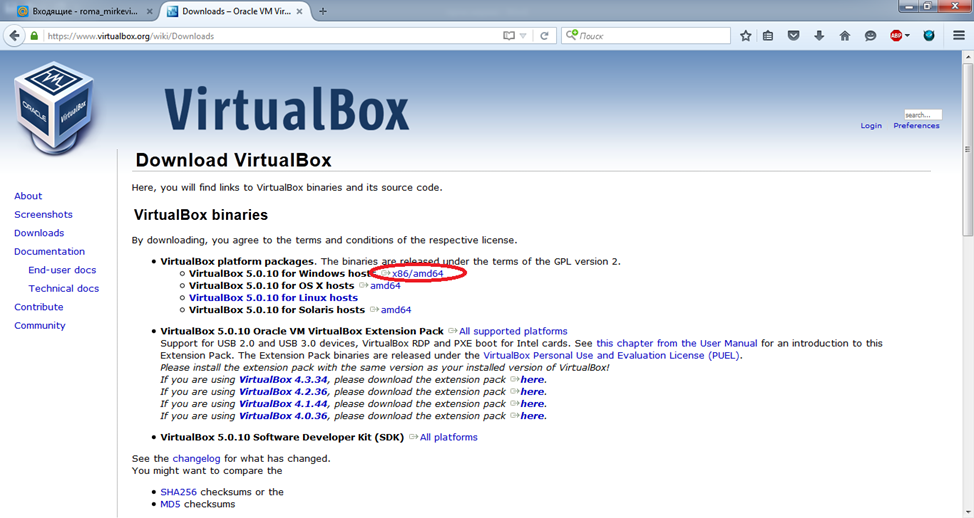

рис.Д1

- [ ] Запустити процес установки (рис.Д.2)

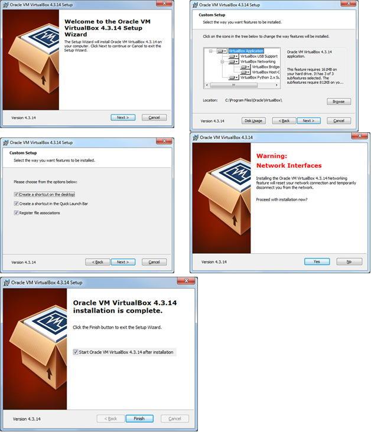

рис.Д.2

- [ ] Для налаштування середовища Virtual Box, необхідно зайти в меню File->Preferences… 

#### 2. Підключення образу віртуальної машини (Варіант 1). 

- [ ] Завантажте образ віртуальної машини для віртуального робочого місця, у випадку якщо Ви його не змогли отримати на кафедрі ІАСУ (https://drive.google.com/file/d/1sWEn-7soGocViHb6ndNlPwrWsv5XGVtq/view?usp=sharing).
- [ ] Запустіть на виконання VirtualBox. У вікні налаштування вибрати "Файл/импорт конфигураций" (рис.Д.5)

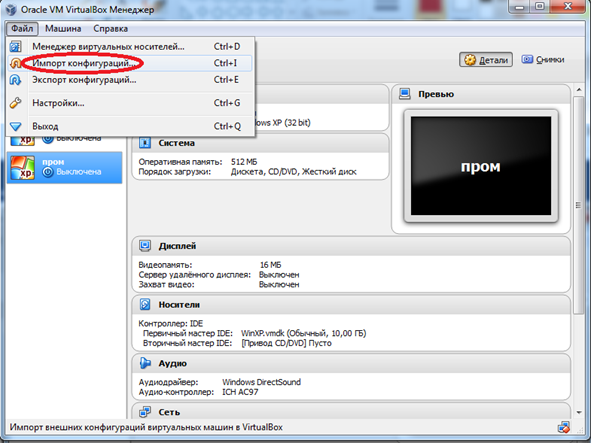

рис.Д.5

- [ ] Вкажіть шлях до образу віртуальної машини: папка «Дистанційна Пром мереж» файл FieldBus.ova

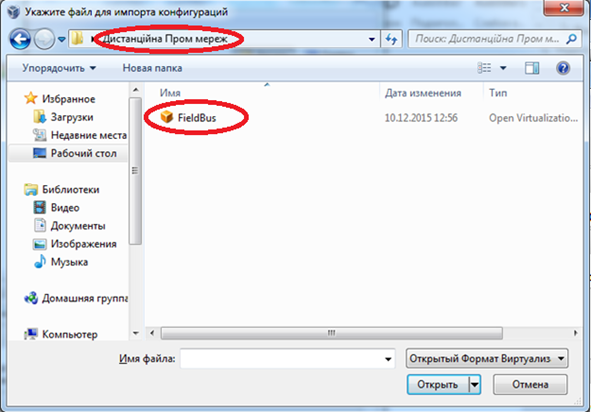

РисД6

- [ ] Налаштуйте (конфігурувати) віртуальну машину з наступними параметрами (рис.Д.7):

1.  Кількість оперативної пам’яті (>=1024 Мб);

2.  Місце збереження файлів віртуальної машини (вибрати самостійно)

- [ ] Після визначення параметрів конфігурування вибрати команду «Імпорт».

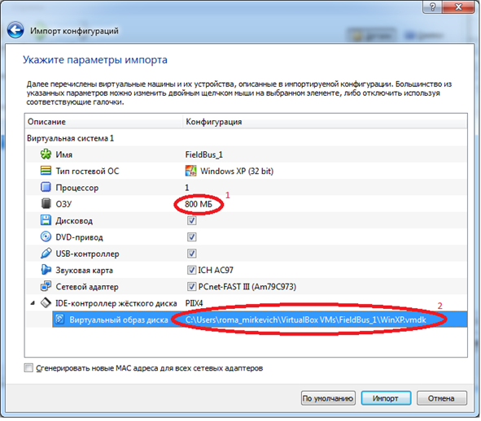

РисД7

Після закінчення імпорту віртуальна машина буде готова до експлуатації. 

#### 3. Запуск, налаштування і робота з віртуальною машиною.

- [ ] Запустіть віртуальну машину. Для запуску віртуальної машини, вона вибирається зі списку і викликається команда «ЗАПУСТИТЬ» (рис.Д.12)

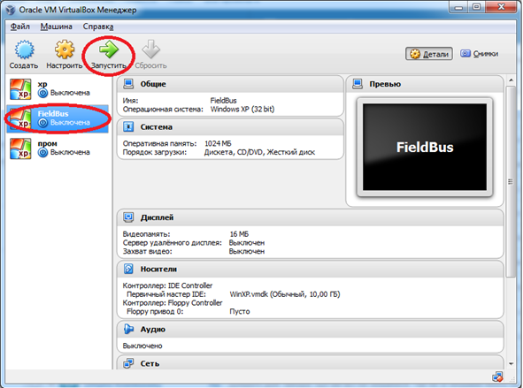

РисД12

Швидкі клавіші для роботи з віртуальною машиною

| Right Ctrl + F| Перехід вікна віртуальної машини в повноекранний  режим |
| ---------------- | ------------------------------------------------------- |
| Right Ctrl + С| Перехід вікна віртуальної машини в режим масштабування  |
| Right Ctrl + Н| Завершити роботу віртуальної машини |
| Right Ctrl + Del | Відіслати віртуальній машині команду Ctrl + Alt + Del|
| Right Ctrl + E| Зробити знімок екрана віртуальної машини  |

Для налаштування віртуальної машини, викликається відповідний пункт контекстного меню або з меню "Машина" (рис.Д.13). Налаштування проводиться тільки при зупиненій віртуальній машині.  

РисД13

#### 4. Встановлення та налаштування гостьових доповнень (Extension Pack).

- [ ] Завантажте гостьові доповнення

Для того щоб з’явилась можливість встановлення гостьових доповнень (Extension Pack - додаткових опцій віртуальної машини) необхідно завантажити їх з сайту https://www.virtualbox.org/wiki/Download_Old_Builds відповідно до встановленої версії Virtual Box. 

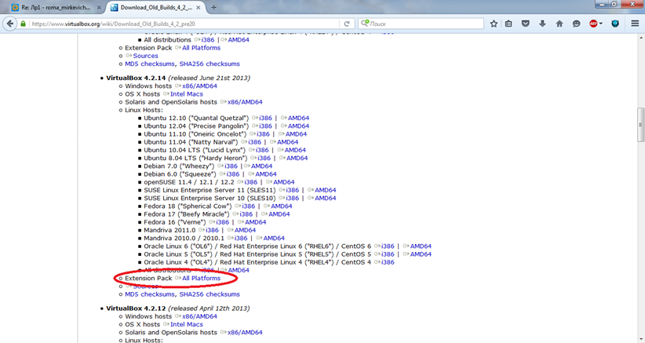

РисД14

Після завантаження, необхідно встановити їх на хостовій операційній системі.

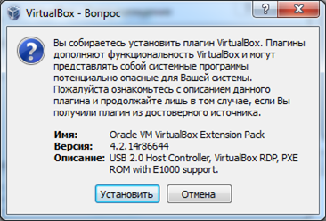

РисД15

- [ ] Встановіть гостьові доповнення на віртуальну машину. Для встановлення даного плагіну на віртуальній машинні необхідно щоб в ній був присутній віртуальний пристрій CD/DVD. Якщо в налаштуваннях машини (розділ "Пам'ять") CD/DVD відсутній, необхідно його додати. Для цього в налаштуваннях в пункті "пам'ять" додається новий CD/DVD пристрій, у вікні вибору ресрусу диску вибирається пункт "Залишити порожнім" (рис.Д.16). 

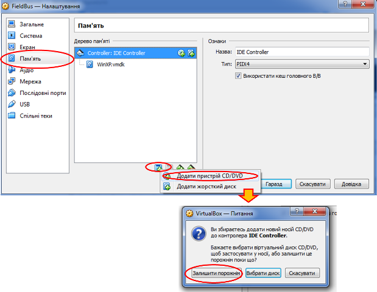

РисД16

- [ ] Після налаштування запустіть віртуальну машину. У гостьовій ОС в меню віртуальної машини, необіхдно вибрати пнкт «Пристрої (Устройство/Device)»-> «Підключити образ диску Гостьові доповнення (Подключить образ диска Дополнений гостевой ОС)»

РисД17

- [ ] Після встановлення образу з’явиться пристрій VirtualBox Guest Additions (рис.Д.18). 

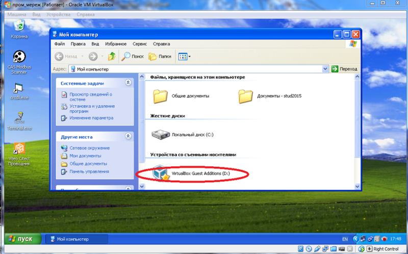

РисД18

Гостьові доповнення віртуальної машини використовуються для збільшення функціоналу віртуальної машини (налаштування розширення екрану, додавання спільних папок і т. д). 

- [ ] Для встановлення VirtualBox Guest Additions, запустіть його з образу, слідуючи вказівкам (рис.Д.19-рис.Д.23). 

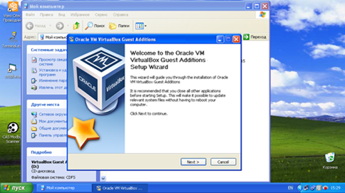

РисД19

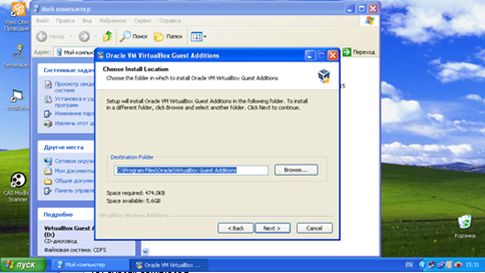

РисД20

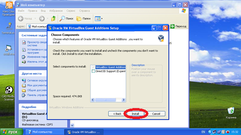

РисД21

- [ ] У процесі установки декілька раз може виникнути вікно з інформацією про несумісність з Вашою операційною системою. У ньому потрібно вибрати «Все одно продожити» (рис.Д.22)

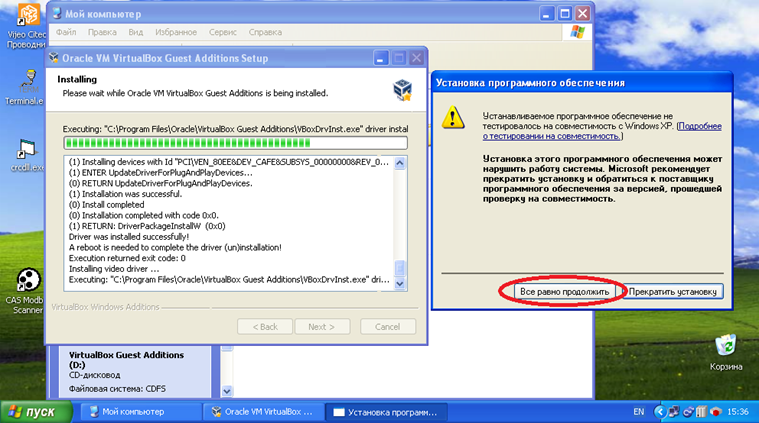

РисД22

- [ ] Після закінчення процесу установки необхідно перезавантажити комп’ютер (Рис.Д.23)

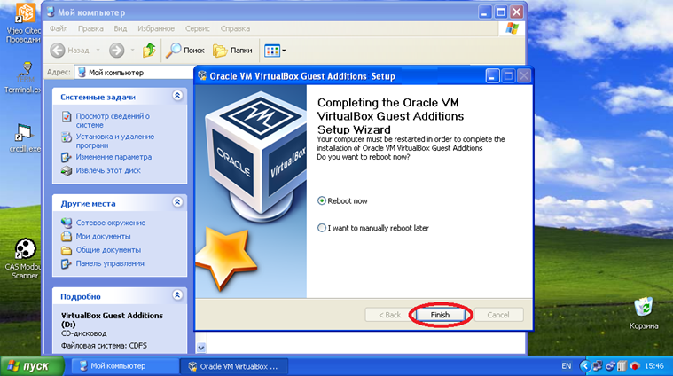

РисД23

- [ ] Після встановлення всіх доповнень необхідно перезавантажити віртуальну машину 

#### 5. Додавання спільної папки 

- [ ] Для додавання спільної папки необхідно при вимкненій віртуальній машині в Oracle VM VirtualBox менеджері вибрати необхідну віртуальну машину і натиснути "Налаштування" («Настроить»). У вікні що з’явилось вибрати вкладку "Спільні теки" («Общие папки») і натиснути кнопку додавання нових папок.

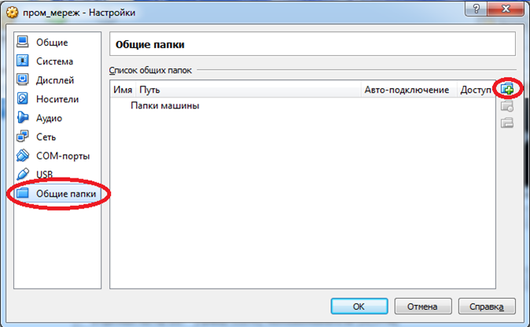

РисД24

- [ ] Далі необхідно вказати місце знаходження цієї папки(можна додавати цілі локальні диски), а також ім’я даної папки. Також необхідно поставити галочку «Авто-подключение» і натиснути «ОК»

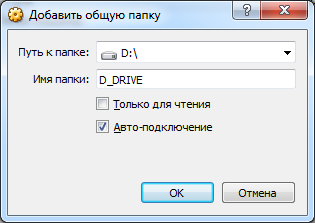

РисД25

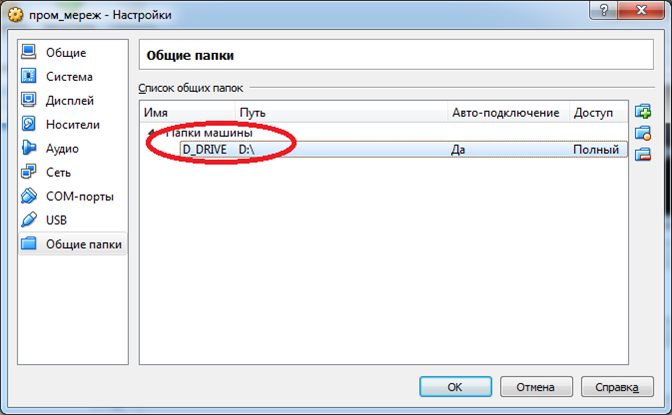

РисД26

Після цього вона з’явиться у вікні списку спільних папок а також в гостьовій ОС. 

## Частина 2. Основи Ethernet та IP

**Тривалість**: 3 акад. години.

**Мета:** Познайомитись з протоколами Ethernet та отримати навики налаштування та тестування комунікацій в ОС Windows. 

### Лабораторна установка для проведення лабораторної роботи у віртуальному середовищі.

**Апаратне забезпечення, матеріали та інструменти для проведення віртуальної лабораторної роботи.** 

Усі досліди проводяться на комп’ютері (ПК) на якому встановлена віртуальна машина відповідно до лабораторної роботи №1. Передбачається, що хостова ОС є однією з версій починаючи з Winodws XP. Інші хостові ОС також можуть бути використані, але опис роботи з ними не розглядаються в даній лабораторній роботі. 

Між хостовою та гостьовою ОС до існуючої віртуальної мережі (для Internet) створюється ще одна, яка буде використовуватися в дослідах.

Рис.1.1. Функціональна схема лабораторної установки

**Програмне забезпечення, що використане у віртуальній лабораторній роботі.** 

1. Сніфер Wireshark (http://www.wireshark.org/)
2. Вбудовані утиліти Winodws XP.

### Загальна постановка задачі. 

Цілі роботи: 

-налаштувати віртуальну локальну мережу між хостовою та гостьовою ОС для проведення наступних лабораторних робіт

-встановити сніфер Wireshark та отримати навички роботи з ним

-проаналізувати структуру кадрів Ethernet та ARP-пакетів

- [Додаток 2](d1_2.md)
- [Додаток 3](d1_3.md)
- [Додаток 4](d1_4.md)
- [Додаток 5](d1_5.md)

### Послідовність виконання роботи.

#### 1. Добавлення мережного адаптеру

- [ ] Добавте на віртуальну машину додатковий мережний адаптер з властивістю «Під’єднаний до» - «Лише головний адаптер» для створення ще однієї віртуальної мережі між гостьовою та хостовою ОС, яка буде використовуватися в дослідах (рис.1.1). 

Віртуальна машина може мати декілька віртуальних мережних адаптерів з різними варіантами реалізації з’єднань. За замовченням на віртуальній машині створений один мережний адаптер. Налаштування цього мережного адаптеру показане на рис.Д.1.  

У налаштуванні «Під’єднаний до» стоїть властивість NAT, яка вказує на те, що адаптер буде використовувати під’єднання Інтернет хостової операційної системи (механізм NAT-трансляції розглядається в наступній темі). 

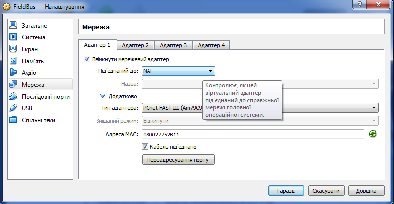

Рис.Д.1.  

У віртуальній машині відповідно до цього налаштування створюється один мережний адаптер, через який відбувається з’єднання з Інтернет. Це з’єднання автоматично отримує всі необхідні налаштування. 

У лабораторній роботі необхідно добавити ще один адаптер, який буде реалізовувати внутрішню віртуальну мережу між хостовою ОС та віртуальною машиною. Для цього необхідно зробити налаштування, відповідно до рис.Д.2. Після чергового завантаження віртуальної машини у гостьовій ОС буде два мережні адаптери: 

-«Подключение по локальной сети» - для Адаптеру 1

-«Подключение по локальной сети 2» - для Адаптеру 2

Слід звертати увагу на назву адаптеру, так як вона вказує на конкретне підключення. 

Для адаптеру, за необхідності можна вибрати тип та налаштувати різні режими. У лабораторній роботі всі налаштування, що показані на рис.Д2 необхідно залишити без змін.

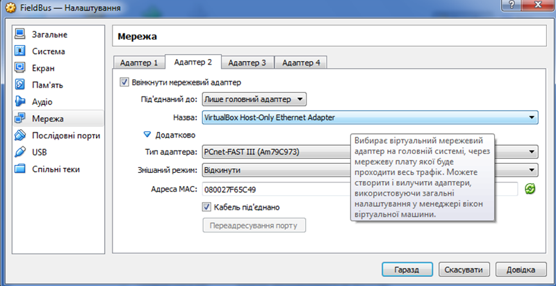

Рис.Д.2. 

#### 2. Налаштування адаптерів

- [ ] На гостьовій ОС (у віртуальній машині) перейменуйте назву новоствореного адаптеру відповідно до назви вашого логіну: `NET вашлогін` 

- [ ] Користуючись відомостями з [додатку 1.2](d1_2.md) налаштуйте драйвери TCP/IP адаптерів в гостьовій (на віртуальній машині) та хостовій ОС наступним чином:

  -  IP адаптера хостової ОС:192.168.x.1/24
  
  
    -  IP адаптера гостьової ОС (віртуальної машини):192.168.x.2/24
  

Де x – номер варіанту (по списку). 

> **Зверніть увагу для якого самого адаптеру в гостьовій машині Ви змінюєте налаштування, адже там два адаптери - перший для NAT (вихід до мереж гостової машини), а другий - для віртуальної мережі, саме його і треба налаштовувати!**  

Зробіть копії екранів згідно формату і прикладу зробленого в [додатку 1.5](d1_5.md).

**Надалі в лабораторній роботі всі дії на гостьовій ОС будуть проводитися саме з цим мережним адаптером!**

#### 3. Визначення MAC-адрес утилітою Getmac 

- [ ] На віртуальній мережі запустіть консольну утиліту ***cmd*** (Пуск->Выполнить). Налаштуйте властивості консольного вікна через контекстне меню утиліти так, щоб ширина розміру вікна була 120 символів. 

- [ ] На віртуальній машині через консольне вікно запустіть утиліту ***Getmac*** (див. додаток [Д1.4.4](d1_4.md)), та використайте її для перегляду MAC-адрес доступних мережних інтерфейсів. Зробіть копію екрану, та занесіть значення MAC-адрес в таблицю. Повторіть те саме для хостової ОС.

- [ ] Заповніть таблицю з МАС-адресами мережних плат для новоствореної віртуальної мережі.

#### 4. Тест наявності підключення 

- [ ] За допомогою утиліти ***ping*** зробіть тест наявності підключення:

- адаптера хостової ОС з гостьової

- адаптера гостьової ОС з хостової

Зробіть копії екранів для звіту. Проаналізуйте результати тестування. За відсутності з’єднання повторіть п.2. 

#### 5. Завантаження, інсталяція та налаштування Wireshark

- [ ] Завантажте та встановіть на віртуальну машину сніфер Wireshark.

- [ ] Запустіть на виконання сніфер WireShark. Через меню Edit/Preferences/Columns добавте необхідні поля, що показані на рис.1.2, якщо вони відсутні, а всі інші видаліть.

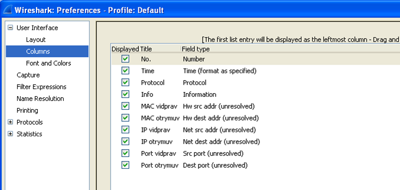

Рис.1.2.

#### 6. Робота з кешем ARP

- [ ] Ознайомтесь з додатком [Д.1.4.3](d1_4.md). Видаліть всі записи з кешу ARP віртуальної машини. Виведіть таблицю записів таблиці ARP і перевірте чи є там записи. 

- [ ] Потім запустіть утиліту ping для тесту з’єднання з мережною картою хостової ОС. Виведіть таблицю записів таблиці ARP. Зробіть копію екрану і поясніть отримані результати (усі поля таблиці ARP). 

#### 7. Запуск прослуховування мережі сніфером Wireshark 

- [ ] Налаштуйте інтерфейс Wireshark на мережну карту та запустіть захоплення пакетів. 

- [ ] Очистіть ARP кеш та перевірте чи він порожній. 

- [ ] Запустіть утиліту ping для тесту з’єднання адаптера хостової ОС з гостьовою. Після закінчення тесту зупиніть захоплення пакетів. 

- [ ] Зробіть фільтрацію пакетів по протоколу ARP, тобто щоб відображалися тільки кадри з arp-пакетами. Зробіть копію екрану, та поясніть отримані результати. 

#### 8. Аналіз пакету

- [ ] Використовуючи вікно деталізації пакету визначте структуру та призначення пакетів в кадрі, які містять ARP (2 шт). Зокрема для кожного кадру та кожного пакету в ньому згідно ієрархії вкладеності визначити:

- протокол

- поля та їх призначення

- [ ] Зробіть копії екранів з відкритою деталізацією кадрів (2 шт). Під кожною копією екрану занотуйте результати у вигляді таблиці, наведеною в [додатку 1.5](d1_5.md).  

#### 9. Аналіз gratuitous ARP

- [ ] На хостовій ОС вимкніть мережний адаптер «VirtualBox Host-Only Ethernet Adapter». На гостьовій ОС (віртуальній машині) запустіть на виконання Wireshark. Включіть захоплення пакетів з мережі. Після цього включіть на хостовій ОС попередньо вимкнений мережний адаптер. Коли індикатор мережі покаже, що вона працює (порядку декілька секунд) зупиніть на гостьовій машині захоплення пакетів.

- [ ] Використовуючи фільтри та вікно деталізації пакету визначте структуру та призначення пакетів в кадрі, які містять ARP (3 шт). Зокрема для кожного кадру та кожного пакету в ньому згідно ієрархії вкладеності визначити:

- протокол

- поля та їх призначення

- [ ] Зробіть копії екранів з відкритою деталізацією кадрів (3 шт). Під кожною копією екрану занотуйте результати у вигляді таблиці, наведеною в [додатку 1.5](d1_5.md). Поясніть результати.

### Оформлення звіту.

Після закінчення роботи, відправте звіт у форматі DOC чи PDF, оформлений у вигляді, наведеному в [додатку 1.5](d1_5.md).

### Перевірка виконання роботи та питання до захисту.

Викладачем перевіряється виконання всіх пунктів роботи відповідно до занотованих у звіті результатів. Оцінюється повнота результатів. Кінцева оцінка коригується по усному опитуванню при очному спілкуванню. Кожен результат студент повинен пояснити. У випадку виникнення помилок або запитань щодо проведення певного пункту, його необхідно буде повторити. 
