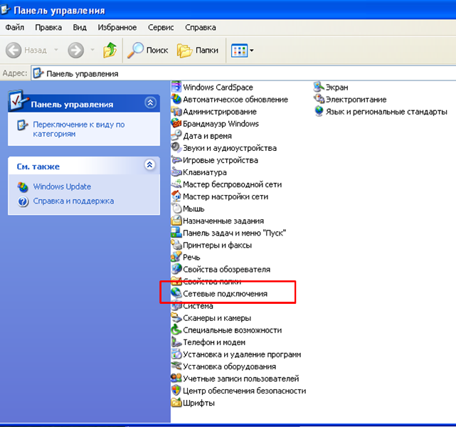
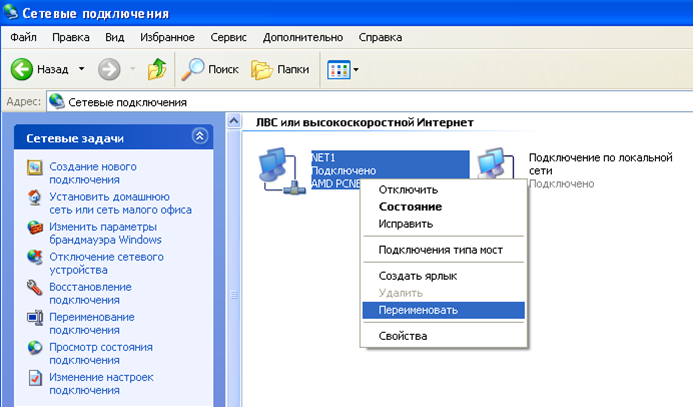
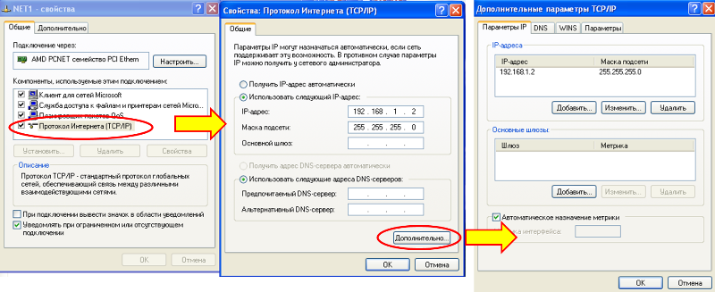
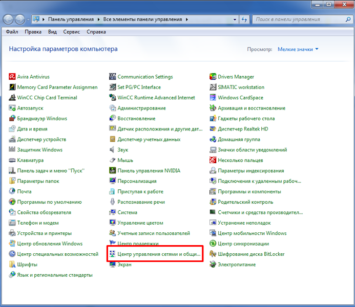
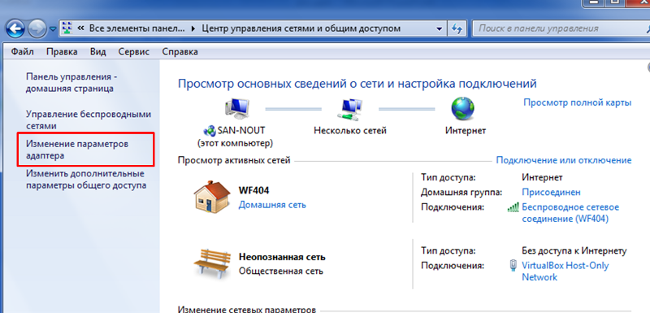
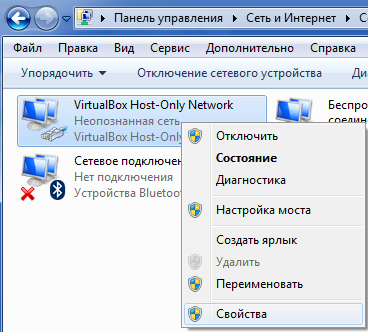

[ЛР.1.Основи Ethernet та IP](1.md)

## Додаток 1.2. Налаштування адаптерів Ethernet на Winodws XP та Windows 7 .

#### Д.1.2.1. Налаштування адаптерів Windows XP (для гостьової ОС)

Для налаштування адаптерів в гостьовій ОС, тобто віртуальної машини, необхідно зайти в меню «Пуск»->«Панель управления»-> «Сетевые подключения» (рис.Д.3) 

Рис.Д.3.

У списку адаптерів видно їх стан, а також можна змінити їх налаштування. Необхідні операції вибираються через контекстне меню. На рис.Д.4 показано як можна перейменувати підключення через мережний адаптер. Для налаштування адаптерів в контекстному меню вибирається команда «Свойства», для вимкнення адаптеру – «отключить», для перегляду стану – «состояние».   

Рис.Д.4.

Серед налаштувань адаптеру можна вказати необхідні параметри для драйверів та служб. Наприклад, для налаштування драйверу TCP/IP, той вибирається зі списку і натискається кнопка «Свойства» (рис.Д.5). Додатково до основних налаштувань можна вибрати додаткові через кнопку «Дополнительно».   
 

Рис.Д.5. 

#### Д.1.2.2. Налаштування адаптерів Windows 7 та інших 64-розрядних систем Windows

У лабораторній роботі також необхідно налаштовувати адаптери на хостовій ОС, яка може бути новішою версію Windows або іншою ОС. Налаштування адаптерів для новіших версій Windows проводиться схоже до Windows XP.

Усі налаштування проводять авторизувавшись з правами Адміністратора.

Для Windows 7 необхідно зайти в «Пуск»-> «Панель управления» -> «Центр управления сетями и общим доступом» (рис.Д6), після чого перейти у меню «Изменение параметров адаптера» (рис.Д7) 

Рис.Д6. 

Рис.Д7.

У вікні мереж вибрати властивості необхідного адаптеру через контекстне меню.

Рис.Д8. 

Для налаштування мереж у Windows 8 можна доступитися через «Параметры» «Изменение параметров компьютера» «Сеть», або через класичний робочий стіл як у Winodws 7.

Налаштування адаптерів у інших ОС виходить за рамки даної лабораторної роботи, необхідно попередньо ознайомтеся з довідниковою інформацією.  