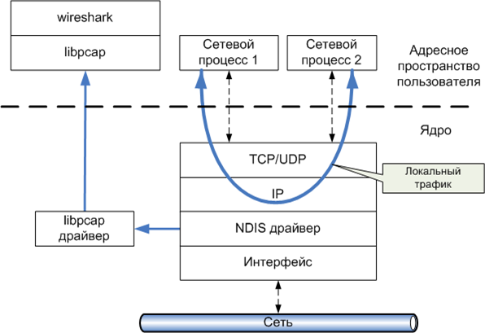
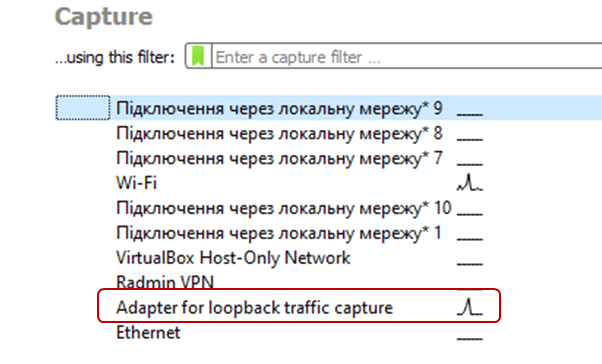
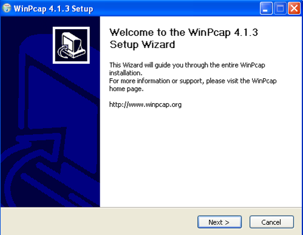
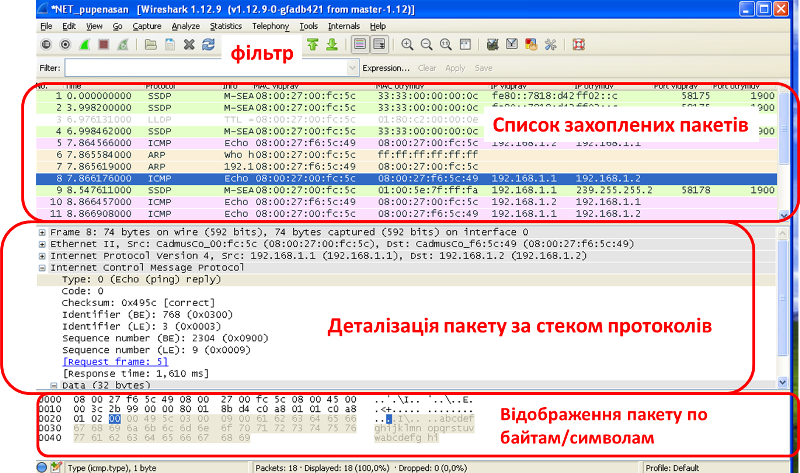
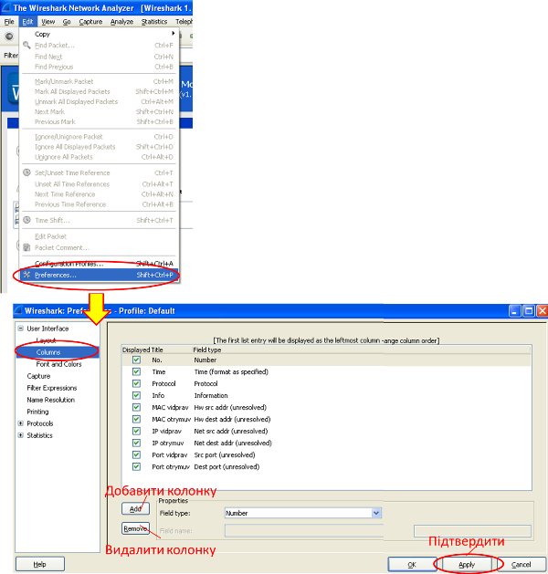
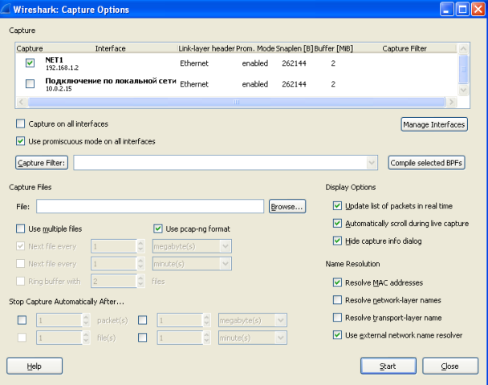
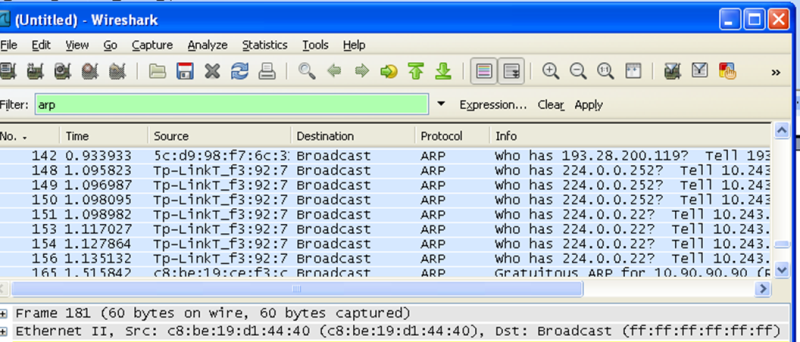
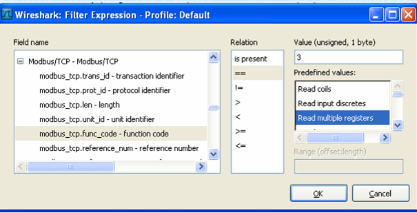

[ЛР.1.Основи Ethernet та IP](1.md)

## Додаток 1.3. Встановлення і робота з Wireshark

#### Д.1.3.1. Загальні відомості про сніфери та Wireshark 

***Sniffer*** (від англ. to sniff – нюхати) – це мережний аналізатор трафіку, програма або програмно-апаратний пристрій, призначений для перехвату та наступного аналізу, або тільки аналізу мережного трафіку, призначеного для інших вузлів. Перехват трафіку може відбуватися:

-     звичайним "прослуховуванням" мережного інтерфейсу; метод ефективний при ивикористанні в сегменті концентраторів (hub) замість комутаторів (switch), в іншому випадку метод малоефективний, оскільки на сніфер попадають лише окремі кадри, які призначені приймаючому вузлу;

-     підключенням сніферу в розрив каналу; 

-     відгалуженням (програмним чи апаратним) трафіку і направленням його копії на сніфер;

-     через аналіз побічних електромагнітних випромінювань та відновленням таким чином трафіку, що прослуховується;

-     через атаку на канальному рівні (2-му) або мережному рівні (3-му), яка приводить до перенаправлення трафіку жертви або всього трафіку сегменту на сніфер з наступним поверненням трафіку на потрібну адресу .

Сніфери застосовуються як в благих, так і деструктивних цілях. Аналіз трафіку, що проходить через сніфер, дозволяє:

-     відслідковувати мережну активність додатків;

-     відлагоджувати протоколи мережних додатків;

-     локалізувати несправність або помилку конфігурації;

-     знаходити паразитний, вірусний та закільцьований трафік, наявність котрого збільшує навантаження мережного обладнання та каналів зв’язку;

-     виявити в мережі шкідливе ПО, наприклад, мережні сканери, флудери, троянські програми, клієнти пірингових мереж та інші; 

-     перехватити любий незашифрований (а інколи і зашифрований) трафік користувача з ціллю дізнавання паролів та іншої інформації

Поступово із інструментів, призначених тільки для діагностики, сніфери перетворилися в засоби для дослідження та навчання. Наприклад, вони постійно використовуються для вивчення динаміки і взаємодії в мережах. Зокрема, вони дозволяють легко та наглядно вивчати тонкощі мережних протоколів. Спостерігаючи за даними, які відправляє протокол, можна глибше зрозуміти його функціонування на практиці, а заодно побачити, коли деяка конкретна реалізація робить не у відповідності зі специфікацією. На сьогоднішній момент існує достатня кількість хороших реалізацій сніферів. Деякі з них:   

-     Tcpdump (http://www.tcpdump.org/) – консольний варіант сніферу. Працює на найбільш поширених на сьогоднішній день ОС;

-     Wireshark (http://www.wireshark.org/) до недавнього часу був відомий під іменем Ethreal;

-     WinDump http://www.winpcap.org/windump;

Програма **Wireshark** являеться однією з самих зручних реалізацій сніферів, яка доступна для багатьох ОС і поширюється безкоштовно. На рис.Д9 зображена структура мережної підсистеми ОС. Уся базова інфраструктура реалізована у вигляді драйверів та працює в режимі ядра. Процеси користувача та реалізації прикладних протоколів, зокрема інтерфейс сніферу працюють в режимі користувача.



Рис.Д9. Принцип захвату мережного трафіку.

Основними компонентами сніферу є: драйвер для захоплення пакетів (libpcap драйвер), інтерфейсна бібліотека (libpcap) та інтерфейс користувача (Wireshark). Бібліотека libpcap (реалізація під ОС Windows носить назву WinPcap - [http://www.winpcap.org](http://www.winpcap.org/)) – універсальна мережна бібліотека, яка самостійно реалізує велику кількість мережних протоколів та працює безпосередньо з NDIS драйверами (Network Driver Interface Specification) мережних пристроїв. На базі даної бібліотеки реалізована велика кількість мережних програм, в тому числі сніфер Wireshark.

Сніфери використовують бібліотеку в режимі "захоплення" пакетів, тобто може отримувати копію всіх даних що проходить через драйвер мережного інтерфейсу. Зміни в самі дані не вносяться. Якщо локальний трафік не проходить через драйвер мережного пристрою (див. рис.Д9), то він не буде видимий сніфером. Але якщо використати спеціальний віртуальний трафік loopback, то можна відслідковувати обмін через poopback інтерфейс (127.0.0.1).



Wireshark дозволяє в режимі реального часу захватувати пакети з мережі, та аналізувати їх структуру. Також можна аналізувати структуру пакетів з файлу, який вміщує трафік, отриманий, наприклад програмою «tcpdump» (unix/linux).

#### Д.1.3.2. Завантаження та інсталяція Wireshark 

Завантажити Wireshark можна з офіційної сторінки https://www.wireshark.org/#download . Слід звернути увагу що для різних версій ОС використовуються різні дистрибутиви:

-              для 32-бітного Winodws 7 https://1.na.dl.wireshark.org/win32/Wireshark-win32-2.0.1.exe  

-              для 64-бітних Windows https://1.na.dl.wireshark.org/win64/Wireshark-win64-2.0.1.exe

-              **для** **Windows** **XP (для гостьової ОС віртуальної машини) треба завантажувати стару портативну версію Wireshark (1.12)** https://1.na.dl.wireshark.org/win32/WiresharkPortable-1.12.9.paf.exe після чого розпакувати її в необхідну папку

При встановленні Wireshark (для портативної версії після першого запуску) необхідно встановити бібліотеку WinPcap (рис.Д10).



  Рис.Д10.

Слід звернути увагу, що після закриття портативної версії WireShark система запропонує деінсталювати WinPcap. У цьому немає потреби, тому для лабораторної робити треба відмовитися від деінсталяції бібліотеки. 

#### Д.1.3.3. Робота з утилітою

На рис. Д.11 зображене основне вікно програми Wireshark. У стандартному режимі вікно сніферу ділиться на 3 панелі: панель списку захоплених пакетів (packet lists), панель деталізації пакету (packet details), панель побайтового відображення пакетів (packet bytes). 



Рис.Д.11. Основне вікно сніферу Wireshark. 

**Панель списку пакетів** вміщує всі пакети, які захоплені з мережі, попередньо відфільтровані через умову фільтру (Filter). Список можна відсортувати по будь-якому полю (в прямому або зворотному порядку) – для цього треба натиснути по заголовку відповідного поля. Кожний рядок вміщує наступні поля (по замовченню) 

-     порядковий номер пакету (No.);

-     час надходження пакету (Time);

-     джерело пакету (Source);

-     пункт призначення (Destination);

-     протокол (Protocol);

-     інформаційне поле (Info). 

Список полів які будуть відображатися в панелі списку як колонки налаштовується в Edit/Perferencis/Columns (рис.Д12). Для того, щоб зміни вступили в силу, після добавлення колонок треба натиснути “Apply”. 

**Панель деталізації пакетів** показує ієрархічну протокольну структуру вибраного в панелі списку пакету. Тобто вказується вкладеність PDU (пакетів) один в одного, згідно відомих Wireshark протоколів. При виділенні PDU, його вміст в байтах показується на панелі побайтового відображення. При розкриванні PDU (+), виводиться детальний аналіз його полів. Так, наприклад, на рис.Д.11 видно, що в кадр EthernetII вкладений пакет IPv4, в який в свою чергу вкладений пакет ICMP (Internet Control Message Protocol). Для виділених пакетів видно поля та їх значення, які розділені через двокрапку. Так, наприклад, на рис.Д.11 видно, що поле ICMP-пакету з назвою Type має значення 0, що вказує на тип «Echo (ping) reply». 



Рис.Д.12.

**На панелі побайтового відображення пакетів** для виділених пакетів показується його 16-кове та символьне представлення. 

#### Д.1.3.5. Захоплення пакетів. 

Для початку захоплення пакетів необхідно задати параметри, зокрема, вказати мережний інтерфейс, з якого і буде відбуватися захват пакетів. Ця дія доступна через меню "Capture -> Interfaces..." (рис.Д.13)., для більш детального налаштування - "Capture -> Options..." (рис.Д.14). У полі «Interface:» вибирається доступний інтерфейс (наприклад мережний адаптер).

У якості додаткових параметрів захвату можна вказати:

-     *«Capture Filter»* – фільтр захвату. Тут можна добавляти той чи інший фільтр із існуючих, або вказати умови фільтрації.

-     *«Update list of packets in real time»* – оновлення списку захоплених пакетів в режимі реальног очасу.

-     *«Stop Capture»* – набір параметрів, які дозволяють задати те чи інше значення, при досягненні якого процес захвату закінчиться.

-     *«Name Resolution»* – набір параметрів вирішення імен дозволяє визначити які із способів вирішення імен повинні використовуватися.


Рис.Д.13



Рис.Д.14. Вибір інтерфейсів та параметрів захвату пакетів.

Для початку моніторинга мережної активності необхідно натиснути «Start». Після вибору інтерфейсу, який цікавить, можна починати і закінчувати захват пакетів через команди в меню «Capture».

#### Д.1.3.6.Налаштування фільтрів. 

Якщо запустити сніфер без додаткових налаштувань, то він буде захоплювати всі пакети, які проходять через мережний інтерфейс. Найбільш часто користувача цікавлять тільки деякі пакети, які відповідають заданим критеріям. Для визначення цих критеріїв служать фільтри відображення та захоплення.

Існує два варіанти фільтрації пакетів: на етапі захоплення і на етапі відображення користувачу. У першому випадку ефективність роботи сніферу та споживані ним системні ресурси значно нижче, ніж у 2-му випадку.

При визначенні фільтру вказуються умови, яким повинні відповідати ті пакети, які повинні бути пропущені через фільтр. Назва полів та протоколів в фільтрі вводиться тільки маленькими літерами. Якщо текст фільтру має коректний зміст, поле фільтру підсвічується зеленим, якщо некоректний – червоним. Для задіяння фільтру необхідно його підтвердити кнопкою "Apply".

Фільтрацію можна проводити за протоколами або за значеннями полів в PDU (пакеті). Для застосування фільтрації за протоколом необхідно в поле вводу фільтра ввести назву протоколу. Наприклад фільтр за протоколом `arp` виводить тільки ARP-кадри (рис.Д.15).



Рис.Д.15. Приклад задавання фільтру через назву протоколу.

Для фільтрації за значенням поля в PDU, записується назва поля, оператор порівняння та значення з яким порівнюється це поле. Для формування тексту фільтру можна скористатися майстром побудови виразів фільтру, який викликається через кнопку "Expression...". Наприклад результат роботи майстра з рис.Д.16 буде текстове значення фільтру  

`modbus_tcp.func_code == 3`

У таб. наводиться перелік найбільш вживаних для лабораторних робіт полів.

 Таб 5.16 

| **Поле**      | **Опис**                                                     |
| ------------- | ------------------------------------------------------------ |
| eth.addr      | Фізична адреса джерела або отримувача в кадрі Ethernet       |
| eth.dst       | Фізична адреса отримувача в кадрі Ethernet                   |
| eth.src       | Фізична адреса джерела в кадрі Ethernet                      |
| eth.len       | Довжина кадру Ethernet                                       |
| ip.addr       | Мережна адреса джерела або отримувача в пакеті протоколу  IP |
| ip.dst        | Мережна адреса отримувача в пакеті протоколу IP              |
| ip.src        | Мережна адреса джерела в пакеті протоколу IP                 |
| ip.proto      | Позначення протоколу, який був інкапсульований в пакет IP    |
| tcp.ack       | Підтвердження (АСК) протоколу ТСР                            |
| tcp.port      | Порт джерела і отримувача в сегменті протоколу TCP           |
| tcp.dstport   | Порт отримувача в сегменті протоколу TCP                     |
| tcp.srcport   | Порт джерела в сегменті протоколу TCP                        |
| udp.port      | Порт джерела або отримувача в сегменті протоколу UDP         |
| udp.dstport   | Порт отримувача в сегменті протоколу UDP                     |
| udp.srcport   | Порт джерела в сегменті протоколу UDP                        |
| dns.qry.name  | Ім’я мережного ресурсу в DNS запиті                          |
| dns.resp.name | Ім’я мережного ресурсу в DNS відповіді                       |



Рис.Д.16. Приклад задавання фільтру через поле протоколу.

Оператор порівняння може являти собою С-подібний оператор або символьне скорочення оператору, які наведені в таб.Д1

Таб.Д1.

| **символьне скорочення** | **C-like** | **Опис та приклад**  |
| ------------------------ | ---------- | -------------------- |
| *eq*                     | *==*       | Рівне                |
| *ip.src==10.0.0.5*       |            |                      |
| *ne*                     | *!=*       | Нерівне              |
| *ip.src!=10.0.0.5*       |            |                      |
| *gt*                     | *>*        | Більше  ніж          |
| *frame.len > 10*         |            |                      |
| *lt*                     | *<*        | Менше  ніж           |
| *frame.len < 128*        |            |                      |
| *ge*                     | *>=*       | Більше  або дорівнює |
| *frame.len* *>= 0x100*   |            |                      |
| *le*                     | *<=*       | Менше  або дорівнює  |
| *frame.len <= 0x20*      |            |                      |

```
Значення поля типу без-знакового цілого можна вводити в різних системах числення: 10-кова, 8-кова (починається з 0), 16-кова (починається з 0x). Наприклад, наступні значення еквівалентні.
ip.len le 1500
```

*ip.len le 02734*

*ip.len le 0x436*

Для того щоб задати умову для булевого поля, достатньо вказати це поле. Наприклад, наступне значення фільтру пропустить тільки ті пакети, для яких прапорець SYN в сегменті TCP буде виставлений  

***tcp.flags.syn***

Байти або два байти адреси Ethernet можуть бути розділені розділювачами ":", "-" або ".". Наприклад:

eth.dst == ff:ff:ff:ff:ff:ff

eth.dst == ff-ff-ff-ff-ff-ff

eth.dst == ffff.ffff.ffff

Для визначення в умові текстового поля, його значення береться в лапки. Наприклад: 

http.request.uri == "http://www.wireshark.org/" 

При побудові фільтру можна комбінувати дві та більше умови, використовуючи логічні оператори. У якості умови може виконуватися як фільтрація за протоколами, так і фільтрація за значенням полів. 

Таб.Д.2.

| **символьне скорочення** | **C-like** | **Опис та приклад**                                          |
| ------------------------ | ---------- | ------------------------------------------------------------ |
| not                      | !          | заперечення  *not llc*                                       |
| and                      | &&         | конкатенація (логічне «І»)  *ip.src==10.0.0.5 and tcp.flags.fin* |
| or                       | \|\|       | альтернатива (логічне «АБО»)  *ip.scr==10.0.0.5 or ip.src==192.1.1.1* |