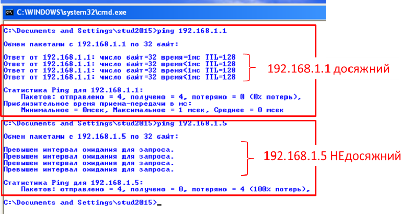
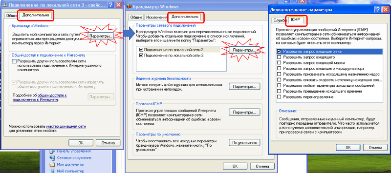
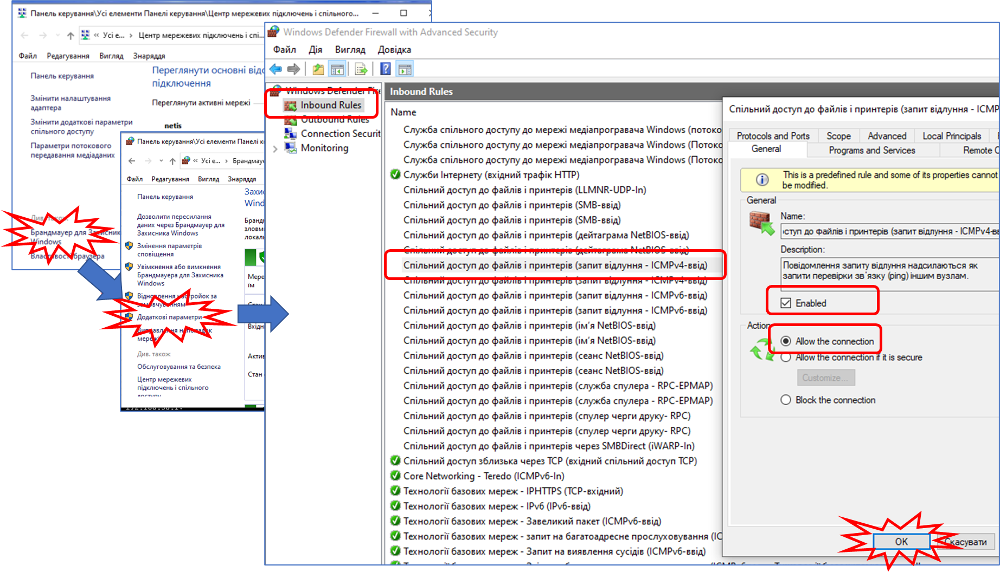
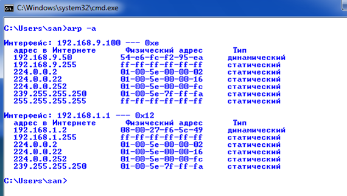
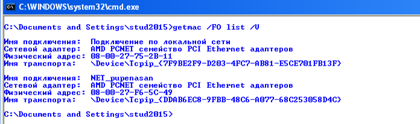

[ЛР.1.Основи Ethernet та IP](1.md)

## Додаток 1.4. ВБУДОВАНІ ЗАСОБИ WINDOWS ДЛЯ КОНФІГУРУВАННЯ ТА ПЕРЕВІРКИ РОБОТИ МЕРЕЖІ

#### Д.1.4.1. Загальний перелік утиліт, що використовуються в даній лабораторній роботі

***ping*** - перевіряє з’єднання на рівні протоколу IP з іншим пристроєм, який підтримує TCP/IP

***arp*** - виводить та змінює записи кешу ARP: таблиць відповідності IP-адрес і відповідних їм фізичних адрес (наприклад MAC в Ethernet)

***getmac*** – отримання апаратних адрес мережних адаптерів (MAC-адрес) як на локальному так і на віддаленому ПК.

#### Д.1.4.2. Утиліта PING (тут дані мінімальні функції, детальніше розглянутий в наступній лабораторній роботі). 

Дана утиліта перевіряє досяжність на рівні протоколу IP іншого пристрою, який підтримує протокол IP. Функціонування даного сервісу базується на протоколі ICMP (розглянутий в наступному розділі курсу). Утиліта відправляє ехо-запит, і після повернення ехо-відповіді виводить час очікування. 

Політики фільтрування пакетів для маршрутизаторів, брандмауерів та інших шлюзів безпеки можуть запобігати перенаправленню пакетів.     

Мінімальний синтаксис: 

***ping*** *кінцевийВузол*

Де *кінцевийВузол -* задає IP-адресу або ім’я вузла-призначення

На рис.Д17 показаний приклад роботи утиліти Ping:

Вузол 192.168.1.1 відповідає на ехо-запити, а вузол 192.168.1.5 – ні. 

Слід зазначити, що не всі вузли мають відповідати на ехо-запити.  



Рис.Д.17.

Для отримання інформації про всі значення параметрів, наберіть команду:

```bash
ping /?
```

```
ping [-t] [-a] [-n кількість] [-l розмір] [-f] [-i TTL] [-v TOS] [-r кількість] [-s кількість] [[-j списокВузлів] | [-k списокВузлів]]  [-w таймаут] кінцевийВузол 
```

| Параметр        | Призначення параметру                                        |
| --------------- | ------------------------------------------------------------ |
| /?              | виводить довідку по використанню                             |
| -t              | Періодична відправка на вказану адресу до команди переривання. Для виводу статистики та продовження необхідно нажати `<Ctrl>+<Break>`, для закінчення `<Ctrl>+<C>`. |
| -a              | Визначення імені (DNS) по адресі вузлу. У випадку успішного виконання виводиться ім’я відповідного вузлу. |
| -n кількість    | Кількість запитів для відправлення. По замовченню дорівнює 4. |
| -l розмір       | Довжина (в байтах) поля даних увідправлених повідомленнях з ехо-запитом. По замовченню – 32байти. Максимальний розмір - 65527 |
| -f              | Виставляє в IP-заголовку пакету  відправки прапорець, який забороняє фрагментацію пакету. |
| -i TTL          | Задає значення поля TTL  (тривалість життя пакету) в IP-заголовку. По замовченню – 128, максимум - 255 |
| -v TOS          | Вказівка на тип служби (TOS  "Type Of Service") в IP-заголовку. Задається від 0 до 255. По  замовченню дорівнює 0. |
| -r кількість    | Задає значення запису  шляху (Record Route) в IP-заголовку – максимальна  кількість переходів між джерелом та місцем призначення (від 1 до 9). |
| -s кількість    | Вказує на штамп часу для кожного  переходу (Internet Timestamp) в IP-заголовку. Від 1 до 4. |
| -j списокВузлів | Вказується набір IP-адрес або  імен (розділених пробілами) проміжних вузлів-маршрутизаторів, через які  повинні йти ехо-запити. Вказується до 9-ти вузлів |
| -k списокВузлів | Вказує необхідність строгої  маршрутизації в IP-заголовку та перелік вузлів, через які повинен проходити ехо-запит. На відміну від попереднього  параметру, при строгій маршрутизації наступна проміжна точка призначення  повинна бути досяжна напряму (вона повинна бути сусідньою в інтерфейсі  маршрутизатору). Вказується до 9-ти вузлів. |
| -w таймаут      | Визначає час очікування  повідомлення з ехо-відповіддю. Якщо час виходить, то видається  повідомлення про помилку "Request timed out". По замовченню дорівнює  4000 (4 секунди) |
| кінцевийВузол   | задає IP-адресу або ім’я  вузла-призначення                  |

Деякі вузли не реагують на ехо-запити PING. Наприклад замовченням вони часто відключені у Winidows.  Для активації їх в Winidows необхідно активувати цю опцію в налаштуваннях брандмауера (Рис.Д.17a та Рис.Д.17b):



 Рис.Д.17a. Увімкнення реагування на запит відлуння у Windows XP



 Рис.Д.17b. Увімкнення реагування на запит відлуння у Windows 10

#### Д.1.4.3. Утиліта ARP. 

Служить для виводу та змін записів кешу реалізації протоколу ARP. Кеш вміщує одну або декілька таблиць, які використовуються для збереження IP-адрес і відповідних їм фізичних адрес (наприклад MAC в Ethernet). Для кожного мережного адаптеру (наприклад Ethernet), встановленого в ПК, використовується окрема таблиця. 

Синтаксис:

**arp** *[-a [інет_адреса] [-N іф_адреса]]* 

**arp** *[-g [інет_адреса] [-N іф_адреса]]* 

**arp** *[-d інет_адреса [іф_адреса]]* 

**arp** *[-s інет_адреса еth_адреса [іф_адреса]]*

| Параметр                                 | Призначення параметру                                        |
| ---------------------------------------- | ------------------------------------------------------------ |
| */?*                                     | виводить довідку по використанню                             |
| *-a [інет_адреса] [-N іф_адреса]*        | Виведення таблиць плинного протоколу ARP для всіх  інтерфейсів.  Щоб вивести записи   ARP для певної IP-адреси:   *arp -a інет_адреса*, де *інет_адреса* — це IP-адреса.   Щоб вивести записи   ARP для певного інтерфейсу:   *arp -a -N іф_адреса*,  де *іф_адреса* — це IP-адреса, призначена інтерфейсу. |
| *-g [інет_адреса] [-N іф_адреса]*        | Співпадає з -a.                                              |
| *-d інет_адреса [іф_адреса]*             | Видалення запису з певною  IP-адресою, де *інет_адреса* – це  IP-адреса  Видалення запису для  конкретного інтерфейсу:   *arp -d іф_адреса,*  де *іф_адреса* — це IP-адреса, призначена інтерфейсу.  Щоб видалити всі записи,  замість *інет_адреса* пишеться  зірочка (*). |
| *-s інет_адреса еth_адреса  [іф_адреса]* | Добавлення статичного запису в  ARP кеш , який зіставляє IP-адресу *інет_адреса* фізичній адресі *еth_адреса*. |

Фізична адреса *еth_адреса* складається з 6 байт, записаних в 16-ковому форматі та розділених дефісами (наприклад 00-AA-00-4F-2A-9C). Записи, добавлені з параметром **-s**, являються статичними і не видаляються з кешу ARP після закінчення періоду часу. Записи видаляються, при повторному завантаженні реалізації протоколу TCP/IP. Щоб створити постійні статичні записи кешу ARP, треба записати послідовність команд *arp* в командний файл і запускати його при старті ПК.

Приклади:

Виведення таблиці кешу ARP для всіх інтерфейсів (рис.Д.18):

```
arp –a
```

**

*Рис.Д.18*

Виведення таблиці кешу ARP для інтерфейсу, якому призначена IP-адреса 10.0.0.99:

```
arp -a -N 10.0.0.99
```

Добавлення статичного запису кешу ARP, який зіставляє IP-адресу 10.0.0.80 з фізичною адресою 00-AA-00-4F-2A-9C:

```
arp - 10.0.0.80 00-AA-00-4F-2A-9C
```

#### Д.1.4.4. Утиліта GETMAC. 

Утиліта повертає апаратну МАС адресу та перелік мережних протоколів, пов’язаних з кожною адресою для всіх мережних плат у будь-якому комп’ютері – як локальному так і доступному по мережі (через мережі Windows).

```
getmac /? - виводить довідку по використанню
```

На рис.Д19 показаний приклад використання утиліти getmac. 



Рис.Д.19

 