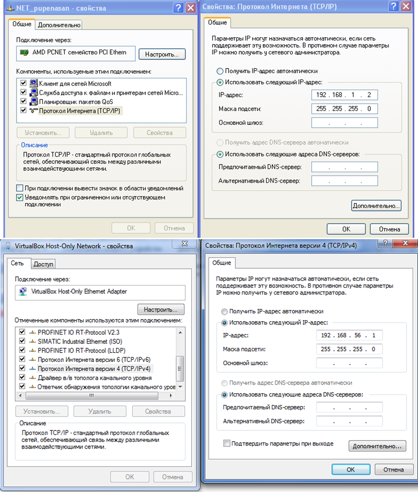

[ЛР.1.Основи Ethernet та IP](1.md)

## Додаток 1.5. Оформлення звіту.

**Пункт 2. Налаштування адаптерів.**

*Навести копію екрану на якому видно налаштування адаптерів згідно прикладів наведених на рис.Д20.*

**

Рис.Д20. Приклади копії екранів налаштування параметрів для звіту.

**Пункт 3. Визначення** **MAC-адрес утилітою**  **Getmac.** 

*Навести копію екрану на якому видно необхідні параметри для адаптерів гостьової ОС.* 

Підключення на віртуальній машині. 

| **Ім’я підключення** | **Мережний адаптер** | **Фізична адреса (****MAC)** |
| -------------------- | -------------------- | ---------------------------- |
|                      |                      |                              |
|                      |                      |                              |

*Навести копію екрану на якому видно необхідні параметри для адаптерів хостової ОС.* 

Підключення на хостовій ОС. 

| **Ім’я підключення** | **Мережний адаптер** | **Фізична адреса (****MAC)** |
| -------------------- | -------------------- | ---------------------------- |
|                      |                      |                              |
|                      |                      |                              |

Параметри підключення для вузлів мережі. 

| **Параметр**          | **Хостова ОС** | **Гостьова  ОС** |
| --------------------- | -------------- | ---------------- |
| Ім’я  підключення     |                |                  |
| Мережний  адаптер     |                |                  |
| Фізична  адреса (MAC) |                |                  |

**Пункт 4. Тест наявності підключення.**

*Навести копії екранів.*

*Написати висновок щодо наявності підключення.*

**Пункт 5. Робота з кешем ARP.**

*Навести копії екранів.*

*Написати пояснення до отриманих результатів.*

**Пункт 7. Прослуховування мережі.**

*Навести копії екранів.*

*Написати пояснення до отриманих результатів.*

**Пункт 8. Аналіз пакету.**

*Навести копії екранів.*

Пакети та їх поля. 

| **Пакет (протокол),  по порядку вкладеності** | **Поле  пакету** | **Значення** | **Пояснення** |
| --------------------------------------------- | ---------------- | ------------ | ------------- |
|                                               |                  |              |               |
|                                               |                  |              |               |
|                                               |                  |              |               |
|                                               |                  |              |               |

**Пункт 9. Аналіз gratuitous ARP.**

*Навести копії екранів*

Пакети та їх поля. 

| **Пакет  (протокол), по порядку вкладеності** | **Поле  пакету** | **Значення** | **Пояснення** |
| --------------------------------------------- | ---------------- | ------------ | ------------- |
|                                               |                  |              |               |
|                                               |                  |              |               |
|                                               |                  |              |               |
|                                               |                  |              |               |

*Написати загальне пояснення до отриманих результатів.*

 

 