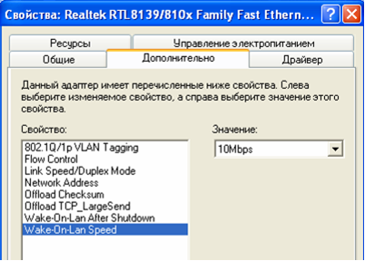
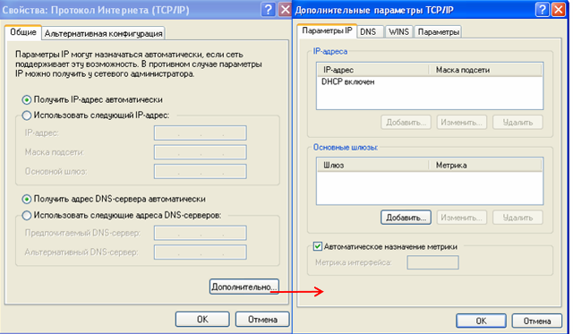
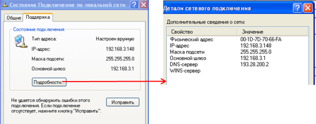
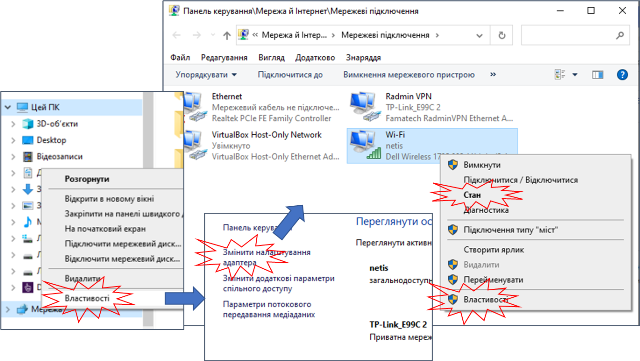

[ЛР.2.Протоколи та утиліти TCP/IP](2.md)

## Додаток 2.1. Вбудовані засоби WINDOWS для конфігурування та перевірки роботи IP та TCP

ipconfig – виводить всіх плинні параметри TCP/IP та оновлює параметри DHCP та DNS

tracert – виводить маршрут (IP-адреси вузлів) до місця призначення

pathping – виводить статистику роботи маршрутизаторів на шляху маршруту до місця призначення

route – виводить маршрутні таблиці

netsh – дає можливість відображати та змінювати настройки мережної карти    

net – робота з мережними службами Windows

nslookup – діагностична утиліта для роботи з DNS

netstat – виводить статистику по мережі та підключенням на транспортному рівні


### Вікна налаштування та діагностики мережної карти. 

Для налаштування параметрів роботи мережної карти та її діагностики можна скористатися графічними засобами провідника Windows. Для різних версій Windows вигляд та доступ до вікон може відрізнятися. Для універсальності в лабораторній роботі застосовується віртуальна машина на Windows XP, тому далі ці налаштування будуть показані саме для цієї версії ОС. 

Для налаштування властивостей мережних карт у Windows XP необхідно викликати "Свойства" в контекстному меню "Сетевого окружения", а далі вибрати аналогічний пункт в контекстному меню вибраного підключення (рис.д2.1).   


рис.д2.1. 

Налаштування роботи карти та драйверу Ethernet проводиться через кнопку "Настроить...". Зокрема на вкладці "Дополнительно" (рисд2.2) можна налаштувати швидкість передачі та тип з’єднання (LinkSpeed/DuplexMode), вручну виставити MAC-адресу (NetworkAddress), налаштувати параметри мічення кадрів VLAN (802.1Q/1p VLAN Tagging).  



Рис.д2.2. Вікно додаткових властивостей мережної карти

У списку компонентів для вказаного підключення вказані служби та драйвери протколів, які інстальовані для нього. Для мережних карт Ethernet (а також IEEE 802.11 WiFi) на комп’ютері з ОС Windows, разом з системою автоматично інсталюються драйвери TCP/IP, які можна налаштувати нажавши кнопку "Свойства", після вибору даного пункту (рис.д2.3). 



Рис.д2.3. Налаштування протколу TCP/IP.

Основні властивості протколу TCP/IP налаштовуються у вікні "Общие" (рис.д2.3). IP-адресу можна задати статично ("Использовать следующий IP-адрес") або вказати динамічний режим ("Получить IP-адрес автоматически"), при якому адреса буде видаватися DHCP-сервером. При статичній адресації крім самої IP-адреси треба задати маску підмережі, та адресу основного шлюзу (маршрутизатору), при необхідності міжмережного з’єднання. У налаштуваннях вказується також два первинні DNS-сервери, через які проводиться отримання адрес по доменному імені. 

Для розширеного налаштування протоколу необхідно визвати вікно додаткових параметрів (кнопка "Дополнительно").

Для відображення стану роботи мережі можна скористуватися кнопкою "Состояние" в контекстному меню вибраного підключення. Там вказується активні налаштування IP, МАС-адреса, швидкість і т.д (рис.д2.8). 



 Рис.д2.8. Вікна відображення стану роботи мережі.

Для Windows 10 до налаштування карти та відображення стану можна зробити через панель керування або провідник, наприклад як це показано на рис.д2.9.



 Рис.д2.9. Доступ да налаштувань мережної карти Windows 10

### Утиліта IPCONFIG 

Утиліта служить для відображення всіх плинних параметрів мережі TCP/IP та оновлення параметрів DHCP та DNS. При виклику команди `ipconfig` без параметрів виводяться тільки IP-адреса, маска підмережі та основний шлюз для кожного мережного адаптеру. Синтаксис для Winxp:

```
ipconfig [/all] [/renew [адаптер]] [/release [адаптер]] [/flushdns] [/displaydns] [/registerdns] [/showclassid адаптер] [/setclassid адаптер [код_класу]]
```

  Таб. 5.9. Параметри команди ipconfig.

| Параметр                        | Призначення параметру                                        |
| ------------------------------- | ------------------------------------------------------------ |
| /?                              | виводить довідку по використанню                             |
| /all                            | Виведення повної конфігурації TCP/IP для всіх адаптерів. Адаптери  можуть представляти собою як фізичні інтерфейси (мережні карти), так і  логічні інтерфейси (підключення віддаленого доступу) |
| /renew [адаптер]                | Оновлення конфігурації DHCP для всіх адаптерів (якщо  адаптер на заданий) або для заданого адаптеру. Даний параметр доступний  тільки для адаптерів, налаштованих на отримання IP-адрес. |
| /release [адаптер]              | Відправка повідомлення DHCPRELEASE серверу DHCP для  вивільнення поточної конфігурації DHCP та видалення конфігурації IP-адрес для  всіх адаптерів (якщо адаптер не заданий) або для заданого адаптеру. |
| /flushdns                       | Скидання та очистка вмісту кешу зіставлених імен DNS  клієнта. Під час усунення неполадок DNS цю процедуру виконують для видалення  з кешу записів зіставлення |
| /displaydns                     | Відображення змісту кешу зіставлення імен DNS клієнту,  завантажених з файлу Hosts, та останні отримані записи ресурсів. Ця  інформація використовується службою DNS-клієнту для швидкого зіставлення  частих імен без звернення до DNS-серверу |
| /registerdns                    | Динамічна реєстрація вручну імен DNS та IP-адрес,  налаштованих на ПК. Цей параметр корисний при усуненні неполадок у випадку  відмови в реєстрації імені DNS або при виявленні причин неполадок динамічного  оновлення між клієнтом та DNS-сервером без перевантаження клієнту. |
| /showclassid адаптер            | Відображення коду класу DHCP для вказаного адаптеру. Щоб  подивитися для всіх адаптерів, замість адаптеру вказується зірочка ().  Даний параметр доступний тільки для адаптерів, налаштованих на отримання  IP-адрес. |
| /setclassid адаптер [код_класу] | Завдання коду класу DHCP для вказаного адаптеру. Щоб  задати для всіх адаптерів, замість адаптеру вказується зірочка ().  Даний параметр доступний тільки для адаптерів, налаштованих на отримання  IP-адрес. Якщо код класу DHCP не заданий, плинний код класу видаляється. |

 Якщо ім’я адаптеру містить пробіли, його треба брати в лапки.  

Приклади:

Виведення основної конфігурації TCP/IP для всіх адаптерів:

```bash
ipconfig
```

Виведення повної конфігурації TCP/IP для всіх адаптерів:

```bash
ipconfig /all
```

Відновлення конфігурації IP-адреси, призначеної DHCP-сервером для адаптеру `Wireless LAN adapter Wi-Fi`

```bash
ipconfig /renew "Wireless LAN adapter Wi-Fi"
```

Скидання кешу зіставлення імен DNS при наявності неполадок: 

```bash
ipconfig /flushdns
```

Виведення коду класу DHCP для всіх адаптерів з іменами, які починаються зі слова "Подключение":

```
ipconfig /showclassid Подключение*
```

Задавання коду класу DHCP " TEST " для адаптеру "Подключение по локальной сети":

```
ipconfig /setclassid "Подключение по локальной сети" TEST
```

### Утиліта TRACERT 

Діагностична утиліта TRACERT визначає маршрут до місця призначення, відсилаючи ехо-запити ICMP з різними значеннями TTL, постійно збільшуючи їх. Враховуючи, що кожний маршрутизатор зменшує значення поля TTL, при 0-му значенні він відсилає ICMP-відповідь з помилкою нульового часу життя. На кожному кроці TRACERT фіксує адресу маршрутизатору та час відправки і відповіді. Процес повторюється до тих пір, поки пакет не досягне цільового вузу. При отриманні відповіді від цього вузла, процес трасування вважається закінченим. На монітор виводиться упорядкований список адрес маршрутизаторів на шляху.

Слід зазначити, що деякі маршрутизатори не відсилають повідомлень про закінчення часу для пакетів з нульовими значеннями TTL і тому не видимі для команди tracert. У цьому випадку для даного переходу відображається ряд зірочок (`*`).

Щоб виконати трасування маршруту, вивести значення затримки розповсюдження по мережі і втрат пакету на кожному маршрутизаторі та вузлі в мережі, необхідно використовувати команду pathping. 

Синтаксис:

```
tracert [-d] [-h максимальна_кількість_переходів] [-j список_вузлів] [-w інтервал] [ім’я_кінцевого_комп’ютера] 
```

  Таб. 5.10. Параметри команди tracert.

| Параметр                           | Призначення параметру                                        |
| ---------------------------------- | ------------------------------------------------------------ |
| /?                                 | виводить довідку по  використанню                            |
| -d                                 | Запобігає намагання команди  tracert отримувати імена проміжних маршрутизаторів по їх адресі. Збільшує  швидкість виводу результатів |
| -h максимальна_кількість_переходів | Задає максимальну кількість  переходів на шляху при пошуку кінцевого об’єкту. Значення по замовченню  дорівнює 30 |
| -j список_вузлів                   | Вказує для повідомлень з  ехо-запитом використання параметру вільної маршрутизації в заголовку IP з  набором проміжних місць призначення, вказаних в списку вузлів. При вільній  маршрутизації успішні проміжні місця призначення можуть бути розділені одним  або декількома маршрутизаторами. Максимальна кількість адрес або імен в  списку – 9. Список адрес представляє набор IP-адрес, розділених пробілами |
| -w інтервал                        | Визначає в мілісекундах час  очікування для отримання ехо-відповідей протоколу ICMP або ICMP-повідомлень  про закінчення часу, що відповідає даному ехо-запиту. Якщо повідомлення не  отримане протягом заданого часу, віводиться зірочка (). Таймаут по  замовченню 4000 (4 секунди) |
| ім’я_кінцевого_вузлу               | Задає точку призначення,  вказану IP-адресою або іменем вузла |

Приклади:

У наступному прикладі пакет повинен пройти два маршрутизатори (`157.54.48.1` та `11.1.0.67`) щоб досягнути вузла `11.1.0.1`. У цьому прикладі основний шлюз - `157.54.48.1` а IP-адреса маршрутизатору в мережі `11.1.0.0` - `11.1.0.67`.

```
C:\>tracert 11.1.0.1 
  Tracing route to 11.1.0.1 over a maximum of 30 hops
  1   2 ms   3 ms   2 ms 157.54.48.1
  2  75 ms  83 ms  88 ms 11.1.0.67
  3  73 ms  79 ms  93 ms 11.1.0.1
  Trace complete.    
```

​           

### Утиліта Route 

Утиліта дає можливість вивести на екран або змінити записи в локальній таблиці IP-маршрутизації. 

Синтаксис:

route [-f] [-p] [команда [кінцева_точка] [mask маска_мережі] [шлюз] [metric метрика]] [if інтерфейс]]

Таб. 5.12. Параметри команди route.

| Параметр          | Призначення параметру                                        |
| ----------------- | ------------------------------------------------------------ |
| /?                | виводить довідку по  використанню                            |
| -f                | очищує таблицю маршрутизації  від всіх записів, які не являються вузловими маршрутами (маршрути з маскою підмережі  255.255.255.255), мережним маршрутом на себе (адреса 127.0.0.0 і маска  255.0.0.0) або маршрутом багатоадресної розсилки (адреса 224.0.0.0 і маска 240.0.0.0);  при використанні даного параметру сумісно з однією із команд (таких, як add,  change  або delete) таблиця очищується перед виконанням команди |
| -p                | при використанні даного параметру з командою add  вказаний маршрут добавляється в реєстр та використовується для ініціалізації  таблиці IP-маршрутизації кожний раз при запуску протоколу TCP/IP; по замовченню  добавлені маршрути не зберігаються при запуску протоколу TCP/IP; при  використанні з командою print виводить на екран список  постійних маршрутів; всі інші команди ігнорують даний параметр; постійні  маршрути зберігаються в реєстрі HKEY_LOCAL_MACHINE\SYSTEM\CurrentControlSet\Services\Tcpip\Parameters\PersistentRoutes |
| команда           | вказує команду, яка буде запущена на віддаленій системі; в  наступній таблиці представлений список допустимих параметрів:  add – добавлення маршруту  change – зміна існуючого  маршруту  delete – видалення маршруту або  маршрутів  print– вивід маршруту або  маршрутів |
| кінцева_точка     | Визначає кінцеву точку маршруту. Кінцевою точкою може бути  мережна IP-адреса (де розряди в мережній адресі мають значення 0), IP-адресу  маршруту до вузла, чи значення 0.0.0.0 для маршруту по замовченню. |
| mask маска_мережі | Вказує маску мережі (маска підмережі) у відповідності з  точкою призначення. По замовченню 255.255.255.255. |
| шлюз              | Вказує IP-адресу пересилки або  настпуного переходу, по якому доступний набір адрес, визначений кінцевою  точкою і маскою підмережі. Для локально-підключених маршрутів підмережі,  адреса шлюзу — це IP-адреса, назначена інтерфейсу, який підключений до  підмережі. Для віддалених маршрутів, які доступні через один або декілька  маршрутизаторів, адреса шлюзу — безпосередньо доступна IP-адреса найближчого  маршрутизатору. |
| metric метрика    | Задає чисельну метрику вартості  маршруту (в межах від 1 до 9999) для маршруту, яка використовується при  виборі в таблиці маршрутизації одного або декількох маршрутів, найбільш  близько відповідного адресі призначення відправленого пакету. Вибирається  маршрут з найменшою метрикою. Метрика відображає кількість переходів,  швидкість проходження шляху, надійність шляху, пропускну здатність шляху і  засоби адміністрування |
| if интерфейс      | Вказує індекс інтерфейсу, через  який доступна точка призначення. Для виводу списку інтерфейсів та їх  відповідних індексів використовується команда route print. Значення індексів інтерфейсів можуть бути  як десяткові так і 16-кові. Перед 16-ковими номерами вводиться 0х.  У випадку, коли параметр if відсутній, інтерфейс визначається з адреси  шлюзу. |
|                   |                                                              |

 

Приклади:

Виведення на екран таблиці IP-маршрутизації:

```
route print
```

Виведення на екран маршрутів з таблиці IP-маршрутизації, які починаються з "10.*":

```
route print 10.*
```

Добавлення маршруту по замовченню з адресою стандартного шлюзу 192.168.12.1:

```
route add 0.0.0.0 mask 0.0.0.0 192.168.12.1
```

Добавлення маршруту до кінцевої точки 10.41.0.0 з маскою підмережі 255.255.0.0 і настпною адресою переходу 10.27.0.1:

```
route add 10.41.0.0 mask 255.255.0.0 10.27.0.1
```

Добавлення постійного маршруту до кінцевої точки 10.41.0.0 з маскою підмережі 255.255.0.0 і настпною адресою переходу 10.27.0.1:

```
route -p add 10.41.0.0 mask 255.255.0.0 10.27.0.1
```

Добавлення маршруту до кінцевої точки 10.41.0.0 з маскою підмережі 255.255.0.0 та настпною адресою переходу 10.27.0.1 та метрикою 7:

```
route add 10.41.0.0 mask 255.255.0.0 10.27.0.1 metric 7
```

Добавлення маршруту до кінцевої точки 10.41.0.0 з маскою підмережі 255.255.0.0 та наступною адресою переходу 10.27.0.1 та використанням індексу інтерфейсу 0х3:

```
route add 10.41.0.0 mask 255.255.0.0 10.27.0.1 if 0x3
```

Видалення маршруту до кінцевої точки 10.41.0.0 з маскою підмережі 255.255.0.0:

```
route delete 10.41.0.0 mask 255.255.0.0
```

Видалення всіх маршрутів з таблиці IP-маршрутизації, які починаються з "10.":

```
route delete 10.
```

Зміна наступної адреси переходу для маршруту з кінцевою точкою 10.41.0.0 і маскою підмережі 255.255.0.0 з 10.27.0.1 на 10.27.0.25:

```
route change 10.41.0.0 mask 255.255.0.0 10.27.0.25
```

### Утиліта NetStat

Утиліта відображає активні підключення TCP, порти, які прослуховуються комп’ютером, статистику Ethernet, таблиці маршрутизації IP, статистику IPv4 (для протоколів IP, ICMP, TCP и UDP). Викликана без параметрів, команда netstat відображає підключення TCP.

Синтаксис:

```
netstat [-a] [-e] [-n] [-o] [-p протокол] [-r] [-s] [інтервал]
```

Таб. 5.11. Параметри команди netstat.

| Параметр    | Призначення параметру                                        |
| ----------- | ------------------------------------------------------------ |
| /?          | виводить довідку по  використанню                            |
| -a          | виводить всі порти TCP та TCP та UDP,  які прослуховуються.  |
| -e          | виводить статистику Ethernet, наприклад кількість  відправлених та прийнятих байтів та пакетів; цей параметр може комбінуватися  з ключем -s. |
| -n          | виводить активні підключення TCP з відображенням адрес та  номерів портів в числовому форматі без визначення імен |
| -o          | виводить активні підключення TCP та включення коду процесу  (PID) для кожного підключення; цей параметр може комбінуватися з ключами -a,  -n та -p. |
| -p протокол | виводить підключення для протоколу, вказаного параметром протокол.  У цьому випдаку параметр протокол  може приймати значення `tcp`, `udp`, `tcpv6` або  `udpv6`.  Якщо даний параметр використовується з ключем `-s` для виводу  статистики по протоколу, параметр протокол может мати занчення `tcp`,  `udp`, `icmp`, `ip`, `tcpv6`, `udpv6`, `icmpv6` або `ipv6`. |
| -s          | виводить статистику по протоколу; по замовченню виводиться  статистика для протоколів TCP, UDP, ICMP та IP; параметр -p може використовуватися для  вказівки набору протоколів. |
| -r          | виводить зміст таблиці маршрутизації IP; ця команда  еквівалентна route print. |
| інтервал    | оновлення вибраних даних з інтервалом, визначеним  параметром інтервал (в секундах); нажимання CTRL+C зупиняє оновлення;  якщо параметр опущений netstat виводить дані тільки  один раз |
|             |                                                              |

Параметри вводяться через дефіс (-), а не косу (/). Команда Netstat виводить статистику для наступних об’єктів. 

- Протокол:  TCP або UDP;
- Локальні  адреси: IP-адреса локального комп’ютера та номер порту, який використовується; якщо порт не назначений, показується зірочка (`*`).
- Зовнішні адреси: IP-адреса віддаленого вузла та номер порту, який використовується; якщо порт не назначений, показується зірочка (`*`).
- (Стан):  вказівка стану підключення TCP. Можливі значення: `CLOSE_WAIT`, `CLOSED`, `ESTABLISHED`,      `FIN_WAIT_1`, `FIN_WAIT_2`, `LAST_ACK`, `LISTEN`, `SYN_RECEIVED`, `SYN_SEND`, `TIMED_WAIT`

Приклади:

Виведення статистики по Ethernet і по всім протоколам разом:

```
netstat -e -s
```

Виведення статистики тільки по протоколам TCP та UDP:

```
netstat -s -p tcp || udp
```

Виведення активних підключень TCP і кодів процесів (PID) кожні 5 секунд:

```
netstat -o 5
```

Виведення активних підключень TCP та кодів з використанням числового формату:

```
netstat -n -o
```

### Утиліта nslookup

[nslookup](https://uk.wikipedia.org/wiki/Nslookup) - це утиліта, що надає користувачеві інтерфейс командного рядка для звернення до системи DNS. Дозволяє задавати різні типи запитів і запрошувати довільно вказані сервери. Її аналогом є утиліти `host` і `dig`. Розроблена у складі пакету BIND (для UNIX-систем). Утиліта портована на Windows безпосередньо фірмою Microsoft і поставляється разом з операційною системою. 

`nslookup` може працювати в інтерактивному режимі, коли спочатку запускається утиліта, а потім вводяться команди.  Наприклад:

```bash
C:\Users\user>nslookup
Default Server:  mail.startnet.com.ua
Address:  91.217.179.254

> ?
Commands:   (identifiers are shown in uppercase, [] means optional)
NAME            - print info about the host/domain NAME using default server
NAME1 NAME2     - as above, but use NAME2 as server
help or ?       - print info on common commands
set OPTION      - set an option
    all                 - print options, current server and host
    [no]debug           - print debugging information
    [no]d2              - print exhaustive debugging information
    [no]defname         - append domain name to each query
    [no]recurse         - ask for recursive answer to query
    [no]search          - use domain search list
    [no]vc              - always use a virtual circuit
    domain=NAME         - set default domain name to NAME
    srchlist=N1[/N2/.../N6] - set domain to N1 and search list to N1,N2, etc.
    root=NAME           - set root server to NAME
    retry=X             - set number of retries to X
    timeout=X           - set initial time-out interval to X seconds
    type=X              - set query type (ex. A,AAAA,A+AAAA,ANY,CNAME,MX,NS,PTR,SOA,SRV)
    querytype=X         - same as type
    class=X             - set query class (ex. IN (Internet), ANY)
    [no]msxfr           - use MS fast zone transfer
    ixfrver=X           - current version to use in IXFR transfer request
server NAME     - set default server to NAME, using current default server
lserver NAME    - set default server to NAME, using initial server
root            - set current default server to the root
ls [opt] DOMAIN [> FILE] - list addresses in DOMAIN (optional: output to FILE)
    -a          -  list canonical names and aliases
    -d          -  list all records
    -t TYPE     -  list records of the given RFC record type (ex. A,CNAME,MX,NS,PTR etc.)
view FILE           - sort an 'ls' output file and view it with pg
exit            - exit the program
```

Команда `?` - виводить допомогу

Приклад режиму командного рядку для виведення IP-адреси `nuft.edu.ua`:

```bash
C:\Users\user>nslookup nuft.edu.ua
Server:  mail.startnet.com.ua
Address:  91.217.179.254

Non-authoritative answer:
Name:    nuft.edu.ua
Address:  193.28.200.16
```

 Спочатку виводиться DNS-сервер, з яким відбувається спілкування. Потім виводиться результат запиту.

 Приклад режиму командного рядку для виведення доменного імені по IP-адресі `8.8.8.8`:

```
Name:    dns.google
Address:  8.8.8.8
```
