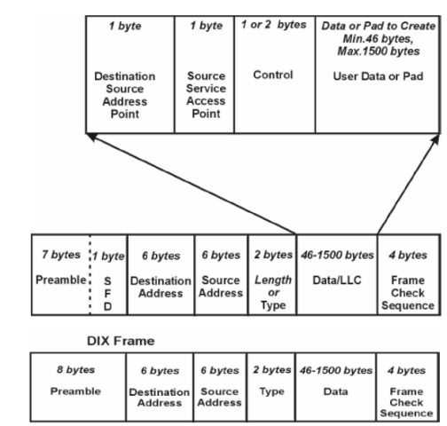
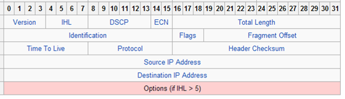
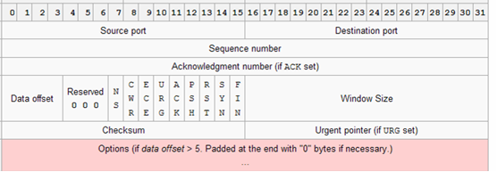
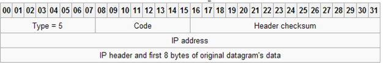
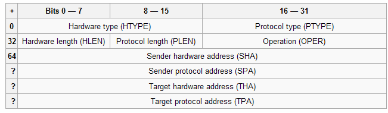

[ЛР.2.Протоколи та утиліти TCP/IP](2.md)

## Додаток 2.2. Мережні протоколи.

### Д.2.2.1.Ethernet та 802.1

На сьогоднішній день існує два формати кадрів Ethernet: кадри DIX Ethernet II та IEEE 802.3. Вони ідентичні по кількості та довжині полів (рис.5.8), однак є відмінності в змісті полів та їх інтерпретації станціями, які відправляють та отримують кадри. Враховуючи це, будь яка станція може відправити будь який з цих кадрів. Відрізняється структура преамбули, однак наповнення та інтерпретація цієї частини буде однаковою. Поля адреси призначення та адреси відправника однакові і призначені для адресації за допомогою МАС-адреси (також називається фізичною адресою\). 

Призначення поля – довжина/тип (які також називаються EtherType) дещо відрізняються в стандартах. Для DIX це поле описує тип PDU вищого рівня (мережного), який переноситься даним кадром. Наприклад $800_{16}$ вказує, що кадр використовується для пакету IP. В кадрі IEEE 802.3 дане поле використовується як для вказівки типу PDU, так і для опису довжини кадру. Якщо значення цього поля < $600_{16}$, воно вказує на довжину поля даних, а в іншому випадку на тип протоколу даних. 



Рис.5.8. Структура кадрів IEEE 802.3 та Ethernet II

### Д.2.2.2.IPv4

ІР (Internet Protocol) – протокол мережного рівня, який служить для об’єднання сегментів мережі в єдину мережу, забезпечуючи доставку пакетів даних між будь-якими вузлами мережі через довільну кількість проміжних вузлів (маршрутизаторів). IP не гарантує надійну доставку пакету до адресату – зокрема, пакети можуть прийти не в тому порядку, в якому були відправлені, продублюватися (приходять дві копії одного пакету), буди пошкодженими, або взагалі не прийти. Надійність доставки може гарантувати протоколи верхнього рівня (наприклад TCP). 

На сьогоднішній день існує дві версії протоколу ІР: IPv4 та IPv6. Хоч остання версія більш перспективна, поки що як правило користуються IPv4, тому надалі буде розглядатися тільки цей протокол. 

У IPv4 для адресації пристроїв відправників та отримувачів використовуються унікальні 32-бітні (4-байтові) ІР-адреси\. Якщо пункт призначення знаходиться в тій самій підмережі (сегменті мережі), що і вузол-відправник, то ІР пакет відправляється безпосередньо йому, якщо ні – то маршрутизатору, який повинен знаходитися в цій самій підмережі. Інтерфейс IP-підключення вузла до мережі часто називають хостом\. Тому слова "хост" і "вузол мережі IP" являються синонімами.  

Для виділення підмережі з IP адреси, вузлу необхідно знати, скільки біт буде використано в якості ідентифікатору підмережі і скільки для ідентифікатору самого вузлу. Це визначається за допомогою маски підмережі. Маска підмережі (subnet mask) - це 32-бітне значення, яке вміщує біти, встановлені в одиницю для ідентифікатору підмережі, і біти, встановлені в нуль для ідентифікатору вузла. Наприклад, якщо вказана IP-адреса 192.168.9.134 та маска 255.255.255.0, то перші 24 біти будуть вказувати на номер під мережі, тобто 192.168.9 а останні 8 біт на номер вузла в мережі, тобто 134. Альтернативний вигляд запису цієї ж адреси з маскою - 192.168.9.134/24, де 24 – це кількість біт, що виділяються під адресу підмережі. 

Серед IP-адрес є зарезервовані для спеціального призначення. 

Приватні IP-адреси (англ. private IP address) – які також називаються внутрішніми, внутрі-мережними, локальними або "сірими" – це IP-адреси, які належать до спеціального діапазону, що не використовуються в Інтернет. Такі адреси призначені для застосування в локальних мережах, розподіл таких адрес ніким не контролюється. У зв’язку з дефіцитом вільних IP-адрес, провайдери часто роздають своїм абонентам саме внутрішні мережні адреси.

Наступні діапазони визначені IANA як адреси, виділені локальним мережам:

- 10.0.0.0 - 10.255.255.255 (маска підмережі 255.0.0.0)
- 172.16.0.0 - 172.31.255.255 (маска підмережі 255.240.0.0)
- 192.168.0.0 - 192.168.255.255 (маска підмережі 255.255.0.0)

Для створення адреси зворотного зв’язку (петлі) зарезервований діапазон 127.0.0.0 — 127.255.255.255. Пакет відправлений протоколом верхнього рівня на будь-яку адресу з цього діапазону повинна повертатися на цей же вузол. На практиці як правило використовують тільки 127.0.0.1/32. 

До даних верхнього рівня реалізація протоколу IP добавляє заголовок, поля якого показані на рис.5.9.



Рис.5.9. IP-датаграма, поля IP-заголовку.

Серед всіх полів заголовку окремо виділимо TOS, TTL, протокол, IP-адреси та опції.

DSCP або ToS - (тип сервісу - type-of-service) вміщує біти-прапорці, які характеризують особливість сервісу: мінімальна затримка, максимальна пропускна здатність, максимальна надійність і мінімальна вартість. Тільки один із цих бітів може бути в стані "1". Якщо всі біти дорівнюють "0", то при передачі IP-датаграми використовується звичайний сервіс. 

TTL – (час життя - time-to-live) вміщує максимальну кількість пересилань (маршрутизаторів), через які може пройти датаграма. Це поле обмежує час життя датаграми, так як це значення зменшується на 1 кожним маршрутизатором, який обробляє цю датаграму. Коли значення поля досягає 0, датаграма знищується, а відправнику повідомляється про це ICMP-повідомленням. Такий алгоритм запобігає за циклюванню пакетів в маршрутизації.  

Поле протоколу використовується для визначення протоколу верхнього рівня, дані якого пересилає дана IP-датаграма. 

IP-адреса відправника (Source IP Address\) та IP-адреса отримувача (Destination IP Address\) в протколі IPv4 задається в 32-біному форматі. 

Поле опцій (options\) – це список додаткової інформації. На сьогоднішній день найбільш популярні опції: безпека і обробка обмежень, запис кожного маршруту та IP адреси, відмітка часу (запис кожного маршруту, його IP адреси, відмітки часу), вільна маршрутизація від джерела, жорстка маршрутизація від джерела. 

### Д.2.2.3. IP-маршрутизація 

Більшість операційних систем на сьогоднішній час можуть бути скнофігуровані таким чином, щоб виступати в якості маршрутизатору. Для операційних систем Windows XP маршрутизація включається через реєстр. 

```
HKEY_LOCAL_MACHINE\SYSTEM\CurrentControlSet\Services\Tcpip\Parameters
Ім’я параметра: IPEnableRouter.
Тип значення: REG_DWORD.
Значення: 1
```

Є можливість вказати простий алгоритм маршрутизації, який буде використовуватися як хостом так і маршрутизатором. Основна фундаментальна різниця між хостом і маршрутизатором заключається в тому, що хост ніколи не перенаправляє датаграми з одного мережного інтерфейсу на інший, тоді як маршрутизатор перенаправляє. 

У відповідності з загальною схемою, IP може отримувати датаграми від власних рівнів TCP, UDP, ICMP та IGMP (тобто датаграм які формуються тут же), які необхідно відправити, однак датаграми можуть бути прийняті з якого-небудь мережного інтерфейсу (ці датаграми повинні бути перенаправлені). IP рівень має в пам’яті таблицю маршрутизації, яку він переглядає кожний раз при отриманні датаграми, яку необхідно перенаправити. Коли дата грама прийнята з мережного інтерфейсу, IP по перше перевіряє, чи не належить йому вказана IP-адреса призначення або чи не являється ця IP адреса широкомовною. Якщо це так, то датаграма поставляється в модуль протоколу, вказаний в полі протоколу в IP заголовку. Якщо датаграма не призначена для цього IP рівня, якщо IP рівень був сконфігурований для того щоб працювати як маршрутизатор, пакет перенаправляється (в цьому випадку датаграма обробляється як вихідна) інакше датаграма знищується.

Кожний пункт таблиці маршрутизації вміщує наступну інформацію:

Таб. 5.13. Інформація в таблиці маршрутизації.

|                                                              |                                                              |
| ------------------------------------------------------------ | ------------------------------------------------------------ |
| IP-адреса призначення                                        | Це може бути як повна адреса  хоста (host address) або адреса мережі (network address), що вказується в  полі прапорців. Адреса хоста має ненульове значення ідентифікатору хоста і  вказує на один конкретний хост, тоді як адреса мережі має ідентифікатор  хоста, встановлений в 0, і вказує на всі хости, включені в певну мережу |
| IP-адреса маршрутизатора  наступної пересилки(next-hop router) | Це IP адреса безпосередньо  підключеної мережі. Маршрутизатор наступної пересилки належить одній із  безпосередньо підключених мереж, в яку ми можемо відправити датаграми для їх  доставки. Маршрутизатор наступної пересилки це не кінцевий пункт призначення,  однак він приймає датаграми, які ми відсилаємо, і перенаправляє їх в напрямку  кінцевого пункту. |
| Прапорці                                                     | Один прапорець вказує, чи  являється IP адреса пункта  призначення, адресою мережі чи адресою хоста. Інший прапорець вказує на те,  чи являється маршрутизатор наступнї пересилки дійсно маршрутизатором чи це  безпосередньо підключений інтерфейс. |
| Вказівка на мережний інтерфейс                               | Вказівка на те, який мережний  інтерфейс повинен бути переданий датаграмі для передачі |

IP-маршрутизація відбувається за принципом пересилка-за-пересилкою. Як ми можемо побачити з таблиці маршрутизації, IP не знає повний маршрут до пункту призначення (за виключенням тих пунктів призначення, які безпосередньо підключені до відправляючого хоста). Все, що може надати IP маршрутизація – це IP адреса маршрутизатора наступної пересилки, на який посилається датаграма. При цьому робиться припущення, що маршрутизатор наступної пересилки ближче до пункту призначення, ніж відправляючий хост. Також робиться припущення, що маршрутизатор наступної пересилки напряму підключений до відправляючого хоста. 

IP маршрутизація проводить наступні дії:

1. Проводить пошук в таблиці маршрутизації, при цьому шукається пункт, який співпадає з повною адресою пункта призначення (повинен співпасти ідентифікатор мережі та ідентифікатор хоста). Якщо пункт знайдений в таблиці маршрутизації, пакет відправляється на вказаний маршрутизатор наступної пересилки або на безпосередньо підключений інтерфейс (в залежності від поля прапорців). Як правило, так визначаються канали точка-точка, при яких інший кінець такого каналу, як правило являється повною IP адресою віддаленого хоста.

2. Відбувається пошук в таблиці маршрутизації пункта, який співпадає, як мінімум з ідентифікатором мережі призначення. Якщо пункт знайдений, пакет відсилається на вказаний маршрутизатор наступної пересилки або на безпосередньо підключений інтерфейс (в залежності від поля прапорців). Маршрутизація до всіх хостів, які находяться в мережі призначення, відбувається з використанням цього єдиного пункту таблиці маршрутизації. Наприклад, всі хости локальної мережі Ethernet представляються в таблиці маршрутизації саме таким чином. Ця перевірка співпадіння ідентифікатору мережі відбувається з використанням можливої маски підмережі. 

3. У таблиці маршрутизації шукається пункт, помічений "по замовченню" (default). Якщо пункт знайдений, пакет відсилається на вказаний маршрутизатор по замовченню.  

Якщо жоден з пунктів не дає позитивного результату, датаграма вважається недоставленою. Якщо недоставлена датаграма була сгенерована даним хостом, то як правило повертається помилка "Хост недоступний" (host unreachable) або "мережа недоступна" (network unreachable). Цей код помилки повертається прикладній програмі, яка сгенерувала датаграму. 

Напочатку завжди відбувається порівняння на співпадіння повної адреси хоста, після чого відбувається порівняння ідентифікатору мережі. Тільки в цьому випадку, якщо результат обидвох порівнянь негативний, використовується маршрут за замовченням. 

### Д.2.2.4.TCP 

Протокол TCP забезпечує доставку потоку даних з попереднім вставновленням з’єднання, робить повторний запит даних у випадку втрати даних і усуває дублювання при отриманні двух копій одного пакету, гарантуючи тим сами на відміну від UDP цільісність даних, що передаються. На рис.5.10 показаний формат TCP-сегменту. Порт відправника (Source port\) ідентифікує прикладну програму клієнту, з якого відправлені пакети. Дані відповіді передаються клієнту на базі цього порту. Порт отримувача (Destination port\) ідентифікує порт, на який відправляється пакет. Призначення інших полів можна знайти у довідникових джерелах. 



Рис.5.10. Формат TCP-сегменту.

### Д.2.2.5.UDP

За допомогою UDP прикладні програми можуть обмінюватися повідомленнями (в даному випадку датаграмами) по IP-мережі без необхідності попереднього з’єднання. Формат повідомлення показаний на рис. Призначення портів, аналогічні як в TCP.  


Рис.5.11. Формат UDP-датаграми.

### Д.2.2.6.ICMP

ICMP (Internet Control Message Protocol ) – мережний протокол, який входить в стек протоколів TCP/IP. У основному ICMP використовується для передачі повідомлень про помилки та інші нештатні ситуації які виникають при передачі даних, наприклад, коли послуга недоступна, або хост чи маршрутизатор не відповідають. Також на ICMP накладаються деякі сервісні функції. 

Підтримка протоколу ICMP обов’язкова при реалізації стеку TCP/IP. ICMP-пакети інкапсулюються в IP-пакети (рис.5.12). Теперішня версія ICMP для IPv4 називається `ICMPv4`, для IPv6 - `ICMPv6`. 



Рис.5.12. Формат повідомлення ICMP.

Всі ICMP-повідомлення вміщують заголовок (ICMP header), який складається з трьох полів: 

- 1 – тип повідомлення (`TYPE`): 1 байт;

- 2 - код (`CODE`): 1 байт;
- 3 – контрольна сума (`CHECKSUM`): 2 байти;

В залежності від типу, поле повідомлення ICMP має різний зміст. 

Таблиця 5.14.

| Type | Code | Опис                                                         |
| ---- | ---- | ------------------------------------------------------------ |
| 0    | 0    | ехо-відповідь                                                |
| 3    |      | Помилка - пункт призначеннянедоступний:                      |
|      | 0    | мережа недоступна                                            |
|      | 1    | вузол недосутпний                                            |
|      | 2    | протокол недосутпний                                         |
|      | 3    | порт недоступний                                             |
|      | 4    | необхідна фрагментація привстановленому прапорці "не фрагментувати" |
|      | 5    | не працює маршрутизація відджерела                           |
|      | 6    | невідома мережа призначення                                  |
|      | 7    | невідомий вузол призначення                                  |
|      | 8    | вузол-джерело ізольований                                    |
|      | 9    | мережа призначення закритаадміністратором                    |
|      | 10   | вузол призначення закритийадміністратором                    |
|      | 11   | мережа недоступна для ToS(типу сервісу)                      |
|      | 12   | вузол недоступний для ToS (типусервісу)                      |
|      | 13   | зв’язок адміністративно закритийшляхом фільтрації            |
|      | 14   | порушено порядок віддачіпереваги вузлів                      |
|      | 15   | старшинство роз’єднане                                       |
| 4    | 0    | помилка: здержуванняджерела – датаграми приходять частіше, ніж можуть бути оброблені |
| 5    |      | помилка: перенаправлення                                     |
|      | 0    | перенаправлення в мережу                                     |
|      | 1    | перенаправлення до вузлу                                     |
|      | 2    | перенаправлення для типу сервісу                             |
|      | 3    | перенаправлення для типу сервісу і вузлу                     |
| 8    | 0    | ехо-запит                                                    |
| 9    | 0    | об’ява маршрутизатору:пересилка маршрутизатором своєї адреси та адрес інших доступних в під мережімаршрутизаторів |
| 10   | 0    | запит маршрутизатору: запитна отримання адреси доступного в підмережі маршрутизатору |
| 11   |      | помилка часу                                                 |
|      | 0    | час життя стало рівним 0 впроцесі передачі                   |
|      | 1    | час життя стало рівним 0 впроцесі повторної збірки           |
| 12   |      | помилка - проблеми зпараметрами                              |
|      | 0    | неправильний IP заголовок                                    |
|      | 1    | відсутня необхідна опція                                     |
| 13   | 0    | запит відмітки часу (вмілісекундах від опівночі)             |
| 14   | 0    | відповідь з відміткою часу                                   |
| 15   | 0    | інформаційний запит                                          |
| 16   | 0    | інформаційна відповідь                                       |
| 17   | 0    | запит маски адреси                                           |
| 18   | 0    | відповідь з маскою адреси                                    |

### Д.2.2.7.ARP 

ARP (англ. Address Resolution Protocol — проткол визначення адреси) — проткол в комп’ютерних мережах, призначений для визначення MAC адреси за відомою IP адресою.

Функціонування ARP розглянемо на прикладі. Комп’ютер А (IP адреса 10.0.0.1) та комп’ютер Б (IP адрес 10.22.22.2) з’єднані мережею Ethernet. Комп’ютер А хоче відіслати пакет даних на комп’ютер Б, IP адреса комп’ютера Б йому відома. Однак мережа Ethernet, якою вони з’єднані, не працює з IP-адресами, тому комп’ютеру А для забезпечення передачі через Ethernet потребується дізнатися адресу комп’ютера Б в мережі Ethernet (MAC адреса в термінах Ethernet). Для цієї задачі використовується протокол ARP. За цим протколом комп’ютер А відправляє широкомовний запит, адресований усім комп’ютерам в одному сегменті Ethernet. Суть запиту «комп’ютер с IP адресою 10.22.22.2, повідомте свою MAC адресу комп’ютеру з IP адресою 10.0.0.1». Мережа Ethernet доатсвляє цей запит всім пристроєм у тому ж сегменті Ethernet, в тому числі і комп’ютеру Б. Комп’ютер Б відповідає комп’ютеру А на запит і повідомляє свою MAC адресу (напр. 00:ea:d1:11:f1:11) Тепер, отримав MAC адресу комп’ютера Б, комп’ютер А може передавати йому будь які дані через мережу Ethernet.

На рис.5.13 показана структура пакету, який використовується в запитах і відповідях ARP. У мережах Ethernet в цих пакетах використовується EtherType 0x0806, та розсилається широкомовно MAC-адреса — FF:FF:FF:FF:FF:FF. 

- Hardware type (HTYPE) – номер(код) протоколу канального рівня; для Ethernet=0x0001.
- Protocol type (PTYPE) – номер(код) мережного протоколу; для IPv4=0x0800.
- Hardware length (HLEN) – довжина адреси для канального рівня в байтах; адреси Ethernet мають довжину 6 байт.
- Protocol length (PLEN) – довжина адреси мережного рівня в байтах; для IPv4 = 4 байта.
- Operation - код операції відправника: 1 у випадку запиту і 2 у випадку відповіді.
- Sender hardware address (SHA) – фізична адреса відправника (для Ethernet - MAC-адреса).
- Sender protocol address (SPA)  - логічна адреса відправника (для IP – IP адреса)
- Target hardware address (THA)  - фізична адреса отримувача (для Ethernet - MAC-адреса): при запиті поле порожнє;
- Target protocol address (TPA) - логічна адреса отримувача (для IP – IP адреса)



Рис.5.13. Формат повідомлення ARP.

У рамках протоколу ARP можливі пакети з самозверненням (gratuitous ARP). При такому запиті ініціатор формує пакет, де в якості IP використовується його власна IP-адреса. Це буває потрібно, коли відбувається стартова конфігурація мережного інтерфейсу. У такому запиті IP-адреси відправника і отримувача співпадають. 

Запити с самозверненням дозволяють вузлам вирішити дві проблеми. По-перше, визначити, чи немає в мережі об’єкту який має ту ж IP-адресу. Тобто при старті пристрою, він формує gratuitous ARP. Якщо на такий запит прийде відклик, то вузол видасть повідомлення про однакову IP-адресу. 

По-друге, у випадку заміни мережної карти проводиться коригування запису в АRP-таблицях вузлів, які вміщували стару МАС-адресу ініціатору. Вузол, який отримує ARP-запит з адресою, що вміщується в таблиці, повинен відновити цей запис.