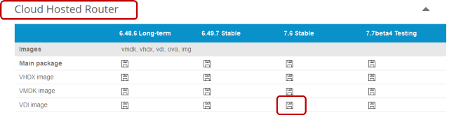
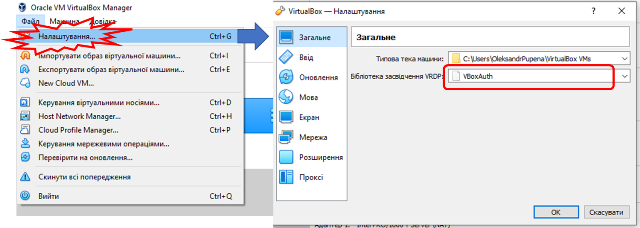
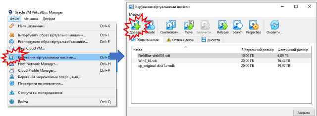
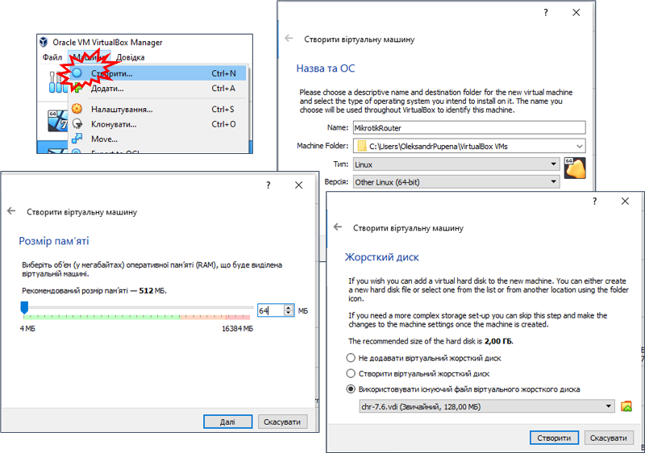
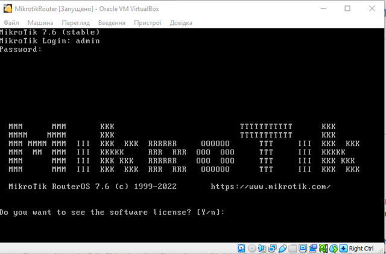
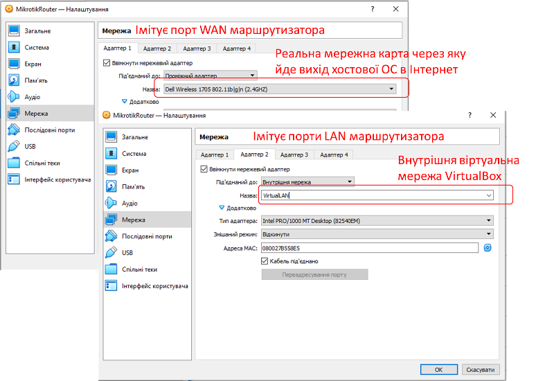
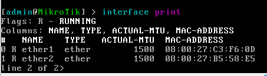
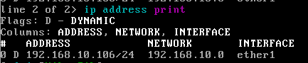
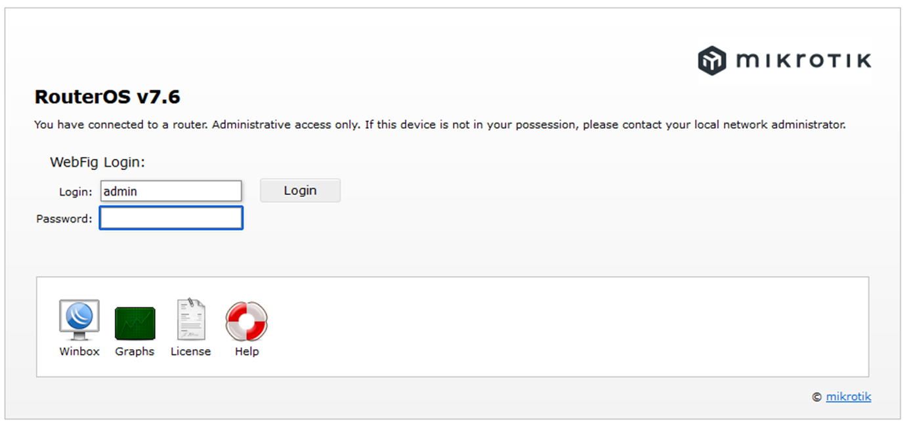

[ЛР.3.Налаштування маршрутизатору](3.md)

## Додаток 3.1. Встановлення віртуальної машини для маршрутизатору Mikrotik

У даному додатку вказані інструкції для встановлення та налаштування віртуальної машини з ОС Mikrotik. 

### 1. Завантаження та добавлення в список образу віртуальної машини Mikrotik

- [ ] Завантажте образ віртуальної машини `*.vdi` за посиланням: <https://mikrotik.com/download>

рис.Д3.1.

- [ ] Розархівуйте файл в папку, де знаходяться образи дисків віртуаульних машин VirtualBox Manager. Це не обов'язково, але в цьому випадку усі образи будуть знаходитися в тому ж місці. Дізнатися про розміщення цієї папки можна в налаштуваннях VirtualBox Manager.    

рис.Д3.2.

- [ ] Додайте образ диску до списку віртуальних носіїв 

рис.Д3.3.

### 2. Встановлення та перший запуск віртуальної машини Mikrotik

- [ ] У VirtualBox Manager створіть нову віртуальну машину з наступними налаштуваннями:
- тип - Linux
- версія - Other Linux
- Розмір пам'яті - 64 Мб
- Використовувати існуючий файл віртуального жорсткого диску - вказати завантажений образ

рис.Д3.4.

- [ ] Запустіть віртуальну машину. Дочекайтеся коли буде запрошення на введення паролю. Введіть користувача `admin` а при запиті пароль натисніть `Enter` (без паролю).

рис.Д3.5.

- [ ] На запрошення передивитися ліцензію натисніть `n`
- [ ] Введіть свій новий пароль при запрошенні паролю.  
- [ ] Вимкніть віртуальну машину.

### 3. Добавлення мережних карт та їх налаштування через консоль

- [ ] У VirtualBox Manager налаштуйте існуючу мережну карту та добавте нову.
- Адаптер 1: буде виступати в якості порта WAN (наприклад для виходу в Internet) віртуального машрутизатора; тут треба вказати ту мережну карту вашої хостової ОС, що використовується для виходу в реальну мережу.   
- Адаптер 2: буде виступати в якості портів LAN, до яких будуть підключатися інші віртуальні машини; тут треба виставити прив'язку до внутрішньої віртуальної мережі, яку назвіть `VirtualLan`  

рис.Д3.6.

- [ ] Запустіть віртуальну машину. Введіть користувача та пароль
- [ ]  Виведіть список мережних карт за допомогою команди `interface print` . Повинно бути дві мережні карти.

рис.Д3.7.

- [ ] Виведіть IP адресу, яка надана віртуальній мережі WAN через команду `ip address print`

рис.Д3.8.

**Увага! У лабораторній роботі передбачається що IP-адреси видаються в реальній мережі динамічно. Якщо це не так скористуйтеся командою `ip address add address=192.168.10.1/24 interface=ether1`  для добавлення реальної адреси IP, де замість `192.168.10.1` буде необхідна статична адреса** 

- [ ] На хостовій ОС відкрийте браузер і введіть виведену адресу. Ви повинні попасти у веб-консоль налаштування ОС маршрутизатору.

рис.Д3.9.

Документація по ОС Mikrotik доступна за посиланням <https://wiki.mikrotik.com/wiki/Manual:TOC> 

