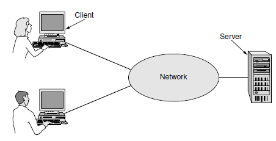
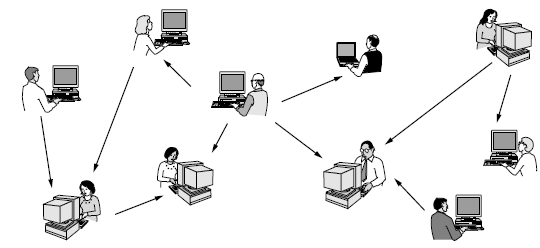
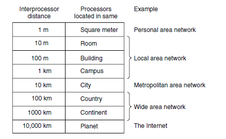
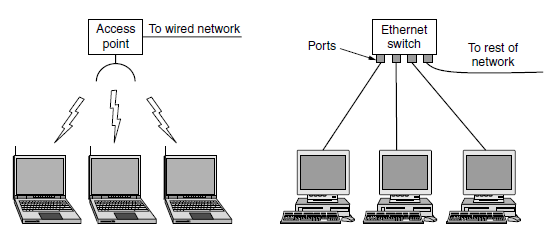
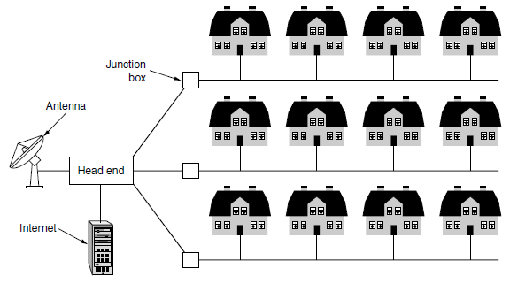
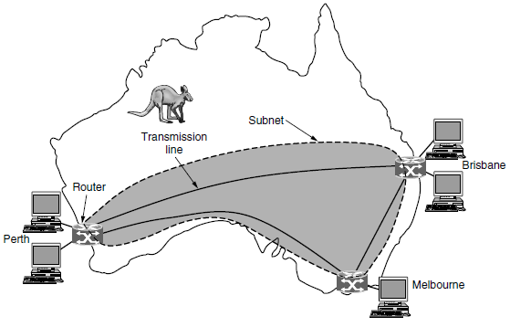
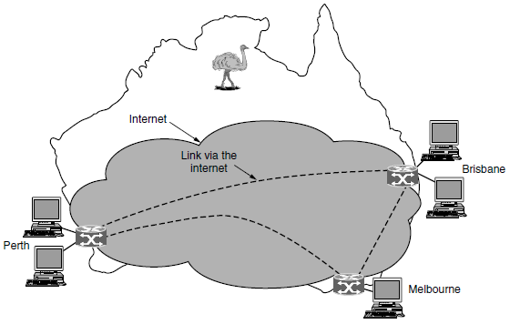
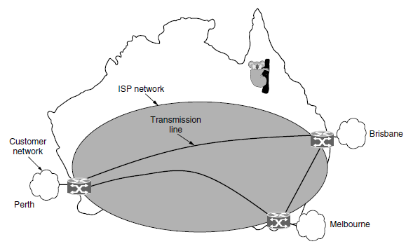
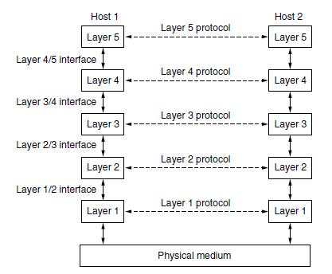
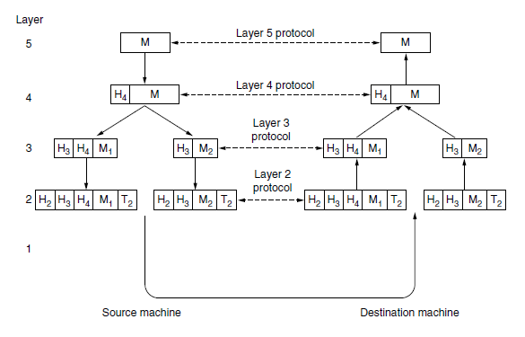

[Зміст <--](README.md) [Лекції](README.md) [  --> 2. Фізичний рівень](2.md)

# 1. Вступ до комп'ютерних мереж

## 1.1. Комп'ютерні мережі та розподілені системи

Ми будемо використовувати термін **комп'ютерна мережа** (computer networks), щоб означувати набір автономних комп'ютерів (і не тільки), пов'язаних однієї технологією. Два комп'ютера називають пов'язаними, якщо вони здатні обмінюватися інформацією. З'єднання не обов'язково має проводитися через кабель з металевими жилами, може використовуватися волоконна оптика, мікрохвилі, інфрачервоний діапазон та супутниковий зв'язок. Мережі бувають різних розмірів, форми та конфігурацій. Часто мережі з'єднуються між собою, щоб створити великі мережі. Найвідомішим прикладом такої мережі мереж є Інтернет.

У літературі існує плутанина між поняттями комп'ютерна мережа та розподілена система. Основне їх відмінність полягає в тому, що в **розподілених системах**(distributed system) наявність численних автономних комп'ютерів непомітно для користувача, тобто з точки зору розподілених систем це єдина пов'язана система. Зазвичай є набір програмного забезпечення на певному рівні (над операційною системою), яке називається проміжним ПЗ (**middleware**) і відповідає за реалізацію цієї ідеї. Зазвичай він має єдину модель або парадигму, яку він представляє користувачам. Добре відомий приклад розподіленою системи - це Всесвітня павутина (World Wide Web). Він працює поверх Інтернету та представляє модель, у якій усе виглядає як документ (веб-сторінка).

По суті, розподілена система — це програмна система, побудована на основі мережі. Програмне забезпечення надає йому високий ступінь зв’язності та прозорості. Таким чином, різниця між мережею та розподіленою системою полягає в програмному забезпеченні (особливо в операційній системі), а не в апаратному забезпеченні.

Тим не менш, між двома предметами існує значне збігання. Наприклад, як розподіленим системам, так і комп’ютерним мережам необхідно переміщувати файли. Різниця полягає в тому, хто викликає рух, система чи користувач.

У цьому курсі розглядаються як комп'ютерні мережі так і розподілені системи.

## 1.2. Використання комп'ютерних мереж

Комп'ютерні мережі оточують нас у повсякденному побутовому та професійному житті.

У дещо загальнішій формі об'єднання комп'ютерів потрібне **для спільного використання ресурсів** . Мета — зробити застосунки, обладнання та дані доступними для всіх у мережі незалежно від фізичного розташування ресурсу чи користувача. Очевидним і поширеним прикладом є використання спільного принтера для групи офісних працівників. Жодній особі не потрібен приватний принтер і мережевий принтер хоч і дорожчий але виходить дешевше, швидше і легше в підтримці ніж велика кількість окремих принтерів.

Однак, мабуть, ще більш важливим, ніж спільне використання фізичних ресурсів, таких як принтери та системи резервного копіювання, є обмін інформацією. Компанії невеликі і великі життєво залежать від комп’ютеризованої інформації. 

Один з видів моделі доступу до ресурсів є їх виділення на потужних загальнодоступних в мережі носіях. У цій моделі, наприклад дані зберігаються на потужних комп’ютерах, які називаються **серверами** . Часто вони розміщуються централізовано та обслуговуються системним адміністратором. На відміну від цього, на столах співробітників є простіші машини, які називаються **клієнтами**, за допомогою яких вони отримують доступ до віддалених даних, наприклад, для включення в електронні таблиці, які вони створюють. У такому обміні іноді під клієнтом розуміють людину, а інколи - програму чи апаратне забезпечення. Клієнтська та серверна машини з’єднані мережею, як показано на рис.1.1. 

Рис. 1.1. Мережа з двома клієнтами і одним сервером. 

Вся ця система називається **клієнт-серверною моделлю**. Вона широко використовується і є основою для широкого використання мережі. Найпопулярнішою реалізацією є веб-застосунок, у якому сервер створює веб-сторінки на основі своєї бази даних у відповідь на запити клієнта, які можуть оновлювати базу даних. У клієнт-серверній моделі задіяні два процеси (тобто запущені програми), один - на клієнтській машині, а інший - на серверній. При обміні клієнтський процес надсилає повідомлення через мережу серверному процесу, і чекає на зворотне повідомлення. Коли серверний процес отримує запит, він виконує запитану роботу або шукає запитані дані та надсилає відповідь. Ці повідомлення показано на рис. 1.2.

**Рис 1.2.** Клієнт-сервер модель передбачає запити і відповіді.

Друга мета створення комп’ютерної мережі стосується людей, а не інформації чи навіть комп’ютерів. Комп’ютерна мережа може забезпечити потужне **середовище зв’язку** між співробітниками. Практично кожна компанія, яка має два або тепер більше комп’ютерів має **електронну пошту** ( **електронну пошту** ), яку працівники зазвичай використовують для щоденного спілкування. Натомість телефонні розмови між працівниками можуть здійснюватися через комп’ютерну мережу від телефонної компанії. Ця технологія називається **IP телефонія** або **голос через IP** ( **VoIP** ), якщо використовується Інтернет-технологія. 

До аудіо можна додати відео, щоб працівники, які знаходяться на відстані, могли бачити та чути один одного під час зустрічі. Ця техніка є потужним інструментом для усунення витрат і часу, які раніше витрачалися на подорожі. **Спільний доступ до робочого столу** дозволяє віддаленим працівникам бачити та взаємодіяти з графічним екраном комп’ютера. Це полегшує двом або більше людям, які працюють далеко один від одного, читати та писати на спільній дошці або писати разом звіт. Коли один працівник вносить зміни в онлайн-документ, інші можуть побачити зміни негайно, замість того, щоб чекати кілька днів на лист. Таке прискорення полегшує співпрацю між різними групами людей там, де раніше це було неможливо. Ця технологія широко вживається при проведенні конференцій і в навчанні.

Є більш амбітні форми віддаленої координації, наприклад телемедицина, яка зараз починає використовуватися наприклад для віддаленого моніторингу пацієнтів, але може стати набагато важливішою. Іноді кажуть, що зв’язок і транспорт ведуть змагання, і хто б не переміг, той застарів.

За допомогою мережних технологій відбувається ведення бізнесу в електронному вигляді, особливо з клієнтами та постачальниками. Ця модель називається **електронною комерцією** ( **електронна комерція**), і за останні роки вона швидко розвинулася. Клієнти можуть купляти продукти не виходячи з дому. У сучасну епоху Індустрії 4.0 підприємства можуть автоматизовано створювати між собою ланцюжки постачань, завдяки мережному обміну. 

Зараз багато споживчих електронних пристроїв, таких як телевізійні приставки, ігрові консолі та радіо-годинник, мають вбудовані комп’ютери та комп’ютерні мережі, особливо бездротові мережі, а домашні мережі широко використовуються для розваг, зокрема для прослуховування, перегляду , створення музики, фотографій і відео.

Доступ до Інтернету забезпечує домашнім користувачам підключення до віддалених комп’ютерів.
Як і в компаніях, домашні користувачі можуть отримувати доступ до інформації, спілкуватися з іншими людьми, приймати участь в соц. мережах, та купувати продукти та послуги за допомогою електронної комерції. Доступ до віддаленої інформації має багато форм. Це може бути перегляд всесвітньої павутини в пошуках інформації або просто для розваги, доступ до онлайн газет, журналів, книг.  Пристрої для читання електронних книг і онлайн-бібліотеки можуть зробити друковані книги застарілими. Скептики повинні звернути увагу на вплив друкарського верстата на середньовічний ілюмінований рукопис. 

Значна частина цієї інформації доступна за допомогою клієнт-серверної моделі, але є це інша, популярна модель доступу до інформації, яка називається **одноранговим** зв’язком. У цій формі можуть спілкуватися особи, які утворюють вільну групу з іншими в групі, як показано на рис.1.3. Кожна людина може, в принципі, спілкуватися з одним або кількома людьми; немає фіксованого поділу на клієнтів і серверів.

 **Рис.1.3.** В одноранговий системі немає фіксованих клієнтів і серверів.

Багато однорангових систем, таких як BitTorrent, не мають центральної бази даних вмісту. Замість цього кожен користувач підтримує власну базу даних локально та надає список іншим людям поблизу, які є учасниками системи. Потім новий користувач може перейти до будь-якого існуючого учасника, щоб побачити, що він має, і отримати імена інших учасників для перевірки додаткового вмісту та інших імен. Цей процес пошуку можна повторювати нескінченно довго, щоб створити велику локальну базу даних про те, що існує. Це заняття може стати втомливим для людей, але комп’ютери з цим справляються.

Окремою категорією можна виділити розваги. Останніми роками це досягло величезних успіхів у побуті, коли розповсюдження музики, радіо- та телевізійних програм і фільмів через Інтернет починає конкурувати з традиційними механізмами. Інша форма з розвага є ігри.

Дуже популярним останнім часом стало використання **повсюдного обчислення**. Багато будинків уже оснащено системами безпеки, які включають датчики дверей і вікон є багато інших датчиків, які можна скласти до розумного домашнього монітора, наприклад як споживання енергії. Цей напрям також відомий в контексті Інтернету Речей (IoT). Використання цієї ідеї на промислових підприємствах назвиається Промисловим Інтернетом речей (IIoT).  У міру того, як вартість вимірювання та витрати на зв’язок падає, все більше вимірювань і звітів здійснюватиметься за допомогою мереж. А технології **RFID** ( **Радіо Частота ідентифікація** ) буде штовхати ці ідея ще далі в майбутньому. RFID-мітки — це пасивні (тобто без акумулятора) чіпи розміром із марку, і їх уже можна прикріплювати до книг, паспортів, домашніх тварин, кредитних карток та інших предметів удома та поза ним а також на виробництві. Це дозволяє зчитувачам RFID знаходити предмети та спілкуватися з ними на відстані до кількох метрів, залежно від типу RFID.  Звичайно, RFID-мітки пропонують набагато більше ніж штрих-коди, і їх ціна швидко падає. Вони можуть реально перетворити весь реальний світ на Інтернет речей. Про RFID можна послухати [спеціальний підкаст](https://youtu.be/C4UAFkjq5mg). 

Мобільні комп’ютери, такі як портативні та кишенькові комп’ютери, є одним із сегментів комп’ютерної індустрії, що швидко розвиваються. Їх продажі вже обігнали настільні комп'ютери.  Підключення їх до Інтернету дає змогу використовувати багато з цих мобільних пристроїв. Оскільки дротове з’єднання неможливо в автомобілях, човнах і літаках, існує великий інтерес до бездротових мереж. Стільникові мережі, якими керують телефонні компанії є одним із видів бездротового зв’язку. Стільникові мережі (3G і 4G), до яких підключаються смартфони, можуть надавати швидкі послуги передачі даних для користування Інтернетом, а також обробки телефонних дзвінків.  Бездротові **точки доступу** на основі стандарту 802.11 (WiFi) є ще одним видом бездротової мережі для мобільних комп’ютерів. Вони з’явилися скрізь, куди ходять люди, що призвело до появи різноманітного покриття в кафе, готелях, аеропортах, школах, поїздах і літаках. Будь-хто з портативним комп’ютером і бездротовим модемом може просто увімкнути свій комп’ютер і підключитися до Інтернету через точку доступу, ніби комп’ютер під’єднано до дротової мережі.

Бездротові мережі також важливі для військових. Якщо вам потрібно мати можливість вести війну будь-де на Землі в короткий термін, розраховувати на використання локальної мережевої інфраструктури, мабуть, не дуже гарна ідея. Краще принести свою ([starlink](https://uk.wikipedia.org/wiki/Starlink)).

Оскільки мобільні телефони знають своє місцезнаходження, часто через те, що вони обладнані приймачами **GPS** ( **система глобального позиціонування** ), деякі служби навмисно залежать від місцезнаходження. 

Сфера, в якій зараз починають використовуватися мобільні телефони, — це мобільна **комерція** ( **Mobile-commerce**. Короткі текстові повідомлення з мобільного використовуються для авторизації оплати їжі в автоматах, квитків у кіно та ін. дрібниці замість готівки та кредитних карток. Потім плата з’являється на рахунку мобільного телефону. Завдяки **технології NFC** ( **Near Field Communication** ) мобільний телефон може діяти як смарт-карта RFID і взаємодіяти з пристроєм для зчитування, який знаходиться поблизу, для оплати. Рушійною силою цього явища є виробники мобільних пристроїв і мережеві оператори, які намагаються зрозуміти, як доотримати шматок пирога електронної комерції. 

## 1.3. Мережне апаратне забезпечення

Класифікувати мережі можна думати за двома розмірностями: технологія передачі і масштаб. Зараз ми розглянемо кожен із них по черзі.

### Технологія передачі

Загалом, існує два типи технології передачі, які широко використовуються: широкомовні канали зв’язку та канали зв’язку «точка-точка ».

Зв’язки «**точка-точка**» з’єднують окремі пари машин. Щоб перейти від джерела до пункту призначення в мережі, що складається з зв’язків «точка-точка», короткі повідомлення, які в певних контекстах називаються **пакетами** , можуть спочатку відвідати одну або кілька проміжних машин. Часто можливі кілька маршрутів різної довжини, тому в мережах «точка-точка» важливо знайти хороший шлях. Передача «точка-точка» з одним відправником і одним отримувачем іноді називається **одноадресною передачею** .

Навпаки, у **широкомовній мережі** канал зв’язку використовується спільно для всіх машин у мережі; пакети, надіслані будь-якою машиною, отримують усі інші. Поле адреси в кожному пакеті означує одержувача. Отримавши пакет, машина перевіряє поле адреси. Якщо пакет призначено для приймаючої машини, ця машина обробляє пакет; якщо пакет призначений для іншої машини, він просто ігнорується. Прикладом широкомовного зв’язку є бездротова мережа, в якій зв’язок використовується в зоні покриття, що залежить від бездротового каналу та машини, що передає. Широкомовні системи зазвичай також допускають можливість адресації пакета *всім* адресатам за допомогою спеціального коду в полі адреси. Коли пакет із цим кодом передається, він приймається й обробляється кожною машиною в мережі. Такий режим роботи називається **трансляцією** . Деякі широкомовні системи також підтримують передачу на підмножину машин, що називається **груповою розсилкою** .

### Масштаб

Відстань є важливим показником для класифікації, оскільки в різних масштабах використовуються  різні технології. На рис.1.4 наведена класифікація систем з багатьма обчислювальними ресурсами (процесорами) за приблизним фізичним розміром цих систем. У верхній частині знаходяться персональні мережі, мережі, призначені для однієї особи. Окрім них, існують мережі більшого радіусу дії. Їх можна розділити на локальні, міські (муніципальні) та глобальні мережі, кожна зі зростаючим масштабом. Нарешті, з'єднання двох або більше мереж називають міжмережею. Всесвітній Інтернет є звичайно найбільш відомою міжмережою але є і інші приклади . 

**Рис.1.4.** Класифікація мультипроцесорних систем.

### Personal Area Network (PAN)

**PAN** ( **персональні мережі** ) дозволяють пристроям обмінюватися даними в околі людини. Типовим прикладом є бездротові мережі що з’єднує комп’ютер з його периферійними пристроями. Майже кожен комп’ютер має підключений монітор, клавіатуру, мишу та принтер. Ряд компаній об’єдналися, щоб розробити бездротову мережу малого радіусу дії під назвою **Bluetooth** для з’єднання цих компонентів без проводів (рис.1.5). Системний блок (ПК) зазвичай є ведучим, спілкуючись із мишею, клавіатурою тощо, які є веденими. Ведучий повідомляє веденим, які їм адреси використовувати, дає їм право транслювати, та вказує як довго вони можуть передавати, на яких частотах вони можуть використовувати, і так далі. Bluetooth також можна використовувати в інших застосуваннях. Його часто використовують для підключення бездротової гарнітури до мобільного телефону. 

**Рис.1.5. ** Bluetooth Конфігурація PAN .

PAN також можна створювати за допомогою інших технологій, які обмінюються даними на малих відстанях, таких як RFID на смарт-картках і бібліотечних книгах. У даному курсі ці мережі не вивчатимуться.

### Локальна мережа (LAN)

Локальна мережа (LAN, Local Area Network) – це приватна мережа, яка працює всередині та поблизу однієї будівлі, наприклад дому, офісу чи фабрики. Локальні мережі широко використовуються для з'єднання персональних комп'ютерів і споживчої електроніки, щоб вони могли спільно використовувати ресурси (наприклад, принтери) і обмінюватися інформацією. Локальні мережі в межах компаній називаються **корпоративними мережами**. 

Сьогодні дуже популярними є бездротові локальні мережі, особливо в тих місцях де надто складно встановити  кабелі. У цих системах кожен комп'ютер має радіомодем і антену що він використовує для зв’язку з іншими комп’ютерами. У більшості випадків кожен комп’ютер спілкується не безпосередньо з іншим, а через спеціальний пристрій, який називається точкою доступу **AP** (Access Point, або **базова станція**) і може бути реалізований як **бездротовий маршрутизатор**  рис.1.6(a). Цей пристрій ретранслює пакети між бездротовими комп’ютерами, а також між ними та Інтернетом. Існує стандарт для бездротових локальних мереж під назвою **IEEE 802.11** , широко відомий як **Wi-Fi**.

**Рис.1.6.** Бездротовий і дротовий локальні мережі. (а) 802.11. (б) Переключено Ethernet.

Провідні локальні мережі базуються на металевих провідниках або оптоволокні. Локальні мережі мають обмежений розмір, що означає, що час передачі в найгіршому випадку обмежений і відомий заздалегідь. Знання цих меж допомагає в розробці мережевих протоколів. Як правило, дротові локальні мережі працюють зі швидкістю від 100 Мбіт/с до 1 Гбіт/с, мають низьку затримку (мікросекунди або наносекунди) і в них виникає дуже мало помилок при передачі. Новіші локальні мережі можуть працювати на швидкості до 10 Гбіт/с. Порівняно з бездротовими мережами дротові локальні мережі перевершують їх за всіма показниками продуктивності. Просто легше надсилати сигнали по дроту або волокну, ніж по повітрю.

Топологія багатьох дротових локальних мереж побудована на основі зв’язків «точка-точка». IEEE 802.3, популярна назва **Ethernet** , безумовно, найпоширеніший тип дротових LAN. На рис. 1.6(b) показаний приклад топології **комутованого Ethernet**. Кожен комп’ютер "розмовляє" протоколом Ethernet і під’єднується до блоку, що називається **комутатором**, за допомогою зв’язку «точка-точка». Комутатор має кілька **портів** , кожен з яких може підключатися до одного комп’ютера. Робота комутатора полягає в тому, щоб передавати пакети між підключеними до нього комп’ютерами, використовуючи адресу в кожному пакеті, щоб визначити, на який комп’ютер його надіслати. Щоб побудувати більші локальні мережі, комутатори можна підключати один до одного за допомогою відповідних портів. Мережа Ethernet детальніше розглянута в інших лекціях.

Також можна розділити одну велику фізичну локальну мережу на дві менші логічні локальні мережі. Це потрібно в кількох випадках. Наприклад комп'ютери для користувачів з різних відділів можуть знаходитися поряд але потребувати різних мереж (розділення трафіку). У цьому випадку вони підключаються до тих самих комутаторів та інших мережних пристроїв в тій самій фізичній мережі, але мережні пакети будуть циркулювати тільки в логічно виділених вузлах. Тобто комутатори керуються не тільки адресацією в пакетах а спеціальним маркером пакетів. Така логічна мережа поверх фізичної називається **Віртуальною локальною мережею** або **VLAN**. У цьому прикладі кожен порт позначається «кольором», скажімо, зелений для техніки та червоний для фінансів. Потім комутатор пересилає пакети, щоб комп’ютери, під’єднані до зелених портів, були відокремлені від комп’ютерів, під’єднаних до червоних портів. Широкомовні пакети, надіслані на червоний порт, наприклад, не будуть прийняті на зелений порт.

Хоча ми можемо розглядати домашню мережу як ще одну локальну мережу, вона, швидше за все, матиме інші властивості, ніж інші мережі. По-перше, мережеві пристрої мають бути дуже простими в установці. Бездротові маршрутизатори – це споживча електроніка, яку найчастіше повертають. Люди купують його, тому що хочуть бездротову мережу вдома, виявляють, що він не працює «з коробки», а потім повертають його. По-друге, мережа та пристрої мають бути надійно захищеними. Раніше кондиціонери мали одну ручку з чотирма налаштуваннями: ВИМК., НИЗЬКИЙ, СЕРЕДНИЙ і ВИСОКИЙ. Тепер у них є посібники на 30 сторінок. Після того, як вони будуть об’єднані в мережу, очікуйте, що лише розділ про безпеку буде займати 30 сторінок. Це проблема, оскільки лише користувачі комп’ютерів звикли миритися з продуктами, які не працюють; люди, які купують автомобілі, телевізори та холодильники, набагато менш толерантні. Вони очікують, що продукти працюватимуть на 100% без необхідності наймати гіка. По-третє, низька ціна є важливою умовою успіху. Люди не будуть платити 50 доларів за інтернет-термостат, оскільки мало хто вважає таким важливим моніторинг температури вдома з роботи. Однак за 5 доларів він може бути проданим. По-четверте, повинна бути можливість почати з одного або двох пристроїв і розширити охоплення мережі поступово. Мережевий інтерфейс повинен залишатися стабільним протягом десятиліть, як і стандарти телевізійного мовлення. По-п'яте, безпека і надійність будуть дуже важливі. Втрата кількох файлів через вірус електронної пошти – це одне; коли грабіжник вимкнув вашу систему безпеки зі свого мобільного комп’ютера, а потім пограбував ваш будинок – це щось зовсім інше. Одним словом, домашні локальні мережі пропонують багато можливостей і викликів. Більшість останніх пов’язана з потребою, щоб мережі були простими в управлінні, надійними та безпечними, особливо в руках нетехнічних користувачів, а також низькою вартістю.

### Муніципальні мережі (MAN)

**MAN** ( **Metropolitan Area Network** ) покриває місто. Найвідомішим прикладом таких мереж є кабельне телебачення. Ці системи виникли на основі попередніх систем громадських антен, які використовувалися в районах із поганим прийомом ефірного телебачення. У тих ранніх системах велику антену розміщували на вершині сусіднього пагорба, а потім сигнал подавався до будинків абонентів. Але з самого початку і до кінця 1990-х років вони призначалися лише для телевізійного прийому. Коли Інтернет почав залучати масову аудиторію, оператори мереж кабельного телебачення почали розуміти, що з деякими змінами в системі вони можуть надавати двосторонню послугу Інтернету в невикористаних частинах спектру. На той момент система кабельного телебачення почала перетворюватися на просто спосіб розповсюдження телебачення в міській мережі. У першому наближенні MAN може виглядати приблизно так, як система, показана на рис.1.7. На цьому рисунку ми бачимо, як телевізійні сигнали та Інтернет подаються в централізовану **кабельну головну станцію** для подальшого розподілу по домівках людей. 

**Рис.1.7.** Муніципальна мережа на основі телевізійного кабелю.

Швидкість бездротового доступу до Інтернету призвела до ще одного MAN, який був стандартизований як IEEE 802.16 і широко відомий як **WiMAX** .

### Глобальні мережі (WAN) 

**WAN** ( **Wide Area Network** ) охоплює велику географічну територію, часто країну чи континент.  WAN на рис.1.8 — це мережа, яка з’єднує офіси в Перті, Мельбурні та Брісбені. Кожен з цих офісів містить комп'ютери, призначені для запуску програм користувача (тобто прикладних програм). Ми дотримуватимемося традиційного використання і називатимемо ці машини **хостами (host)** . Решта мережі, яка з’єднує ці хости, тоді називається комунікаційною підмережею або скорочено просто **підмережею (subnet)**. Робота підмережі полягає в тому, щоб передавати повідомлення від хоста до хоста, так само як телефонна система передає слова (насправді лише звуки) від мовця до слухача. У більшості глобальних мереж підмережа складається з двох окремих компонентів: ліній передачі та комутаційних елементів. **Лінії передачі** переміщують біти між машинами. Вони можуть бути зроблені з мідного дроту, оптичного волокна або навіть радіоканалів. Більшість компаній не мають ліній електропередачі, тому натомість вони орендують лінії в телекомунікаційних компаній. **Комутаційні елементи** , або просто **комутатори** , - це спеціалізовані комп'ютери, які з'єднують дві або більше ліній електропередачі. Коли дані надходять на вхідну лінію, перемикаючий елемент повинен вибрати вихідну лінію, на яку їх пересилати. У минулому ці комутаційні комп’ютери називали різними іменами; зараз найчастіше використовується назва **маршрутизатор .** 

**Рис.1.8.** WAN до якої підключаються три відділення офісів в Австралії.

Короткий коментар до терміну «підмережа» тут. Спочатку, його **єдиним** значенням була сукупність маршрутизаторів і ліній зв’язку, які переміщували пакети від вихідного хосту до хосту призначення. Читачі повинні знати, що воно набуло другого, більш останнього значення у поєднанні з мережевою адресацією. Ми обговоримо це значення коли будемо розглядати питання маршрутизації.

WAN, як ми описали, виглядає схоже на велику дротову локальну мережу, але є деякі важливі відмінності, які виходять за межі довгих проводів. Перша заключається в тому, що зазвичай у WAN, хости і підмережа є у власності різних людей.  Наприклад, працівники можуть відповідати за власні комп’ютери, а ІТ-відділ компанії відповідає за решту мережі. Ми побачимо більш чіткі межі в наступних прикладах, у яких мережевий провайдер або телефонна компанія керує підмережею. Відокремлення комунікаційних аспектів мережі (підмережа) від прикладних аспектів (хости) значно спрощує загальну конструкцію мережі. Друга відмінність полягає в тому, що маршрутизатори зазвичай використовують різні види мережевих технологій. Наприклад, мережі всередині офісів можуть бути комутованим Ethernet,  тоді як міжміські лінії передачі можуть бути з'єднаннями SONET. Це означає, що багато WAN фактично будуть **міжмережами (internetworks)** або складеними мережами, які складаються з кількох мереж (кількох сегментів мереж). Остання відмінність полягає в тому, що саме підключено до підмережі. Це можуть бути окремі комп’ютери, як у випадку підключення до локальних мереж, або це можуть бути цілі локальні мережі. Таким способом з менших мереж будуються великі. 

Тепер розглянемо два інших різновиди глобальних мереж. Перший випадок: припустимо, необхідно об'єднати кілька територіально розосереджених офісів в єдину мережу. Замість того, щоб орендувати виділені лінії електропередачі для з'єднання їх в мережу, компанія може підключити свої офіси до існуючої глобальної мережі Інтернет. При цьому встановлювати з’єднання між офісами у вигляді віртуальних каналів, які використовують базову пропускну здатність Інтернету. Така схема, показана на рис. 1.9 і називається **VPN** (віртуальна приватна мережа, Virtual Private Network). Порівняно з виділеними лініями зв'язку, VPN має звичайну перевагу віртуалізації, яка полягає в тому, що він забезпечує гнучке повторне використання існуючого ресурсу (підключення до Інтернету). За таким способом до віртуальної приватної мережі легко додати будь яку кількість офісів, незалежно від їх розміщення (тільки б був доступ о Інтернет). VPN також має звичайний недолік віртуалізації, який полягає у відсутності контролю над основними ресурсами (згадайте випадки часткового відсутністю доступу або падіння трафіку). З виділеною лінією передачі пропускна здатність зрозуміла. 

 

**Рис.1.9.** WAN з використанням віртуальної приватної мережі.

Другий випадок полягає в тому, що підмережа може керуватися іншою компанією. Оператор підмережі є **провайдером (постачальником) мережевих послуг**, а офіси є клієнтами. Ця структура показана на рис.1.10. Оператор також як правило надає можливість доступу до Інтернету. У цьому випадку цей оператор називають **ISP** ( **Internet Service Provider** ), а підмережу – **мережею ISP** . Його клієнти, які підключаються до провайдера, отримують послуги Інтернету.

**Рис.1.10.** WAN з використанням мережі ISP.

У більшості WAN мережа містить багато ліній передачі, кожна з яких з’єднує пару маршрутизаторів. Якщо два маршрутизатори не мають спільної лінії передачі, вони повинен робити це опосередковано, через інший маршрутизатори. У мережі може бути багато шляхів, які з’єднують ці два маршрутизатори. Те, як мережа приймає рішення щодо того, який шлях використовувати, називається **алгоритмом маршрутизації (routing)**, а те, як кожен маршрутизатор приймає рішення щодо того, куди далі відправляти пакет, називається **алгоритмом пересилання (forwarding)**. Таких алгоритмів є багато, але вони не є предметом даної дисципліни.

Інші види WAN активно використовують бездротові технології. У супутникових системах кожен комп’ютер на землі має антену, через яку він може надсилати дані на супутник на орбіті та отримувати дані з нього. Усі комп’ютери можуть чути вихід *із* супутника, а в деяких випадках вони також можуть чути висхідні передачі інших комп’ютерів *на* супутник. Супутникові мережі за своєю суттю є широкомовними, і вони найбільш корисні, коли важлива властивість трансляції.

Стільникова телефонна мережа є ще одним прикладом глобальної мережі, яка використовує бездротову технологію. Ця система вже пройшла через три покоління, і на горизонті п'яте (5G). Перше покоління було аналоговим і лише для голосу. Друге покоління було цифровим і лише для голосу. Третє покоління є цифровим і призначене як для голосу, так і для даних. Кожна базова станція стільникового зв’язку покриває відстань, набагато більшу, ніж бездротова локальна мережа, із радіусом дії, що вимірюється в дюймах кілометри, а не десятки метрів. Базові станції з’єднані одна з одною за допомогою магістральної мережі, яка зазвичай є дротовою. Швидкість передачі даних у стільникових мережах часто становить близько 1 Мбіт/с, що набагато менше, ніж у бездротовій локальній мережі, яка може досягати порядку 100 Мбіт/с. 

### Інтермережі

Існує багато мереж у світі, часто з іншим апаратним і програмним забезпеченням. Люди, підключені до однієї мережі, часто цього хочуть спілкуватися з людьми, підключеними до іншої. Виконання цього бажання вимагає підключення різних і часто несумісних мереж. Сукупність взаємопов’язаних мереж називається **інтермережою (internetwork)** або **інтернетом** . Ці терміни використовуватимуться в загальному значенні, на відміну від всесвітнього **Інтернету** (який є одним конкретним Інтернетом), який ми завжди будемо писати з великої літери. Інтернет використовує мережі провайдерів для підключення корпоративних мереж, домашніх мереж і багатьох інших мереж. 

Підмережі, мережі та інтермережі часто плутають. Термін «підмережа» має найпопулярніший смисл у контексті глобальної мережі, де він стосується сукупності маршрутизатори та лінії зв'язку, що належать оператору мережі. Як аналогія, телефонна система складається з телефонних комутаторів, з’єднаних один з одним високошвидкісними лініями, а з будинками та підприємствами – низькошвидкісними лініями. Ці лінії та обладнання, якими володіє та керує телефонна компанія, утворюють підмережу телефонної системи. Самі телефони (хости в цій аналогії) не є частиною підмережі.

Мережа утворюється комбінацією підмережі та її хостів. Однак слово «мережа» часто вживається також у вільному значенні. Підмережу можна описати як мережу, як у випадку «мережі ISP» на рис.1.10. Інтермережа може також бути описана як a мережа, як в WAN на рис. 1.8. 

Скажемо більше про те, що являє собою мережа. Ми знаємо, що Інтернет утворюється, коли окремі мережі з’єднуються між собою. На наш погляд, підключення LAN і WAN або з'єднання двох локальних мереж є звичайним способом створення інтермережі, але в галузі мало згоди щодо термінології в цій галузі. Є два корисних правила. По-перше, якщо різні організації заплатили за створення різних частин мережі, і кожна підтримує свою частину, ми маємо інтермережу, а не єдину мережу. По-друге, якщо основний технології відрізняються в різних частинах (наприклад провідна і безпровідна), у нас, ймовірно також інтермережа.

Щоб зайти глибше, нам потрібно поговорити про те, як можна з’єднати дві різні мережі. Загальна назва машини, яка встановлює з’єднання між двома або більше мережами та забезпечує необхідний переклад як з точки зору апаратного забезпечення, так і програмне забезпечення є **шлюзом (gateway)** . Шлюзи розрізняються за рівнем, на якому вони працюють в ієрархії протоколів.  

Оскільки перевага створення інтермережі полягає в з’єднанні комп’ютерів в різних мережах, ми не хочемо використовувати шлюз надто низького рівня, інакше ми не зможемо встановити з’єднання між різними типами мереж. Ми також не хочемо використовувати шлюз надто високого рівня, інакше підключення працюватиме лише для певних програм. Рівень посередині, який є «самим правильним», часто називають мережевим рівнем, а маршрутизатор — це такий шлюз, який комутує пакети на мережевому рівні. Тепер ми можемо визначити інтермережу як таку, в якій можна знайти маршрутизатори.

## 1.4. Ієрархія протоколів в мережах

Щоб зменшити складність дизайну, більшість мереж організовано як стек **шарів (layer)** або **рівнів(levels)** , кожен з яких побудований на наступному. Кількість шарів, назва кожного шару, вміст кожного шару та функції кожного шару відрізняються від мережі до мережі. Мета кожного рівня полягає в тому, щоб запропонувати певні послуги вищим рівням, одночасно захищаючи ці рівні від деталей того, як фактично реалізуються запропоновані послуги. У певному сенсі кожен рівень є свого роду віртуальною машиною, яка пропонує певні послуги вищестоящому рівню. Приклади моделей мереж будуть розглядатися в інших лекціях.  

Коли шар *n* на одній машині продовжує розмову з рівнем *n* на іншій машині, правила та умовності, що використовуються в цій розмові, спільно відомі як протокол рівня *n* . По суті, **протокол (protocol)** — це угода між сторонами про правила спілкування. На рис. 1.11 показана п'ятирівнева мережа. Сутності, що входять до складу того самого рівня на різних машинах можуть бути програмними процесами, апаратними пристроями або навіть людьми. І вони спілкуються один з одним з використанням одного й того ж протоколу цього рівня. 

 

**Рис.1.11.** Рівні, протоколи, і інтерфейси.

Насправді дані не передаються безпосередньо із рівня *n* на одній машині до рівня *n* на іншій. Замість цього кожен рівень передає дані та керуючу інформацію на рівень безпосередньо під ним, доки не буде досягнуто найнижчого рівня. Нижче рівня 1 знаходиться **фізичне середовище (physical medium)** , через яке відбувається фактичне спілкування. На рис. 1.1q віртуальне спілкування показано пунктирними лініями, а фізичне — суцільними лініями.

Між кожною парою суміжних шарів є **інтерфейс (interface)** . Інтерфейс означує, які примітивні операції та служби нижній рівень робить доступними для верхнього. Коли розробники мережі вирішують, скільки рівнів включити в мережу і що повинен робити кожен, одне із найважливіших міркувань є означення чітких інтерфейсів між рівнями. Це, у свою чергу, вимагає, щоб кожен рівень виконував певний набір добре зрозумілих функцій. На додаток до мінімізації обсягу інформації, яку необхідно передати між рівнями, чіткі інтерфейси також спрощують заміну одного рівня на зовсім інший протокол або реалізацію (наприклад, заміна всіх телефонних ліній супутниковими каналами). Тому що все що потрібно новому протоколу або реалізації полягає в тому, що він пропонує своєму сусідові нагорі точно такий же набір послуг, як і попередній. Зазвичай різні хости використовують різні реалізації одного протоколу (часто написаного різними компаніями). Насправді сам протокол може змінюватися на якомусь рівні, навіть не помічаючи цього рівнями над і під ним.

А Сукупність рівнів і протоколів називається **мережевою архітектурою (network architecture)** . Специфікація архітектури повинна містити достатньо інформації, щоб дозволити реалізатору написати програму або створити апаратне забезпечення для кожного рівня, щоб воно правильно підкорялося відповідному протоколу. Ані деталі реалізації, ані специфікація інтерфейсів не є частиною архітектури, оскільки вони приховані всередині машин і невидимі ззовні. Навіть не обов’язково, щоб інтерфейси на всіх машинах у мережі були однаковими, за умови, що кожна машина може правильно використовувати всі протоколи. Список протоколів, які використовує певна система, по одному протоколу на рівень, називається **стеком протоколів (protocol stack)** . Мережні архітектури, стеки протоколів і самі протоколи є основними предметами цієї книги.

Тепер розглянемо технічний приклад: як забезпечити зв'язок між верхніми рівнями п'ятирівневої мережі на рис.1.12. Повідомлення $M$ створюється прикладним процесом, який виконується на рівні 5, і передається на рівень 4 для передачі. Рівень 4 розміщує **заголовок (Header)** $H_4$ перед повідомленням, щоб ідентифікувати повідомлення, і передає результат на рівень 3. Заголовок містить керуючу інформацію, таку як адреси, щоб дозволити рівню 4 на машині призначення доставити повідомлення. Іншими прикладами керуючої інформації, яка використовується на деяких рівнях, є порядкові номери (якщо нижній рівень не зберігає порядок повідомлень), розміри та час.

**Рис.1.12.** Приклад інформаційного потоку підтримуючий віртуальне спілкування на рівні 5.

У багатьох мережах немає обмежень на розмір повідомлень, що передаються за допомогою протоколу рівня 4, але майже завжди є обмеження, накладене протоколом рівня 3. Отже, рівень 3 повинен розбивати вхідні повідомлення на менші блоки, пакети, додаючи перед кожним пакетом заголовок рівня 3. У цьому прикладі M розділено на дві частини, $M_1$ і $M_2$, які будуть передані окремо. 

Рівень 3 вирішує, яку з вихідних ліній використовувати, і передає пакети на рівень 2. Рівень 2 додає до кожної частини не лише заголовок, але й кінцевик (trailer) $T_1$ і $T_2$, і передає отриману одиницю на рівень 1 для фізичної передачі. На приймальній машині повідомлення рухається вгору, від рівня до рівня із видаленням заголовків у міру просування наверх. Жоден із заголовків для рівнів нижче *n* не передається на рівень *n.*

Важливо розуміти, що на рис. 1.12 існує зв’язок між віртуальним і фактичним зв’язком, а також різниця між протоколами та інтерфейсами. Наприклад, однорангові процеси на рівні 4 концептуально вважають свій зв’язок «горизонтальним» за допомогою протоколу рівня 4. Кожен з цих процесів, імовірно, матиме процедури, які називаються щось на кшталт `ВідправитиІншійСтороні` та `ОтриматиВідІншоїСторони`, навіть якщо ці процедури насправді спілкуються з нижчими рівнями через інтерфейс 3/4, а не з іншою стороною.

Абстракція однорангового процесу має вирішальне значення для проектування всіх мереж. Використовуючи його, некероване завдання проектування повної мережі можна розбити на кілька менших, керованих завдань проектування, а саме проектування окремих рівнів.

Варто зазначити, що нижні рівні ієрархії протоколу часто впроваджуються в апаратному забезпеченні або у вигляді прошивки. Тим не менш, задіяні складні алгоритми протоколу, навіть якщо вони вбудовані (повністю або частково) в апаратне забезпечення.

## 1.5. Стандартизація в мережах

Існує багато мережевих продавців і постачальників, кожен зі своїми власними уявленнями про те, як це робити. Без координації був би повний хаос, і користувачі нічого б не зробили. Єдиний вихід - домовитися про якісь стандарти мережі. Хороші стандарти не тільки дозволяють різним комп’ютерам взаємодіяти, але й збільшують ринок продуктів, які відповідають стандартам. Більший ринок веде до масового виробництва, економії за рахунок масштабу виробництва, кращих реалізацій та інших переваг, які знижують ціну та ще більше підвищують визнання.

Стандарти визначають, що необхідно для сумісності: ні більше, ні менше. Це дозволяє з’явитися більшому ринку, а також дозволяє компаніям конкурувати на основі якості їхніх продуктів. Наприклад, стандарт 802.11 визначає багато швидкостей передачі, але не вказує, коли відправник має використовувати яку швидкість, що є ключовим фактором хорошої продуктивності. Це залежить від того, хто виготовляє продукт. Часто досягти сумісності таким чином важко, оскільки існує багато варіантів реалізації, а стандарти зазвичай визначають багато варіантів. Для 802.11 було так багато проблем, що в рамках стратегії, яка стала звичайною практикою, торгова група під назвою WiFi Alliance почала працювати над сумісністю в рамках стандарту 802.11.

Подібним чином, стандарт протоколу означує протокол обміну, але не інтерфейс служби всередині реалізації цього протоколу. Справжні інтерфейси служб часто є пропрієтарними. Наприклад, спосіб підключення TCP до IP на комп’ютері не має значення для спілкування з віддаленим хостом. Важливо лише те, що віддалений хост розмовляє на TCP/IP. Насправді TCP і IP зазвичай реалізуються разом
без будь-якого чіткого інтерфейсу. Тим не менше, хороші сервісні інтерфейси, як і хороші API, є цінними для використання протоколів, і найкращі з них (наприклад, сокети Berkeley) можуть стати дуже популярними.

Стандарти поділяються на дві категорії: де-факто та де-юре. Стандарти **де-факто** (лат. «від факту») — це стандарти, які щойно сталися, без будь-якого формального плану. HTTP, протокол, на якому працює Інтернет, почав своє існування як стандарт де-факто. Він був частиною ранніх браузерів WWW, розроблених Тімом Бернерсом-Лі в CERN, і його використання почало розвиватися разом із розвитком Інтернету. Іншим прикладом є Bluetooth. Його спочатку розробила компанія Ericsson, але тепер ним користуються всі.

Стандарти **де-юре** (лат. «за законом»), навпаки, приймаються через правила певного офіційного органу стандартизації. Міжнародні органи стандартизації, як правило, поділяються на два класи: ті, що створені угодою між національними урядами, і ті, що включають добровільні, бездоговірні організації. У сфері стандартів комп’ютерних мереж існує кілька організацій кожного типу, зокрема ITU, ISO, IETF та IEEE, усі з яких ми обговоримо нижче.

На практиці відносини між стандартами, компаніями та органами стандартизації є складними. Стандарти де-факто часто перетворюються на стандарти де-юре, особливо якщо вони успішні. Це сталося у випадку HTTP, який швидко підхопив IETF. Органи стандартизації часто ратифікують стандарти один одного, що схоже на поплескування один одного по плечу, щоб збільшити ринок для технології. У наші дні багато спеціальних бізнес-альянсів, які формуються навколо певних технологій, також відіграють важливу роль у розробці та вдосконаленні мережевих стандартів. Наприклад, **3GPP** ( **Проект партнерства третього покоління** ) – це співпраця між телекомунікаційними асоціаціями, які розробляють стандарти мобільних телефонів UMTS 3G.

У світі телекомунікацій є багато організацій по стандартизації, ряд з них будуть згадуватися в інших лекціях. 

## Запитання для самоперевірки

1. Наведіть приклади використання комп'ютерних та промислових мереж мереж:
   - в офісі
   - вдома
   - на промисловому виробництві
2. Поясніть що таке сервер та модель в клієнт-серверній моделі. Поясніть принципи функціонування. Наведіть приклади. До чого в даній моделі більше відноситься поняття: апаратного забезпечення, програмного забезпечення, операційної системи?
3. Розкажіть про принципи однорангового зв'язку. Наведіть приклади. Подумайте, чи можуть в такому зв'язку працювати клієнт-серверні моделі і якщо так, то для чого.
4. Які можливості надають RFID та NFC.
5. Поясніть відмінність одноадресної, мультиадресної та широкомовної розсилки.
6. Наведіть приклади використання мереж в залежності від масштабу. Поясніть що таке інтермережа і як вона організовується?
7. Поясніть поняття хост, підмережа, комутатор, маршрутизатор, шлюз.
8. Що таке VPN і поверхнево яким чином організовується зв'язок.
9. Поясніть поняття протокол рівня, інтерфейс рівня і стек протоколів.   

[Зміст <--](README.md) [Лекції](README.md) [  --> 2. Фізичний рівень](2.md)

Основа для матеріалу взята з книги [COMPUTER NETWORKS FIFTH EDITION. ANDREW S. TANENBAUM](https://www.mbit.edu.in/wp-content/uploads/2020/05/Computer-Networks-5th-Edition.pdf)

## Посилання на відеозаписи лекцій

[Запис Л1.Вступ до комп'ютерних мереж](https://youtu.be/gg3c405LXOY?si=J8DfiUREUhCuThXY)

