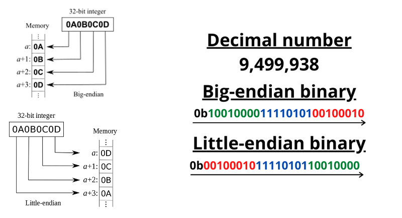
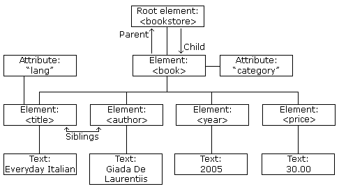
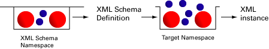
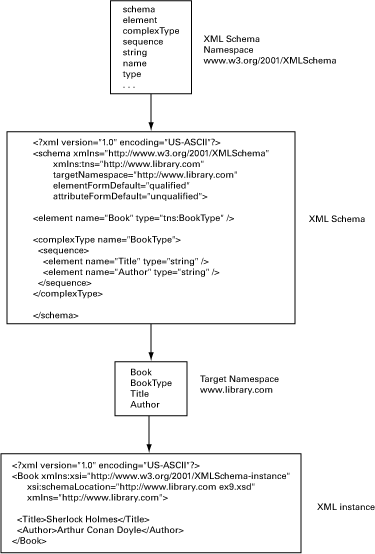

[9.  Прикладний рівень: HTTP, HTTP API <--   ](9.md) [Лекції](README.md) [   --> 11.JSON](11.md)

# 10. XML

## 10.1. Серіалізація

Обмін даними в комп’ютерних системах зазвичай відбувається з використанням структурованих даних. Ці дані зберігаються, обробляються і передаються між пристроями та системами. Найпростішим способом могло б бути просте копіювання та передача області пам'яті в бінарному форматі. Однак комп’ютерні системи можуть мати різні апаратні архітектури та різні способи представлення даних, зокрема:

- дані атомарних типів можуть бути представлені в оперативній пам’яті по-різному
- виділення пам'яті для структурних даних може відбуватися різним чином а отже по різному інтерпретуватися. 

Обмін даними в двійковому вигляді між системами з різною організацією пам’яті, у разі використання атомарних типів і при неінтепретованій їх обробці, з великою вірогідністю призведе до помилок. Так на рис.10.1 показано, що одне і те саме число може по різному інтерпретуватися, так як одні системи сприймають перший байт як старший, а інші як молодший.



рис.10.1. Представлення даних в різних архітектурах комп'ютера. 

В обчислювальній техніці для цього використовується серіалізація/десерілазація.  **Серіалізація** (serialization, serialisation) або маршалинг - процес переведення структури даних або стану об’єкта у формат, який можна зберігати (файли, буфери) або передавати через мережу з послідуючим відновленням. Протилежною операцією, що витягує структуру даних із серії байтів, є **десеріалізація** (також називається демаршалинг).

Приклади застосування серіалізації включають такі методи, як:

- серіалізація даних для передачі в мережах (обмін повідомленнями)
- зберігання даних (у базах даних, на жорстких дисках)
- віддалені виклики процедур, наприклад, як у SOAP
- розповсюдження об’єктів, особливо в розробці програмного забезпечення на основі компонентів, наприклад COM, CORBA тощо.
- виявлення змін у даних що змінюються в часі

Як варіант організації формату передачі даних є представлення їх у вигляді тексту. Це звісно приведе до збільшення обсягу необхідної пам'яті та кількості даних що передаються а також збільшить затрати на їх обробку, але спростить задачу забезпечення сумісності. Додатковою перевагою текстового представлення є можливість передавати (і зберігати) не тільки самі дані, але і їх опис (метадані). Тому існуючі та використовувані текстові представлення (серіалізації) даних радше називається не форматом даних а мовою опису даних. 

При цьому варто також зауважити, що і при обміні текстовим представлення даних відправник та отримувач повинні однаково сприймати дані, якими обмінюються, інакше система не буде функціонувати належним чином. Тому дані перед обробкою бажано перевірити на відповідність певній схемі (**валідність**), що буде свідчити про їх правильну організацію. Така перевірка можлива лише за наявності додаткової інформації, яка б описувала таку схему. Наявність механізмів такої перевірки може стати важливим аргументом при виборі того чи іншого способу серіалізації.    

У цій лекції розглядається мова опису даних - XML, а в наступній - JSON, які на сьогодні найчастіше використовуються при обміні даними між комп'ютерними системами. Варто зазначити що є і інші мови серіалізації, наприклад YAML. Усі вони зберігають дані у форматі звичайного тексту. Це забезпечує незалежний від програмного та апаратного забезпечення спосіб зберігання, транспортування та спільного використання даних. За допомогою XML та JSON дані можуть бути доступні для всіх видів «машин для читання», таких як люди, комп’ютери, голосові машини, канали новин тощо.

## 10.2. Загальне представлення XML

### Загальне представлення

**XML** – eXtensible Markup Language – метамова, що надає гнучкий інструментарій формування документів, призначених для опису структур даних для їх машинної обробки. XML є еволюцією іншої мови SGML (Standard Generalised Markup Language) від якої також з'явилася мова HTML. XML використовується на практиці для опису складних структур даних (опис переліків полів даних, типів даних, способів їх обробки), обміну цими описами між комп’ютерними системами та збереження цих даних. Приклад XML:

```xml
<note>
  <to>Tove</to>
  <from>Jani</from>
  <heading>Reminder</heading>
  <body>Don't forget me this weekend!</body>
</note>
```

Наведений вище XML є досить описовим. Він містить інформацію про відправника, приймача, має заголовок, має тіло повідомлення. Але все одно наведений вище XML нічого не РОБИТЬ. XML — це просто інформація, загорнута в теги. Хтось повинен написати частину програмного забезпечення, щоб надсилати, отримувати, зберігати або відображати його.

HTML-документи також мають подібну структуру, але на відміну від мови HTML, XML-мова не має заздалегідь означеного набору тегів і фокусується на представленні даних а не відображення даних на сторінці. 

### Структура документу

Для початку перелічимо основні поняття і складові:

- **Теги** (Tag) – будь-яке слово латиницею, наприклад `<Tag>`, що вказує на розмітку даних, тобто загорнутий в `<` та `>`.
- **Зміст тегів (контент)** - все що знаходиться між між відкритими  `<Tag>` та закритими  `</Tag>` тегами 
- **Атрибути тегів**  - частини, які описують властивості (атрибути) об’єкта, у форматі `<Tag attribute=“attribute value”/>`
- Розділ даних DTD (CDATA) - блок даних, що не містить елементів розмітки (тільки корисне навантаження), наприклад, `<![CDATA[ *будь-які дані* ]]>` 
- Розділ коментарів, наприклад  `<!-- Commentaries -->`
- Метадані в заголовку - дані про документ, наприклад `<?xml version="1.0" encoding="UTF-8”?>`

**XML елемент** – одиниця опису XML, який обгорнутий тегом зі змістом, приклади:

- `<price>1.29</price>` - елемент price із значенням
- `<emptyTag></emptyTag>` - пустий елемент, або те саме `<emptyTag/>`
- `<price type="wholesale">1.29</price>` - атрибут `type` із значенням `wholesale`

Наведемо приклад XML документу: 

```xml
<?xml version="1.0" encoding="UTF-8"?>
<!-- This is a comment -->
<bookstore>
  <book category="cooking">
    <title lang="en">Everyday Italian</title>
    <author>Giada De Laurentiis</author>
    <year>2005</year>
    <price>30.00</price>
  </book>
  <book category="children">
    <title lang="en">Harry Potter</title>
    <author>J K. Rowling</author>
    <year>2005</year>
    <price>29.99</price>
  </book>
</bookstore> 
```

Таким чином для того, щоб означити структуру документу для його розмічування використовують спеціальні коди, які називаються тегами (іноді також  маркерами). У наведеному прикладі `<bookstore>`,  `<book>` та  `<title>` та інше все є тегами, зміст яких починається з відкритого (початкового) тегу, наприклад `<book>` та обов'язково завершується закритим (кінцевим) тегом, наприклад  `</book>`. Назви тегів XML:

- можуть містити літери, цифри, дефіси, підкреслення та крапки але не можуть містити пробіли
- не можуть починатися з літер `xml` (або `XML`, або `Xml` тощо)
- повинні починатися з літери або підкреслення
- чутливі до регістру, наприклад тег `<Letter>` відрізняється від тега `<letter>`
- можуть містити нелатинські літери
- для розділення частин назви тегу рекомендується використовувати символ `_` або різний регістр літер  

Теги по факту є мітками для виділення певного іменованого змісту (`content`), які вони обрамляють. Зміст може бути звичайним текстом або містити інші XML-елементи чи комібнувати одне з іншим. Наприклад у наведеному вище прикладі значення поіменованої сутності `price` дорівнює `30.00`.   

Щодо текстового представлення змісту, там можуть бути будь які символи за винятком службових. На відміну від HTML пробіли не видаляються, мультирядкові тексти розділяються символом `LF`. Деякі символи є службовими в XML. Якщо ви розмістите символ на кшталт `<` всередині елемента XML, це спричинить помилку, оскільки аналізатор інтерпретує його як початок нового елемента. Щоб уникнути цієї помилки, спеціальні символи посиланням на сутність. У XML є 5 попередньо означених посилань на сутності:

| Необхідний символ | Замінник |
| ----------------- | -------- |
| <                 | `&lt;`   |
| >                 | `&gt;`   |
| &                 | `&amp;`  |
| '                 | `&apos;` |
| "                 | `&quot;` |

Окрім змісту, ці поіменовані сутності можуть мати певні властивості, які називають атрибутами (`attributes`). Ці властивості записують у форматі `ключ="значення"` або  `ключ='значення'` . У тега може бути довільна кількість атрибутів, які  записуються через пробіл. У наведеному вище прикладі  у одного з тегів `book` є два атрибути `category="computer"` і `subcategory="web"`.

Як вже зазанчалося, теги з їх змістом та формують XML елементи. Вкладеність елементів в інші елементи формують перегорнуте догори ногами дерево, яке починається з одного кореневого (root) елементу, який має дочірні (child) елементи які в свою чергу можуть мати дочірні елементи і так далі.

```xml
<root>
  <child>
    <subchild>.....</subchild>
  </child>
</root> 
```

Елемент може не мати вмісту, тоді він називається порожнім. У XML ви можете вказати порожній елемент так:

```xml
<element></element> 
```

або так:

```xml
<element /> 
```

Наведений вище код XML з `bookstore` можна відобразити графічно як на рис.10.2.     



рис.10.2. Приклад дерева XML-документу.

Окрім самих даних, документ містить метадані в заголовку (Пролог `prolog`), що означує версію XML і [кодування](https://xmlwriter.net/xml_guide/xml_declaration.shtml) символів:

```xml
<?xml version="1.0" encoding="UTF-8"?>
```

Цей заголовок є декларацією XML і якщо він є, то має розташовуватися в першій позиції першого рядка і символи в нижньому регістрі. Окрім `version` та `encoding` може мати атрибути `standalone="yes"` що вказує на вміст в документі DTD (описано нижче).   

Коментарі починаються `<!--` і завершуються `-->`. Два тире в середині коментаря не допускаються. Приклад коментаря:

```xml
<!-- This is a comment -->
```

Для того щоб передавати текст без заміни заборонених символів посиланнями на сутності можна використовувати розділи CDATA. Ці розділи можуть з’являтися всередині вмісту елемента та дозволяти відображати наприклад символьні літерали `<` та `&`. Розділ CDATA починається з послідовності символів `<![CDATA[` і закінчується послідовністю символів `]]>`. Між двома послідовностями символів процесор XML ігнорує всі символи розмітки, такі як `<`, `>` і `&`. Єдина розмітка, яку XML-процесор розпізнає всередині розділу CDATA, це послідовність закриваючих символів `]>`. Тому послідовність символів, яка закінчує розділ CDATA `]]>`, не повинна з’являтися всередині вмісту елемента. Натомість завершальний символ `>` має бути екранований за допомогою відповідної сутності `&gt;`. Розділи CDATA не можуть бути вкладеними.

### Приклад розбору в Google Apps Scripts

Для роботи XML в усіх сучасних мовах та середовищах програмування надаються певні бібліотеки або сервіси.  У Google Apps Scripts наприклад, для роботи з XML є окремий вбудований сервіс [XML Service](https://developers.google.com/apps-script/reference/xml-service). Цей сервіс дозволяє сценаріям аналізувати, переглядати та програмно створювати документи XML. 

Для отримання об'єкту з XML використовується метод `parse`  в який в якості аргументу вставляється текстовий зміст, а результатом є об'єкт `Document`. Далі документ можна аналізувати або змінювати, використовуючи його методи. Можна доступатися до всіх вузлів через `getAllContent()` або до елементів (об'єкти класу `Element`), починаючи з кореневого `getRootElement()` а потім поступово вглиб до всіх дочірніх `getChildren()` або вказуючи назву елементів, до яких потрібно доступитися. Методи класу `Element` надають можливість доступатися до значення, змісту та атрибутів елементу. Нижче наведений приклад для демонстрації роботи деяких методів сервісу та його класів. 

```js
let xmlcontent = `<?xml version="1.0" encoding="UTF-8"?>
<!-- This is a comment -->
<bookstore>
  <book category="cooking">
    <title lang="en">Everyday Italian</title>
    <author>Giada De Laurentiis</author>
    <year>2005</year>
    <price>30.00</price>
  </book>
  <book category="children">
    <title lang="en">Harry Potter</title>
    <author>J K. Rowling</author>
    <year>2005</year>
    <price>29.99</price>
  </book>
</bookstore>`
let document = XmlService.parse(xmlcontent);
let doccontents = document.getAllContent();
//наступний цикл виведе COMMENT та ELEMENT
for (let cont of doccontents){
  console.log (cont.getType().toString());
}
// отримати кореневий документ
let root = document.getRootElement();  
console.log (root.getName()); //виведе bookstore
// отримати усі дочірні елементи
let childrens = root.getChildren() ;
let child = childrens[0];
//наступне виведе [category='cooking']
console.log (child.getAttributes().toString()); 
//наступне виведе Everyday Italian
console.log (child.getChildren('title')[0].getValue()); 
```

### Простір імен

XML може повторно використовувати елементи/атрибути з інших XML-документів замість того, щоб створювати їх щоразу заново. Екземпляр XML може містити імена елементів або атрибутів з кількох документів XML. Неможливо буде зберегти унікальність елементів з різних документів, особливо при використанні чужого документа. Наприклад, у наступному фрагменті два елементи мають називатися  `address` але з різним контекстом:

```xml
<office>
    <address> Volodymyrska 68 </address>
    <address> 193.28.200.3 </address>
</office>
```

Простір імен — це спосіб вирішення конфліктів імен між різними джерелами елементів.

**Простір імен** (namespace) - це колекція доступних імен елементів і атрибутів XML, унікальних в межах цього простору, які ідентифікуються через посилання на той самий ідентифікатор простору імен. Цю колекцію часто називають "словником" XML, оскільки в ньому знаходяться переліки усіх доступних імен. Тобто вказівка простору імен вказує, що вимоги до змісту цього елементу обумовлюються вказаним простором імен. Таким чином в одному документі XML можуть бути кілька однакових імен але з різних просторів і таким чином вони будуть унікальні. 

Ось декілька ситуацій, коли простір імен корисний:

1. Імпорт інших XML-документів: Якщо ви вставляєте один XML-документ в інший, імена елементів і атрибутів можуть конфлікувати. Використання просторів імен дозволяє вам чітко вказати, який елемент належить до якого документу.
2. Використання сторонніх схем: Якщо ви використовуєте сторонні схеми, такі як XSD (XML Schema Definition), простір імен вказує, які елементи та типи даних використовуються зовнішньою схемою, що допомагає валідувати ваш XML.
3. Робота з різними додатками: Якщо різні додатки генерують XML-дані, простори імен дозволяють їм використовувати однакові імена, не спричиняючи конфліктів у результуючих даних.

Наприклад в наведеному вище прикладі, проблему можна б було вирішити добавивши до імен префікс адресного простору:  

```xml
<office>
    <post:address> Volodymyrska 68 </address>
    <net:address> 193.28.200.3 </address>
</office>
```

У якості ідентифікатору простору імен в XML використовують синтаксис URI (унікального ідентифікатора ресурсів), зокрема:

- URL (Uniform Resource Locators), наприклад, `https://www.w3schools.com`
- URN (Uniform Resource Names), наприклад, `urn:www-develop-com:student`

Варто зауважити що URI є чутливими до регістру. Хоч URL має формат посилання на ресурс в Інтернеті у даному випадку він є просто абстракцією, через яку теоретично можна унікально ідентифікувати простори імен. Формально ідентифікатор може бути довільним, але найважливішою властивістю простору імен є його унікальність. Автори можуть гарантувати унікальність URL-адреси, зареєструвавши наприклад доменне ім’я в Інтернеті і використовувати унікальні шляхи після  доменного імені. Далі цю адресу можна використовувати не тільки для ідентифікації, але і для опису самого простору імен.

Простори імен оголошуються як атрибути будь якого елемента документу XML за наступним синтаксисом. 

```xml
 <someElement xmlns:prefix=namespace/>
```

Ключове слово `xmlns` є зарезервованим і використовується лише з метою оголошення простору імен. Коли аналізатор XML зустрічає атрибути, що починаються з слова `xmlns` він розуміє, що це є атрибутом означення простору імен. Це слово пов'язує `prefix`, що йде після `xmlns:` з вказівником на простір імен, що є унікальним URI. По суті, кожен елемент тепер має назву з двох частин, ідентифікатор простору імен і локальну назву. Комбінацію цих двох імен часто називають іменем простору імен. Префікс використовується для скорочення посилання на цей простір імен далі в документі XML. Якщо в означенні `xmlns` префікс не вказано, то усі елементи без вказівки префіксу будуть використовувати даний простір імен за замовченням. Приклад означення та використання простору імен:  

```xml
<?xml version="1.0"?> 
<Book xmlns:lib="http://www.library.com"> 
    <lib:Title>Sherlock Holmes - I</lib:Title> 
    <lib:Author>Arthur Conan Doyle</lib:Author> 
</Book>
```

У даному прикладі будь-який елемент або атрибут, ім’я якого починається з префікса  `lib:`, вважається таким, що входить до простору імен `"http://www.library.com"`, якщо він  або предок має наведену вище декларацію простору імен. 

Коли в документах використовуються елементи або атрибути з кількох просторів імен, для певного елемента зазвичай є кілька декларацій простору імен, як показано в наступному прикладі:

```xml
<d:student xmlns:d='https://www.develop.com/student'
  xmlns:i='urn:schemas-develop-com:identifiers'
  xmlns:p='urn:schemas-develop-com:programming-languages'
>
  <i:id>3235329</i:id>
  <name>Jeff Smith</name>
  <p:language>C#</p:language>
  <d:rating>9.5</d:rating>
</d:student>
```

Тут елементи `student` і `rating` належать до одного простору імен, тоді як `id` і `language` - кожен з різного, а елемент `name` не належить до жодного простору імен. Якщо наприклад в наступному фрагменті коду на Google Apps Scripts (GAS) змінній `xmlcontent` присвоїти наведений вище xml, то за допомогою об'єкту класу `Namespace` можна отримувати інформацію про простір імен а також використовувати простір імен для фільтрації при виборі необхідних елементів. 

```js
let document = XmlService.parse(xmlcontent);
let root = document.getRootElement();  
let ns = root.getNamespace();
console.log (ns.getPrefix());// виведе d
console.log (ns.getURI()); //ввиведе https://www.develop.com/student
// наступний цикл вививде поступово 'i', '', 'p', 'd'
for (let child of root.getChildren()) {
  ns = child.getNamespace();
  console.log (ns.getPrefix());
}
```

Префікси простору імен також можна замінити, переоголосивши префікс у вкладеній області. 

Атрибути також можуть відноситися до певного простору імен:

```xml
<root xmlns:example="http://www.example.com/namespace">
  <element1 example:attribute1="Значення атрибуту 1">
    Зміст елемента 1
  </element1>
  <element2 example:attribute2="Значення атрибуту 2">
    Зміст елемента 2
  </element2>
</root>

```

У цьому прикладі, ми використовуємо адресний простір з префіксом `example`, який ми оголосили як `xmlns:example="http://www.example.com/namespace"` для елемента `root`. Потім ми використовуємо цей простір імен для атрибутів `example:attribute1` та `example:attribute2` для елементів `element1` та `element2`, відповідно. Це дозволяє нам чітко пов'язати атрибути з певним простором імен, щоб уникнути конфліктів імен і забезпечити коректне розуміння структури XML-документа.

Якщо ви оголошуєте простір імен для елемента, то всі дочірні елементи цього батьківського елемента, які не мають власної оголошеного простору імен, будуть належати до того ж простору імен, який оголошено для батьківського елемента. Оголошення простору імен для батьківського елемента стає дійсним для всіх його дочірніх елементів, поки вони самі не оголошують інший простір імен. Ось приклад:

```xml
xml
<root xmlns="http://www.example.com/namespace">
  <child1>Зміст дочірнього елемента 1</child1>
  <child2>Зміст дочірнього елемента 2</child2>
</root>
```

У цьому прикладі, елемент `root` оголошує простір імен з URI "http://www.example.com/namespace". Оскільки жоден з дочірніх елементів `child1` та `child2` не оголошує власний простір імен, вони автоматично належать до того самого простору імен, який оголошено для `root`. Простір імен можна оголошувати окремо для кожного дочірнього елемента, якщо потрібно змінити простір імен для окремих частин XML-структури.

В XML існують два аспекти, які можуть впливати на адресні простори імен елементів та атрибутів:

1. Простір імен елемента (Element Namespace): Якщо для елемента оголошується адресний простір за допомогою `xmlns` без префікса, цей простір імен застосовується до всіх дочірніх елементів цього батьківського елемента за замовчуванням.
2. Простір імен атрибута (Attribute Namespace): Атрибути не мають власних адресних просторів за замовчуванням і не належать до простору імен елемента, якщо вказано лише простір імен для самого елемента. Щоб прив'язати атрибут до певного простору імен, потрібно використовувати префікс для цього атрибута.

 Наприклад:

```xml
<root xmlns="http://www.example.com/namespace">
  <element attribute1="Значення атрибуту 1">
    Зміст елемента
  </element>
</root>
```

У цьому прикладі простір імен "http://www.example.com/namespace" застосовується до елемента `element`, але атрибут `attribute1` не має власного адресного простору і належить до простору імен елемента `element`.

Інший приклад:

```xml
<d:student xmlns:d='https://www.develop.com/student' xmlns='urn:foo' id='3235329'>
  <name>Jeff Smith</name>
  <language xmlns=''>C#</language>
  <rating>35</rating>
</d:student>
```

Тут `student` походить із простору імен `https://www.develop.com/student`, а `name` та `rating` — із простору імен за умовчанням `urn:foo`. Атрибут `id` не належить до простору імен, оскільки атрибути не пов’язуються автоматично з ідентифікатором простору імен за замовчанням.

### Опис документів та валідація

Як вже було зазначено, на відміну від мови HTML, в XML теги не мають певного заздалегідь означеного призначення. Однак при обміні даними між системами, призначення тегів має значення, адже під кожним тегом передбачається певна сутність, яка має атрибути, вкладені елементи і т.п. Тому системи повинні однаково розуміти їх, а структура документу повинна бути якимось чином описана. Маючи подібний опис, XML-документ може бути перевірений на коректність (валідність), що вказує на те, що його структура відповідає задуманій а перелік тегів та його властивостей коректний.

Для опису XML-документів використовують спеціальні описові формати що означують перелік полів даних, їх типи, ознаку обов’язковості, варіації версійності формату. Призначення таких описів документів – стандартизація форматів даних, що дозволяє налагодити беззбійний автоматичний обмін даними між комп’ютерними системами.  XML-документ із правильним синтаксисом називається "добре сформованим". XML-документ, перевірений на відповідність XML-схемі, є як "правильно сформованим", так і "дійсним".

Існують різноманітні формати опису XML-документів, далі розглянемо DTD та XSD, які є найбільш поширеними. Про них в наступних пунктах. 

## 10.3. Опис документів з використанням DTD

### Оголошення DTD

Означення формату **DTD** (Document Type Definition) є спадщиною від SGML. DTD оголошує глосарій усіх типів елементів документа, типи дочірніх елементів, а також порядок і номер кожного типу елемента. Він також оголошує будь-які атрибути, сутності, позначення, інструкції з обробки, коментарі та посилання в документі.

Для його використання він вказується в оголошенні типу документа (`!DOCTYPE`) , яке вказує що XML документ включає внутрішнє означення DTD або посилається на файл DTD.  У цьому випадку в декларації `!DOCTYPE` йде назва кореневого елементу XML, після чого йде оголошення формату між відкритою та закритою квадратною дужками, наприклад:  

```dtd
<?xml version="1.0" standalone="yes" ?>
<!DOCTYPE foo [
  <!ELEMENT foo (#PCDATA)>
]>
<foo> Hello World. </foo>
```

Зовнішні DTD корисні для створення спільного DTD, який можна використовувати для кількох документів. Будь-які зміни, внесені до зовнішнього DTD, автоматично оновлюють усі документи, які посилаються на нього. Існує два типи зовнішніх DTD: приватні та публічні. Приватні зовнішні DTD ідентифікуються ключовим словом `SYSTEM` і призначені для використання одним автором або групою авторів. Приклад оголошення:

```dtd
<!DOCTYPE root_element SYSTEM "DTD_location">
```

Де `DTD_location` відносний або абсолютний URL. 

Публічні зовнішні DTD ідентифікуються ключовим словом `PUBLIC` і призначені для широкого використання. Тут `DTD_location` використовується для пошуку публічного DTD, якщо його неможливо знайти за `DTD_name`:

```dtd
<!DOCTYPE root_element PUBLIC "DTD_name" "DTD_location">
```

### Елементи опису

У самому файлі DTD вказується тільки формат. До формату DTD входить оголошення зокрема (не повний перелік):

- `ELEMENT` -  типи елементів, типи дочірніх елементів, послідовність і їх кількість
- `ATTLIST` - перелік атрибутів
- `ENTITY` - перелік сутностей
- `NOTATION ` -  перелік нотаток 

Оголошення типу елемента встановлюють правила щодо типу та кількості елементів, які можуть з’являтися в XML-документі, які елементи можуть з’являтися один в одному та в якому порядку вони мають з’являтися в форматі.

```dtd
<!ELEMENT name допустимий_вміст>
```

Дозволеним вмістом типу елемента є `EMPTY`, `ANY`, змішаний або дочірні типи елементів:

- `EMPTY` - Вказує на тег, що має бути порожнім, тобто без змісту. Наприклад, порожній тег `IMG` з HTML може бути представлений одним із таких способів: `` або `</IMG>`
- `ANY` - Тег, зміст якого може бути будь якого типу, за умови дотримання правил XML. ANY корисно використовувати, коли вам ще потрібно вирішити допустимий вміст елемента.
- дочірні елементи в форматі `<!ELEMENT parent_name (child_names)>` - Можна розмістити будь-яку кількість типів елементів всередині іншого типу елемента. Вони називаються дочірніми елементами, а елементи, в які вони поміщені, називаються батьківськими.
- `#PCDATA` - Аналізовані символьні дані, тобто текст, який не є розміткою. Тому елемент із допустимим вмістом `(#PCDATA)` не може містити дочірніх елементів.
- Змішаний контент - Посилається на комбінацію `(#PCDATA)` і дочірніх елементів.

Оголошення батьківського і дочірніх елементів йде за форматом: 

```dtd
<!ELEMENT parent_name (child1_name,child2_name,child3_name)>
<!ELEMENT child1_name допустимий_вміст>
<!ELEMENT child2_name допустимий_вміст>
<!ELEMENT child3_name допустимий_вміст>
```

Кілька дочірніх елементів оголошуються за допомогою ком `,`. Коми фіксують послідовність, у якій дочірні елементи можуть з’являтися в документі XML. Усі дочірні елементи мають бути оголошені в окремій декларації типу елемента. 

Опційні дочірні елементи оголошуються за допомогою оператора `?`. Опційний означає що він повинен зустрітися нуль або один раз.

```dtd
<!ELEMENT parent_name (child_name?)>
<!ELEMENT child_name допустимий_вміст>
```

Нуль або більше дочірніх елементів оголошуються за допомогою оператора `*`.

```dtd
<!ELEMENT parent_name (child_name*)>
<!ELEMENT child_name допустимий_вміст>
```

Один або кілька дочірніх елементів оголошуються за допомогою оператора `+`.

```dtd
<!ELEMENT parent_name (child_name+)>
<!ELEMENT child_name допустимий_вміст>
```

Вибір між типами дочірніх елементів оголошується за допомогою оператора `|`.

```dtd
<!ELEMENT parent_name (child1_name|child2_name)>
<!ELEMENT child1_name допустимий_вміст>
<!ELEMENT child2_name допустимий_вміст>
```

Наведений нижче приклад містить дійсні оголошення вкладених елементів. Зверніть увагу що у прикладі використовується оголошення внутрішнього DTD. 

```xml-dtd
<?xml version="1.0"?>
<!DOCTYPE student [
  <!ELEMENT student (surname,firstname*,dob?,(origin|sex)?)>
  <!ELEMENT surname (#PCDATA)>
  <!ELEMENT firstname (#PCDATA)>
  <!ELEMENT sex (#PCDATA)>
]>
<student>
  <surname> Smith </surname>
  <firstname> Jo </firstname>
  <firstname> Sephine </firstname>
  <sex> female </sex>
</student>
```

У прикладі спочатку оголошується елемент з тегом `student`, який місить один `surname`, нуль або більше `firstname`, нуль або один `dob`, нуль або більше `origin` або `sex`. Кожен з дочірніх елементів містить будь який символьний набір які не аналізуються на розмітку (`#PCDATA`).

Оголошення `ATTLIST` означують, які типи елементів можуть мати атрибути, типи атрибутів і значення атрибутів за замовчуванням:

```xml-dtd
<!ATTLIST element_name attribute_name attribute_type default_value>
.
.
.
<element attribute_name="attribute_value">
```

де `element_name` -  ім'я елемента, до якого застосовується атрибут; `default_value` означає, чи потрібен атрибут чи ні, і якщо ні, яке значення за замовчуванням має відображатися: `#REQUIRED` - атрибут має завжди бути присутнім,  `#IMPLIED`  - не є обов'язковим, `FIXED 'Default_Value'` - Атрибут завжди повинен мати задане значення за умовчанням

Є три основні типи атрибутів: 

- `CDATA` - текстовий, означає символьні дані, тобто текст, який не формує розмітки.
- маркеровані типи які мають певне призначення, до них відносяться: `ID`, `IDREF`, `IDREFS`, `ENTITY`, `ENTITIES`, `NMTOKEN`, `NMTOKENS`
- перелічувані типи. 

У наступному прикладі для атрибутів `height` та `width` елементу `image` вказаний тип `CDATA` що вказує на текстовий зміст атрибуту.  

```xml-dtd
<?xml version="1.0"?>
<!DOCTYPE image [
  <!ELEMENT image EMPTY>
  <!ATTLIST image height CDATA #REQUIRED>
  <!ATTLIST image width CDATA #REQUIRED>
]>
<image height="32" width="32"/>
```

У якості маркерованого типу розглянемо `ID`  — це унікальний ідентифікатор атрибуту. Ідентифікатори зі значенням цього атрибуту не повинні з’являтися більше одного разу в документі XML. Атрибут типу `ID` може мати лише значення за замовчуванням `#IMPLIED` або `#REQUIRED`. У наступному прикладі атрибут `student_no`  елемента `student_name` повинен бути унікальним в межах документу і завжди бути присутнім.  

```xml-dtd
<?xml version="1.0"?>
<!DOCTYPE student_name [
  <!ELEMENT student_name (#PCDATA)>
  <!ATTLIST student_name student_no ID #REQUIRED>
]>
<student_name student_no="a9216735">Jo Smith</student_name>
```

Перелічувані типи атрибутів дозволяють робити вибір між різними значеннями атрибутів. У наступному прикладі для атрибуту `status` елементу `task` може бути одне з двох значень `important` або `normal`. 

```xml-dtd
<?xml version="1.0"?>
<!DOCTYPE ToDoList [
  <!ELEMENT ToDoList (task)*>
  <!ELEMENT task (#PCDATA)>
  <!ATTLIST task status (important|normal) #REQUIRED>
]>
<ToDoList>
  <task status="important">This is an important
    task that must be completed</task>
  <task status="normal">This task can wait</task>
</ToDoList>
```

Сутності (`ENTITY`) посилаються на дані, які діють як абревіатури або можуть бути знайдені у зовнішньому місці. Сутності допомагають зменшити введення інформації, що повторюється, а також дозволяють легше редагувати (шляхом зменшення кількості входжень даних для редагування). Оголошення сутностей виглядить наступним чином:

```xml-dtd
<!ENTITY name "entity_value">
```

де `name` - це посилання на сутність а `"entity_value"` це значення сутності. Таким чином в документі в змісті елементу можна вказувати не саме значення типу `#PCDATA` а посилання на нього через  синтаксис `&name`. Наприклад:

```xml-dtd
<?xml version="1.0" standalone="yes" ?>
<!DOCTYPE author [
  <!ELEMENT author (#PCDATA)>
  <!ENTITY js "Jo Smith">
]>
<author>&js;</author>
```

Є два типи декларацій сутностей: декларації сутностей `GENERAL` і оголошення сутностей `PARAMETER`.

Детальніше про DTD можна почитати [за посиланням](https://xmlwriter.net/xml_guide) 

## 10.4. Опис документів з використанням  XSD

### Основи XSD 

XSD (Означення схеми документу XML, XML Schema Definition) – набагато просунутіший і гнучкіший спосіб означення стандарту документу. XML Schema — це альтернатива DTD, яка базується на XML і використовує простір імен, і є більш потужною. 

Оскільки XML-схема – це також XML, як і документ, що на нього посилається, як і будь-який інший XML-документ, XML-схема складається з елементів і атрибутів. Цей «будівельний матеріал» має надходити з простору імен `http://www.w3.org/2001/XMLSchema`, який є оголошеним і зарезервованим простором імен, який містить елементи й атрибути, як означено в [W3C XML Schema Structures Specification ](http://www.w3.org/TR/xmlschema-1/) і [W3C XML Schema Datatypes Specification ](http://www.w3.org/TR/2001/REC-xmlschema-2-20010502). Використовуючи ці будівельні блоки можна створювати нові елементи та атрибути за потреби та накладати необхідні обмеження на ці елементи та атрибути та зберігати їх у певному просторі імен (рис.10.3). XML Schema називає цей конкретний простір імен цільовим простором імен (**target namespace**) або простором імен, де будуть знаходитися щойно створені елементи та атрибути.



рис.10.3. Створення власного простору імен з використанням означення XML Schema Definition.

За такого підходу в кінцевому екземплярі XML документу (XML instance) посилаються на цей цільовий простір імен для забезпечення дійсності документа (рис.10.4). Під час перевірки валідатор перевіряє наявність елементів/атрибутів, які використовуються в екземплярі, у заявленому просторі імен, а також перевіряє наявність будь-яких інших обмежень щодо їх структури та типу даних, взявши файл схеми XSD за правило.



рис.10.4. Від XML Schema до XML Schema instance

Розглянемо простий приклад XSD.

```xml
<?xml version="1.0"?>
<xs:schema xmlns:xs="http://www.w3.org/2001/XMLSchema"
targetNamespace="https://www.w3schools.com"
xmlns="https://www.w3schools.com"
elementFormDefault="qualified">

<xs:element name="note">
  <xs:complexType>
    <xs:sequence>
      <xs:element name="to" type="xs:string"/>
      <xs:element name="from" type="xs:string"/>
      <xs:element name="heading" type="xs:string"/>
      <xs:element name="body" type="xs:string"/>
    </xs:sequence>
  </xs:complexType>
</xs:element>

</xs:schema> 
```

Кореневим елементом кожної XSD має бути `<schema>` . Як вже зазначалося, атрибут `xmlns:xs="http://www.w3.org/2001/XMLSchema"` вказує на те, що елементи та типи даних, які використовуються в схемі, походять із простору імен `"http://www.w3.org/2001/XMLSchema"` та в даному випадку отримують префікс `xs`. Наступний атрибут `targetNamespace` вказує на те, що елементи, означені цією схемою (`note`, `to`, `from`, `heading`, `body` та інші) походять із постору імен `"https://www.w3schools.com"`. Атрибут `elementFormDefault` вказує на те, що будь-які елементи, які використовуються документом екземпляра XML і які були оголошені в цій схемі, повинні мати кваліфікований простір імен.  Далі означаються правила для елементів, які розглянуті нижче.  

Розглянемо екземпляр XML документу який посилається вказану вище на схему.

```xml
<?xml version="1.0"?>
<note
xmlns="https://www.w3schools.com"
xmlns:xsi="http://www.w3.org/2001/XMLSchema-instance"
xsi:schemaLocation="https://www.w3schools.com/xml note.xsd">
  <to>Tove</to>
  <from>Jani</from>
  <heading>Reminder</heading>
  <body>Don't forget me this weekend!</body>
</note> 
```

Тег `note` в даному документі має три атрибути, кожен з яких рівний посиланню URI : `xmlns`, `xmlns:xsi` та `xsi:schemaLocation`. Як вже було сказано вище, ключове слово `xmlns` вказує на те, що атрибут задає простір імен. Якщо не вказано префікс, то це вказує на простір за замовченням (`"https://www.w3schools.com"`). Префікс `xsi` використовується для простору імен для екземпляру`"http://www.w3.org/2001/XMLSchema-instance"`. 

Для простору імен з префіксом `xsi` вказується ключове слово `schemaLocation`. Цей атрибут має два значення, розділених пробілом: перше — це простір імен для використання, а друге — це розташування XML-схеми для використання в цьому просторі імен:

```xml
xsi:schemaLocation="https://www.w3schools.com/xml note.xsd"
```

Таким чином валідатор зможе завантажити файл `note.xsd` і використовуючи правила, вказані в ньому перевірити екземпляр на валідність.

### Прості елементи

Схеми XML означують елементи файлів XML. Простий елемент (Simple Elements) — це елемент XML, який містить лише текст, він не може містити жодних інших елементів чи атрибутів. Текст в простих елементах може бути різних типів, включених у означення XML-схеми (логічне значення, рядок, дата тощо), або спеціального типу, який можна означити самостійно. В схемі також можна додати обмеження (фасети) до типу даних та відповідність певному шаблону. Означення простого елементу в схемі виглядить наступним чином:

```xml
<xs:element name="xxx" type="yyy"/> 
```

де `xxx` — ім’я елемента, а `yyy` — тип даних елемента. Схема XML має багато вбудованих типів даних. Найпоширеніші види:

- `xs:string` - див. також [XSD String Data Types](https://www.w3schools.com/xml/schema_dtypes_string.asp)
- `xs:decimal`, `xs:integer` -див. також [XSD Numeric Data Types](https://www.w3schools.com/xml/schema_dtypes_numeric.asp)
- `xs:boolean` - див. також [XSD Miscellaneous Data Types](https://www.w3schools.com/xml/schema_dtypes_misc.asp)
- `xs:date`, `xs:time` - див. також [XSD Date and Time Data Types](https://www.w3schools.com/xml/schema_dtypes_date.asp)

Ось приклад фрагменту екземпляру XML:

```xml
<lastname>Refsnes</lastname>
<age>36</age>
<dateborn>1970-03-27</dateborn> 
```

А ось відповідні прості означення даних елементів в схемі:

```xml
<xs:element name="lastname" type="xs:string"/>
<xs:element name="age" type="xs:integer"/>
<xs:element name="dateborn" type="xs:date"/> 
```

Означення типу даних для елементу або атрибуту накладає обмеження на їх вміст. Якщо, наприклад елемент XML має тип `"xs:date"` але містить рядок на зразок `"Hello World"`, елемент не буде валідним. За допомогою схем XML можна також додавати власні обмеження до елементів і атрибутів XML, які називають фасетами (див. нижче).

Прості елементи можуть мати значення за замовчуванням або вказане фіксоване значення. Значення за замовчуванням автоматично призначається елементу, якщо не вказано інше значення.  У наступному прикладі значенням за замовчуванням є `red`:

```xml
<xs:element name="color" type="xs:string" default="red"/> 
```

Фіксоване значення також автоматично призначається елементу, і ви не можете вказати інше значення. У наступному прикладі фіксованим значенням є `red`:

```xml
<xs:element name="color" type="xs:string" fixed="red"/> 
```

### Атрибути

Прості елементи не можуть мати атрибутів, бо якщо елемент має атрибути, він вважається комплексним елементом. Але сам атрибут завжди оголошується як простий тип. Синтаксис для означення атрибута:

```xml
<xs:attribute name="xxx" type="yyy"/> 
```

де `xxx` — ім’я атрибуту, а `yyy` — тип даних атрибуту.

Означення атрибуту дуже схоже на означення простого елементу. Використовуються типи даних з того ж переліку, можна означувати значення за замовченням та фіксовані значення. На додаток до цього можна вказувати обов'язковість атрибутів. За замовчуванням усі означені атрибути є необов'язковими.  Якщо необхідно щоб атрибут був обов'язковим у атрибуті означення атрибуту використовується ключове слово `use` зі значенням `"required"`: 

```xml
<xs:attribute name="lang" type="xs:string" use="required"/> 
```

### Обмеження та фасети

Обмеження використовуються для означення прийнятних значень для елементів або атрибутів XML. Обмеження на елементи XML називаються фасетами. Для означення обмежень, означують тип елементу, на який потім посилаються. Для простих елементів та атрибутів це робиться через елемент [`simpleType`](https://www.w3schools.com/xml/el_simpletype.asp). Наприклад у наступному прикладі XSD означено елемент під назвою `"age"` з обмеженням ([`restriction`](https://www.w3schools.com/xml/el_restriction.asp)), у якому значення може бути нижче 0 або більше 120:

```xml
<xs:element name="age">
  <xs:simpleType>
    <xs:restriction base="xs:integer">
      <xs:minInclusive value="0"/>
      <xs:maxInclusive value="120"/>
    </xs:restriction>
  </xs:simpleType>
</xs:element> 
```

Нижче наведений перелік можливих обмежень:

| обмеження      | опис                                                         |
| -------------- | ------------------------------------------------------------ |
| enumeration    | Означує список прийнятних значень                            |
| fractionDigits | Вказує максимальну дозволену кількість знаків після коми. Має дорівнювати або бути більше нуля |
| length         | Означує точну дозволену кількість символів або елементів списку. Має дорівнювати або бути більше нуля |
| maxExclusive   | Означує верхню межу для числових значень (значення має бути меншим за це значення) |
| maxInclusive   | Означує верхню межу для числових значень (значення має бути менше або дорівнювати цьому значенню) |
| maxLength      | Означує максимальну дозволену кількість символів або елементів списку. Має дорівнювати або бути більше нуля |
| minExclusive   | Означує нижні межі для числових значень (значення має бути більшим за це значення) |
| minInclusive   | Означує нижні межі для числових значень (значення має бути більше або дорівнювати цьому значенню) |
| minLength      | Означує мінімальну допустиму кількість символів або елементів списку. Має дорівнювати або бути більше нуля |
| pattern        | Означує точну послідовність прийнятних символів              |
| totalDigits    | Вказує точну допустиму кількість цифр. Має бути більше нуля  |
| whiteSpace     | Означує, як обробляються пробіли (переведення рядків, табуляції, пробіли та повернення каретки). |

Детальніше про використання обмежень можна прочитати за [цим посиланням](https://www.w3schools.com/xml/schema_facets.asp).

### Комплексні елементи

Комплексні елементи (Complex Elements) - містить інші елементи та/або атрибути.  Існує чотири типи комплексних елементів:

-  порожні елементи, наприклад:

```xml
<product pid="1345"/> 
```

-  елементи, які містять лише інші елементи, наприклад:

```xml
<employee>
  <firstname>John</firstname>
  <lastname>Smith</lastname>
</employee> 
```

-  елементи, що містять лише текст, наприклад:

```xml
<food type="dessert">Ice cream</food> 
```

-  елементи, які містять як інші елементи, так і текст, наприклад:

```xml
<description>
It happened on <date lang="norwegian">03.03.99</date> ....
</description> 
```

Кожен із цих елементів також може містити атрибути. 

У схемі XML комплексний елемент можна означити двома шляхами. Наприклад, розглянемо наступний фрагмент екземпляру:

```xml
<employee>
  <firstname>John</firstname>
  <lastname>Smith</lastname>
</employee> 
```

Перший спосіб означення передбачає означення включених елементів прямо в структурі елементу  `xs:complexType` що є дочірнім для елементу `xs:element` через включені елементи `sequence`: 

```xml
<xs:element name="employee">
  <xs:complexType>
    <xs:sequence>
      <xs:element name="firstname" type="xs:string"/>
      <xs:element name="lastname" type="xs:string"/>
    </xs:sequence>
  </xs:complexType>
</xs:element> 
```

Другий спосіб передбачає що створюється окремо `xs:complexType` з означенням його імені, на який потім просто посилаються.

```xml
<xs:element name="employee" type="personinfo"/>

<xs:complexType name="personinfo">
  <xs:sequence>
    <xs:element name="firstname" type="xs:string"/>
    <xs:element name="lastname" type="xs:string"/>
  </xs:sequence>
</xs:complexType> 
```

При використанні другого способу кілька елементів можуть посилатися на той самий складний тип, наприклад:

```xml
<xs:element name="employee" type="personinfo"/>
<xs:element name="student" type="personinfo"/>
<xs:element name="member" type="personinfo"/>

<xs:complexType name="personinfo">
  <xs:sequence>
    <xs:element name="firstname" type="xs:string"/>
    <xs:element name="lastname" type="xs:string"/>
  </xs:sequence>
</xs:complexType> 
```

## 10.5. Розбір і обробка XML документів

Для перетворення XML в об'єкти, з якими зручно працювати в коді програми, середовища програмування використовують парсери (розбірники) XML. Вище був розглянутий приклад коду в GAS, де цього використовується метод  `parse` об'єкту `XmlService`.

```js
let document = XmlService.parse(xmlcontent);
```

Є принаймні два підходи до такого парсингу: 

- DOM (Document object model) – парсер XML, який «завантажує», повністю відтворює об’єкт, описуваний в XML, в оперативній пам’яті, з усіма властивостями. Цей парсер вимагає набагато більше пам’яті і процесорного часу для обробки документів, але надає можливість працювати із об’єктом «цілком»
- SAX (Simple API for XML) – доволі простий парсер XML, що дозволяє здійснювати обробку документу методом траверсингу (руху від елементу до елементу) і не «будує» повну структуру документу в оперативній пам’яті. Цей парсер доволі швидкий, не вимагає великої кількості оперативної пам’яті і працює набагато швидше, ніж парсер DOM. 


У `XmlService.parse` наприклад використовується підхід DOM. На виході формується об'єкт [`Document`](https://developers.google.com/apps-script/reference/xml-service/document) який має набір методів для доступу до розпарсеного об'єкту як для читання так і для запису.

## 10.6. XSL, трансформація XSLT

**XSL** (Extensible Stylesheet Language) — це сімейство рекомендацій для означення перетворень і представлення XML документів. XSL складається із чотирьох частин:

- XML Path Language (XPath) - мова для виразів, використовується XSLT для доступу або посилання на частини XML документа. (XPath також використовується в специфікації XML Linking).
- XSL Transformations (XSLT) - мова для опису перетворень XML документів.
- XSL Formatting Objects (XSL-FO) - XML словник для описання семантики форматування.
- XQuery - мова для запитів документів XML

### XPath 

XPath використовує вирази шляху для вибору вузлів або наборів вузлів у документі XML. Ці вирази шляху дуже схожі на вирази, які ви бачите під час роботи з традиційною файловою системою комп’ютера. У XPath існує сім типів вузлів: елемент (element), атрибут (attribute), текст(text), простір імен(namespace), інструкція обробки (processing-instruction), коментар(comment) і кореневі вузли (root nodes). Документи XML розглядаються як дерева вузлів. Самий верхній елемент дерева називається кореневим елементом. 

Вузол вибирається за шляхом або кроками. Нижче наведено найбільш корисні вирази шляху:

| Вираз                       | Опис                                                         |
| --------------------------- | ------------------------------------------------------------ |
| `nodename`                  | Вибирає всі вузли з назвою `nodename`                        |
| `/`                         | Вибирає з кореневого вузла                                   |
| `//`                        | Вибирає вузли в документі з поточного вузла, які відповідають виділенню незалежно від того, де вони знаходяться |
| `.`                         | Вибирає поточний вузол (контекстний)                         |
| `..`                        | Вибирає батьківський елемент для поточного вузла             |
| `@`                         | Вибирає атрибути                                             |
| `comment( )`                | Вибирає коментарі                                            |
| `text( )`                   | Вибирає текст CDATA                                          |
| `processing-instruction( )` | Вибирає інструкція обробки                                   |

Розглянемо приклад:

```xml
<?xml version="1.0" encoding="UTF-8"?>
<bookstore>
    <book>
      <title lang="en">Harry Potter</title>
      <price>29.99</price>
    </book>
    <book>
      <title lang="en">Learning XML</title>
      <price>39.95</price>
</book>
</bookstore> 
```

У таблиці нижче перераховані деякі вирази шляху та результат виразів:

| Вираз             | Результат                                                    |
| ----------------- | ------------------------------------------------------------ |
| `bookstore`       | Вибирає всі вузли з назвою `bookstore`                       |
| `/bookstore`      | Вибирає кореневий елемент `bookstore` . Зверніть увагу, якщо шлях починається зі слеша `/`, він завжди представляє абсолютний шлях до елемента! |
| `bookstore/book`  | Вибирає всі елементи `book`, які є дочірніми для `bookstore` |
| `//book`          | Вибирає всі елементи `book` незалежно від того, де вони знаходяться в документі |
| `bookstore//book` | Вибирає всі елементи `book`, які є нащадками елемента `bookstore`, незалежно від того, де вони знаходяться під елементом `bookstore` |
| `//@lang`         | Вибирає всі атрибути з назвою `lang`                         |

Для пошуку конкретного вузла, або вузла, який містить певне значення використовуються предикати. Предикати завжди вкладаються в квадратні дужки, в яких записується умова істинності, яка означує умову вибору елементу. У таблиці нижче наведені деякі вирази шляху з предикатами та результат виразів:

| Вираз                                | Результат                                                    |
| ------------------------------------ | ------------------------------------------------------------ |
| `/bookstore/book[1]`                 | Вибирає перший елемент `book`, який є дочірнім елементом `bookstore`. |
| `/bookstore/book[last()]`            | Вибирає останній елемент `book`, який є дочірнім елементом `bookstore` |
| `/bookstore/book[last()-1]`          | Вибирає передостанній елемент `book`, який є дочірнім елементом `bookstore` |
| `/bookstore/book[position()<3]`      | Вибирає перші два елементи `book`, які є дочірніми елементами `bookstore` |
| `//title[@lang]`                     | Вибирає всі елементи `title`, які мають атрибут `lang`       |
| `//title[@lang='en']`                | Вибирає всі елементи заголовка, які мають атрибут `lang` зі значенням `"en"` |
| `/bookstore/book[price>35.00]`       | Вибирає всі елементи `book` в елементі `bookstore`, які мають елемент `price` зі значенням, вищим за `35,00` |
| `/bookstore/book[price>35.00]/title` | Вибирає всі елементи `title` елементів `book` в елементі книжкового `bookstore`, які мають елемент `price` зі значенням більше 35,00 |

Для вибору невідомих вузлів XML можна використовувати символи підстановки.

| Символи підстановки | Результат                                   |
| ------------------- | ------------------------------------------- |
| `*`                 | Відповідає будь-якому вузлу елемента        |
| `@*`                | Відповідає будь-якому вузлу атрибута        |
| `node()`            | Відповідає будь-якому вузлу будь-якого типу |

У таблиці нижче перераховані деякі вирази шляху та результат виразів:

| Вираз          | Результат                                                    |
| -------------- | ------------------------------------------------------------ |
| `/bookstore/*` | Вибирає всі дочірні вузли елемента `bookstore`               |
| `//*`          | Вибирає всі елементи в документі                             |
| `//title[@*]`  | Вибирає всі елементи заголовка, які мають принаймні один атрибут будь-якого типу |

Використовуючи оператор `|` (обчислення двох наборів вузлів) у виразі XPath, можна вибрати кілька шляхів, наприклад:

| Вираз                             | Результат                                                    |
| --------------------------------- | ------------------------------------------------------------ |
| `//book/title | //book/price`     | Вибирає всі елементи `title`  ТА `price` всіх елементів `book` |
| `//title | //price`               | Вибирає всі елементи `title`  ТА `price` в документі         |
| `/bookstore/book/title | //price` | Вибирає всі елементи `title` елемента `book` в елементі `bookstore` ТА всі елементи `price` в документі |

Крім `|` у XPath є багато різних операторів, зокрема:

- арифметичні: `+`, `-`, `*`, `div` (ділення), `mod` (остача від ділення)
- порівняння: `=`, `!=` (не дорівнює), `<`, `<=`, `>`, `>=`
- логічні: `and`, `or` 

Крім цього, в XPath є ряд функцій, з переліком яких можна ознайомитися, наприклад за [цим посиланням](https://developer.mozilla.org/en-US/docs/Web/XPath/Functions). Наприклад вище була наведена функція `last()`, яка повертає ціле число, що дорівнює розміру контексту з контексту оцінки виразу. 

Вище ми розглянули скорочений синтаксис шляхів розташування. Однак XPath також пропонує нескорочений синтаксис для шляхів розташування, який є більш докладним, більш гнучким, але не таким використовуваним (не підтримується в XSLT). Кожен крок розташування в шляху розташування має три частини: вісь, перевірку вузла і предикати (необов'язкова). Вісь (axis) вказує у якому напрямку рухатися від контекстного вузла (де ми зараз знаходимся), щоб шукати наступні вузли. Перевірка вузлів повідомляє вам, які вузли слід включити вздовж цієї осі, а предикати додатково зменшують кількість вузлів відповідно до певного виразу. У скороченому шляху розташування вісь і перевірка вузла поєднуються, тоді як у нескороченому шляху розташування вони розділені подвійною двокрапкою `::`. 

```xml
axisname::nodetest[predicate] 
```

Наприклад, скорочений шлях розташування 

```xml
people/person/@id 
```

складається з трьох кроків розташування. Перший крок вибирає вузли елемента `people` уздовж дочірньої осі. На другому кроці вибираються вузли елемента `person` уздовж дочірньої осі. Третій крок вибирає вузли атрибутів ідентифікатора вздовж осі атрибутів. Якщо переписати з використанням нескороченого синтаксису, той самий шлях розташування буде:

```xml
child::people/child::person/attribute::id
```

Ці повні, нескорочені шляхи розташування можуть бути абсолютними, якщо вони починаються з кореневого вузла, так само як і скорочені шляхи. Наприклад, повна форма

```xml
/child::people/child::person
```

що еквівалентно

```
/people/person
```

### Загальні принципи XSLT

XSLT використовується для перетворення XML-документа в інший XML-документ або інший тип документа, який розпізнається браузером, наприклад HTML, XHTML або TXT. 

За допомогою XSLT можна додавати до вихідного файлу або видаляти з нього елементи та атрибути. Можна також змінювати порядок і сортувати елементи, виконувати тести та приймати рішення про те, які елементи приховувати та відображати, і багато іншого. Загальний спосіб опису процесу трансформації полягає в тому, що XSLT перетворює вихідний документ XML у новий документ XML (XHTML, TXT) використовуючи таблицю стилів XSLT (рис.10.5).


рис.10.5. Принципи трансформації XSLT

Для означення пошукової інформації в документі XML механізм XSLT використовує скорочену форму XPath. У процесі трансформації XSLT використовує XPath для означення частин вихідного документа, які мають відповідати одному або декільком попередньо означеним шаблонам, що задані в таблиці стилів. Коли збіг знайдено, XSLT перетворить відповідну частину вихідного документа в кінцевий документ.

Кореневим елементом, який заявляє, що документ є таблицею стилів XSL, є `<xsl:stylesheet>` або `<xsl:transform>`, які є повними синонімами. Правильний спосіб оголошення таблиці стилів XSL згідно з рекомендацією W3C XSLT:

```xml
<xsl:stylesheet version="1.0"
xmlns:xsl="http://www.w3.org/1999/XSL/Transform"> 
```

або

```xml
<xsl:transform version="1.0"
xmlns:xsl="http://www.w3.org/1999/XSL/Transform"> 
```

Щоб отримати доступ до елементів, атрибутів і функцій XSLT, необхідно оголосити простір імен XSLT у верхній частині документа. Запис `xmlns:xsl="http://www.w3.org/1999/XSL/Transform"` вказує на офіційний простір імен W3C XSLT. 

Кожне правило шаблону представлено елементом `xsl:template`. Цей елемент має атрибут `match`, який містить:

- шаблон XPath, що ідентифікує вхідні дані, яким він відповідає, використовуючи атрибут `match`; 
- сам шаблон, який створюється та виводиться

Для означення дій що необхідно зробити в шаблоні з вказаної вибірки використовуються спеціальні елементи адресного простору XSLT, зокрема:

- `xsl:value-of` - обчислює рядкове значення виразу XPath, означений в атрибуті `select` і вставляє його у вихідні дані
- `xsl:for-each` - перебирає кожен елемент, означений XPath в атрибуті `select`
- `xsl:sort` - сортує елементи за вказаним елементом в атрибуті `select`
- `xsl:apply-templates` - вказує порядок обробки

Перелік усіх елементів XSLT можна знайти за [цим посиланням](https://developer.mozilla.org/en-US/docs/Web/XSLT/Element)

### Приклад XSLT

Розглянемо [приклад](https://www.w3schools.com/xml/xsl_transformation.asp) перетворення XML-документу без форматування  "cdcatalog.xml" у XHTML. Нижче наведений фрагмент прикладу вихідного файлу XML без форматування:

```xml
<?xml version="1.0" encoding="UTF-8"?>
<catalog>
  <cd>
    <title>Empire Burlesque</title>
    <artist>Bob Dylan</artist>
    <country>USA</country>
    <company>Columbia</company>
    <price>10.90</price>
    <year>1985</year>
  </cd>
.
.
</catalog> 
```

Повний варіант наведений [за посиланням](https://www.w3schools.com/xml/cdcatalog.xml). Якщо його відкрити в браузері він буде показувати структуру документу по якому можна робити навігацію (відкривати/закривати гілки, тощо). Також в браузері можна подивитися вихідний файл. 

Для перетворення можна зробити файл з шаблоном з таблицею стилів XSL Style Sheet, який матиме вигляд:

```xml
<?xml version="1.0" encoding="UTF-8"?>

<xsl:stylesheet version="1.0"
xmlns:xsl="http://www.w3.org/1999/XSL/Transform">
    <xsl:template match="/">
      <html>
      <body>
      <h2>My CD Collection</h2>
      <table border="1">
        <tr bgcolor="#9acd32">
          <th>Title</th>
          <th>Artist</th>
        </tr>
        <xsl:for-each select="catalog/cd">
            <tr>
              <td><xsl:value-of select="title"/></td>
              <td><xsl:value-of select="artist"/></td>
            </tr>
        </xsl:for-each>
      </table>
      </body>
      </html>
    </xsl:template>
</xsl:stylesheet> 
```

В елементі оголошення таблиці стилів є дочірній елемент `xsl:template`, який використовується для побудови шаблонів, що містить правила перетворення. Атрибут `match` використовується для асоціації шаблону з елементом XML з використанням XPath, тому запис `match="/"` вказує на те, що правило відноситься до всього документу.

Вміст всередині елемента `<xsl:template>` означає деякий код HTML для запису у вивід.  Елемент XSL `<xsl:for-each>` використовується для вибору кожного елемента XML із зазначеного набору вузлів зазначеного атрибутом `select`, який у прикладі вище містить вираз XPath. Такими чином `catalog/cd` вказує, що у вихідному документі треба перебрати усі дочірні елементи у елементі `cd` кореневого елементу `catalog` і зробити для них виведення, означене в межах елементу `for-each`. Елемент `<xsl:value-of>` використовується для отримання значення елемента XML і додавання його до вихідного потоку перетворення. У даному випадку для кожного елементу `catalog/cd` значення `title`  та `artist` записуються як поля у відповідних колонках.

Тепер можна підключити таблицю стилів у вихідний документ 

```xml
<?xml version="1.0" encoding="UTF-8"?>
<?xml-stylesheet type="text/xsl" href="cdcatalog.xsl"?>
<catalog>
  <cd>
    <title>Empire Burlesque</title>
    <artist>Bob Dylan</artist>
    <country>USA</country>
    <company>Columbia</company>
    <price>10.90</price>
    <year>1985</year>
  </cd>
.
.
</catalog> 
```

Якщо цей документ XML відкрити в браузері, сумісному з XSLT, він перетворить XML у XHTML відповідно до `cdcatalog.xsl`. Результат можна подивитися [за посиланням](https://www.w3schools.com/xml/cdcatalog_with_xsl.xml)

Вище був наведений приклад означення таблиці стилів прямо в файлі XML, який необхідно відобразити в браузері. Але часто необхідно перетворити один файл XML в інший XML, HTML, або інший текстовий документ, використовуючи файл XSL. Це дає можливість наприклад перетворювати документи XML різного формату в єдиний формат.  

## Контрольні питання

1. Розкажіть про проблему сумісності при передачі даних, та як їх можна вирішити передаючи дані в текстовому форматі. Які переваги мають текстові мови та назвіть кілька відомих Вам.
2. Поясніть що таке XML. Яка принципова відмінність від HTML?
3. Назвіть основні складові XML та їх призначення.
4. Поясніть що таке XML елемент.
5. Навіщо використовуються простори імен в XML? Навіщо необхідно ідентифікувати простір імен? Як ідентифікуються простори імен?
6. Як вказується простір імен в документі XML? Навіщо потрібні префікси? Що значить відсутність префіксу в означенні простору імен?
7. Навіщо потрібні описи документів XML?
8. Розкажіть про основні принципи формування DTD.
9. Розкажіть про порядок оголошення переліку елементів, атрибутів та сутностей в DTD.
10. Розкажіть про основні принципи формування XSD.
11. Поясніть що таке цільовий простір імен XSD та як він створюється. Як він означується в схемі? Як на схему відбувається посилання в екземплярі XML?
12. Розкажіть про правила означення простого елементу в XSD. 
13. Розкажіть про правила означення атрибуту в XSD. 
14. Як накладається обмеження на тип елементів та атрибутів в XSD?
15. Розкажіть про використання обмежень та фасет в XSD.
16. Розкажіть про правила означення комплексних елементів в XSD.
17. Розкажіть про підходи до розбору та обробки XML документів через парсери.
18. Розкажіть про XPath. Наведіть приклади вибору елементів за вказаним шляхом.
19. Розкажіть про загальні принципи роботи XSLT.
20. Де і як означуються правила шаблонів XSLT?
21. Покажіть на прикладі роботу XSLT.

## Посилання на відеозаписи лекцій

- [Л10. XML](https://youtu.be/y38GPi4BRgc?si=ry7pfS8ziY0VMwjT)

- [XML - гостьова лекція від Льва Ваняна](https://www.youtube.com/embed/ppX_0cApQZQ)

