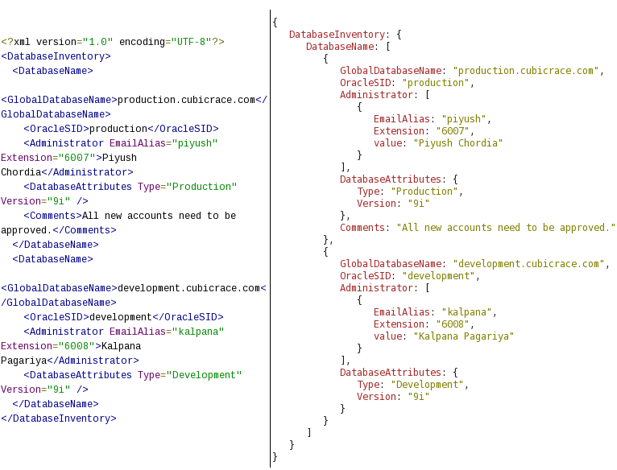

[10. XML <--   ](10.md) [Лекції](README.md) [   --> 12.Керування ідентифікацією і доступом](12.md)

# 11. JSON

## 11.1. Формат JSON

### Синтаксис

**JSON** ([JavaScript Object Notation](https://www.json.org/json-uk.html)) - це стандартний спосіб подання об'єкта JavaScript у вигляді рядку. Він часто використовується у веб-API для відправки та повернення даних а також для їх збереження, і має підтримку не тільки для середовищ JS а і для інших мов та середовищ.  При збереженні файлів їх розширення типово є ".json". Тип MIME при обміні по HTTP з використанням JSON є  "application/json" 

JSON побудований на двох структурах:

- Колекція пар `ключ:значення`. У різних мовах це реалізовано як об’єкт, запис, структура, словник, хеш-таблиця, список із ключем або асоціативний масив. Для JS це представлення об'єкту з його властивостями. 
- Упорядкований список значень. У більшості мов це реалізовано як масив (JS), вектор, список або послідовність.

Усі об'єкти що містять колекцію пар `ключ:значення`  беруться у фігурні дужки. Ось приклад порожнього об'єкту.

```json
{}
```

Властивості об'єкту типу ключ-значення записуються наступним чином:

```json
{"key1" : 23 , 
 "key2" : "24", 
 "key5" : {"key5_1": 37, 
           "key5_2": [123, 124]
          }
}
```

Ключі обов'язково беруться в подвійні лапки.

Масиви записуються з використанням квадратних дужок, в яких перераховуються елементи масиву:

```json
[10, "20", 30.7]
```

У якості елементів масиву можна використовувати різні типи даних: число, рядок, об'єкт, масив, true/false, null. Таким чином масиви та об'єкти можуть включати у свою чергу масиви та об'єкти.

```json
[10, "20", [30, 40], {"key1" : 23 , "key2" : "24"}]
```

Хоч JSON є текстовим представленням об'єктів JS він НЕ може містити в собі: функцій (методів), дати/часу, значення `undefined`. Крім того, він не може містити коментарі.

Якщо значення властивості має тип `string`, то не можна використовувати в середині символи подвійних лапок `"` а зворотня коса  `\` використовується в якості службового символу, що використовується для екранування та символів форматування:

- `"\""` - лапки
- `"\\"` - зворотня коса
- `"\/"` - коса
- `"\b"` - backspace
- `"\f"` - formfeed (зміна сторінки)
- `"\n"` - linefeed (зміна рядка)
- `"\r"` - повернення каретки
- `"\t"` - горизонтальна табуляція
- `"\u"` - для пердставлення Unicode символів в 16-ковій системі, наприклад `\u012A`

### JSON в порівнянні з XML

JSON і XML мають подібне призначення і виконують у більшості випадків однакові функції: 

- можуть читатися однаково як машиною так і людиною  
- мають ієрархічну природу (значення в середині інших значень)
- можуть бути розпарсені і використовуватися в різних мовах та середовищах програмування
- можуть передаватися в тілі повідомлення HTTP

JSON має переваги у своїй компактності, швидкості обробки, використанні окремого синтаксису для масиву і об'єкту. Крім того, у мові JS є вбудований клас `JSON`, який автоматично переводить текст JSON в об'єкт та навпаки (див.11.3), хоча в мові Java в базовий набір включена бібліотека для роботи з XML.  

На відміну від JSON, який є форматом даних, XML є мовою розмітки. Тобто XML є самоописовим документом (а не просто даними), в якому окрім самих даних є: метадані (дані про дані), простори імен, означення схеми. Це дає змогу перевірити документ XML на валідність та використати його в перетворенні в інші форми. Зокрема його можна навіть відобразити в зручній для користувача формі (XHTML), тоді як JSON не призначений для форматування зовнішнього вигляду. Крім того, документ XML може містити коментарі, підтримує більшу кількість типів даних для передачі (хоча все кодується як текст). Отже, хоч XML є набагато старішим форматом, він разом з обробниками надає більше функцій ніж передбачено в JSON.  



рис.11.1. Приклад представлення даних у вигляді документу XML (ліворуч) та JSON (праворуч).

## 11.2. Валідація JSON

Як зазначалося в попередній лекції, при передачі даних важливо, щоб їх структура відповідала очікуваній, інакше розподілена система буде не належним чином функціонувати, або взагалі перестане працювати. Хоч JSON першопочатково розроблений без передбачення валідації, існують певні рішення для цього, наприклад [JSON Schema](https://json-schema.org/). JSON Schema — це інструмент для перевірки структури даних JSON, який наразі є чорновим варіантом, а не стандартом. Остання версія JSON Schema доступна на сайті https://json-schema.org.  Існують також системи реєстрації схем JSON для автоматичної валідації JSON об’єктів в момент передачі даних між системами.

JSON Schema має наступне призначення:

- Описує існуючі формати даних
- Надає чітку документацію, яку можна зчитувати людиною та машиною.
- Перевіряє дані, корисні для:
  - Автоматизованого тестування
  - Забезпечення якості наданих клієнтом даних

Схема JSON означує: 

- media type `application/schema+json` як формат на основі JSON для опису структури даних JSON; 
- вигляд документу JSON; 
- способи отримання з нього інформації та способи взаємодії з ним. 

Розглянемо принципи валідації на прикладі. Припустимо, маємо наступні дані в форматі JSON: 

```json
{
  "subjects": [
    {
      "name": "math",
      "description": "Elementary Math",
      "hours": 25
    },
    {
      "name": "chemistry",
      "description": "Elementary Chemistry",
      "hours": 15
    }
  ],
  "tutors": [
    {
      "type": "main",
      "firstName": "Olexander",
      "lastName": "Olexenko"
    },
    {
      "type": "substitute",
      "firstName": "Roman",
      "lastName": "Romanenko"
    }
  ]
}
```

Припустимо, необхідно описати наведену вище структуру в форматі JSON Schema. Фрагмент схеми може мати вигляд:

```json
{
  "$schema": "http://json-schema.org/draft-04/schema#",
  "$id": "http://iasu-nuft.pp.ua/schemas/schemaexmpl.json",    
  "type": "object",
  "properties": {
    "subjects": {
      "type": "array",
      "items": [
        {"type": "object",
          "properties": {
            "name": {"type": "string"},
            "description": {"type": "string"},
            "hours": {"type": "integer"}
         },
          "required": ["name","description", "hours"]
        }
      ]
    },
    "tutors": {
      "type": "array",
      "items": [ 
      ...
      ]
    }
  },
  "required": [
    "subjects",
    "tutors"
  ]
}
```

Це об'єкт, який має першу властивість `$schema`, яка вказує на версію JSON Schema. Це схоже на посилання на простір імен `xmlns` в XML. Вказуючи на схему Ви означуєте її версію. Крім версійності JSON Schema можна також вказати унікальний ідентифікатор самої схеми, для чого використовується властивість `$id`.

Далі йде властивість `type`, яка означує тип даних для кореневого об'єкту. Доступні такі типи: string, number, integer, object, array, boolean, null. Як видно, на відміну від JS, є окремо типи `array` та `integer`. 

У даному прикладі кореневим елементом є `object`. Тому для нього треба означити властивості, через властивість  `properties`.  Значення `properties`— це об’єкт, де кожен ключ — це ім’я властивості, а кожне значення — це схема, яка використовується для перевірки цієї властивості. Будь-яка властивість, яка не відповідає жодній назві властивості в ключовому слові `properties`, ігнорується цим ключовим словом. У наведеному прикладі кореневий об'єкт має властивості  `subjects` та `tutors`, тому далі йде означення їх схеми. 

За замовчуванням властивості, означені ключовим словом `properties`, не є обов'язковими. Однак можна надати список необхідних властивостей за допомогою ключового слова `required`. Воно приймає масив із нуля або більше рядків, які задають перелік обов'язкових властивостей. У наведеному прикладі властивості  `subjects`  та `tutors` означені як обов'язкові. 

Означення властивості йде за тією ж схемою. Спочатку вказується тип, якщо він  `object`, то далі вказується означення властивостей. Якщо це `array` то вказується вимога до елементів через ключове слово `items` де у вигляді масиву задаються схеми для кожного елменту. Якщо це необ'єктний тип, то на вказівці типу означення може завершитися.    

Наведений вище приклад є демонстраційним і не показує усі можливості JSON Schema. 

## 11.3. JSON об'єкт в JS

Як вже зазначалося для роботи з JSON в JS є вбудований однойменний об'єкт. Він має всього два методи:

- `parse` - для отримання JS об'єкту з JSON 
- `stringify` - для серіалізації об'єкту в JSON

Ось простий приклад для роботи `parse`:

```js
const obj = JSON.parse('{"name":"John", "age":30, "city":"New York", "kids": ["Elvis", "Rita"]}');
console.log (obj.kids.length);//2
```

Інший формат методу:

```js
JSON.parse(text, reviver)
```

де `reviver` - функція яка викликається після парсингу кожного значення для наступної обробки перед поверненням результату. Функція викликається з такими аргументами:

- `key` - ключ, що асоціюється зі значенням       
- `value` - значення після парсингу

Для розуміння послідовності обробки кожного значення можна викликати наступний фргамент коду в JS:

```js
const obj = JSON.parse('{"name":"John", "age":30, "city":"New York", "kids": ["Elvis", "Rita"]}', 
  function (key, value) {console.log (key + ' ' + value)});
```

він виведе наступне:

```
name John
age 30
city New York
0 Elvis
1 Rita
kids ,
[object Object]
```

Як видно, обробка відбувається з кінцевих елементів в напрямку руху до кореневого. Ось приклад використання reviver-функції для обробки дати. 

```js
const text = '{"name":"John", "birth":"1986-12-14", "city":"New York"}';
const obj = JSON.parse(text, function (key, value) {
  if (key == "birth") {
    return new Date(value);
  } else {
    return value;
  }
});
```

Як вже зазначалося, методи (функції) як частина серіалізованого об'єкту не підтримуються в JSON. Але можна їх передавати у вигляді тексту і потім викликати через `eval`, як це показано в наступному прикладі.

```js
var text = `{"name":"John", "birth":"1986-12-14", "city":"New York",
"age":"function () {return ((new Date() - new Date(this.birth))/(365*24*60*60000))}"}` 
const obj = JSON.parse(text);
obj.age = eval("(" + obj.age + ")");
console.log (obj.age());
```

Метод `stringify` перетворює об'єкт JS в рядок. Наприклад:   

```js
const obj = {name: "John", age: 30, city: "New York", kids: ["Elvis", "Rita"]};
const myJSON = JSON.stringify(obj);
```

Значення `undefined`, `Function` і `Symbol` не є дійсними значеннями JSON. Якщо такі значення зустрічаються під час перетворення, вони або пропускаються (якщо знайдено в об’єкті), або змінюються на `null` (якщо знайдено в масиві). Наприклад даний код в JS/GAS виведе те, що вказано в коментарі:

```js
const obj = {name:"John", 
birth:"1986-12-14", 
city:"New York",
age: function () {return ((new Date() - new Date(this.birth))/(365*24*60*60000))}
}
const myJSON = JSON.stringify(obj);
console.log (myJSON); // виведе {"name":"John","birth":"1986-12-14","city":"New York"}
```

Натомість можна скористатися методом `toString ()`:

```js
const obj = {name:"John", 
birth:"1986-12-14", 
city:"New York",
age: function () {return ((new Date() - new Date(this.birth))/(365*24*60*60000))}
}
obj.age = obj.age.toString();
const myJSON = JSON.stringify(obj);
console.log (myJSON);
//виведе {"name":"John","birth":"1986-12-14","city":"New York","age":"function () {return ((new Date() - new Date(this.birth))/(365*24*60*60000))}"}
```

Метод `stringify` має ще дві форми виклику:

```js
JSON.stringify(value, replacer)
JSON.stringify(value, replacer, space)
```

де:

-  `replacer` - це замінник що є функцією або масивом, які змінюють поведінку процесу серіалізації. Якщо замінник є масивом елементів `string` то їх значення буде використовуватися як назва ключів, які будуть використовуватися при серіалізації об'єкту, тобто значення інших властивостей не будуть серіалізуватися.  Якщо це буде функція, то вона приймає два параметри: ключ і значення, яке перетворюється в string. Об’єкт, у якому було знайдено ключ, надається як замінник цього контексту. 
- `space` - рядок або число, яке використовується для вставлення пробілів або інших символів (включно з відступами, символами розриву рядка тощо) у вихідний рядок JSON для зручності читання. Якщо це число, воно вказує кількість символів пробілу, які будуть використовуватися як відступи (від 0 до 10). Якщо це рядок то перші 10 символів рядка вставляється перед кожним вкладеним об’єктом або масивом. 

Нижче наведений приклад використання `replacer` як масиву:

```js
const foo = {foundation: "Mozilla", model: "box", week: 45, transport: "car", month: 7};
console.log (JSON.stringify(foo, ["week", "month"]));// {"week":45,"month":7}
```

Наступний фрагмент коду `replacer` як функції:

```js
const foo = {ob: {a:1, b:2}, model: "box", week: 45, transport: "car", month: 7};
let jsonrez = JSON.stringify(foo, function (key, value) { 
  console.log (key + ' = ' + value);
  if (typeof value === "string") {
    return undefined;
  }
  return value});
console.log (jsonrez); 
```

поверне такий результат:

```
 = [object Object]
ob = [object Object]
a = 1
b = 2
model = box
week = 45
transport = car
month = 7
{"ob":{"a":1,"b":2},"week":45,"month":7}
```

Як видно,  `replacer` повертає значення властивостей об'єкту починаючи з кореня, тому перший вивід вивів пусте значення назви ключа.

У наступному фрагменті використовується аргумент `space` 

```js
console.log(JSON.stringify({a:1, c:[1,[2,3]]}));
console.log(JSON.stringify({a:1, c:[1,[2,3]]}, null, 1));
console.log(JSON.stringify({a:1, c:[1,[2,3]]}, null, ">"));
```

Він видає наступний результат:  

```
{"a":1,"c":[1,[2,3]]}
{
 "a": 1,
 "c": [
  1,
  [
   2,
   3
  ]
 ]
}
{
>"a": 1,
>"c": [
>>1,
>>[
>>>2,
>>>3
>>]
>]
}
```

## 11.4. JSONata

[JSONata](https://jsonata.org/) — це мова запитів і перетворення даних JSON, яка була розроблена за натхнення семантики XPath, яка розглядалася на минулій лекції. JSONata дозволяє виражати складні запити на вибірку в компактній та інтуїтивно зрозумілій нотації. Основна ідея в тому щоб з вихідних даних JSON отримати необхідні дані, перетворити їх у потрібну форму (об'єднати, скомпонувати) і видати результат. Для підтримки вилучення значень зі структури JSON означений синтаксис шляху розташування. Це дозволяє вибрати всі можливі значення в документі, які відповідають вказаному шляху розташування (location path). 

Для розуміння роботи JSONata можна перевірити наведені приклади, перейшовши на сайт http://try.jsonata.org/ . У вікні ліворуч можна вибрати приклад вихідного документу зі списку, або вписати свій. У якості типового прикладу в лекції буде використовуватися Address.

### Прості запити на вибірку

У якості прикладу розглянемо наступний вихідний документ (вибирається на  http://try.jsonata.org/ як Address):

```json
{
  "FirstName": "Fred",
  "Surname": "Smith",
  "Age": 28,
  "Address": {"Street": "Hursley Park", "City": "Winchester", "Postcode": "SO21 2JN"},
  "Phone": [
    {"type": "home", "number": "0203 544 1234"},
    {"type": "office", "number": "01962 001234"},
    {"type": "office","number": "01962 001235"},
    {"type": "mobile","number": "077 7700 1234"}
  ],
  "Email": [
    {"type": "work", "address": ["fred.smith@my-work.com", "fsmith@my-work.com"]},
    {"type": "home", "address": ["freddy@my-social.com", "frederic.smith@very-serious.com"]}
  ],
  "Other": { "Over 18 ?": true, "Misc": null, "Alternative.Address": { "Street": "Brick Lane", "City": "London", "Postcode": "E1 6RF"}
  }
}
```

Для вказівки шляху розташування необхідно використовувати синтаксис пошуку об'єктів, їх властивостей, масивів та їх елементів. Пошук починається з кореневого об'єкту, до якого за необхідності можна звернутися через `$$`. Тому, якщо в шляху вказати якесь слово, буде шукатися властивість в кореневому об'єкті. Якщо потрібно знайти щось у включеному об'єкті, то необхідно прописати шлях доступу до нього. Якщо потрібно вказати елемент масиву, до нього йде звернення аналогічно як в JS, наприклад `Phone[0]`. Якщо звернення йде до назви масиву, або не вказується індекс, повертаються усі елементи масиву. Негативне значення індексу в масиві шукає значення відраховане з кінця, наприклад `arr[-1]` бере останній елемент, а `arr[-2] ` - бере передостанній.  При пошуку полів з пробілами вони вказуються в спеціальних лапках ` `` `.    

У таблиці 11.1 показні прості приклади задавання пошуку в ``JSONata``. 

Таблиця 11.1.

| **JSONata**       | **Result**                                       |
| ----------------- | ------------------------------------------------ |
| `Surname`         | `"Smith"`                                        |
| `Age`             | `28`                                             |
| `Age[0]`          | `28`                                             |
| `Address.City`    | `"Winchester"`                                   |
| `Other.Misc`      | `null`                                           |
| `Other.Over 18 ?` | `true`                                           |
| `Phone[0]`        | `{ "type": "home", "number": "0203 544 1234" }`  |
| `Phone[-2]`       | `{ "type": "office", "number": "01962 001235" }` |
| `Phone[8]`        | *undefined*                                      |
| `Phone[0].number` | `"0203 544 1234"`                                |

Слід зазначити, що пошук відбувається рекурсивно. Тобто, якщо задати в пошуку назву масиву об'єктів, і при цьому звертатися до властивості цих об'єктів, то результатом буде масив властивостей усіх елементів масиву. Це можна представляти так: спочатку пошук поверне масив усіх об'єктів, а потім зробить пошук у кожному елементі потрібних властивостей і поверне їх в цьому масиві замість всього об'єкту. У таблиці 11.2 показаний приклад такого звернення `Phone.number`.

За цією ж ідеєю можна звернутися до елементу з поверненого результату. У таблиці 11.2 показаний приклад такого звернення `(Phone.number)[0]`, який можна пояснити так:

- вибираємо усі елементи `Phone` -> масив об'єктів `Phone` 
- вибираємо з кожного елементу `Phone` властивість `number` -> масив `Phone.number` 
- вибираємо 0-й елемент з `Phone.number` 

Але зверніть увагу, що в даному прикладі `Phone.number` треба поставити в дужки `()` для пріоритизації послідовності пошуку. Інакше, якщо звернутися як `Phone.number[0]`, то алгоритм буде наступний:

- вибираємо усі елементи `Phone` -> масив об'єктів `Phone` 
- вибираємо з кожного елементу `Phone` властивість `number[0]` -> масив `Phone.number` 

Хоч `number` в `Phone` не є формально масивом, звернення до 0-го елементу аналогічно зверненню до самого елементу. Тобто у виразі або підвиразі JSONata будь-яке значення яке не є масивом і масив, що містить тільки це значення, вважаються еквівалентними. Це дозволяє складати композицію таким чином, щоб шляхи розташування, які витягують одне значення з об'єктів і шляхи розташування, які витягують декілька значень з масивів, можуть бути використані як вхідні дані для інших виразів без використання іншого синтаксису для двох форм. 

Таблиця 11.2.

| **JSONata**         | **Result**                                                   |
| ------------------- | ------------------------------------------------------------ |
| `Phone.number`      | `[ "0203 544 1234", "01962 001234", "01962 001235", "077 7700 1234" ]` |
| `(Phone.number)[0]` | `"0203 544 1234"`                                            |
| `Phone.number[0]`   | `[ "0203 544 1234", "01962 001234", "01962 001235", "077 7700 1234" ]` |

На кожному рівні такого пошуку ми маємо певний результат, який називається контекстом і позначається як `$` . На самому початку контекстом є весь документ, і як вже зазначалося, він має також спеціальне позначення `$$`. Це легко перевірити, вписавши ці символи в  http://try.jsonata.org/ . Обидві ці системні змінні можна використовувати для організації складніших запитів. Однак, коли кореневим елементом є масив, звернутися до його елементу можна тільки через них.   

Візьмемо приклад:

```json
[{ "ref": [ 1,2 ] },{ "ref": [ 3,4 ] }]
```

Якщо ми хочемо вибрати перший (0-й) об'єкт у цьому масиві, то необхідно вказати назву об’єкту верхнього рівня, до якого треба додати [0]. Ми не можемо використовувати [0] самостійно, тому що стикаємося з синтаксисом конструктора масиву. Однак, ми можемо використовувати посилання контексту `$` для посилання на початок документа наступним чином (таблиця 11.3)

Таблиця 11.3.

| **JSONata**     | **Result**           | **Коментар**                                                 |
| --------------- | -------------------- | ------------------------------------------------------------ |
| `$[0]`          | `{ "ref": [ 1,2 ] }` | `$` на початку виразу відноситься до всього вхідного документа |
| `$[0].ref`  ` ` | `[ 1,2 ] `  ` `      | `.ref` тут повертає  весь внутрішній масив                   |
| `$[0].ref[0]`   | `1`                  | повертає елемент на  першу позицію внутрішнього масиву       |
| `$.ref`         | `[ 1, 2, 3, 4 ]`     | Незважаючи на  структуру вкладеного масиву, результуючий вибір сплющується в один плоский  масив. Початкова вкладена структура вхідних масивів втрачається. |

### Предикативні запити 

На будь-якому кроці шляху розташування виділені елементи можуть бути відфільтровані за допомогою **предиката** - `[expr]`, де `expr` аналізується як вираз, що повертає булеве значення. Кожен елемент у виділенні перевіряється як вираз, якщо він дорівнює `true`, то елемент залишається у виділенні, якщо `false`, він видаляється з виділення. Вираз оцінюється відносно поточного (контекстного) елемента, що перевіряється, тому, якщо вираз предиката виконує навігацію, то вона проводиться відносно цього контексту. У таблиці 11.4 показні приклади предикатів. Можна перевірити ці приклади, перейшовши на сайт `http://try.jsonata.org/ (виберіть приклад Address).

Приклад:

```json
{"Phone": [
    {"type": "home", "number": "0203 544 1234"},
    {"type": "office","number": "01962 001234"},
    {"type": "office","number": "01962 001235"},
    {"type": "mobile","number": "077 7700 1234"}]
}
```

Таблиця 11.4.

| **JSONata**                      | **Result**                                        |
| -------------------------------- | ------------------------------------------------- |
| `Phone[type='mobile'] `          | `{"type": "mobile", "number": "077 7700 1234" } ` |
| `Phone[type='mobile'].number`    | `"077 7700 1234"`                                 |
| `Phone[type='office'].number`` ` | `["01962 001234", "01962 001235"] `               |

Як вже зазначалося у виразі або підвиразі JSONata будь-яке значення (яке не є масивом) і масив, що містить тільки це значення, вважаються еквівалентними.  Наприклад (див вихідний текс JSON вище):

- `Address.City` повертає `"Winchester"`
- `Phone[0].number`  повертає `"0203 544 1234"`
- `Phone[type='home'].number`  повертає `"0203 544 1234"`
- `Phone[type='office'].number` повертає`["01962 001234", "01962 001235"]`

При наступній обробці поверненого з вираження JSONata значення, може бути бажаним мати результати в узгодженому форматі, незалежно від того, скільки співпадінь було і відповідно який формат поверненого значення (масив або одне значення). У перших двох виразах вище, очевидно, що кожен вираз звертається до одного значення в структурі і має сенс повернути саме це значення. В останніх двох виразах, однак, не є очевидним, скільки значень буде повернено, тому при наступній обробці прийдеться враховувати різні формати, що не є зручним. Для таких випадків вираз можна змінити таким чином, щоб повернути масив, навіть якщо збігається лише одне значення. Це робиться шляхом додавання порожніх квадратних дужок `[]` до кроку в шляху розташування. Наведені вище приклади можуть бути переписані так, щоб завжди повертати масив, це виглядає наступним чином:

- `Address[].City` повертає `[ "Winchester"]`
- `Phone[0][].number` повертає `[ "0203 544 1234" ]`
- `Phone[][type='home'].number` повертає `[ "0203 544 1234" ]`
- `Phone[type='office'].number[] `повертає `[ "01962 001234", "01962 001235" ]`

Зауважимо, що `[]` можна розмістити у будь-якому місці предикатів і на будь-якому кроці вираження шляху

Для вибору всіх полів в об'єкті можна використовувати `*` замість імені поля. У таблиці 11.5 показні приклади предикату `*`. Можна перевірити ці приклади, перейшовши на сайт http://try.jsonata.org/ (виберіть приклад Address). Приклад:

```json
{
  "FirstName": "Fred",
  "Surname": "Smith",
  "Age": 28,
  "Address": {
    "Street": "Hursley Park",
    "City": "Winchester",
    "Postcode": "SO21 2JN"
  }
}
```

 Таблиця 11.5.

| **JSONata**   | **Result**                                      |
| ------------- | ----------------------------------------------- |
| `Address.*`   | `[ "Hursley Park", "Winchester", "SO21 2JN" ] ` |
| `*.Postcode ` | `"SO21 2JN" `                                   |

Шаблон нащадка `**` замість `*` буде відбирати всіх нащадків (багаторівневий шаблон). Для прикладу з таблиці 11.1 

`**.Postcode` поверне `[ "SO21 2JN", "E1 6RF" ]`

### Вирази та оператори

У виразах шляху можна використовувати літеральні константи, помістивши символи в лапки: подвійні `"` або одинарні `'` (як і рядки JSON). Рядки можна комбінувати за допомогою оператора конкатенації `&`, цей оператор поєднує два рядки, які повертаються виразами. Це єдиний оператор, який намагатиметься збирати операнди разом до очікуваного рядкового типу. У таблиці 11.6 показні приклади оператору `&`. Можна перевірити ці приклади, перейшовши на сайт http://try.jsonata.org/ (виберіть приклад Address).  Приклад:

```json
{
  "FirstName": "Fred",
  "Surname": "Smith",
  "Age": 28,
  "Address": {
    "Street": "Hursley Park",
    "City": "Winchester",
    "Postcode": "SO21 2JN"
  }
}
```

Таблиця 11.6.

| **JSONata**                       | **Result**                    |
| --------------------------------- | ----------------------------- |
| `FirstName & ' ' & Surname`       | `"Fred Smith" `               |
| `Address.(Street & ', ' & City) ` | `"Hursley Park, Winchester" ` |
| `5&0&true `                       | `"50true"`                    |

Вирази шляхів, які вказують на числове значення, повернуть це значення як числовий тип. JSONata також може використовувати числові контстанти за тими ж правилами, що і для JSON-чисел. Числові літетерали та вирази можуть бути використані в розрахунках результатів з використанням звичайних математичних операторів. Підтримувані оператори:

- `+` додавання
- `-` віднімання
- `*` множення
- `/` ділення
- `%` остача від ділення 

У таблиці 11.7 показні приклади арифметичних операторів. Можна перевірити ці приклади, перейшовши на сайт `http://try.jsonata.org/ (скопіюйте приклад в поле Exerciser).   Приклад:

  ```json
{ "Numbers": [1, 2.4, 3.5, 10, 20.9, 30] }
  ```

Таблиця 11.7.

| **JSONata**                 | **Result**       | **Коментар**       |
| --------------------------- | ---------------- | ------------------ |
| `Numbers[0] + Numbers[1]`   | `3.4`            | додати 2 числа     |
| `Numbers[0] - Numbers[4]`   | `-19.9`          | віднімання         |
| `Numbers[0] * Numbers[5]`   | `30`             | множення           |
| `Numbers``[0] / Numbers[4]` | 0.04784688995215 | ділення            |
| `Numbers``[2] % Numbers[5]` | 3.5              | остача від ділення |

В предикатах можна використоувати оператори порівняння двох значень, які повертають логічні значення `true` або `false`. Підтримувані оператори:

- `=` дорівнює
- `!=` не дорівнює
- `<` менше ніж
- `<=` менше ніж чи дорівнює
- `>` більше ніж
- `>=` більше або дорівнює ніж
- `in` значення міститься в масиві

Для об'єднання булевих результатів для підтримки більш складних предикатних виразів можна використати булеві оператори:

- `and`
- `or`

Зверніть увагу, що `not` підтримується як функція ([$not](http://docs.jsonata.org/boolean-functions#not)), а не оператор. У таблиці 11.8 показні приклади булевих виразів. Можна перевірити ці приклади, перейшовши на сайт `http://try.jsonata.org/ (скопіюйте приклад в поле Exerciser). Таблиця 11.8.

```json
{"Numbers": [1, 2.4, 3.5, 10, 20.9, 30]}
```

| **JSONata**                                         | **Result** |
| --------------------------------------------------- | ---------- |
| `(Numbers[2]  != 0) and (Numbers[5] != Numbers[1])` | *false*    |
| `(Numbers[2]  != 0) or (Numbers[5] = Numbers[1])`   | *true*     |

### Структурування результату 

Окрім вибірки значень JSONata дає можливість компонування кількох результатів в один масив або об'єкт.

Як зазначалося раніше, якщо шлях розташування у вхідному документі відповідає декільком значенням, ці значення повертаються як масив. Значення у документі можуть бути як об'єктами так і масивами, але значення що повертаються знаходяться на верхньому рівні у вигляді масиву.

Можна побудувати додаткову структуру в результуючому масиві, вказавши у виразі шляху розташування конструктор масивів (або об'єктів). У будь-якій точці шляху розташування, де очікується посилання на поле, можна вставити пару квадратних дужок `[]`, щоб вказати, що результати вираження в цих дужках повинні міститися в новому масиві на виході. Коми використовуються для розділення декількох виразів у конструкторі масиву. У таблиці 11.9 показні приклади конструкторів масивів. Можна перевірити ці приклади, перейшовши на сайт `http://try.jsonata.org/ (виберіть приклад Address).   

```json
{
  "FirstName": "Fred",
  "Surname": "Smith",
  "Age": 28,
  "Address": {"Street": "Hursley Park", "City": "Winchester", "Postcode": "SO21 2JN"},
  "Email": [
    {"type": "work","address": ["fred.smith@my-work.com", "fsmith@my-work.com"]},
    {"type": "home","address": ["freddy@my-social.com", "frederic.smith@very-serious.com"]}
  ],
  "Other": {"Over 18 ?": true,"Misc": null, "Alternative.Address": {"Street": "Brick Lane","City": "London", "Postcode": "E1 6RF"}}
}
```

Таблиця 11.9.

| **JSONata**                                   | **Result**                                                   | **Коментар**                                                 |
| --------------------------------------------- | ------------------------------------------------------------ | ------------------------------------------------------------ |
| `Email.address `                              | `[   "fred.smith@my-work.com",   "fsmith@my-work.com",   "freddy@my-social.com", "frederic.smith@very-serious.com"  ]` | Чотири адреси електронної пошти повертаються в плоскому масиві |
| `Email.[address]`                             | `[  [ "fred.smith@my-work.com", "fsmith@my-work.com" ],  [ "freddy@my-social.com", "frederic.smith@very-serious.com" ]  ]` | Кожен об'єкт  електронної пошти генерує масив адрес          |
| `[Address, Other.Alternative.Address].City` ` | `[ "Winchester", "London" ]`                                 | Вибирає значення `City`   як з об’єкту `Address`  так і з `Alternative.Address`. |

Подібно до того, як можна побудувати масиви, так само можуть бути побудовані на виході об'єкти JSON. У будь-якій точці шляху розташування, де очікується посилання на поле, можна використати пару фігурних дужок `{}`, що містять пари ключ/значення, розділені комами, з кожним ключем і значенням, розділеними двокрапкою: `{key1: value2, key2: value2}`. Ключі та значення можуть бути літералами або можуть бути виразами. Ключ повинен бути або рядком, або виразом, який оцінюється до рядка.               

Коли за виразом, що вибирає кілька значень, йде конструктор об'єктів, той створить єдиний об'єкт з парою ключ/значення для кожного з цих значень контексту. Якщо потрібний масив об'єктів (один для кожного значення контексту), то конструктор об'єкта повинен  слідувати за точкою `.` . У таблиці 11.10 показні приклади конструкторів об’єктів. Можна перевірити ці приклади, перейшовши на сайт `http://try.jsonata.org/ (виберіть приклад Address).

```json
{"Phone": [
    {"type": "home", "number": "0203 544 1234"},
    {"type": "office","number": "01962 001234"},
    {"type": "office","number": "01962 001235"},
    {"type": "mobile", "number": "077 7700 1234"}]
}
```

Таблиця 11.10.

| **JSONata**                | **Result**                                                   | **Коментар**                                                 |
| -------------------------- | ------------------------------------------------------------ | ------------------------------------------------------------ |
| `Phone.{type: number} `    | `[   { "home": "0203 544 1234" },    { "office": "01962 001234" },    { "office": "01962 001235" },    { "mobile": "077 7700 1234" }   ]` | Створює масив об'єктів (по одному для кожного телефону).     |
| `Phone{type: number}`  ` ` | `{   "home": "0203 544 1234",   "office": [    "01962 001234",    "01962 001235"   ],   "mobile": "077 7700 1234"  }`  ` ` | Об'єднує пари ключ/значення  в один об'єкт. Докладніше див.` [Grouping using object key expression](http://docs.jsonata.org/sorting-grouping) |
| `Phone{type: number[]} `   | `{   "home": [    "0203 544 1234"   ],   "office": [    "01962 001234",    "01962 001235"   ],   "mobile": [    "077 7700 1234"   ]  }`  ` ` | Об'єднує пари ключ/значення  в один об'єкт. У цьому випадку для узгодженості всі числа групуються в  масиви. Див. [Singleton array and value   equivalence](http://docs.jsonata.org/predicate#singleton-array-and-value-equivalence). |

### Інші можливості

JSONata дуже багата мова, опис якої не може влізти в одну лекцію. Тут оглядово наведемо деякі інші її можливості.

У JSONata все є виразами (*expression*). Вираз містить значення (*values*), функції (*functions*) та оператори (*operators*), які при оцінюванні (*evaluated*) виробляють результуюче значення. Функції та оператори застосовуються до тих значень, які в свою чергу самі можуть бути результатами оцінювання під-виразів. Таким чином, мова передбачає складені (ієрархічні) вирази. У виразах JSONata можуть бути використані коментарі з використанням синтаксису стилю мови «C».

JSONata підтримує умовні конструкції подібно до JS:

```json
predicate ? expr1 : expr2
```

Будь які назви, що починаються з знаку `$` є змінними. Змінна – це поіменоване посилання на значення. Значення може бути одним із будь-яких типів серед системних типів. Є також вбудовані в JSONata змінні:

- `$` - змінна без імені посилається на значення контексту у будь якій точці вхідної ієрархії JSON.
- `$$` - корінь входу JSON. Тільки потребується у випадках для виходу з теперішнього контексту для     тимчасового переходу вниз в інший шлях. Наприклад для перехресного посилання     або об’єднання даних.  

Окрім операторів JSONata має багато різноманітних вбудованих функцій, які як і змінні також починаються з символу `$`. Зокрема доступні функції для роботи з рядками, числами, об'єктами, масивами, датою/часом, агрегування та іншими. Можна створювати власні функції, які можуть бути збережені в змінних подібно іншим типам.  Підтримуються регулярні вирази.

Ось приклад програми на JSONata яка навіть не потребує вхідних даних. Можна спробувати його на https://try.jsonata.org/

```json
/* Довгі вирази можуть потребувати певного пояснення */
(
  $pi := 3.1415926535897932384626;
  /* JSONata не відомий своєю підтримкою графіки! */
  $plot := function($x) {(
    $floor := $string ~> $substringBefore(?, '.') ~> $number;
    $index := $floor(($x + 1) * 20 + 0.5);
    $join([0..$index].('.')) & 'O' & $join([$index..40].('.'))
  )};
  /* Факторіал — це добуток цілих чисел 1..n */
  $product := function($a, $b) { $a * $b };
  $factorial := function($n) { $n = 0 ? 1 : $reduce([1..$n], $product) };
  $sin := function($x){ /* визначає синус через косинус */
    $cos($x - $pi/2)
  };
  $cos := function($x){ /* Виводить косинус шляхом розкладання в ряд Тейлора */
    $x > $pi ? $cos($x - 2 * $pi) : $x < -$pi ? $cos($x + 2 * $pi) :
      $sum([0..12].($power(-1, $) * $power($x, 2*$) / $factorial(2*$)))
  };
  [0..24].$sin($*$pi/12).$plot($)
)
```

## Контрольні питання

1) Розкажіть про призначення та синтаксис JSON.
2) Розкажіть про особливості форматування JSON в порівнянні з об'єктами JS.
3) Розкажіть про відмінності та схожості в JSON та XML.
4) Розкажіть про необхідність валідації в JSON. Розкажіть про основні принципи JSON Schema.
5) Покажіть на прикладі побудову JSON Schema.
6) Розкажіть про роботу `JSON.parse` в JS.
7) Розкажіть про роботу `JSON.stringify` в JS.
8) Яке призначення і основні ідеї JSONata? Яку аналогічну технологію можна привести для XML?
9) Як в JSONata організовано прості запити на вибірку: доступ до об'єктів, їх властивостей, масивів і їх елементів? Продемонструйте на прикладах.
10) Що таке контекст в JSONata? Як звернутися до контексту і до всього документу, незалежно від контексту?
11) Наведіть приклад предикативних запитів в JSONata.
12) Наведіть приклад виразів в JSONata з використанням різних типів операторів.
13) Наведіть приклади структурування результатів в JSONata.

## Посилання на відеозаписи лекцій

- [Запис Л11. JSON](https://youtu.be/Jz4WG5g4I4U?si=J4O9D7sA7b2iYXCP)
- [XML і JSON. Гостьова лекція від Льва Ваняна](https://www.youtube.com/embed/ppX_0cApQZQ?start=4247)
