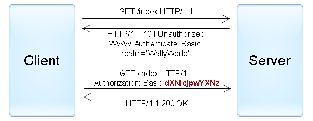
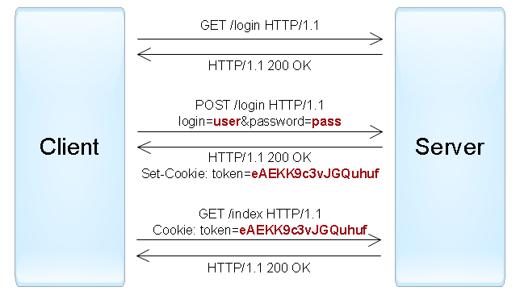
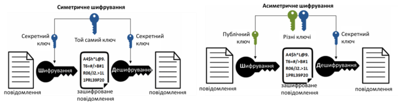
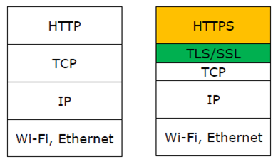
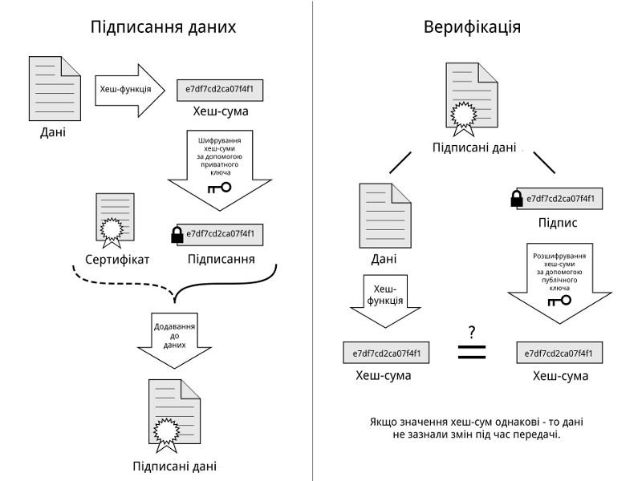
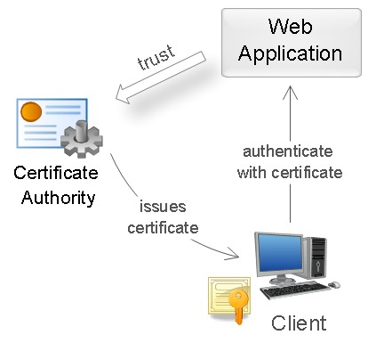
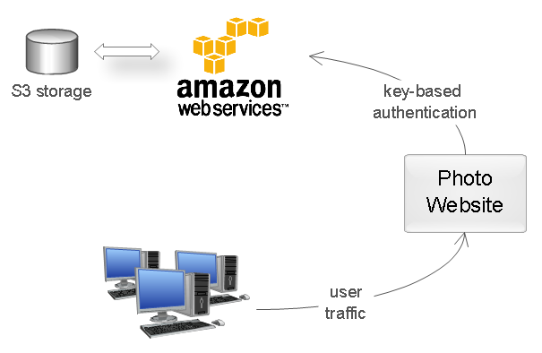
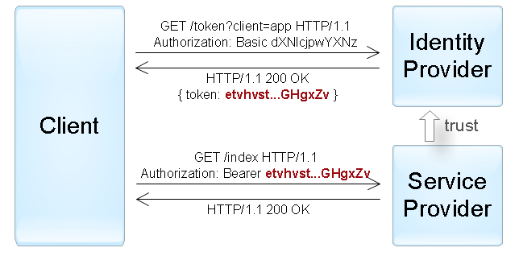
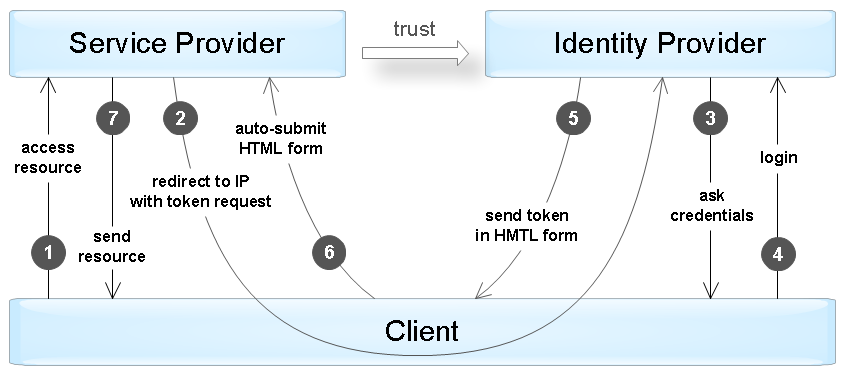
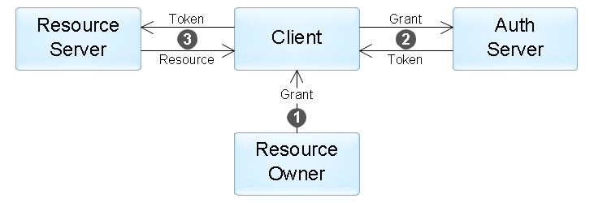

[11. JSON <--   ](11.md) [Лекції](README.md) [   --> 13. Хмарні технології ](13.md)

# 12. Керування ідентифікацією і доступом

При обміні даними та використання сервісів в розподілених застосунках велика увага приділяється захисту інформації. У цій лекції розглянемо основи керування ідентифікацією і доступом у розподілених системах що будуються на базі обміну по HTPP. 

## 12.1. Процедури керування ідентифікацією та доступом (ІАМ) 

Керування ідентифікацією та доступом [Identity and Access Management](https://en.wikipedia.org/wiki/Identity_management) -  це набір політик та технологій для забезпечення доступу певних людей та/або застосунків до певних ресурсів. Системи керування ідентифікацією та доступом зокрема ідентифікують, підтверджують автентичність та надають дозволи до конкретних ресурсів.

- **Ідентифікація** - це процедура розпізнавання користувача в системі. У залежності від ситуацій, це може бути зроблено за іменем користувача (`username` ), адресою електронної пошти, номером облікового запису, і тд.

- **Автентифікація** - процедура встановлення, що користувач насправді є тим, ким ідентифікувалися (від слова "authentic" - істинний, справжній). Це можна зробити, наприклад за перевіркою паролю.
- **Авторизація** - перевірка, що користувачу дозволено доступ до запитуваного ресурсу. 

Також до IAM відносяться процедури означення доступу.  У сучасних системах існують як прості схеми автентифікації за іменем користувача та паролем, так і більш складні. У цій лекції розглядаються найбільш вживані.

Слід розуміти що до ВЕБ-застосунків можуть доступатися як користувачі так і інші застосунки. При цьому як правило ті ж самі застосунки використовують різні способи автентифікації для одних та інших.  

## 12.2. Автентифікація користувачів за паролем

Наведені нижче схеми використовуються як правило для автентифікації користувачів (людей) а не сервісів чи застосунків.  Цей метод грунтується на тому, що для успішної ідентифікації і автентифікації в системі користувач повинен надати ім'я (`username`) і пароль (`password`). Пара імені та паролю задається користувачем при його реєстрації в системі, при цьому в якості імені може виступати і адреса електронної пошти користувача. Стосовно веб-застосунків існує кілька стандартних протоколів для автентифікації за паролем, які розглянуто нижче.

### HTTP автентифікація

Цей протокол існує дуже давно, він описаний ще в стандартах HTTP 1.0/1.1, але до цих пір активно застосовується в корпоративному середовищі. Стосовно веб-сайтів він працює наступним чином:

1. Сервер, при зверненні неавторизованого клієнта до захищеного ресурсу, відсилає HTTP статус "401 Unauthorized" і додає заголовок "WWW-Authenticate" із зазначенням схеми і параметрів автентифікації.
2. Браузер, при отриманні такої відповіді, автоматично показує діалог введення користувача і паролю. Користувач вводить деталі свого облікового запису.
3. У всіх наступних запитах до цього веб-сайту браузер автоматично додає HTTP заголовок "Authorization", в якому передаються дані користувача для аутентифікації сервером.
4. Сервер аутентифікує користувача за даними з цього заголовку. Рішення про надання доступу (авторизація) проводиться окремо на підставі ролі користувача, ACL або інших даних облікового запису.

Весь процес стандартизований і добре підтримується всіма браузерами і веб-серверами. Існує кілька схем аутентифікації, що відрізняються за рівнем безпеки. **Basic** —  найбільш проста схема, при якій `username` і `password` користувача передаються в заголовку `Authorization` в незашифрованому вигляді (`base64-encoded`). Однак при використанні HTTPS (HTTP over SSL) протоколу ця схема є відносно безпечною.
  		
  		рис. 12.1. Приклад HTTP автентификації з використанням Basic схеми.  	

Більш захищеною є схема **Digest**, у якій сервер посилає унікальне значення `nonce`, а браузер передає хеш пароля користувача (зашифрований пароль), обчислений з використанням зазначеного `nonce`. Це більш безпечна альтернатива Basic схеми при незахищених з'єднаннях, але схильна до атак типу man-in-the-middle (людина всередині). Крім того, використання цієї схеми не дозволяє застосувати сучасні хеш-функції для зберігання паролів користувачів на сервері. У системах Windows також використовуються схеми NTLM та Negotiate, які підтримуються більшістю браузерів і веб-серверів для Windows Active Directory.

Варто відзначити, що при використанні HTTP-аутентифікації у користувача немає стандартної можливості вийти з веб-застосунку, крім як закрити всі вікна браузера.

### Автентифікація через форму

Для цього протоколу немає певного стандарту, тому всі його реалізації специфічні для конкретних систем, а точніше, для модулів аутентифікації. Цей спосіб працює це за наступним принципом: в веб-застосунок включається HTML-форма, в яку користувач повинен ввести своє ім'я та пароль. Вони відправляються на сервер через HTTP метод `POST` для аутентифікації. У разі успіху веб-застосунок створює маркер сесії (`session token`), який зазвичай поміщається в браузерні куки (`cookies`) . При наступних веб-запитах маркер сесії автоматично передається на сервер і дозволяє застосунку отримати інформацію про поточного користувача для авторизації запиту.

  
рис. 12.2. Приклад автентифікації через форму.

Необхідно розуміти, що перехоплення маркерів сесії часто дає аналогічний рівень доступу, як і знання імені користувача та паролю. Тому всі комунікації між клієнтом і сервером повинні проводитися тільки по захищеному з'єднанню HTTPS.

### Інші протоколи автентификації по паролю

Два протоколи, описані вище, успішно використовуються для аутентифікації користувачів на веб-сайтах. Але при розробці клієнт-серверних застосунків з використанням веб-сервісів (наприклад, iOS або Android), поряд з HTTP-автентифікацією, часто застосовуються нестандартні протоколи, в яких дані для автентифікації передаються в інших частинах запиту. Існує всього декілька місць, де можна передати ім'я і пароль користувача в HTTP запитах:

- URL запиту - вважається небезпечним варіантом, так як рядки URL можуть запам'ятовуватися браузерами, проксі і веб-серверами.
- Тіло запиту (body) - безпечний варіант, але він застосовується лише для запитів, що містять тіло повідомлення (такі як POST, PUT, PATCH).
- HTTP-заголовки - оптимальний варіант, при цьому можуть використовуватися і стандартний заголовок Authorization (наприклад, з Basic-схемою), так і інші довільні заголовки.

### Поширені вразливості і помилки реалізації

Автентифікації за паролем вважається не дуже надійним способом, так як паролі часто можна підібрати, а користувачі схильні використовувати прості і однакові паролі в різних системах, або записувати їх на клаптиках паперу. Якщо зловмисник зміг з'ясувати пароль, то користувач часто про це навіть не дізнається. Крім того, розробники застосунків можуть допустити ряд концептуальних помилок, що спрощують взлом облікових записів. Нижче наведений список вразливостей, які найбільш часто зустрічаються у разі використання автентифікації за паролем, а саме коли веб застосунок:

- дозволяє користувачам створювати прості паролі.
- не захищений від можливості перебору паролів (brute-force attacks).
- сам генерує і поширює паролі користувачам, однак не вимагає зміни пароля після першого входу (тобто поточний пароль десь записаний).
- допускає передачу паролів по незахищеному HTTP-з'єднанню або в рядку URL.
- не використовує безпечні хеш-функції (методи шифрування) для зберігання паролів користувачів.
- не надає користувачам можливості зміни пароля або не повідомляє користувачам про зміну їх паролів.
- використовує вразливу функцію відновлення пароля, яку можна використовувати для отримання несанкціонованого доступу до інших облікових записів.
- не вимагає повторної автентифікації користувача для важливих дій: зміна пароля, зміни адреси доставки товарів і т.п.
- створює сесійні маркери таким чином, що вони можуть бути підібрані або передбачені для інших користувачів.
- допускає передачу сесійних маркерів по незахищеному HTTP-з'єднанню, або в рядку URL.
- вразливий для session fixation-атак (тобто не замінює сесійний ключ при переході анонімної сесії користувача в автентифіковану).
- не встановлює прапорці HttpOnly і Secure для browser cookies, що містять сесійні ключі.
- не знищує сесії користувача після короткого періоду неактивності або не надає функцію виходу з автентифікованої сесії.

## 12.3. Захищені протоколи передачі даних

Вище розглядалися питання автентифікації, які передбачали що тільки користувачу буде відомий пароль. Однак, як вже зазначалося, якщо трафік прослуховується, наприклад сніфером типу Wire Shark, то ці дані легко отримати зловмиснику. Крім того, якщо трафік проходить через пристрій, керований зловмисником (відомий як людина посередині), то він зможе підміняти трафік в обидва боки між пристроями для виконання своїх зловмисних дій. Щоб убезпечитися від цього приміняють різноманітні механізми захисту, один з яких - шифрування.     

### Шифрування

Шифрування - це процес перетворення повідомлення в незрозумілий вигляд з неможливістю його відтворення в оригінальну форму без наявності відповідного ключа. 

Треба розуміти відмінність понять "кодування" та "шифрування". Звичайне кодування, на відміну від шифрування передбачає тільки зміну форми повідомлення. Тобто якщо алгоритм кодування відомий, то маючи його можна перетворити закодоване повідомлення в оригінальну форму. Шифрування передбачає кодування та декодування з використанням не тільки повідомлення і алгоритму а ще і ключів. 

Отже є два процеси:

- шифрування, яке використовує алгоритм шифрування з ключем шифрування для створення з повідомлення зашифрованого повідомлення
- дешифрування, яке використовує алгоритм дешифрування з ключем дешифрування для відновлення з зашифрованого повідомлення ориганільного

При цьому **ключ** - це якась порція даних, які формуються як правило з використанням випадкових алгоритмів. Чим більше довжина ключа (кількість байтів даних), тим складніше його підбірати.  

Якщо при шифруванні і дешифруванні використовується той самий ключ, метод називається **симетричним**. Якщо для шифрування і дешифрування використовуються різні ключі, методи називається **асиметричним**. 



рис. 12.3. Симетричне і асиметричне шифрування.

Симетричні алгоритми швидше працюють, а у відправника і отримувача має бути один і той самий ключ, який треба якимось чином переправити. Крім того, швидкість роботи означає і швидкість перебору. Тобто якщо зловмиснику буде відомо фрагмент відкритого повідомлення він гіпотетично може підбирати такий ключ, щоб із зашифрованого повідомлення отримати розшифроване. Таким чином, є проблема обміну ключами і проблема можливості їх швидкого підбору. Проблема стає ще більшою, коли необхідно зробити захищений обмін з пубілчним ресурсом, наприклад WEB-сервером, обмін ключами з яким не проводився до встановлення з'єднання. 

Асиметричні алгоритми передбачають пару ключів, один з яких публічний, а один - приватний. Відкритий ключ генерується із закритого ключа. Тому маючи відкритий ключ можна робити наприклад шифрування, щоб при дешифруванні скористатися закритим ключем, або навпаки. Наприклад, маючи відкритий ключ, який відправляє сервер клієнту, той може шифрувати дані, які передає цьому серверу з використанням цього ключа. Оскільки тільки у сервера є відповідний до цього відкритого ключа закритий ключ, тільки він може зробити дешифрування.

Однак у асиметричного алгоритму є одна серйозна вада, він дуже повільно працює в порівнянні з симетричним. Але це також є і перевагою, бо для підбору ключів зловмиснику знадобиться набагато більше часу. Тому ці два методи часто комбінують. Наприклад, при встановленні з'єднання клієнт користується відкритим ключем серверу для шифрування повідомлення, використовуючи при цьому асиметичні способи шифрування. Далі клієнт з сервером по захищеному таким чином з'єднанні організовують обмін симетричними ключами, які генеруються саме для цього сеансу. Далі обмін відбувається вже з використанням симетичного шифрування. Таким чином симетричні ключі мають недовгий час життя, тому ймовірність їх підбору за час сеансу дуже низька.           

### Цілісність і хеш-функції

Для того, щоб зловмисник не міг підробляти інформацію, вставляючи свої шматки повідомлення в оригінальні, необхідно забезпечити їх цілісність. Тобто отримувач повинен знати, що він отримав саме те повідомлення, яке йому відправляли. У лекціях з мереж ми знайомилися з контрольними сумами, які вставлялися в пакети і використовувалися для того, щоб перевірити що дані в пакетах не були спотворені. Але тут ми маємо справу з можливим навмисним спотворенням, отже і контрольну суму зловмисник також може підробити. Щоб цього не відбувалося, контрольна сума вставляється не у відкритому вигляді а в зашифрованому. 

Взагалі, коли говорять про відбиток якихось даних, тобто про набір даних фіксованої довжини, значення яких змінюється в залежності від інших даних змінної дожини та змісту, то це називають **хешем**. Функція, яка використовується для формування такого відбитку називається **хеш-функцією** (hash function). Маючи алгоритм формування такого відбитку (хеш функцію), можна сформувати його при відправці і перевірити при отриманні. Якщо отриманий і повторно-згенерований хеші співпадають, то вочевидь дані не було спотворено.  За хешем не можна визначити, на основі яких даних він був створений, тобто відтворити з хешу дані, по яким він генерувався неможливо. В ідеалі, різні дані повинні б були генерувати різні хеші, однак в реалії цього добитися практично неможливо. Коли за різними даними виходить один і той саме хеш - це називають колізією. 

Для захисту даних при передачі від спотворення використовують різні криптографічні хеш функції (MD5 , SHA …), тобто для формування хешу використовують алгоритми шифрування з закритим ключем. Це практично унеможливлює підробку такого хешу, адже ключ шифрування закритий.  

### Протоколи TLS/SSL та їх використання

TLS/SSL - це протоколи безпечної передачі даних в Інтернет. TLS –Transport Layer Security, протокол захисту транспортного рівня, TLS1.2/TLS 1.3 (2018), RFC 8446. SSL –Secure Sockets Layer, рівень захищених сокетів, який наразі застарів. Але абревіатура "SSL" наразі  використовується як назва сімейства протоколів захисту і бібліотек, наприклад OpenSSL, LibreSSL. 

Протокол TLS працює поверх TCP і призначений для надання трьох основних сервісів усім програмам та протоколам, що працюють над ним (наприклад HTTP): шифрування, автентифікації за сертифікатами (див. нижче) та цілісності даних. Технічно від вас не вимагається використовувати всі три в кожній ситуації. Ви можете прийняти сертифікат без підтвердження його автентичності, але ви повинні добре знати про ризики безпеки та наслідки цього. 

TSL/SSL використовується в передачі даних:

- з використанням протоколу HTTPS (Hypertext Transfer Protocol Secure), за замовченням використовується порт 443; по факту це використання протоколу HTTP поверх захищених з'єднань TLS/SSL (рис.12.4.)

- SMTPS, POP3S, IMAPS – захищені протоколи електронної пошти, по факту використання протоколів без останньої літери "S" в назві, поверх захищених з'єднань TLS/SSL
- інших комунікацій між застосунками поверх захищених з'єднань над TCP



рис.12.4. Протокол HTTPS в стеку TCP/IP.

Послідовність роботи по SSL/TLS можна описати наступним алгоритмом:

1. Клієнт відправляє вітання (client hello) в якому повідомляє серверу про підтримувану ним версію протоколу та список підтримуваних алгоритмів шифрування в порядку їх бажаності. Також це повідомлення має рядок випадкових байтів. Протокол дозволяє  зазначати підтримувані клієнтом методи стиснення даних.
2. У відповідь сервер відправляє власне вітання (server hello), в якому називає вибраний ним шифр (CipherSuite) із запропонованого клієнтом переліку, ідентифікатор сеансу (session ID) та рядок випадкових байтів. Також сервер віправляє свій цифровий сертифікат. Якщо сервер потребує цифровий сертифікат клієнта для його  автентифікації, то до відповіді додається відповідний запит (client certificate request) та перелік підтримуваних типів сертифікатів та унікальні імена (Distinguished Name; DN) центрів сертифікації (Certification Authority; CA).
3. Клієнт перевіряє на дійсність (верифікує) отриманий цифровий сертифікат сервера.
4. Клієнт відправляє у відповідь рядок випадкових байтів зашифровану  відкритим ключем сервера. Цей рядок необхідний для шифрування даних при подальшому обміні.
5. Якщо сервер запитав сертифікат клієнта, то до відповіді додається  рядок з випадковими байтами, який клієнт шифрує своїм приватним ключем, та цифровий сертифікат клієнта. Якщо клієнт не має сертифіката, то у  відповідь відправляється відповідне попередження (no digital certificate alert). Якщо сервер налаштований на обов'язкову автентифікацію клієнтів, то на цьому процедура рукостискання може перерватись.
6. Сервер перевіряє на дійсність (верифікує) сертифікат клієнта.
7. Клієнт відправляє повідомлення про успішне завершення рукостискання (finished).
8. Сервер відправляє повідомлення про успішне завершення рукостискання, яке зашифроване таємним ключем.
9. Тепер протягом сеансу клієнт та сервер можуть обмінюватись даними, зашифрованими спільним таємним ключем.

Як бачимо процедура встановлення з'єднання є досить тривалою і може зайняти кілька сотень мілісекунд. Крім того, усі пакети в межах з'єднання передаються в зашифрованому вигляді, що трохи сповільнює обмін. Однак це є ціна за захищеність обміну поверх незахищених мереж, зокрема публічного Інтернету.  

## 12.4. Автентифікація за сертифікатами 

Вище ми розглянули, як деякі захищені протоколи використовують сертифікацію. У цьому пункті розглянемо основні принципи використання сертифікатів. 

При підключенні клієнта до серверу, вони повинні довіряти один одному. Іншими словами, клієнт має чітко розуміти що він підключився саме до того серверу, за кого він себе видає. Сервер відправляє клієнту сертифікат, який використовується як для засвідчення того, що він дійсно той за кого видає, так і містить необхідну інформацію для подальшого обміну. Для гарантування того, що інформація приходить саме та, яка відправлялася учасником, використовується механізм електронного цифрового підпису. 

Сертифікати - це по суті файли з розширенням `.pem`, `.crt`, `.cer`, які підписаний центром сертифікації. 

### Електронний цифровий підпис

Електронний цифровий підпис - це дані в електронній формі, отримані за результатами криптографічного перетворення, які додаються до інших даних або документів і забезпечують їх цілісність та ідентифікацію автора. Для підписування використовується асиметричне шифрування, в якому приватний закритий ключ має підписант, а публічний, який йде з ним в парі, відомий усім учасникам і міститься в сертифікаті підписанта (рис.12.5). Приватний ключ підписант використовує для шифрування хеша, що отримуються за даними, які передаються. Далі цей хеш, який по суті і є підписом, прикріплюється до даних і передається іншому учаснику обміну. Отримувач за отриманими даними також розраховує хеш, а отриманий з даними хеш розшифровує з використанням відкритого ключа і звіряє хеші, щоб вони були однакові. Якщо хеші неоднакові, то дані були спотворені.   



рис.12.5. Принцип електронного цифрового підпису

Відкритий ключ міститься в сертифікаті. Однак виникає питання, чи дійсно цей сертифікат є оригінальним і представляє ту особу, чи організацію, яка вказана в сертифікаті. Для перевірки дійсності сертифікату використовуються органи сертифкації.

### Органи сертифікації  

Для довіри до сертифікату він має бути підписаний іншими сертифікатом від **органу сертифікації** (*certificate authority* (**CA)**) також називається центром сертифікації. Орган сертифікації виступає в ролі посередника, який гарантує справжність сертифікатів. Тобто органу сертифікації довіряють обидві сторони обміну, і його електронний цифровий підпис свідчить про дійсність сертифікату. 

Отже центр видає сертифікати – файли з різноманітною інформацією, в тому числі відкритим ключом серверу. Справжність сертифіката центр завіряє своїм підписом (одержувач має відкритий ключ центру і довіряє йому апріорі). Коли вузол видає іншому вузлу свій сертифікат, той перевіряє його дійсність перевіривши цифровий підпис центру сертифікації. Сертифікати мать термін дії, тому якщо він не був оновлений вчасно, то вважається недійсним, якому ризиковано довіряти. Окрім серверу, сертифікат може бути запрошений і від клієнта.  

Тільки кореневі центри сертифікації мають бути апріорі відомі усім учасникам зв'язку. Їх сертифікати прошиті на рівні операційних систем пристроїв, і ці сертифікати, які засвідчують їх дійсність є самопідписаними (підписаними ними ж). Однак таких центрів не так багато щоб виділяти сертифікати усім бажаючим. Тому використовують ланцюжок центрів, коли кореневі центри сертифікації надають сертифікати іншим центрам сертифікації, засвідчуючи їх дійсність. Ці центри (некореневі) мають право надавати сертифікати учасникам зв'язку. Таким чином, наприклад, отриманий від серверу сертифікат може бути підписаний якимось невідомим для клієнта центром сертифікації. Клієнт запросить сертифікат від цього центру і якщо він підписаний кореневим центром, то сертифікату серверу можна довіряти.  

Для створення сертифікату генеруються ключі за вибраним алгоритмом (файли `.key`), формується файл запиту на підпис сертифікату `.csr` , в якому зберігається відкритий ключ плюс інформація про компанію і власний домен. Цей файл відправляється в центр сертифікації, який підписує сертифікат своїм електронним підписом.    

### Процес перевірки сертифікату

У веб-застосунках традиційно використовують сертифікати стандарту `X.509`. Автентифікація за допомогою `X.509`-сертифіката відбувається в момент з'єднання з сервером і є частиною наприклад того ж протоколу `SSL/TLS`. Цей механізм також добре підтримується браузерами, які дозволяють користувачеві вибрати і застосувати сертифікат, якщо веб-сайт допускає такий спосіб автентифікації.  

Під час автентифікації сервер виконує перевірку сертифіката на підставі наступних правил:

1. Сертифікат повинен бути підписаний довіреним органом сертифікації CA (перевірка ланцюжка сертифікатів).
2. Сертифікат повинен бути дійсним на поточну дату (перевірка терміну дії).
3. Сертифікат не повинен бути відкликаний відповідним CA (перевірка списків виключення).



рис.12.6. Використання сертифікату для автентифікації. 

Після успішної автентифікації веб-застосунок може виконати авторизацію запиту на підставі таких даних сертифікату (рис.12.7), як `subject` (ім'я власника), `issuer` (емітент), `serial number` (серійний номер сертифіката) або `thumbprint` (відбиток відкритого ключа сертифіката) .

  

рис.12.7. Приклад X.509 сертифікату.

### Само-підписаний сертифікат

Як вже зазначалося, кореневі центри сертифікації мають само-підписані сертифікати, вони за замовченням вже знаходяться в сховищах довірених сертифікатів на ОС. Якщо необхідно налагодити захищений зв'язок між учасниками у закритій системі, можна створити самопідписаний сертифікат і помістити його в сховище довірених сертифікатів. Інший спосіб - вказати застосунку, що можна довіряти самопідписаним сертифікатам. 

Створити самопідписаний сертифікат можна за такою послідовністю:

- завантажити і встановити [OpenSSL](https://slproweb.com/products/Win32OpenSSL.html) (мін.версію)

- запустити OpenSSL
- ввести команду для створення і само-підписання сертифікату 

```bash
req -newkey rsa:2048 -nodes -keyout c:/temp/domain.key -x509 -days 365 -out c:/temp/domain.crt
```

На стороні клієнта сертифікат разом з закритим ключем можуть зберігатися в операційній системі, в браузері, в файлі, на окремому фізичному пристрої (smart card, USB token). Зазвичай закритий ключ додатково захищений паролем або PIN-кодом. 

## 12.5. Автентифікація за одноразовими паролями та двофакторна автентифікація

Автентифікація за одноразовими паролями зазвичай застосовується додатково до автентифікації за паролями для реалізації **двофакторної автентифікації** (*two-factor authentication* (2FA)). У цій концепції користувачеві необхідно надати дані двох типів для входу в систему: щось, що він знає (наприклад, пароль), і щось, чим він володіє (наприклад, пристрій для генерації одноразових паролів). Наявність двох факторів дозволяє в значній мірі збільшити рівень безпеки, що можливо буде затребуване для певних видів веб-застосунків. Інший популярний сценарій використання одноразових паролів - додаткова автентифікація користувача під час виконання важливих дій: переказ грошей, зміна налаштувань і т.п.

Існують різні джерела для створення одноразових паролів. Найбільш популярні:

1. Апаратні або програмні маркери (токени), які можуть генерувати одноразові паролі на підставі секретного ключа, введеного в них, і поточного часу. Відкриті ключі користувачів, які є фактором володіння, також зберігаються на сервері, що дозволяє виконати перевірку введених одноразових паролів. Приклад апаратної реалізацій токенів - [RSA SecurID](http://www.emc.com/security/rsa-securid/index.htm); програмної - застосунок [Google Authenticator](https://play.google.com/store/apps/details?id=com.google.android.apps.authenticator2).
2. Випадково генеруються коди, що передаються користувачеві через SMS або інший канал зв'язку. У цій ситуації фактор володіння - це телефон користувача (точніше - SIM-карта, прив'язана до певного номеру).
3. Роздруківка або `scratch card` зі списком заздалегідь сформованих одноразових паролів. Для кожного нового входу в систему потрібно ввести новий одноразовий пароль із зазначеним номером.

У веб-застосунках такий механізм автентифікації часто реалізується за допомогою розширення автентифікації через форму: після первинної автентифікації за паролем, створюється сесія користувача, проте в контексті цієї сесії користувач не має доступу до застосунку до тих пір, поки він не виконає додаткову автентифікацію за одноразовим паролем.

## 12.6. Автентифікація за ключами доступу (API key)

Цей спосіб найчастіше використовується для автентифікації пристроїв, сервісів або інших застосунків при зверненні до веб-сервісів. Тут в якості секрету застосовуються **ключі доступу** (**access key**, **API key**) - довгі унікальні рядки, що містять довільний набір символів, що по суті замінюють собою комбінацію імені користувача та паролю.

У більшості випадків, сервер генерує ключі доступу за запитом користувачів, які далі зберігають ці ключі в клієнтських застосунках. При створенні ключа також можливо обмежити термін дії і рівень доступу, який отримає клієнтська програма при автентифікації за допомогою цього ключа.

Розглянемо приклад застосування автентифікації за ключем - хмарні сервіси Amazon Web Services (рис.12.8). Припустимо, у користувача є веб-застосунок, що дозволяє завантажувати і переглядати фотографії, і він хоче використовувати сервіс `Amazon S3` для зберігання файлів. В такому випадку, користувач через консоль AWS може створити ключ, що має обмежений доступ до хмари: тільки читання / запис його файлів в Amazon S3. Цей ключ в результаті можна застосувати для аутентифікації веб-застосунку в хмарі AWS.


рис.12.8. Приклад застосування автентифікації за ключем.

Використання ключів дозволяє уникнути передачі пароля користувача стороннім застосункам (у прикладі вище користувач зберіг у веб-застосунку не свій пароль, а ключ доступу). Ключі мають значно більшу складність в порівнянні з паролями, тому їх практично неможливо підібрати. Крім того, якщо ключ був розкритий (скомпрометовано), це не призводить до компрометації основного облікового запису користувача - достатньо лише анулювати цей ключ і створити новий.

З технічної точки зору ключі можуть передаватися в різних частинах HTTP-запиту: URL-запиті, тілі чи заголовку. Як і в випадку автентифікації за паролем, найбільш оптимальний варіант - використання заголовків. У деяких випадках використовують HTTP-схему `Bearer` для передачі токена в заголовку `Authorization: Bearer [token]`. Щоб уникнути перехоплення ключів, з'єднання з сервером має бути обов'язково захищене протоколом SSL/TLS.

  
рис.12.9. Приклад автентифікації за ключем доступу, переданого в HTTP заголовку.

Існують більш складні схеми автентифікації за ключами для незахищених з'єднань. У цьому випадку, ключ зазвичай складається з двох частин: публічної і секретної (приватної). Публічна частина використовується для ідентифікації клієнта, а приватна частина дозволяє згенерувати підпис. Наприклад, за аналогією з схемою `digest authentication`, сервер може послати клієнту унікальне значення `nonce` або `timestamp`, а клієнт - повернути хеш цього значення, обчислений з використанням секретної частини ключа. Це дозволяє уникнути передачі всього ключа в оригінальному вигляді і захищає від атак.

## 12.7. Автентифікація за маркерами (токенами)

Такий спосіб автентифікації найчастіше застосовується при побудові розподілених систем, де один застосунок - **провайдер сервісів**(**service provider**) делегує функцію автентифікації користувачів іншому застосунку - **сервісу/провайдеру автентифікації** (**identity provider** або **authentication service** ). Провайдер сервісів (постачальник послуг) - застосунок, який надає доступ до своїх сервісів через API. Але замість того, щоб автентифікувати користувача безпосередньо, він користується сервісами провайдера автентифікації  (рис.12.10):.     

Типовий приклад цього способу - вхід в застосунок через обліковий запис в соціальних мережах. Тут соціальні мережі є сервісами автентифікації, а застосунок довіряє функцію автентифікації користувачів соціальним мережам. Наприклад в https://www.slideshare.net/ можна зайти через `LinkedIn` або `Facebook`.   

Реалізація цього способу полягає в тому, що провайдер автентифікації (identity provider) надає достовірні відомості про користувача в вигляді **маркера** (**токен**, **token**), а застосунок провайдеру сервісів (service provider) використовує цей токен для ідентифікації, автентифікації і авторизації користувача.

  
рис.12.10.  Приклад автентифікації «активного» клієнта за допомогою маркера, переданого за допомогою  схеми Bearer: trust - дозвіл. 

На загальному рівні, весь процес виглядає наступним чином (рис.12.11):

1. Клієнт (клієнтський застосунок, наприклад браузер) хоче доступитися до певного ресурсу у провайдера сервісів (наприклад https://www.slideshare.net/) і вказує через який провайдер автентифікації хоче автентифкуватися (наприклад LinkedIn).
2. Провайдер сервісів перенаправляє запит на отримання токену від провайдеру автентифікації.
3. Провайдер автентифікації запитує дані для автентифікації, наприклад ім'я користувача та пароль.  
4. Користувач автентифікується у провайдері автентифікації одним із характерним для нього способів,  (пароль, ключ доступу, сертифікат, Kerberos, і т.д.).
5. Провайдер автентифікації генерує маркер (token) і надає його клієнтському застосунку.
6. Клієнт автентифікується в необхідному застосунку (провайдера сервісів) за допомогою цього маркеру.
7. Запитуваний ресурс надається клієнту.


рис.12.11  Приклад автентификації «пасивного» клієнта шляхом перенаправлення запитів.

Далі, маркер працює на рівні сесії і може зберігатися в кукі-файлах. 

Існує кілька стандартів, які в точності означують протокол взаємодії між клієнтами і застосунками провайдерів, а також формат підтримуваних маркерів. Серед найбільш популярних стандартів - OAuth, OpenID Connect, SAML, і WS-Federation. Деяка інформація про перші два наведені нижче.

Сам маркер зазвичай представляє собою структуру даних, яка містить інформацію про те, хто його згенерував, хто може бути одержувачем, термін дії та відомості про самого користувача (claims). Крім того, маркер додатково підписується для запобігання несанкціонованих змін і гарантій автентичності.

При автентифікації за допомогою маркера провайдер сервісів повинен виконати наступні перевірки:

- маркер був виданий довіреним провайдером автентифікації .
- маркер призначається поточному провайдеру сервісів .
- термін дії маркера ще не закінчився .
- маркер справжній і не був змінений (перевірка підпису).

У разі успішної перевірки провайдер сервісів виконує авторизацію запиту на підставі даних про користувача, що містяться в маркері.

Існує кілька поширених форматів маркерів для веб-застосунків, усі вони захищені шифруванням:

- Simple Web Token (SWT) - у форматі кодування форми HTML
- JSON Web Token (JWT) - у форматі JSON
- Security Assertion Markup Language (SAML) - в XML-форматі

## 12.8. Стандарти OAuth и OpenID Connect

Стандарт **OAuth** (Open Authorization) означує механізм отримання доступу одного застосунку до іншого від імені користувача без необхідності вводу імені користувача та паролю. 

OAuth дозволяє користувачам, як власникам ресурсів (`resource owner`) роздавати клієнтським застосункам (`client`)  маркери доступу до власних даних , що розміщуються на серверах ресурсів (`resource server`). Кожен маркер доступу надає доступ до конкретного серверу ресурсів (наприклад, сайту редагування відео) навіть до конкретних ресурсів на них (наприклад, тільки відео від конкретного альбому) та на означений термін (наприклад, на наступні 2 години). Це дозволяє користувачам надавати доступ клієнтським застосункам до їх інформації, що зберігається на інших серверах — провайдерів сервісів, не передаючи повною мірою самих даних та без застосування імені/паролю. 

Перша версія стандарту розроблялася в 2007 - 2010 рр., а поточна версія 2.0 опублікована в 2012 р Версія 2.0 значно розширює і в той же час спрощує стандарт, але зворотно несумісний з версією 1.0. Зараз OAuth 2.0 дуже популярний і використовується повсюдно для надання делегованого доступу і третє-сторонньої автентифікації користувачів.

У загальному весь процес складається з декількох кроків (рис.12.12.):

1. Користувач (`resource owner`) дає дозвіл клієнтському застосунку (`client`) на доступ до певного ресурсу у вигляді гранту. Що таке грант, розглянемо трохи нижче.
2. Застосунок звертається до сервера авторизації та отримує маркер доступу до ресурсу в обмін на свій грант. При виклику застосунок додатково автентифікується за допомогою ключа доступу, виданим йому за попередньою реєстрацією.
3. Програма використовує цей маркер для отримання необхідних даних від сервера ресурсів.

  
рис.12.12.  Взаємодія компонентів у стандарті OAuth.

Стандарт описує чотири види **грантів**, які означують можливі сценарії застосування:

1. Authorization Code - цей грант користувач може отримати від сервера авторизації після успішної автентифікації і підтвердження згоди на надання доступу. Такий спосіб найбільш часто використовується у веб-застосунках. 
2. Implicit - застосовується, коли у застосунку немає можливості безпечно отримати маркер від сервера авторизації (наприклад, JavaScript-застосунок у браузері). У цьому випадку грант є маркером, отриманим від сервера авторизації, а крок №2 виключається зі сценарію вище.
3. Resource Owner Password Credentials - грант є парою `username/password` користувача. Може застосовуватися, якщо застосунок є «інтерфейсом» для сервера ресурсів (наприклад, застосунок - мобільний клієнт для Gmail).
4. Client Credentials - у цьому випадку немає ніякого користувача, а застосунок отримує доступ до своїх ресурсів за допомогою власних джерел доступу (виключається крок №1). 

Стандарт не означує формат маркеру, який отримує застосунок: в сценаріях, адресованих стандартом, з застосунком немає необхідності аналізувати маркер, так як він лише використовується для отримання доступу до ресурсів. Тому ні маркер, ні грант самі по собі не можуть бути використані для автентифікації користувача. Однак якщо з застосунком необхідно отримати достовірну інформацію про користувача, існують кілька способів це зробити:

1. Як правило API сервера  ресурсів включають операцію, яка надає інформацію про самого користувача (наприклад, `/me` у Facebook API). Застосунок може виконувати цю операцію кожного разу після отримання маркеру для ідентифікації клієнту. Такий метод інколи називають *псевдо-автентифікацією*. 
2. Використовувати стандарт **OpenID Connect**, розроблений як шар облікових даних поверх OAuth (опублікований в 2014 р). Відповідно до цього стандарту, сервер авторизації надає додатковий маркер авторизації на кроці № 2. Цей маркер в форматі JWT буде містити набір певних полів з інформацією про користувача.

Варто зауважити, що OpenID Connect, який замінив попередні версії стандарту OpenID 1.0 і 2.0, також містить набір необов'язкових доповнень для пошуку серверів авторизації, динамічної реєстрації клієнтів і управління сесією користувача.


## Питання для самоперевірки.

1) Які процедури входять до керування ідентифікацією та доступом? Поясніть їх призначення.
2) У чому полягає автентифікація користувачів за паролем?
3) Розкажіть про механізм автентифікації HTTP Basic. Які переваги та недоліки такої схеми?
4) Розкажіть про механізм автентифікації через форми. Які переваги та недоліки такої схеми?
5) Яким чином можуть передаватися дані користувача, паролі, маркери та інше через HTTP? Які з них найкращі і чому?
6) Розкажіть про поширені вразливості і помилки реалізації автентифікації.
7) Розкажіть про призначення і принципи шифрування.
8) Розкажіть про симетричне та асиметричне шифрування і приклади їх використання.
9) Що таке хеш, хеш-функції? Як їх використовують для захисту передачі даних?
10) Розкажіть про принципи функціонування протоколів TLS/SSL та їх використання в обміні даними.
11) Розкажіть навіщо потрібні сертифікати при обміні даними. Що собою представляють сертифікати?
12) Що таке електронний цифровий підпис? Як функціонує механізм цифрової підписки?
13) Як функціонує механізм підписування сертифікатів з використанням органів (центрів) сертифікації? Чим відрізняються кореневі центри сертифікації від звичайних?
14) Як відбувається перевірка дійсності сертифікату?
15) Яка інформація використовується при генеруванні сертифікату? 
16) Що таке самопідписаний сертифікат? Як можна використовувати самопідписаний сетифікат?
17) Розкажіть про принципи автентифікації за одноразовими паролями та двофакторної автентифікації.
18) Розкажіть про принципи автентифікації за ключами доступу (API key).
19) Розкажіть про принципи автентифікації за маркерами.
20) Розкажіть про взаємодію компонентів у стандарті OAuth2.