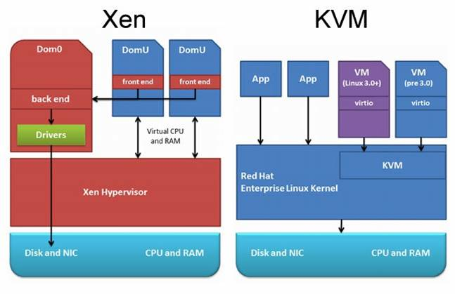
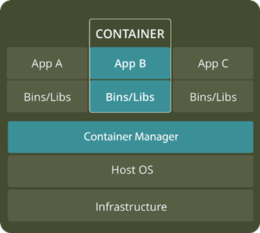
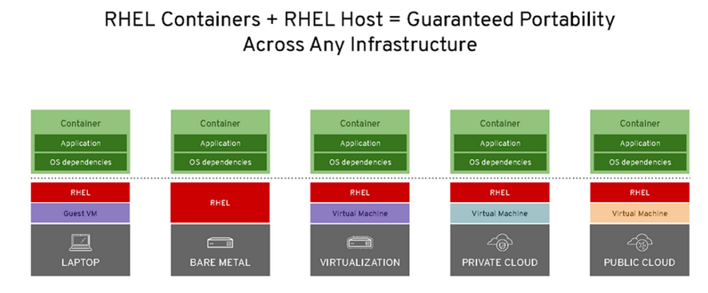
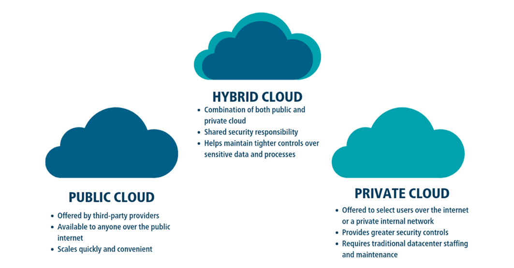
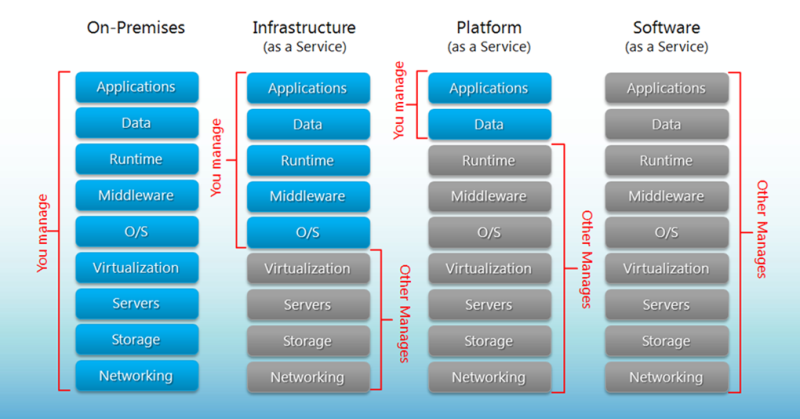
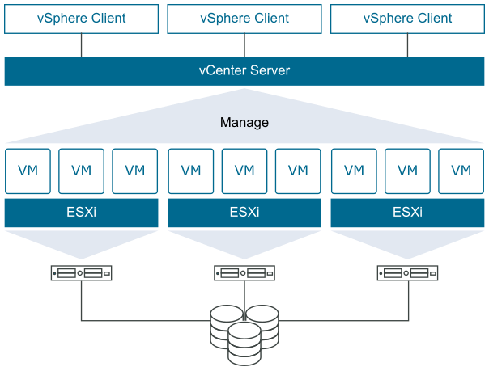

[12. Керування ідентифікацією і доступом <--   ](12.md) [Лекції](README.md) [   --> 14. Побудова розподілених застосунків з використанням Google Scripts ](14.md)

# 13. Хмарні технології

## 13.1. Про хмарні обчислення

***Хмарні обчислення*** (Cloud Computing) — модель забезпечення повсюдного та зручного доступу через мережу на вимогу до загальнодоступного набору обчислювальних ресурсів, що підлягають налаштуванню (наприклад, до комунікаційних мереж, серверів, засобів збереження даних, прикладних програм та сервісів), і які можуть бути оперативно надані та звільнені з мінімальними затратами на керування та зверненнями до провайдера.

Поняття «хмара» відноситься до інфраструктури обчислювальних служб, які зазвичай необхідні відповідно до запиту. Набір ресурсів (обчислень, мереж, сховищ і пов'язаних з ними програмних сервісів) може динамічно масштабуватися в бік збільшення або зменшення в залежності від середнього навантаження і якості обслуговування. Хмари, як правило, - це великі центри обробки даних, які надають клієнтам послуги, орієнтовані на зовнішнього споживача, і модель оплати за використання. Ці центри створюють ілюзію єдиного хмарного ресурсу, в той час як насправді може бути використано багато географічно розподілених ресурсів (наприклад серверів). Це дає користувачеві відчуття незалежності від їх місця розташування. Ресурси є еластичними (що означає масштабованість), а сервіси – це еквівалент плати за використання, незмінний дохід для провайдера. Сервіси, які працюють в хмарі, відрізняються від традиційного програмного забезпечення своєю конструкцією та реалізацією. Хмарні застосунки можуть розроблятися і розвиватися швидше і в меншій мірі залежати від мінливості середовища. Таким чином, розгортання хмар відбувається дуже швидко.

рис.13.1. Приклади використання хмарних обчислень.

Хмарні обчислення можна характеризувати наступними показниками.

1. Спритність (Agility) -  працює в розподіленому середовищі, розподіляє ресурси між користувачами дуже швидко 

2. Висока доступніть і надійність (High availability and reliability) – за рахунок роботи інфраструктури а не окремих серверів

3. Висока масштабованість (High Scalability) – надає необхідні ресурси на вимогу без необхідності думати про пікові навантаження

4. Мульти-розподіленість (Multi-Sharing) – кілька користувачів та застосунків можуть більш ефективно працювати через розподілення спільної інфраструктури 

5. Незалежність від пристроїв та розміщення (Device and Location Independence)   - користувачі можуть підключатися з будь-якого місця та пристрою

6. Обслуговування (Maintenance) – не потрібно встановлювати ПЗ на ПК, обслуговувати залізо

7. Низькі затрати (Low Cost) – якщо рахувати вартість закупки заліза, ПЗ, оренду приміщення, електроенергію, обслуговування ….  

8. Сервіси в режимі плати-користуйся (Services in the pay-per-use mode) – API забезпечує доступ до хмарних застосунків та оплату тільки за використовувані ресурси

Хмарні обчислення мають як переваги так і недоліки порівняно з традиційними обчисленнями "за місцем" або "на віддаленому сервері". Серед переваг можна назвати наступні:

1. Легше резервувати і відновлювати дані, так як якщо є хмарна інфраструктура можна легко копіювати віртуальні машини або контейнери. 

2. Покращена взаємодія між групами користувачів, так як можна до одних і тих самих ресурсів надати доступ для декількох користувачів. 

3. Швидкий доступ до ресурсів та їх доступність

4. Менші витрати на підтримування, так як необхідний ресурс надається в "чистому вигляді" без необхідності підготовки і підтримання того, на чому він базується (наприклад ОС, залізо і т.п.).

5. Легкий доступ з мобільних пристроїв, оскільки всі технології підтримують Інтернет, і орієнтовані на різні платформи. 

6. Плата тільки за використовувані ресурси

7. Збереження даних в любій кількості

8. Надійне безпечне збереження даних, так як постачальник сервісу гарантує це і має відповідні кваліфіковані кадри та інфраструктуру.  

У той же час можна виділити наступні недоліки:

1. Необхідність постійного доступу Internet, у порівнянні з локальними ресурсами.

2. Можливі проблеми перенесення сервісів між різними постачальниками (провайдерами).

3. Менша контрольованість (ресурси контролюються провайдером)

4. Безпечність великою мірою контролюється саме провайдером 

Хмарні обчислення базуються на наступних технологіях:

1. Віртуалізація. Віртуалізуватися можуть різні ресурси: Hardware virtualization, Server virtualization, Storage virtualization, Operating system virtualization, Data Virtualization і т.д..
2. Сервіс-орієнтована архітектура (плата проходить тільки за сервіс).

3. Розподілені обчислення (для роботи використовується декілька машин або програм).

Надалі ці технології розглянемо більш детально.

## 13.2. Віртуалізація

Простими словами віртуалізація забезпечує можливість використання не реальних ресурсів а їх програмного емулятора, який у свою чергу використовує частину фізичного ресурсу. Таким чином один фізичний ресурс, наприклад апаратний сервер може одночасно використовуватися кількома віртуальними серверами, що робить використання цього ресурсу гнучкішим. На сьогоднішній день використовуються два варіанти віртуалізації для використання застосунків: віртуальні машини та контейнери.     

### Віртуальна машина

Віртуальна машина (VM, ВМ) - це емуляція комп'ютерної системи на іншому комп'ютері.  Це дає змогу запускати, як здається, багато окремих комп'ютерів на апаратних засобах, які є фактично одним комп'ютером.

рис.13.2. Стек з віртуальною машиною та гіпервізором. 

Гостьові ОС та їхні застосунки спільно використовують апаратні ресурси одного хост-сервера або з пулу хост-серверів. Кожна віртуальна машина вимагає власної ОС, а її апаратне забезпечення є віртуалізованим. 

Віртуальні машини мають наступні особливості:

- можуть зайняти багато системних ресурсів:

- працює не тільки з повною копією операційної системи, але і з віртуальною копією всього обладнання, яке операційна система потребує для запуску

- великий об’єм необхідної оперативної пам'яті 

- необхідний процесорний час

Віртуалізацію віртуальних машин забезпечує **гіпервізор** (Hypervisor). Гіпервізор або монітор віртуальної машини - це програмне забезпечення, прошивка або апаратне забезпечення, яке створює і запускає віртуальні машини. 

Гіпервізор: 

- розташований між апаратним забезпеченням і віртуальною машиною, і є необхідним для віртуалізації серверу

- може працювати на ОС або безпосередньо поверх заліза

Наприклад, завдяки гіпервізору **virtualbox** можна на одному фізичному комп’ютері запустити декілька віртуальнаих комп’ютерів. Це дає можливість робити з застосунками на різних ОС та з різним встановленим ПЗ одночасно, маючи один і той самий комп'ютер. 

Приклади гіпервізорів:

- [VMware vSphere](https://www.vmware.com/products/vsphere.html)
- [VirtualBox](https://www.virtualbox.org/)
- [Xen](https://www.xenproject.org/)
- [Hyper-V](https://docs.microsoft.com/en-us/virtualization/hyper-v-on-windows/about/)
- [KVM](https://www.linux-kvm.org/page/Main_Page)

Гіпервізори можуть працювати як поверх ОС, у цьому випадку кажуть про "хостову ОС" так і як операційна система. Розглянемо це на прикладах платформ віртуалізації XEN та KVM (рис.13.3) XEN - це гіпервізор, який працює поверх заліза. KVM - гіпервізор, який працює як служба ОС, дає можливість працювати як віртуальним машинам так і застосункам безпосередньо в цій же ОС.

рис.13.3. Приклад роботи гіпервізорів поверх заліза або на рівні ОС.

Серед основних переваги віртуальних машин можна виділити наступні:

- для застосунків (applications) доступні усі ресурси гостьової ОС, так само як на окремому ПК

- на віртуальну машину можна встановити будь яку ОС (гостьову ОС), незалежно від ОС хостової ОС 
- існують перевірені часом інструменти керування ВМ
- існують перевірені часом засоби безпеки

До недоліків можна віднести те, що потрібно дуже багато ресурсів і часу, щоб віртуалізувати залізо віртуальної машини. 

### Контейнери

За допомогою контейнерів, замість віртуалізації базового комп'ютера, як віртуальної машини (VM), віртуалізована тільки сама ОС (рис.13.4).

Контейнери працюють поверх фізичного сервера, в якого його хостова ОС типово є Linux або Windows. Контейнери розділяють між собою єдине ядро хостової ОС і, як правило, також бінарні файли і бібліотеки. Ці спільні компоненти доступні лише для читання. Спільне використання ресурсів ОС, таких як бібліотеки, значно зменшує необхідність відтворення коду операційної системи і означає, що сервер може запускати кілька робочих навантажень за допомогою однієї установленої операційної системи. Таким чином, контейнери є надзвичайно легкими - вони мають розмір порядку кількох десятків мегабайт і запускаються протягом кількох секунд. У порівнянні з контейнерами запуск віртуальних машин проходить протягом кількох хвилин, і вони займають на порядок більше пам’яті, аніж еквівалентний до них за функціями контейнер.

рис.13.4. Стек з контейнером

На відміну від віртуальних машин, все, чого вимагає контейнер - це наявна операційна система, підтримуючі застосунки і бібліотеки, а також системні ресурси для запуску певної програми. На практиці це значить, що на одному сервері з контейнерами ви можете помістити в два-три рази більше застосунків, ніж з використанням ВМ. Крім того, за допомогою контейнерів ви можете створити портативне, послідовне робоче середовище для розробки, тестування та розгортання.

**Linux Containers (LXC)**. Оригінальна технологія контейнера Linux, відома як LXC. LXC - це метод віртуалізації на рівні операційної системи Linux для запуску декількох ізольованих систем Linux на одному хості.

**Docker** . Docker був запущений як проект з побудови контейнерів LXC з одним застосунком, вводячи кілька змін до LXC, які роблять контейнери більш портативними та гнучкими у використанні. Пізніше він перетворився на своє власне середовище виконання. На вищому рівні Docker - це утиліта Linux, яка може ефективно створювати, відправляти і запускати контейнери.

До переваг контейнерів порівняно з віртуальними машинами можна віднести:

- Зниження ресурсів керування ІТ

- Зменшений розмір знімків (зміст контейнеру)

- Швидший запуск застосунків

- Зменшені та спрощені оновлення безпеки

- Менше коду для передачі, міграції, завантаження робочих навантажень

Контейнерні технології дуже гнучкі і можуть використовувати різноманітні комбінації стеків. На рис.13.5 показаний приклад розгортання контейнерів RHEL.

рис.13.5. Можливості розгортання контейнерів RHEL.

### Порівняння ВМ і контейнерів

І контейнери, і віртуальні машини мають переваги та недоліки, і остаточне рішення буде залежати від конкретних потреб, але є деякі загальні правила.

- Віртуальні машини є кращим вибором для запуску застосунків, які потребують усіх ресурсів та функціональності операційної системи, коли потрібно запускати декілька застосунків на серверах або мати широкий спектр операційних систем для керування.

- Контейнери є кращим вибором, коли найбільшим пріоритетом є максимізація кількості застосунків, що працюють на мінімальній кількості серверів.

Таблиця 13.1. Порівняння віртуальних машин та контейнерів

| Віртуальні машини                            | **Контейнери**                                             |
| -------------------------------------------- | ---------------------------------------------------------- |
| Важковагий                                   | Легковагий                                                 |
| Обмежена продуктивність                      | Вихідна продуктивність                                     |
| Кожна віртуальна машина працює у  власній ОС | Усі контейнери поділяють хостову ОС                        |
| Віртуалізація на рівні обладнання            | Віртуалізація на рівні ОС                                  |
| Запускається порядку кількох хвилин          | Запускається порядку кількох секунд або  сотень мілісекунд |
| Виділяє необхідну пам'ять                    | Потребує менше пам’яті                                     |
| Повністю ізольована і, отже, більш  безпечна | Ізоляція на рівні процесу, можливо, менш  безпечна         |

## 13.3. Моделі топологій хмар

У хмарному середовищі існують три різні моделі топології хмар: приватна хмара (private cloud), хмара загального користування або публічна (public cloud) та гібридна хмара (Hybrid cloud). 

рис.13.6. Моделі топологій хмар

***Публічна хмара*** **(*Public Cloud*)** - хмарна інфраструктура, при якій серверні потужності обов'язково знаходяться на стороні провайдера хмарних послуг, який надає ресурси відразу кільком організаціям з одночасно. Тут інфраструктура надається на вимогу для безлічі клієнтів і застосунків. Тут інфраструктура – це набір ресурсів, які будь-яка людина може використовувати в будь-який час в рамках своїх угод про рівень обслуговування. Перевага використання у тому, що хмарні центри обробки даних дозволяють забезпечити безпрецедентну масштабованість для багатьох клієнтів, які обмежені тільки тим, яку частину послуг вони хочуть придбати. Прикладами публічних хмар є:

- [AWS (Amazon Web Services)](https://aws.amazon.com/) 
- [Google Cloud](https://cloud.google.com)
- [Microsoft Azure](https://azure.microsoft.com) 
- [IBM Cloud](https://cloud.ibm.com/) 
- [Alibaba Cloud](www.alibabacloud.com)

***Приватна хмара (private cloud)*** – хмарна інфраструктура, надана в виключне користування однієї організації або корпорації. Приватна хмара існує по ряду причин, включаючи безпеку та перевіреність якості. Тобто це потрібно для гарантування, що інформація обробляється виключно системами, що керовані клієнтом. Однак, щоб вважатися хмарою, повинні існувати деякі аспекти хмарних сервісів, такі як віртуалізація і балансування навантаження. 

***Гібридна хмара*** (**Hybrid cloud**) – одночасне використання приватної і публічної хмари. 

Незалежно від моделі, каркаси хмар повинні забезпечувати динамічну масштабованість, швидкість розробки і розгортання, а також використання в потрібному місці незалежно від його близькості. Сучасні корпоративні системи, як правило, використовують гібридну архітектуру для забезпечення безпеки критично важливих застосунків і даних за місцем і використовують публічну хмару для підключення, простоти і швидкості розгортання.

## 13.4. Модель хмарних сервісів

Хмарні провайдери зазвичай підтримують цілий ряд продуктів «Все як сервіс» (XaaS). Тобто, послуга програмного забезпечення з оплатою за використання. Сервіс включає в себе службу мережі (NaaS), програмне забезпечення як послугу (**SaaS**), платформу як послугу (**PaaS**) і інфраструктуру як послугу (IaaS). Кожна модель представляє все більше і більше хмарних сервісів від постачальників. Ці сервісні пропозиції - додана вартість хмарних обчислень. Як мінімум, ці послуги повинні компенсувати капітальні витрати, з якими зіштовхується клієнт для придбання і обслуговування такого обладнання центру обробки даних, і врахувати це як експлуатаційні витрати. 

                               

Рис.13.7. Різні моделі надання хмарних сервісів.

***SaaS*** (Software as a Service, програмне забезпечення як послуга) пропонує користувачеві використовувати готове програмне забезпечення, яке виконується в хмарі. З точки зору користувача, віртуальний SaaS фактично працює на його пристрої. Прикладами таких сервісів є різноманітні застосунки Google (наприклад, Google Sheet, Google Docs) або Microsoft Office 365.

***PaaS*** (Platform as a Service, **платформа як сервіс**) використовує базове устаткування і програмні засоби нижнього рівня, що надаються хмарою. У такому випадку кінцевий користувач тільки використовує апаратне забезпечення центру обробки даних, операційну систему, проміжне ПЗ і різні бази даних постачальника для розміщення свого приватного застосунку або сервісу. Проміжне ПЗ може складатися з систем керування базами даних, збору та обробки даних і т.п. Тобто платформа використовується як певний напівфабрикат, за допомогою якого збирається рішення для кінцевого споживача. Зрештою, розробник може використовувати PaaS для створення власного SaaS.  

У моделі ***IaaS*** (Infrastructure as a Service, **інфраструктура як сервіс**) постачальник створює масштабовані апаратні служби в хмарі і надає модифікацію програмних каркасів для створення клієнтських віртуальних машин. По суті, клієнт отримує віртуальні комп’ютери з необхідною ОС і встановлює на них все, що необхідно. Кількість комп’ютерів, їх графік роботи керується ззовні як користувачем так і скриптами, що надає такому рішенню гнучкості.  

рис.13.8. Приклад віртуалізації IaaS: VMware vSphere.

## Запитання для самоперевірки

1. Що таке хмарні обчислення?
2. Назвіть основні характеристики хмарних обчсилень.
3. Назвіть переваги та недоліки хмарних обчислень порівняно з локальними обчисленнями.
4. Поясніть принципи роботи віртуальних машин.
5. Поясніть принципи роботи контейнерів.
6. Назвіть переваги та недоліки віртуальних машин та контейнерів порівняно один з одним.
7. Назвіть основні моделі топологій хмар.
8. Перерахуйте моделі надання хмарних сервісів та коротко опишіть їх принципи. 
