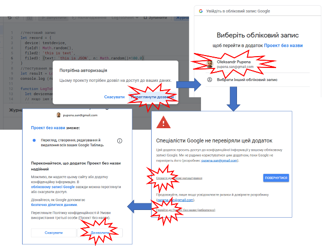

[13.  Хмарні технології<--   ](13.md) [Лекції](README.md) [   --> 15 Google Sheet API ](15.md)

# 14. Побудова розподілених застосунків з використанням Google Scripts

## Вступ до Google Apps Scripts

**Google Apps Script (GAS)** - це платформа для розробки застосунків, що дозволяє швидко та легко створювати бізнес-застосунки, які інтегруються з [Google Workspace](https://uk.wikipedia.org/wiki/Google_Workspace). Код пишеться на сучасному JavaScript і надається доступ до вбудованих бібліотек для застосунків Google Workspace, таких як Gmail, Календар, Диск тощо. Непотрібно нічого встановлювати — доступний редактор коду прямо у браузері, а скрипти запускаються на серверах Google. 


рис.14.1. Застосунки Google Workspace

У Apps Script як і для багатьох інших реалізацій JavaScript *середовище виконання* містить рушій JavaScript, який аналізує та виконує код сценарію. Apps Script підтримує рушій V8, який використовують наприклад `Google Chrome` та `Node.js`. 

Apps Script є універсальним. Зокрема він дозволяє:

- Додати [користувацькі меню](https://developers.google.com/apps-script/guides/menus), [діалоги та бічні панелі](https://developers.google.com/apps-script/guides/dialogs ) до Документів, Таблиць(Sheets) та Форм Google.
- Писати [користувацькі функції](https://developers.google.com/apps-script/execution_custom_functions) та [макроси](https://developers.google.com/apps-script/guides/sheets/macros) для Google Sheets.
- Публікувати [веб-застосунки](https://developers.google.com/apps-script/execution_web_apps) - самостійно або вбудовані в Google Sites.
- Взаємодіяти з іншими [сервісами Google](https://developers.google.com/apps-script/guides/services), включаючи AdSense, Analytics, Календар, Диск, Gmail та Картами.
- Створювати [add-ons](https://developers.google.com/gsuite/add-ons/overview) для розширення Документів, Таблиць, Слайдів та форм Google і публікувати їх у магазині застосунків.
- Конвертувати Android App в [Android add-on](https://developers.google.com/gsuite/add-ons/mobile), щоб він міг обмінюватися даними з Google Doc або Листом користувача на мобільному пристрої.
- Упорядковувати робочі процеси чату Hangouts, створивши [чат-бот](https://developers.google.com/hangouts/chat/quickstart/apps-script-bot).

Apps Script працює на стороні сервера, але може мати інтерфейс користувача, створений за допомогою Html, CSS, JavaScript або будь-якої іншої технології, що підтримується браузером. На відміну від Nodejs, який керується подіями, GAS працюють у потоковій моделі. Усі виклики скрипта генерують унікальний екземпляр цього скрипта, який виконується ізольовано від усіх інших екземплярів. Коли екземпляр сценарію завершує виконання, він знищується.

Функції в Apps Script блокуються, тому шаблони зворотного виклику й асинхронного програмування не потрібні. Блокування використовується, щоб запобігти одночасному виконанню критичних розділів коду, наприклад файлового вводу/виводу, різними екземплярами.

## Самостійне використання Apps Script 

Скрипти створюються на сторінці [Google Apps Script  https://script.google.com](https://script.google.com). Для роботи з цим сервісом, так само як і з більшістю інших необхідно мати обліковий запис Google. Приклад функції в GAS показаний на рис.14.2.


рис.14.2. Приклад функції в Google Apps Script

Після створення функціїї, її можна зберегти і запустити проект на виконання. Результат виконання можна передивитися у консолі журналу виконання.  


рис.14.3. Приклад журналу в Google Apps Script

Самостійне виконання GAS без взаємодії має мало сенсу, тому до нього можна підключати різноманітні сервіси через клієнтський API. 

## Публікація Apps Script як Веб-застосунків

### Обробка методів

Скрипт можна опублікувати як [веб-застосунок](https://developers.google.com/apps-script/guides/web). Для цього треба, щоб в скрипті були використані функції, які реалізовують методи  GET через функцію `doGet(e)` та/або POST через функцію  `doPost(e)`. В обох випадках аргумент `e` представляє параметр події, який може містити інформацію про будь-які параметри запиту. 

Таким чином коли скрипт публікується як веб-застосунок, кожного разу коли відбувається запит до URL-адреси скрипта  - викликаються спеціальні функції зворотного виклику `doGet()` і `doPost()`. 

Можна оперувати як HTML змістом, повертаючи об’єкти інтерфейсу користувача, створеного за допомогою [HTML service](https://developers.google.com/apps-script/guides/html), так і використовувати [Content service](https://developers.google.com/apps-script/reference/content) для повернення текстового вмісту у вигляді звичайного тексту  або серіалізованого JSON, XML. Перший дозволяє реалізовувати динамічно генеровані WEB-сторінки, а другий - розробляти сервіси що надають доступ через HTTP API, відповідаючи на запити `GET` та `POST` та обслуговуючи дані різних типів MIME, що доступні 24/7.

Розглянемо простий приклад для Веб-сервісу, що генерує HTML сторінку

```js
function doGet(e) {
  return HtmlService.createHtmlOutput().setContent ('<h1>Привіт світ!</h1>');
}
```

У цьому випадку викликається функція [doGet](https://developers.google.com/apps-script/guides/web) яка в якості вхідного аргументу отримує об'єкт `e` - параметр події, який може містити інформацію про будь-які параметри запиту. [HTML service](https://developers.google.com/apps-script/guides/html)  використаний для генерування веб-сторінки, створивши контент через метод [createHtmlOutput()](https://developers.google.com/apps-script/reference/html/html-output#setContent(String)).

### Публікація

Після написання коду скрипт необхідно зберегти і опублікувати. 


рис.14.4. Публікація скрипту як Веб-застосунку

Після публікації застосунку його базовий URL матиме вигляд:

```http
https://script.google.com/macros/s/AKfyVOWxGcR9A/exec
```

Для перевірки роботи скрипту треба вписати в поле адреси браузера вказаний URL. Повинен з'явитися відповідно форматований текст.

Зауважте що кожна зміна коду буде приводити до необхідності публікації нового застосунку. Стара адреса буде використовуватися зі старим кодом. Так забезпечується версійність, коли старі застосунки залишаються робочими при зміні реалізації.


рис.14.5. Вибір версію скрипту

Також варто відзначити, що Google Apps Scripts пропонує два інтерфейси:

- для виконання, URL якого завершується `/exec` і постійно змінюється при публікації
- для налагодження, URL якого завершується `/dev` і не змінюється при публікації, є постійною що спрощує налагодження але доступний тільки розробникам. Його можна отримати з меню "Ввести в дію->Тестувати пакети". Приклад такого URL:  

```http
https://script.google.com/macros/s/AKfycbzES1LxLzsgWPDm/dev
```

Таким чином налагоджувати веб-застосунок простіше з URL, що завершується на  `/dev`

Можна також зробити відповідний текстовий Content. Наприклад скрипт що просто повертає текст при запиті сторінки, матиме наступний вигляд.

```javascript
function doGet() {
  return ContentService.createTextOutput('Привіт світ!');
}
```

Використовуючи ці ж об'єкти можна відповідати на запити в форматі ATOM, CSV, iCal, JavaScript, JSON, RSS, vCard, та XML.

### Об'єкт події (Event parameter)

Структура об’єкта події:

- `e.queryString` - Значення частини рядка запиту URL-адреси або значення null, якщо рядок запиту не вказано, наприклад:

```http
name=alice&n=1&n=2
```

- `e.parameter` - об’єкт з пар ключ/значення, які відповідають параметрам запиту. Для параметрів, які мають кілька значень, повертається лише перше значення, наприклад: 	

```json
{"name": "alice", "n": "1"}
```

- `e.parameters` - Об’єкт, подібний до `e.parameter`, але з масивом значень для кожного ключа

```json
{"name": ["alice"], "n": ["1", "2"]}
```

- `e.pathInfo` - URL-шлях після `/exec` або `/dev`. Наприклад, якщо URL-шлях закінчується на `/exec/hello`, інформація про шлях буде `hello`.	

- `e.contextPath` Не використовується, завжди порожній рядок.

- `e.contentLength` - Довжина тіла запиту для запитів POST або `-1` для запитів GET.

```
332
```

- `e.postData.length`  - те саме що `e.contentLength`

```
332
```

- `e.postData.type` - Тип MIME тіла POST	

```
text/csv
```

- `e.postData.contents` - Текст вмісту тіла POST	

```
Alice,21
```

- `e.postData.name ` - Завжди значення `postData`

Наприклад, можна передати такі параметри, як  `username`  та  `age` до URL-адреси, як показано нижче:

```http
https://script.google.com/.../exec?username=jsmith&age=21
```

Потім можна відобразити параметри так:

```js
function doGet(e) {
  var params = JSON.stringify(e);
  return HtmlService.createHtmlOutput(params);
}
```

У наведеному вище прикладі `doGet(e)` повертає такий результат:

```json
{
  "queryString": "username=jsmith&age=21",
  "parameter": {
    "username": "jsmith",
    "age": "21"
  },
  "contextPath": "",
  "parameters": {
    "username": [
      "jsmith"
    ],
    "age": [
      "21"
    ]
  },
  "contentLength": -1
}
```

## Підключення сервісів Google Workspace

До Apps Scripts можна підключати інші сервіси Google.


рис.14.6. Підключення сервісу до Google Apps Scripts

Після добавлення можна звертатися до сервісів через означені методи. На наведеному нижче прикладі показано як в консоль виводиться перелік запланованих подій в Google Calendar. 


рис.14.7. Приклад використання підключеного сервісу Google Calendar

При запуску скриптів, що доступаються до застосунків або сервісів Google, необхідно надавати дозволи. 


рис.14.8. Приклад надання дозволів 

## Використання Apps Script в Google Sheets

Скрипти Apps Script можуть використовуватися разом з Google Таблицями. Це має те саме призначення, що і мова VBA в `MS Excel` . В [Гугл Таблицях](https://docs.google.com/spreadsheets/) для нової або існуючої таблиці в меню "Інструменти - Редактор сценаріїв" створюється код, наприклад:


рис.14.9. Створення розширення на Apps Script

```javascript
function myFunction() {
    //отримати активну сторінку
  	let sheet = SpreadsheetApp.getActiveSpreadsheet().getActiveSheet();
    // на активній сторінці у комірках з 1,1 виведе повідомлення
    let word = "Привіт світ!";
    for (i=0; i<word.length; i++){
      sheet.getRange(1,i+1).setValue(word[i]);
    }   
}
```

Після збереження коду, його можна запустити на виконання. Перший запуск приведе до необхідності автентифікації, тому з'явиться повідомлення про необхідність надання доступу застосунку до Google Sheet. Необхідно автентифікувати себе, та надати дозвіл на доступ (рис.14.10).   



рис.14.10. Дозвіл на доступ застосунку до Google Sheet

Після успішного виконання у вікні консолі будуть з'являтися повідомлення. Детальніше про використання Google Sheet розглянуто в наступній лекції. 

## Використання в якості клієнта API

### UrlFetch

Google Apps Script може взаємодіяти з API з усього Інтернету як клієнт.  Для цього можна використовувати службу [`UrlFetch`](https://developers.google.com/apps-script/reference/url-fetch), щоб надсилати запити API безпосередньо. 

```
fetch(url, params);
```

У `params` вказуються параметри, повний перелік яких наведений за [посиланням](https://developers.google.com/apps-script/reference/url-fetch/url-fetch-app#fetch(String,Object)).   

У наведеному нижче прикладі використовується [API GitHub](https://developer.github.com/v3/search/#search-repositories) для пошуку сховищ зі 10000 або більше зірочками, у яких згадується "Apps Script" і виведення їх кількості. Цей запит API не потребує авторизації чи ключа API.

```js
function myFunction() {
  let query = '"Apps Script" stars:">=10000"'; // запит
  let url = 'https://api.github.com/search/repositories' // клієнтський API github 
    + '?sort=stars' // параметр сортування stars
    + '&q=' + encodeURIComponent(query); // параметр запиту 

  // відправка клієнтського запиту
  var response = UrlFetchApp.fetch(url,{'muteHttpExceptions': true} 
      //muteHttpExceptions - Якщо значення true, вибірка не створює винятку, якщо код відповіді вказує на помилку, а натомість повертає HTTPResponse. 
  );
  let repos = response.getContent();
  console.log(repos.length);  
}
```

API, які діють від імені користувача, зазвичай потребують авторизації, часто з використанням [протоколу OAuth](http://oauth.net/). Apps Script не підтримує вбудовану підтримку протоколу, але є бібліотеки з відкритим кодом, які можна використовувати для виконання потоку OAuth і надсилання облікових даних із вашими запитами:

- [OAuth1 для Apps Script](https://github.com/googlesamples/apps-script-oauth1): сумісний із OAuth 1.0 і 1.0a.
- [OAuth2 для Apps Script](https://github.com/googlesamples/apps-script-oauth2): сумісний з OAuth2.

Для формування запиту можна користуватися різними методами. Вибір методу та інших параметрів задається у другому аргументі:

| Назва параметру             | Тип       | Опис                                                         |
| --------------------------- | --------- | ------------------------------------------------------------ |
| `contentType`               | `String`  | the content type (defaults to    'application/x-www-form-urlencoded'). Another example of content type is 'application/xml;    charset=utf-8'. |
| `headers`                   | `Object`  | a JavaScript key/value map of HTTP headers for the request   |
| `method`                    | `String`  | the HTTP method for the request: `get`, `delete`,    `patch`, `post`, or `put`. The default is `get`. |
| `payload`                   | `String`  | the payload (that is, the POST body) for the request. Certain    HTTP methods (for example, GET) do not accept a payload. It can be a string, a byte array,    a blob, or a JavaScript object. A JavaScript object is interpreted as a map of form field    names to values, where the values can be either strings or blobs. |
| `useIntranet`               | `Boolean` | Deprecated. This instructs fetch to resolve the specified    URL within the intranet linked to your domain through (deprecated) [SDC](http://code.google.com/securedataconnector/) |
| `validateHttpsCertificates` | `Boolean` | If `false` the fetch ignores any    invalid certificates for HTTPS requests. The default is `true`. |
| `followRedirects`           | `Boolean` | If `false` the fetch doesn't automatically    follow HTTP redirects; it returns the original HTTP response. The default is `true`. |
| `muteHttpExceptions`        | `Boolean` | If `true` the fetch doesn't throw an    exception if the response code indicates failure, and instead returns the `HTTPResponse`. The default is `false`. |
| `escaping`                  | `Boolean` | If `false` reserved characters in the URL aren't    escaped. The default is `true`. |

```js
// Зробити запит POST з корисним навантаженням JSON
var data = {
  'name': 'Bob Smith',
  'age': 35,
  'pets': ['fido', 'fluffy']
};
var options = {
  'method' : 'post',
  'contentType': 'application/json',
  // Convert the JavaScript object to a JSON string.
  'payload' : JSON.stringify(data)
};
UrlFetchApp.fetch('https://httpbin.org/post', options);
```


### Робота з JSON

Якщо запитуваний API повертає необроблену відповідь JSON для запиту, доступ до рядкової відповіді JSON можна отримати за допомогою методу [`HTTPResponse.getContentText()`](https://developers.google.com/apps-script/reference/url-fetch/http-response#getContentText()). Після того, як цей рядок буде отримано, викликається `JSON.parse()` для рядка, щоб отримати власне представлення об’єкта.

```js
// Make request to API and get response before this point.
var json = response.getContentText();
var data = JSON.parse(json);
Logger.log(data.title);
```

Так само, щоб створити рядкове представлення об’єкта JavaScript для того, щоб зробити запит, використовуйте `JSON.stringify()`.

```js
var data = {
  'entry': {
    'group': {
      'title': 'Dog Skateboarding',
      'description': 'My dog gets some serious air'
    },
    'keywords': 'dog, skateboard'
  }
}
var payload = JSON.stringify(data);
```

Детальніше про JSON та роботою з ним в GAS, можна прочитати в [лекції по JSON](11.md)

### Парсинг XML

Якщо зовнішній API повертає необроблену XML-відповідь на запит, ви можете отримати доступ до XML-відповіді за допомогою методу [`HTTPResponse.getContentText()`](https://developers.google.com/apps-script/reference/url- fetch/http-response#getContentText()).

```js
// Make request to API and get response before this point.
var xml = response.getContentText();
var doc = XmlService.parse(xml);
```

Роблячи XML-запити до API, створіть XML для надсилання за допомогою методів [`XmlService`](https://developers.google.com/apps-script/reference/xml-service/xml-service).

```js
var root = XmlService.createElement('entry')
    .setAttribute('keywords', 'dog, skateboard');
var group = XmlService.createElement('group')
    .setAttribute('title', 'Dog Skateboarding');
    .setAttribute('description', 'My dog gets some serious air');
root.addContent(group);
var document = XmlService.createDocument(root);
var payload = XmlService.getPrettyFormat().format(document);
// Make request to API with payload after this point.
```

Детальніше про XML та роботою з ним в GAS, можна прочитати в [лекції по XML](10.md)

## Базові сервіси GAS

Базові сервіси GAS надають доступ до інформації користувача, такої як адреси електронної пошти та імена користувачів. Вони також керують журналами скриптів і діалоговими вікнами в застосунках Google Workspace. Ці сервіси надаються через класи та об'єкти, перелік яких наведений нижче. 

| Клас/об'єкт      | Призначення                                                  |
| ---------------- | ------------------------------------------------------------ |
| `Blob`           | Об’єкт обміну даними для служб Apps Script.                  |
| `BlobSource`     | Інтерфейс BlobSource для об’єктів, які можуть експортувати свої дані як `Blob`. |
| `Browser`        | Цей клас надає доступ до діалогових вікон, характерних для Google Таблиць. |
| `Button`         | Перелік, що представляє заздалегідь означені локалізовані діалогові кнопки, повернуті `alert` або `PromptResponse.getSelectedButton()` , щоб вказати, яку кнопку в діалоговому вікні натиснув користувач. |
| `ButtonSet`      | Перелік, що представляє заздалегідь означені локалізовані набори однієї або кількох діалогових кнопок, які можна додати до  `alert`  або `prompt`. |
| `ColorType`      | Типи кольорів                                                |
| `Logger`         | Цей клас дозволяє розробнику записувати текст у журнали налагодження. |
| `Menu`           | Спеціальне меню в екземплярі інтерфейсу користувача для програми Google. |
| `MimeType`       | Перелік, який надає доступ до декларацій типу MIME без явного введення рядків. |
| `Month`          | Перелік місяців року.                                        |
| `PromptResponse` | Відповідь на діалогове вікно  `prompt` , що відображається в середовищі інтерфейсу користувача для програми Google. |
| `RgbColor`       | Колір, означений червоним, зеленим, синім кольоровими каналами. |
| `Session`        | клас, що надає доступ до інформації про сеанс, такої як адреса електронної пошти користувача (у деяких випадках) і налаштування мови. |
| `Ui`             | Екземпляр середовища інтерфейсу користувача для програми Google, який дозволяє сценарію додавати такі функції, як меню, діалогові вікна та бічні панелі. |
| `User`           | Представлення користувача, придатне для скрипту.             |
| `Weekday`        | Перелік, що представляє дні тижня.                           |
| `console`        | Цей клас дозволяє розробнику записувати журнали до служби  [Stackdriver Logging](https://cloud.google.com/logging/docs/)  від Google Cloud Platform. |

Детальний опис цих сервісів доступний за [посиланням](https://developers.google.com/apps-script/reference/base).

## Запитання для самоперевірки

1. Що

## Корисні посилання

https://riptutorial.com/google-apps-script

## Посилання на відеозаписи лекцій

[Запис Л14. Побудова розподілених застосунків з використанням Google Scripts](https://youtu.be/jJEN-trAwq8?si=HJL_vcIBri398bnJ)