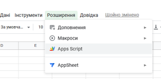
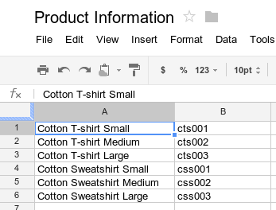

[14. Побудова розподілених застосунків з використанням Google Scripts <--   ](14.md) [Лекції](README.md) [   --> 16.  Інтегрування з хмарними сховищами](16.md)

# 15. Google Sheet API

## Вступ

`Google Sheet` (Гугл Таблиці) - це хмарний застосунок від Google для роботи з електронними таблицями. За функціональністю і принципами роботи він схожий на `Microsoft Excel`. Усі створені таблиці зберігаються на Гугл Диску (`Google Drive`). 

Google Apps Script може використовуватися в Google Sheet для:

- додавання [спеціальних меню](https://developers.google.com/apps-script/guides/menus)
- додавання [діалогових вікон та бічних панелей](https://developers.google.com/apps- скрипт/посібники/діалоги) 
- додавання [спеціальних функцій](https://developers.google.com/apps-script/guides/sheets/functions) для Таблиць
- інтегрувати Таблиці з іншими [службами Google](https://developers .google.com/apps-script/guides/services), як-от Календар, Диск і Gmail

Більшість скриптів, розроблених для Гугл Таблиць, керують масивами для взаємодії з клітинками, рядками та стовпцями в електронній таблиці. 

Apps Script містить спеціальні API, які дозволяють програмно створювати, читати та редагувати Google Таблиці. Apps Script може взаємодіяти з Google Sheets двома способами: 

- будь-який скрипт може створювати або змінювати електронну таблицю, якщо користувач скрипту має відповідні дозволи для електронної таблиці, 
- скрипт також можна прив’язувати до електронної таблиці, що надає сценарію спеціальні можливості для зміни інтерфейсу користувача або відповіді на відкриття електронної таблиці. 

Щоб створити пов’язаний сценарій, необхідно у Google Таблиці вибрати Розширення > Apps Script.



рис.15.1. Створення розширення на Apps Script

Spreadsheet service розглядає Таблиці Google (Google Sheets) як таблицю, що працює з двовимірними масивами. Щоб отримати дані з електронної таблиці (spreadsheet), ви повинні отримати доступ до електронної таблиці, де зберігаються дані, отримати діапазон у електронній таблиці, який містить дані, а потім отримати значення клітинок. Apps Script полегшує доступ до даних, читаючи структуровані дані в електронній таблиці та створюючи для них об’єкти JavaScript

Припустімо, у вас є список назв продуктів і номерів продуктів, які ви зберігаєте в електронній таблиці, як показано на зображенні нижче.



рис.15.2. Приклад таблиці 

У прикладі нижче показано, як отримати та зареєструвати назви та номери продуктів.

```js
function logProductInfo() {
  var sheet = SpreadsheetApp.getActiveSheet();
  var data = sheet.getDataRange().getValues();
  for (var i = 0; i < data.length; i++) {
    console.log('Product name: ' + data[i][0]);
    console.log('Product number: ' + data[i][1]);
  }
}
```

Щоб переглянути зареєстровані дані, у верхній частині редактора сценаріїв натисніть **Журнал виконання**.

Щоб зберегти дані, як-от назву та номер нового продукту, до електронної таблиці, додайте наступний код у кінець скрипта.

```js
function addProduct() {
  var sheet = SpreadsheetApp.getActiveSheet();
  sheet.appendRow(['Cotton Sweatshirt XL', 'css004']);
}
```

Наведений вище код додає новий рядок унизу електронної таблиці із зазначеними значеннями. Якщо ви запустите цю функцію, ви побачите новий рядок, доданий до електронної таблиці.

## Google Sheets API

Google Sheets API -  це інтерфейс RESTful, який дозволяє читати та змінювати дані електронної таблиці. Найпоширеніші використання цього API включають такі завдання: 

- Створення електронних таблиць
- Читання та запис значень клітинок електронної таблиці
- Оновлення форматування електронної таблиці
- Керування підключеними аркушами

Опис Google Sheets API доступний за [цим посиланням](https://developers.google.com/sheets/api)

Нижче наведено список поширених термінів, які використовуються в API таблиць.

- [*Spreadsheet*](https://developers.google.com/sheets/api/reference/rest/v4/spreadsheets)  - основний об’єкт у Таблицях Google, який може містити кілька аркушів, кожен із структурованою інформацією, що міститься в клітинках. Кожну електронну таблицю представляє [Spreadsheet resource](https://developers.google.com/sheets/api/reference/rest/v4/spreadsheets) який має унікальний [`spreadsheetId`](https://developers.google.com /sheets/api/reference/rest/v4/spreadsheets), що містить літери, цифри, дефіси або підкреслення. Ви можете знайти ідентифікатор електронної таблиці в URL-адресі Google Таблиць:

  `https://docs.google.com/spreadsheets/d/spreadsheetId/edit#gid=0`

- [*Sheet*](https://developers.google.com/sheets/api/reference/rest/v4/spreadsheets/sheets) - Аркуш або вкладка в електронній таблиці. Кожен аркуш представляється [Sheet resource](https://developers.google.com/sheets/api/reference/rest/v4/spreadsheets/sheets), який має унікальну назву та числовий  [`sheetId`](https://developers.google.com/sheets/api/reference/rest/v4/spreadsheets/sheets).  Ви можете знайти ідентифікатор аркуша в URL-адресі Google Таблиць: 

  `https://docs.google.com/spreadsheets/d/aBC-123_xYz/edit#gid=sheetId`

- [*Cell*](https://developers.google.com/sheets/api/reference/rest/v4/spreadsheets/cells)  - Окреме поле тексту або даних на аркуші. Комірки розташовані в рядках і стовпцях і можуть бути згруповані як діапазон комірок. Кожну клітинку представляє [CellData resource](https://developers.google.com/sheets/api/reference/rest/v4/spreadsheets/cells), який не має унікального значення ідентифікатора. Натомість клітинки ідентифікуються координатами рядків і стовпців. Можна використати один з 2-х варіантів нотації:

  - *A1 Нотація* - Синтаксис, який використовується для означення комірки або діапазону комірок із рядком, який містить ім’я аркуша, а також початкові та кінцеві координати комірки за допомогою літер стовпців і номерів рядків. Цей метод є найбільш поширеним і корисним при посиланні на абсолютний діапазон клітинок. 
    - `Sheet1!A1:B2` посилається до перших двох клітинок у верхніх двох рядках Sheet1.
    - `Sheet1!A:A` посилається до всіх клітинок у першому стовпці Sheet1.
    - `Sheet1!1:2` посилається до всіх клітинок у перших двох рядках Sheet1.
    - `Sheet1!A5:A` посилається до всіх клітинок першого стовпця Sheet 1, з 5-го ряду і далі.
    - `A1:B2` посилається до перших двох клітинок у верхніх двох рядках першого видимого аркуша.
    - `Sheet1` посилається до всіх клітинок у Sheet1.
    - `'My Custom Sheet'!A:A`  посилається на всі клітинки в першому стовпці аркуша з назвою "My Custom  Sheet." Для імен аркушів із пробілами, спеціальними символами чи буквено-цифровими комбінаціями потрібні одинарні лапки.
    - `'My Custom Sheet'` посилається до всіх клітинок у 'My Custom Sheet'.

  - *Нотація R1C1*  - Синтаксис, який використовується для означення комірки або діапазону комірок із рядком, який містить ім’я аркуша, а також координати початкової та кінцевої комірок за допомогою номерів рядків і стовпців. Цей метод менш поширений, ніж нотація A1, але може бути корисним під час посилання на діапазон комірок відносно позиції даної комірки.
    - `Sheet1!R1C1:R2C2` посилається до перших двох клітинок у верхніх двох рядках  Sheet1.
    - `R1C1:R2C2` посилається до перших двох клітинок у верхніх двох рядках першого видимого аркуша.
    - `Sheet1!R[3]C[1]` посилається на комірку, розташовану трьома рядками нижче та одним стовпцем праворуч від поточної комірки.

- [*Named range*](https://developers.google.com/sheets/api/reference/rest/v4/spreadsheets/sheets#filterview) - Означена комірка або діапазон комірок із настроюваною назвою для спрощення посилань у програмі. [FilterView resource](https://developers.google.com/sheets/api/reference/rest/v4/spreadsheets/sheets#filterview) представляє іменований діапазон.

- [*Protected range*](https://developers.google.com/sheets/api/reference/rest/v4/spreadsheets/sheets#protectedrange) - Означена клітинка або діапазон клітинок, які не можна змінювати. [Ресурс ProtectedRange](https://developers.google.com/sheets/api/reference/rest/v4/spreadsheets/sheets#protectedrange) представляє захищений діапазон.

Google Sheet API можна користуватися з сторонніх сервісів так і GAS. Надалі будемо розглядати тільки використання  

## Об'єкт SpreadsheetApp

Цей клас дає можливість отримати доступ до файлів Google Таблиць і створювати їх. Цей клас є батьківським класом для служби електронних таблиць. Нижче наведено кілька методів об'єкту SpreadsheetApp, детальніше написано в [документації](https://developers.google.com/apps-script/reference/spreadsheet/spreadsheet-app).

### Створення таблиці

`create (name, rows, columns)`

Створює нову електронну таблицю з заданим іменем і вказаною кількістю рядків і стовпців.

### Відкриття таблиці

``open(file)``

Відкриває електронну таблицю, яка відповідає заданому об’єкту File.

```js
// Отримує будь-які електронні таблиці з Диска Google позначені зірочкою
// потім відкриває електронні таблиці та пише їх ім’я в жрунал
function myFunction() {
  let files = DriveApp.searchFiles('mimeType = "' + MimeType.GOOGLE_SHEETS + '"');
  while (files.hasNext()) {
    const spreadsheet = SpreadsheetApp.open(files.next());
    console.log(spreadsheet.getName())
  }
}
```

`openByUrl(url)`

Відкриває електронну таблицю з указаною URL-адресою. Створює виняток скрипа, якщо URL-адреса не існує або користувач не має дозволу на доступ до неї.

```js
function myFunction() {
  const ss = SpreadsheetApp.openByUrl ("https://docs.google.com/spreadsheets/d/1e7nWHSOuPlnBtR96gAqyKFKR4Bzdj5DwxKfWr43_IT4/edit?usp=drive_link");
  console.log(ss.getName());
}
```

`openById(id)`

Відкриває електронну таблицю з указаним ідентифікатором. Ідентифікатор електронної таблиці можна отримати з її URL-адреси. Наприклад, ідентифікатор електронної таблиці в URL-адресі https://docs.google.com/spreadsheets/d/abc1234567/edit#gid=0 є "abc1234567".

```js
function myFunction() {
  const ss = SpreadsheetApp.openById("1e7nWHSOuPlnBtR96gAqyKFKR4Bzdj5DwxKfWr43_IT4");
  console.log(ss.getName());
}
```

### Отримання/встановлення активної таблиці 

`getActive()`

або

`getActiveSpreadsheet()`

Ці функції працюють однаково і повертають поточну активну електронну таблицю або `null`, якщо такої немає. Викликавши цю функцію, функції, які виконуються в контексті електронної таблиці, можуть отримати посилання на відповідний об’єкт Spreadsheet, .

```js
function myFunction() {
  const activess = SpreadsheetApp.getActive();
  console.log (activess.getName() )
  console.log(activess.getUrl());
}
```

`setActiveSpreadsheet(newActiveSpreadsheet)`

Встановлює вказану таблицю активною.

```js
function myFunction() {
  const ss = SpreadsheetApp.openByUrl ("https://docs.google.com/spreadsheets/d/1e7nWHSOuPlnBtR96gAqyKFKR4Bzdj5DwxKfWr43_IT4/edit?usp=drive_link");
  SpreadsheetApp.setActiveSpreadsheet(ss);
  const activess = SpreadsheetApp.getActive();
  console.log (activess.getName())
}
```

### Отримання/встановлення активного аркушу таблиці

`getActiveSheet()`

Повертає активний аркуш в електронній таблиці. Активний аркуш в електронній таблиці – це аркуш, який відображається в інтерфейсі користувача електронної таблиці.

```js
function myFunction() {
  const activesh = SpreadsheetApp.getActiveSheet();
  console.log (activesh.getName() )
  console.log(activesh.getSheetId());
}
```

`setActiveSheet(sheet, restoreSelection)`

Встановлює активний аркуш в електронній таблиці з можливістю відновлення останнього вибору на цьому аркуші.

```js
function myFunction() {
  const ss = SpreadsheetApp.getActive();
  SpreadsheetApp.setActiveSheet(ss.getSheets()[0]);
}
```

### Доступ до змісту

Наступний перелік методів надає можливість доступатися до змісту таблиці. 

| Метод                  | Повертає    | Опис                                                         |
| ---------------------- | ----------- | ------------------------------------------------------------ |
| `getActiveRange()`     | `Range`     | Повертає вибраний діапазон на активному аркуші або `null`, якщо активного діапазону немає. |
| `getActiveRangeList()` | `RangeList` | Повертає список активних діапазонів на активному аркуші або `null`, якщо діапазонів не вибрано. |
| `getCurrentCell()`     | `Range`     | Повертає поточну (виділену) комірку, вибрану в одному з активних діапазонів на активному аркуші, або `null`, якщо поточної комірки немає. |
| `getSelection()`       | `Selection` | Повертає поточний `Selection` в електронній таблиці.         |

## Об'єкт Sheet

Об'єкт для роботи з аркушем. Весь перелік методів та властивостей доступний за [посиланням](https://developers.google.com/apps-script/reference/spreadsheet/sheet).

### Інформація про лист

`getName()` Returns the name of the sheet.

```js
var ss = SpreadsheetApp.getActiveSpreadsheet();
var sheet = ss.getSheets()[0];
Logger.log(sheet.getName());
```

### Вставлення рядків

`insertRows(rowIndex)` - Вставляє порожній рядок на аркуші у вказане місце `rowIndex`.

```js
var ss = SpreadsheetApp.getActiveSpreadsheet();
var sheet = ss.getSheets()[0];
// Зміщує всі рядки вниз на один
sheet.insertRows(1);
```

`insertRows(rowIndex, numRows)` - Вставляє один або кілька `numRows` послідовних порожніх рядків на аркуші, починаючи з указаного місця `rowIndex`. 

```js
var ss = SpreadsheetApp.getActiveSpreadsheet();
var sheet = ss.getSheets()[0];
// Зміщує всі рядки на три вниз
sheet.insertRows(1, 3);
```


`insertRowsAfter(afterPosition, howMany)` - Вставляє кілька рядків `howMany` після вказаної позиції рядка `afterPosition`.

```js
var ss = SpreadsheetApp.getActiveSpreadsheet();
var sheet = ss.getSheets()[0];

// вставляє п'ять рядків після першого рядка
sheet.insertRowsAfter(1, 5);
```


`insertRowsBefore(beforePosition, howMany)` - Вставляє кілька рядків `howMany` перед заданою позицією `beforePosition` рядка . 

```js
var ss = SpreadsheetApp.getActiveSpreadsheet();
var sheet = ss.getSheets()[0];

// вставляє п’ять рядків перед першим рядком
sheet.insertRowsBefore(1, 5);
```

### Доступ до комірок

`getRange(row, column)` - Повертає діапазон із верхньою лівою клітинкою за заданими координатами `row` `column`.

```js
var ss = SpreadsheetApp.getActiveSpreadsheet();
var sheet = ss.getSheets()[0];
// Передача лише двох аргументів повертає "діапазон" з однією клітинкою.
var range = sheet.getRange(1, 1);
var values = range.getValues();
Logger.log(values[0][0]);
```

`getRange(row, column, numRows)` - Повертає діапазон із верхньою лівою клітинкою за заданими координатами та заданою кількістю рядків.

```js
var ss = SpreadsheetApp.getActiveSpreadsheet();
var sheet = ss.getSheets()[0];
// Коли використовується аргумент "numRows", повертається лише один стовпець даних.
var range = sheet.getRange(1, 1, 3);
var values = range.getValues();

// Друкує 3 значення з першого стовпця, починаючи з рядка 1.
for (var row in values) {
  for (var col in values[row]) {
    Logger.log(values[row][col]);
  }
}
```

`getRange(row, column, numRows, numColumns)` - Повертає діапазон із верхньою лівою коміркою в заданих координатах із заданою кількістю рядків і стовпців.

```js
var ss = SpreadsheetApp.getActiveSpreadsheet();
var sheet = ss.getSheets()[0];
var range = sheet.getRange(1, 1, 3, 3);
var values = range.getValues();

// Роздрукуйте значення з поля 3x3.
for (var row in values) {
  for (var col in values[row]) {
    Logger.log(values[row][col]);
  }
}
```

`getRange(a1Notation)` - Повертає діапазон, як зазначено в нотації A1 або R1C1.

```js
// Отримує діапазон A1:D4 на аркуші під назвою "Invoices" 
var ss = SpreadsheetApp.getActiveSpreadsheet();
var range = ss.getRange("Invoices!A1:D4");

// Отримує комірку A1 на першому аркуші
var sheet = ss.getSheets()[0];
var cell = sheet.getRange("A1");
```

`getRangeList(a1Notations)` - Повертає колекцію RangeList, яка представляє діапазони на тому самому аркуші, визначеному непорожнім списком нотацій A1 або R1C1.

```js
// Отримує список Range A1:D4, F1:H4.
var sheet = SpreadsheetApp.getActiveSpreadsheet().getActiveSheet();
var rangeList  = sheet.getRangeList(['A1:D4', 'F1:H4']);
```

`getActiveRange()`  (повертає `Range`)  Повертає вибраний діапазон на активному аркуші або `null`, якщо активного діапазону немає. Зазвичай це означає діапазон, який користувач вибрав на активному аркуші, але в користувацькій функції це стосується комірки, яка активно перераховується.

```js
// Наведений нижче код реєструє фоновий колір для активного діапазону.
var colorObject = SpreadsheetApp.getActiveRange().getBackgroundObject();
// Припустимо, що колір має ColorType.RGB.
Logger.log(colorObject.asRgbColor().asHexString());
```

`setActiveRange(range)`  `Range`  Встановлює вказаний діапазон як `active range`, а верхню ліву клітинку в діапазоні як `current cell`. Інтерфейс електронної таблиці відображає аркуш, який містить вибраний діапазон, і вибирає комірки, визначені у вибраному діапазоні.

```js
// Наведений нижче код встановлює діапазон C1:D4 на першому аркуші як активний діапазон. 
var range = SpreadsheetApp.getActiveSpreadsheet().getSheets()[0].getRange('C1:D4');
SpreadsheetApp.setActiveRange(range);

var selection = SpreadsheetApp.getSelection();
// Current cell: C1
var currentCell = selection.getCurrentCell();
// Active Range: C1:D4
var activeRange = selection.getActiveRange();
```

`getActiveRangeList()`  `RangeList`  Повертає список активних діапазонів на активному аркуші або `null`, якщо діапазонів не вибрано.

`setActiveRangeList (rangeList)`  `RangeList`  Sets the specified list of ranges as the `active ranges`.

`getCurrentCell()`  `Range`  Повертає поточну (виділену) комірку, вибрану в одному з активних діапазонів на активному аркуші, або `null`, якщо поточної комірки немає.

`setCurrentCell(cell)`  `Range`  Sets the specified cell as the `current cell`.

`getSelection()`  `Selection`   Повертає поточний `Selection` в електронній таблиці.

## Range

Доступ і зміна діапазонів електронних таблиць. Діапазоном може бути одна клітинка на аркуші або група суміжних клітинок на аркуші.

### Доступ до діапазону

`getCell(row, column)` (повертає Range) - Повертає задану клітинку в діапазоні.

`getDataRegion()` (повертає Range) - Повертає копію діапазону, розширеного в чотирьох основних напрямках, щоб охопити всі суміжні клітинки з даними в них.

`getDataRegion(dimension)` (повертає Range) - Повертає копію розгорнутого діапазону `Direction.UP` і `Direction.DOWN`, якщо вказаний розмір — `Dimension.ROWS`, або `Direction.NEXT` і `Direction.PREVIOUS`, якщо розміром є `Dimension.COLUMNS`.

`getNextDataCell(direction)` (повертає Range) -  Починаючи з клітинки в першому стовпці та рядку діапазону, повертає наступну клітинку в заданому напрямку, яка є краєм безперервного діапазону клітинок із даними в них або клітинку на краю електронної таблиці в цьому напрямку.

`offset(rowOffset, columnOffset)` (повертає Range) - Returns a new range that is offset from this range by the given number of rows and columns (which can be negative).

`offset(rowOffset, columnOffset, numRows)` (повертає Range) - Returns a new range that is relative to the current range, whose upper left point is offset from the current range by the given rows and columns, and with the given height in cells.

`offset(rowOffset, columnOffset, numRows, numColumns)` (повертає Range) - Returns a new range that is relative to the current range, whose upper left point is offset from the current range by the given rows and columns, and with the given height and width in cells.

`randomize()` (повертає Range) - Randomizes the order of the rows in the given range.

### Читання/запис значень комірок

`getValue()` - Повертає значення `Object` верхньої лівої клітинки в діапазоні. Значення може бути типу  `Number`, `Boolean`, `Date`, або `String` залежно від значення клітинки. Порожні клітинки повертають порожній рядок.

`getValues()` - Повертає двовимірний масив значень `Object[][]`, проіндексованих рядком, а потім стовпцем. Значення можуть бути типу `Number`, `Boolean`, `Date`, або`String` залежно від значення комірки. Порожні клітинки представлені порожнім рядком у масиві. Пам’ятайте, що хоча індекс діапазону починається з `1, 1`, масив JavaScript індексується з `[0][0]`.

```js
// Код нижче отримує значення для діапазону C2:G8
// в активній електронній таблиці. Зверніть увагу, що це масив JavaScript.
var values = SpreadsheetApp.getActiveSheet().getRange(2, 3, 6, 4).getValues();
Logger.log(values[0][0]);
```

У веб-програмах значення `Date`  не є допустимим параметром. `getValues()` не повертає дані веб-програмі, якщо діапазон містить клітинку зі значенням `Date`. Натомість перетворіть усі значення, отримані з аркуша, у підтримуваний примітив JavaScript, як-от `Number`, `Boolean` або `String`.

`setValue(value)` - Встановлює значення діапазону і пвоертає `Range`. Значення може бути ч `Number`, `Boolean`, `Date`, або `String` . Якщо воно починається з `'='` , то інтерпретується як формула.

```js
var ss = SpreadsheetApp.getActiveSpreadsheet();
var sheet = ss.getSheets()[0];

var cell = sheet.getRange("B2");
cell.setValue(100);
```

`setValues(values)` - Встановлює прямокутну сітку значень `Object[][]` (має відповідати розмірам цього діапазону).

```js
var ss = SpreadsheetApp.getActiveSpreadsheet();
var sheet = ss.getSheets()[0];

// The size of the two-dimensional array must match the size of the range.
var values = [
  [ "2.000", "1,000,000", "$2.99" ]
];

var range = sheet.getRange("B2:D2");
range.setValues(values);
```

### Форматування

Клас [`Range`](https://developers.google.com/apps-script/reference/spreadsheet/range) має такі методи, як [`setBackground(color)`](https://developers.google.com/ apps-script/reference/spreadsheet/range#setBackground(String)), щоб отримати доступ і змінити формат клітинки або діапазону клітинок. У наступному прикладі показано, як можна встановити стиль шрифту для діапазону:

```js
function formatMySpreadsheet() {
  // Set the font style of the cells in the range of B2:C2 to be italic.
  var ss = SpreadsheetApp.getActiveSpreadsheet();
  var sheet = ss.getSheets()[0];
  var cell = sheet.getRange('B2:C2');
  cell.setFontStyle('italic');
}
```

## Перевірка даних

Apps Script дає вам доступ до існуючих правил перевірки даних у Google Таблицях або створює нові правила. Наприклад, у наведеному нижче прикладі показано, як встановити правило перевірки даних, яке дозволяє лише числа від 1 до 100 у клітинці.

```js
function validateMySpreadsheet() {
  // Set a rule for the cell B4 to be a number between 1 and 100.
  var cell = SpreadsheetApp.getActive().getRange('B4');
  var rule = SpreadsheetApp.newDataValidation()
     .requireNumberBetween(1, 100)
     .setAllowInvalid(false)
     .setHelpText('Number must be between 1 and 100.')
     .build();
  cell.setDataValidation(rule);
}
```

Докладніше про роботу з правилами перевірки даних див [`SpreadsheetApp.newDataValidation()`](https://developers.google.com/apps-script/reference/spreadsheet/spreadsheet-app#newDataValidation()), [`DataValidationBuilder`](https://developers.google.com/apps-script/reference/spreadsheet/data-validation-builder), and [`Range.setDataValidation(rule)`](https://developers.google.com/apps-script/reference/spreadsheet/range#setDataValidation(DataValidation))

## Діаграми

Apps Script дозволяє вставляти в електронну таблицю діаграми, які представляють дані в певному діапазоні. У наведеному нижче прикладі створюється вбудована гістограма, припускаючи, що у вас є дані для діаграми в клітинках «A1:B15».

```js
function newChart() {
  // Generate a chart representing the data in the range of A1:B15.
  var ss = SpreadsheetApp.getActiveSpreadsheet();
  var sheet = ss.getSheets()[0];

  var chart = sheet.newChart()
     .setChartType(Charts.ChartType.BAR)
     .addRange(sheet.getRange('A1:B15'))
     .setPosition(5, 5, 0, 0)
     .build();

  sheet.insertChart(chart);
}
```

Щоб дізнатися більше про вбудовування діаграми в електронну таблицю, перегляньте [`EmbeddedChart`](https://developers.google.com/apps-script/reference/spreadsheet/embedded-chart) і спеціальні конструктори діаграм, як-от [`EmbeddedPieChartBuilder `](https://developers.google.com/apps-script/reference/spreadsheet/embedded-pie-chart-builder).

## Спеціальні функції в Google Таблицях 

[Спеціальна функція](https://developers.google.com/apps-script/guides/sheets/functions) подібна до вбудованої функції електронної таблиці, як-от  `=SUM(A1:A5)` , за винятком того, що ви визначаєте поведінка функцій із скриптом додатків. Наприклад, ви можете створити спеціальну функцію `in2mm()`, яка перетворює значення з дюймів на міліметри, а потім використати формулу в електронній таблиці, ввівши `=in2mm(A1)` або `=in2mm(10)`  у клітина.

Щоб дізнатися більше про користувацькі функції, спробуйте 5-хвилинний короткий посібник [Меню та користувацькі функції](https://developers.google.com/apps-script/quickstart/custom-functions) або подивіться додаткову інформацію deep [посібник із спеціальних функцій](https://developers.google.com/apps-script/guides/sheets/functions).

## Тригери

Сценарії, [прив’язані](https://developers.google.com/apps-script/guides/bound) до файлу Google Таблиць, можуть використовувати [прості тригери](https://developers.google.com/apps-script /guides/triggers), як-от функції `onOpen()` і `onEdit()`, щоб автоматично реагувати, коли користувач, який має доступ до редагування електронної таблиці, відкриває або редагує електронну таблицю.

- `onOpen(e)` запускається, коли користувач відкриває електронну таблицю, документ, презентацію або форму, на редагування яких він має дозвіл.
- `onInstall(e)` запускається, коли користувач встановлює [Editor Add-on](https://developers.google.com/workspace/add-ons/concepts/types#editor_add-ons) з Google Docs, Sheets, Slides, або Forms.
- `onEdit(e)` запускається, коли користувач змінює значення в електронній таблиці.
- `onSelectionChange(e)` запускається, коли користувач змінює вибір в електронній таблиці.
- `doGet(e)` запускається, коли користувач відвідує a [web app](https://developers.google.com/apps-script/guides/web) або програму відправивши HTTP `GET` запит на web.
- `doPost(e)` rзапускається, коли користувач відправляє HTTP `POST` запит на web.

Параметр `e` у наведених вище назвах функцій є [об’єктом події](https://developers.google.com/apps-script/guides/triggers/events), який передається у функцію. Об’єкт містить інформацію про контекст, який викликав спрацьовування тригера, але використовувати його необов’язково. Для таблиць Google перелік об'єктів подій з їх описом наведений [за посиланням](https://developers.google.com/apps-script/guides/triggers/events).

Наведений нижче приклад створює примітки для комірки, яка була змінена:

```js
function onEdit(e){
  const range = e.range;
  range.setNote('Останній раз модифіковано : ' + new Date());
}
```

Як і прості тригери, [тригери, які можна встановити](https://developers.google.com/apps-script/guides/triggers/installable) дозволяють Google Таблицям автоматично запускати функцію, коли відбувається певна подія. Однак тригери, які можна встановити, пропонують більшу гнучкість, ніж прості тригери, і підтримують такі події: відкриття, редагування, зміна, надсилання форми та керування часом (годинник).

## Запитання для самоперевірки

1. Щ

## Корисні посилання

https://developers.google.com/sheets/api/guides/concepts

https://blog.coupler.io/google-apps-script-tutorial/#What_makes_Google_Apps_Script_useful

## Посилання на відеозаписи лекцій

[Запис Л15. Google Sheet API](https://youtu.be/YeEL7Hb6yZE)
