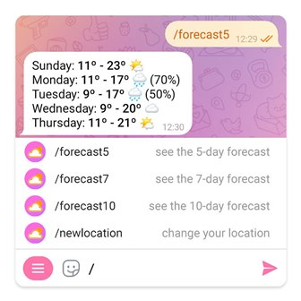
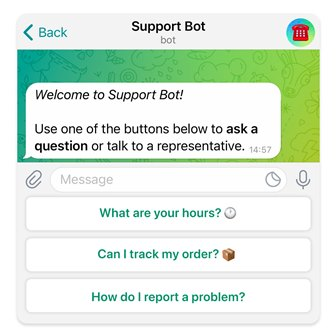
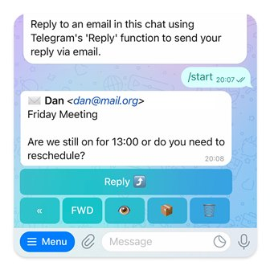
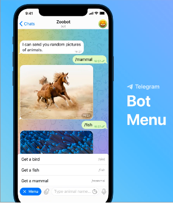
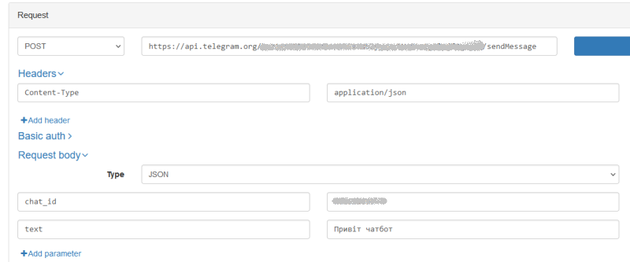

[15. Інтегрування з хмарними сховищами <--   ](15.md) [Лекції](README.md) 

# 16. Інтегрування з месенджерами

## 16.1. Месенджери та чат-боти 

**Месенджер** - це програма чи платформа, яка дозволяє користувачам обмінюватися повідомленнями. Ці програми дають можливість надсилати текстові, голосові, відео- та фото-повідомлення, використовуючи Інтернет. Месенджери використовуються для особистих чатів між користувачами, групових чатів для спільного обговорення тем, а також для відео- та аудіодзвінків. Деякі з найпопулярніших месенджерів у світі включають Telegram, WhatsApp, Facebook Messenger, Viber, і Signal.

Ці платформи зазвичай працюють на різних пристроях (смартфони, комп'ютери, планшети), дозволяючи користувачам спілкуватися з іншими в будь-який час та з будь-якого місця, де є доступ до Інтернету. Більшість месенджерів також надають можливість обміну файлами, використання стікерів, емоджі та інших елементів для розширення способів спілкування.

Для зв'язку сторонніх застосунків з месенджерами ті надають API, що дозволяє створювати зв'язок між зовнішніми програмами та платформами месенджерів, використовуючи їхні функції та можливості. API для месенджерів можуть містити різноманітні функції, такі як:

1. **Надсилання повідомлень:** Розробники можуть використовувати API для надсилання текстових, голосових, відео- та фото-повідомлень у месенджери.
2. **Створення групових чатів:** Інтерфейс API дозволяє розробникам створювати групові чати та керувати ними через свої програми.
3. **Відправлення файлів:** Розробники можуть надсилати файли різних форматів, такі як документи, зображення, відео тощо, через месенджери.
4. **Організація дзвінків та відеодзвінків:** Деякі API дозволяють інтегрувати функції дзвінків та відеодзвінків у сторонні додатки.

Використання API дозволяє розробникам створювати **чат-ботів**, які можуть взаємодіяти з користувачами через месенджери, використовуючи їхні можливості. Це означає, що чат-бот може відправляти повідомлення, обробляти запити, надавати інформацію чи послуги через месенджер, забезпечуючи зручну та доступну форму комунікації для користувачів. Чат-боти можуть мати різні функції та застосовуватися в різних галузях, одні з найпоширеніших сфер:

1. **Клієнтське обслуговування:** Вони допомагають вирішувати запитання клієнтів, надають інформацію про продукти чи послуги, а також надають підтримку в режимі реального часу.
2. **Електронна комерція:** Чат-боти можуть допомагати вибирати товари, здійснювати покупки та вирішувати питання про доставку чи оплату.
3. **Управління завданнями:** Вони можуть допомагати в організації робочих завдань, наприклад, створювати списки справ або нагадувати про важливі події.
4. **Освіта та навчання:** Чат-боти можуть бути використані для навчання, надання корисних порад або відповідей на питання з певної області знань.

У розподілених застосунках чат-боти грають важливу роль, оскільки вони можуть забезпечувати доступ до інформації та сервісів у режимі реального часу, допомагаючи спрощувати комунікацію та вирішувати завдання без прямого участі людини. Це особливо актуально в умовах розподіленості, коли доступ до фізичного сервісу чи підтримки може бути обмеженим.

Інтеграція чат-ботів з месенджерами – це процес підключення програмного забезпечення (бота) до платформи месенджера для ведення спілкування з користувачами через цю платформу. Це дозволяє користувачам спілкуватися з ботом безпосередньо в месенджері, з якого вони вже користуються. Основні переваги інтеграції ботів з месенджерами включають:

1. **Зручність для користувачів:** Користувачам не потрібно встановлювати окремі додатки чи програми для спілкування з ботом. Вони можуть взаємодіяти з ним прямо в звичному месенджері.
2. **Широкий охоплення аудиторії:** Месенджери мають велику базу активних користувачів, тому інтеграція з ними дозволяє ботам отримати доступ до широкої аудиторії.
3. **Використання функціоналу месенджера:** Боти можуть використовувати можливості месенджера, такі як передача файлів, голосові повідомлення, стікери тощо, для більш різноманітної та ефективної комунікації.
4. **Автоматизація комунікації:** Інтеграція ботів з месенджерами дозволяє автоматизувати відповіді на типові запитання чи запити користувачів, що полегшує навантаження на підтримку.

Деякі з популярних месенджерів, які підтримують інтеграцію з чат-ботами, включають Facebook Messenger, WhatsApp, Telegram, Viber та інші. Це надає розробникам можливість створювати ботів, які можна використовувати на різних платформах для більш широкого охоплення аудиторії.

## 16.2. Чат-боти в Telegram

Telegram - це популярний месенджер, який надає широкі можливості для використання чат-ботів. Хоч сервіс Telegram має неоднозначну репутацію і наразі не рекомендується для використання в приватних та секретних комунікаціях, він має дуже простий безкоштовний API, що надає змогу експериментувати в навчальних цілях, та використовувати для автоматизації певних процесів. 

Ось кілька ключових можливостей ботів в Telegram:

1. **Боти-асистенти:** Telegram підтримує різноманітні боти-асистенти, що можуть надавати користувачам інформацію, розважати чи допомагати у вирішенні побутових завдань.
2. **Інтерактивність:** Боти в Telegram можуть працювати з кнопками, відео, зображеннями та іншими мультимедійними елементами, що робить спілкування з ними більш інтерактивним.
3. **Групові чати:** Боти можуть бути використані для автоматизації операцій в групових чатах, наприклад, для створення опитувань, організації розсилок чи навіть модерації.
4. **API для розробників:** Telegram надає документацію та API для розробників, що дозволяє створювати потужні боти з різноманітним функціоналом.

Боти в Telegram дозволяють реалізовувати різноманітні ідеї від простих автоматизованих відповідей до складних сервісів інтерактивної комунікації з користувачами. Користувачі можуть взаємодіяти з ботами, надсилаючи їм повідомлення, команди та вбудовані запити. Будь хто може створити свого бота та керувати ним за допомогою запитів HTTPS з використанням [Bot API](https://core.telegram.org/bots/api).

По суті, боти Telegram - це спеціальні облікові записи, для налаштування яких не потрібен додатковий номер телефону. Користувачі можуть взаємодіяти з ботами двома способами:

- Надсилати повідомлення та команди ботам, відкриваючи з ними чат або додаючи їх до груп.
- Надсилати запити безпосередньо з поля введення, ввівши `@username` бота та запит. Це дозволяє надсилати вміст із вбудованих ботів (inline bots) безпосередньо в будь-який чат, групу чи канал.

На відміну від користувачів-людей, боти мають такі особливості:

- Боти не мають однайн статусу та не мають останніх побачених часових відміток, замість цього на інтерфейсі відображається мітка **"бот"**.
- Боти мають обмежену хмарну пам’ять - застарілі повідомлення можуть бути видалені сервером незабаром після їх обробки.
- Боти не можуть ініціювати розмову з користувачами. Користувач **повинен** або додати їх до групи, або спочатку надіслати їм повідомлення. Люди можуть використовувати посилання `t.me/<ім'я_бота>` або знайти його по імені користувача, щоб знайти свого бота.
- Імена користувачів ботів завжди закінчуються на "Bot" (наприклад, `@TriviaBot`, `@GitHub_bot`).
- При додаванні до групи, боти не отримують усі повідомлення за замовчуванням 

Повідомлення, команди та запити, надіслані користувачами, передаються програмному забезпеченню, яке працює на серверах, що керуються власниками ботів. Посередницький сервер Telegram обробляє все шифрування та зв’язок із Telegram API. Спілкування з цим сервером відбувається за допомогою HTTPS-інтерфейсу, який пропонує спрощену версію API Telegram - так званим [Bot API](https://core.telegram.org/bots/api).

## 16.3. Створення Telegram-бота

Для створення Telegram-бота є спеціальний бот - [BotFather](https://t.me/botfather) , який в інтерактивному режимі допомагає створити та адмініструвати бота. Ось послідовність кроків:

1. **Знайомство з BotFather:** Знайти BotFather в Telegram (пошуковий запит "@BotFather"), розпочати чат з ним та створення нового бота.
2. **Створення нового бота:** Ввести або обрати команду `/newbot` та дотримуватися інструкцій BotFather. Вибрати ім'я для бота та отримати унікальне користувацьке ім'я для бота, закінчене на "bot".
3. **Отримання токену доступу:** Після успішного створення бота, BotFather надішле власнику токен (маркер) доступу. Цей токен буде потрібен для з'єднання програми користувача з API Telegram для бота.
4. **Розроблення бота:** Для розроблення бота можна використовувати різні мови програмування та використовувати Telegram Bot API.
5. **Реєстрація обраних команд:** Можна зареєструвати команди для бота через BotFather, додати опис, зображення та інші налаштування.
6. **Тестування бота:** Після створення функціоналу бота, можна почати тестування. Зайти у чат з власним ботом та спробувати виконати створені команди.
7. **Розгортання на сервері:** Якщо бот створюється для публічного використання, власнику може знадобитися розгортання бота на сервері, щоб він був доступний постійно.

​    [

рис.16.1. Зображення Botfather Telegram

## 16.4. Можливості Telegram-ботів

Нижче наведені деякі можливості Telegram-ботів.  Повний опис можливостей наведений [за посиланням](https://core.telegram.org/bots/features)

Користувачі можуть надсилати ботам будь-які типи повідомлень, зокрема текст, файли, розташування, наклейки (стікери), голосові повідомлення та навіть кубки. У той же час боти Telegram пропонують також багато інших інструментів для створення гнучких інтерфейсів, адаптованих до конкретних потреб:

- Команди, які підсвічуються в повідомленнях і їх можна вибрати зі списку після введення `/`.
- Клавіатури, які замінюють клавіатуру користувача попередньо означеними варіантами відповіді.
- Кнопки, які відображаються поруч із повідомленнями від бота.

Для ще більшої гнучкості Веб-застосунки підтримують 100% користувацькі інтерфейси з JavaScript.

Боти Telegram можуть підтримувати кілька мов, які адаптуються до мовних налаштувань користувачів у програмі.

### Команди

Команда — це просте `/ключовеслово`, яке повідомляє боту, що робити. Програми Telegram надають можливість:

- підсвічувати команди в повідомленнях; коли користувач торкається виділеної команди, ця команда негайно надсилається до бота;
- виводити список підтримуваних команд з описами, для чого користувач вводить `/` ; щоб це працювало, потрібно надати список команд @BotFather або використати відповідний метод API; вибір команди зі списку негайно надсилає її.
- показати кнопку меню, яка містить усі або деякі команди бота (які ви встановлюєте через `@BotFather`).

Команди завжди мають починатися з символу `/` і містити до 32 символів. Вони можуть використовувати латинські літери**, **цифри та підкреслення, хоча для чіткішого вигляду рекомендується використовувати простий текст малими літерами. Ось кілька прикладів: `/next` , `/cancel` , `/newlocation` ,`/newrule` . Команди мають бути якомога конкретнішими – наприклад, `/newlocation` або `/newrule` краще, ніж команда `/new`, яка вимагає від користувача додаткового параметра, як-от `location` або `rule`.



рис.16.2. Приклад інтерфейсу боту

Щоб забезпечити послідовність та зручність роботи ботів Telegram усі розробники мають підтримували кілька глобальних базових команд. Застосунки Telegram мають інтерфейсні ярлики для цих команд.

- `/start` - починає взаємодію з користувачем, як відправка вступного повідомлення. Цю команду також можна використовувати для передачі боту додаткових параметрів (див. Глибоке посилання).
- `/help` - повертає довідкове повідомлення, наприклад короткий текст про те, що може робити ваш бот, і список команд.
- `/settings` - (якщо є) показує налаштування бота для цього користувача та пропонує команди для їх редагування.

Коли користувачі вперше відкриють чат із ботом, вони побачать кнопку `Почати`. Якщо у `@BotFather` будуть додані команди `/help` і `/settings`, вони також будуть доступні на сторінці профілю бота.  

Бот може показувати різні команди різним користувачам і групам, що налаштовується за допомогою області застосування (scopes). Наприклад, бот може показувати додаткові команди адміністраторам групи або перекладати список команд на основі коду мови користувача.

### Клавіатури

Боти можуть інтерпретувати вільний текст, введений користувачами, але надання варіантів відповідей часто більш інтуїтивно зрозуміле. Для цього можна використати спеціальні клавіатури. Щоразу, коли бот надсилає повідомлення, він може відображати внизу спеціальну клавіатуру (рис. 16.3) з попередньо означеними параметрами відповіді (див. формати повідомлень). Програми Telegram, які отримують повідомлення, відображатимуть користувачеві клавіатуру. Використання будь-якої кнопки негайно надішле відповідний текст. Таким чином можна значно спростити та оптимізувати взаємодію користувача з ботом.



рис.16.3. Приклад клавіатури

Необхідно перевіряти параметр `one_time_keyboard`, щоб автоматично приховати клавіатуру бота, щойно вона використається. Також можна налаштувати текстовий заповнювач у полі введення, встановивши параметр `input_field_placeholder`.

### Вбудовані клавіатури

Вбудовані клавіатури - це клавіатури , які відображаються безпосередньо під відповідними повідомленнями (рис.16.4). На відміну від звичайних клавіатур, натискання кнопок на вбудованих клавіатурах не приводить до надсилання повідомлення в чат. Натомість вбудовані клавіатури підтримують кнопки, які можуть працювати в фоні або відкривати різні інтерфейси: кнопки зворотного виклику, кнопки URL-адреси, кнопки перемикання на вбудовані клавіатури, ігрові кнопки і кнопки оплати.

Щоб забезпечити кращу взаємодію з користувачем, необхідно подумати про редагування клавіатури, коли користувач перемикає кнопку налаштування. Це може привести до переходу на нову сторінку, що і швидше, і плавніше, ніж надсилання цілого нового повідомлення та видалення попереднього.



рис.16.4. Приклад вбудованої клавіатури

### Кнопка меню

У всіх чат-ботах біля поля повідомлення з’являється кнопка меню. За умовчанням натискання цієї кнопки відкриває меню, яке може містити деякі або всі команди бота, включаючи короткий опис для кожної. Потім користувачі можуть вибрати команду з меню без необхідності вводити її.

Ви можете встановити різні тексти кнопки меню та описи її команд для різних користувачів або груп користувачів – наприклад, відображати перекладений текст на основі мови користувача. Крім того, кнопку меню можна використовувати для запуску веб-застосунку. Кнопки меню налаштовуються через `@BotFather`  або API.



рис.16.5.Приклад використання меню

### Взаємодія з ботом

Є кілька способів взаємодії з ботом:

- надсилання команд і повідомлень у чат із ботом або в групі, де він присутній 
- вбудований режим (Inline mode) дозволяє надсилати запити роботам прямо з поля введення – з будь-якого чату в Telegram.
- глибоке посилання (Deep linking) дозволяє використовувати спеціальні посилання, які надсилають певні параметри боту під час відкриття.
- інтеграція меню вкладень (Attachment menu) дає змогу використовувати ботів із меню вкладень у чатах.

Користувачі можуть взаємодіяти з ботом за допомогою **вбудованих запитів** прямо з поля повідомлення в будь-якому чаті. Все, що їм потрібно зробити, це почати повідомлення з `@username` вашого бота та ввести ключове слово. Отримавши запит, бот може видати деякі результати. Щойно користувач вибирає один із них, він надсилається у відповідний чат. Таким чином, люди можуть запитувати та надсилати вміст від бота в будь-якому зі своїх чатів, груп або каналів. Функції вбудованих запитів потрібно ввімкнути через `@BotFather`. Приклади вбудованих ботів включають [@gif](https://gif.t.me), [@bing](https://bing.t.me) і [@wiki](https://wiki.t.me). В мережі також можна використовувати [Web App](https://core.telegram.org/bots/features#web-apps) боти, наприклад [@durgerkingbot](https://durgerkingbot.t.me).

Боти Telegram мають механізм **глибокого посилання**, який дозволяє передавати боту під час запуску додаткові параметри . Це може бути команда, яка запускає бота, або токен автентифікації для підключення облікового запису Telegram користувача до його облікового запису на іншій платформі. Кожен бот має посилання, яке відкриває розмову з ним у Telegram – `https://t.me/<bot_username>`. До цього посилання можна додавати безпосередньо параметри, які дозволять боту працювати з додатковою інформацією на льоту, без жодного введення користувача. Дозволені символи `A-Z`, `a-z`, `0-9`, `_` і `-` . Для кодування параметрів у бінарному та інших типах вмісту рекомендується використовувати base64url. Параметр може мати до 64 символів.

У приватних чатах ви можете використовувати параметр `start`, щоб автоматично передавати будь-яке значення боту щоразу, коли користувач натискає посилання. Наприклад, можна використовувати:

```
https://t.me/your_bot?start=airplane
```

Коли хтось відкриє чат із ботом за цим посиланням, бот отримає команду:

```
/start airplane
```

У групах до цього посилання можна додати параметр `startgroup`. Наприклад:

```
https://t.me/your_bot?startgroup=spaceship
```

Перехід за посиланням із цим параметром запропонує користувачеві вибрати групу для додавання бота – отримане оновлення міститиме текст у формі:

```
/start@your_bot spaceship
```

Певних ботів можна додавати безпосередньо до **меню вкладень** користувача, надаючи їм легкий доступ до бота в будь-якому чаті. Наразі ця опція доступна лише певним [схваленим ботам](https://core.telegram.org/bots/webapps#launching-web-apps-from-the-attachment-menu), але пізніше її можна розширити.

## 16.5.Telegram Bot API

Пропонується два типи API для розробників:

- Bot API дозволяє легко створювати застосунки, які використовують повідомлення Telegram у якості інтерфейсу 
- Telegram API і TDLib дозволяють створювати власні клієнти Telegram. 

Обидва API можна використовувати безкоштовно. Нижче наводиться деякі можливості Bot API, детальніше можна познайомитися [на сайті](https://core.telegram.org/bots).  

### Структура запиту/відповіді

Кожному боту під час його створення надається унікальний токен(маркер) автентифікації. Маркер виглядає приблизно так: `123456:ABC-DEF1234ghIkl-zyx57W2v1u123ew11`, але замість цього нижче в описі буде використовуватися просто слово `<token>`. 

Усі ресурси в запитах до API Telegram Bot мають обслуговуватися через HTTPS і мають бути представлені в цій формі:

```http
https://api.telegram.org/bot<token>/METHOD_NAME
```

Зверніть увагу, що `METHOD_NAME` це не метод HTTP, а метод API.

Наприклад:

```http
GET https://api.telegram.org/bot123456:ABC-DEF1234ghIkl-zyx57W2v1u123ew11/getMe
```

Підтримуються методи HTTP `GET` і `POST` і чотири способи передачі параметрів у запитах API ботів:

- через передачу параметрів в URL
- через тіло `application/x-www-form-urlencoded`
- через тіло`application/json` (за виключенням завантаження файлів)
- через тіло `multipart/form-data` (для завантаження файлів)

Відповідь містить об’єкт JSON, який завжди має логічне поле `ok` і може мати необов’язкове поле  `description` типу String із зрозумілим для людини описом результату. Якщо `ok` дорівнює `True`, запит виконано успішно, і результат запиту можна знайти в полі `result`. У разі невдалого запиту `ок=false`, а помилка пояснюється в `description`. Також повертається поле `error_code` типу Integer, але його вміст може бути змінено в майбутньому. Деякі помилки також можуть мати необов’язкове поле `parameters` типу `ResponseParameters`, яке може допомогти автоматично обробити помилку.

Усі методи в API бота нечутливі до регістру, а запити мають виконуватися за допомогою UTF-8.

Є два взаємовиключних способи отримання оновлень з чатів для бота:

- метод `getUpdates`, який передбачає періодичне опитування серверу
- веб-хуки (webhooks), який передбачає зворотній виклик

Вхідні оновлення зберігаються на сервері, поки бот не отримає їх у той чи інший спосіб, але вони зберігатимуться не довше 24 годин. 

Незалежно від того, який варіант використовується, в результаті буде отримано JSON-серіалізовані об’єкти `Update` (див нижче).  

### Робота з API

Весь перелік яких доступний [за посиланням](https://core.telegram.org/bots/api#available-methods). Нижче наведені деякі з них.

#### Тест доступу getMe

Простий метод тестування токена автентифікації бота. Викликається з використанням методу `GET` Не вимагає параметрів. Повертає основну інформацію про бота у формі об’єкта [User](https://core.telegram.org/bots/api#user). Приклад запиту:

```http
GET https://api.telegram.org/bot<token>/getMe
```

Приклад відповіді:

```json
{"ok":true,
 "result":{
     "id":898569328,
  	"is_bot":true,
  	"first_name":"AKTSUchatBot", 
  	"username":"AKTSUchatBot",
  	"can_join_groups":true,
  	"can_read_all_group_messages":false,
  	"supports_inline_queries":false
 }
}
```

#### Періодичне оновлення через getUpdates

Для періодичного оновлення використовується метод `getUpdates`.  Метод використовує HTTP-метод `GET`, який може включати необов'язкові параметри, які наведені [за посиланням](https://core.telegram.org/bots/api#getupdates). У відповідь повертається масив об’єктів оновлення `Update`. Запит має вигляд:

```http
GET https://api.telegram.org/bot<token>/getUpdates
```

#### Об'єкт Update

Об’єкт `Update` представляє вхідне оновлення. У будь-якому окремому оновленні може бути присутнім щонайбільше один із додаткових (необов'язкових) параметрів.

| Поле                 | Тип                                                          | Опис                                                         |
| -------------------- | ------------------------------------------------------------ | ------------------------------------------------------------ |
| update_id            | Integer                                                      | Унікальний ідентифікатор оновлення. Ідентифікатори оновлення починаються з певного додатного числа та послідовно збільшуються. Якщо принаймні протягом тижня немає нових оновлень, ідентифікатор наступного оновлення буде вибрано випадково, а не послідовно. |
| message              | [Message](https://core.telegram.org/bots/api#message)        | *Необов’язково*. Нове вхідне повідомлення будь-якого типу - текст, фото, стікер тощо. |
| edited_message       | [Message](https://core.telegram.org/bots/api#message)        | *Необов’язково*. Нова версія повідомлення, яка відома боту та була відредагована |
| channel_post         | [Message](https://core.telegram.org/bots/api#message)        | *Необов’язково*. Нова вхідна публікація каналу будь-якого типу - текст, фото, наклейка тощо. |
| edited_channel_post  | [Message](https://core.telegram.org/bots/api#message)        | *Необов’язково*. Нова версія публікації на каналі, яка відома боту та була відредагована |
| inline_query         | [InlineQuery](https://core.telegram.org/bots/api#inlinequery) | *Необов’язково*. Новий вхідний вбудований запит (див. вбудований режим в "взаємодія з ботом") |
| chosen_inline_result | [ChosenInlineResult](https://core.telegram.org/bots/api#choseninlineresult) | *Необов’язково*. Результат [вбудованого](https://core.telegram.org/bots/api#inline-mode) запиту, який вибрав користувач і надіслав своєму партнеру в чаті. |
| callback_query       | [CallbackQuery](https://core.telegram.org/bots/api#callbackquery) | *Необов’язково*. Новий вхідний запит зворотного виклику      |
| shipping_query       | [ShippingQuery](https://core.telegram.org/bots/api#shippingquery) | *Необов’язково*. Новий вхідний запит на доставку. Лише для рахунків із гнучкою ціною |
| pre_checkout_query   | [PreCheckoutQuery](https://core.telegram.org/bots/api#precheckoutquery) | *Необов’язково*. Новий вхідний запит перед розрахунком. Містить повну інформацію про оформлення замовлення |
| poll                 | [Poll](https://core.telegram.org/bots/api#poll)              | *Необов’язково*. Новий стан опитування. Боти отримують лише оновлення про зупинені опитування та опитування, які надсилає бот |
| poll_answer          | [PollAnswer](https://core.telegram.org/bots/api#pollanswer)  | *Необов’язково*. Користувач змінив свою відповідь у неанонімному опитуванні. Боти отримують нові голоси лише в опитуваннях, надісланих самим ботом. |
| my_chat_member       | [ChatMemberUpdated](https://core.telegram.org/bots/api#chatmemberupdated) | *Необов’язково*. У чаті бота оновлено статус учасника чату. Для приватних чатів це оновлення отримується лише тоді, коли бот заблоковано або розблоковано користувачем. |
| chat_member          | [ChatMemberUpdated](https://core.telegram.org/bots/api#chatmemberupdated) | *Необов’язково*. У чаті оновлено статус учасника чату. Щоб отримувати ці оновлення, бот має бути адміністратором у чаті та має чітко вказати `"chat_member"` у списку *allowed_updates*. |
| chat_join_request    | [ChatJoinRequest](https://core.telegram.org/bots/api#chatjoinrequest) | *Необов’язково*. Запит на приєднання до чату надіслано. Щоб отримувати ці оновлення, бот повинен мати права адміністратора *can_invite_users* у чаті. |

Нижче наведений приклад відповіді, який в полі `result` місить один елемент масиву - об'єкт `Update`, який містить тільки два поля: `update_id` та `message`.

```json
{
  "ok": true,
  "result": [{
      "update_id": 60872760,
      "message": {
        "message_id": 514,
        "from": {...},
        "chat": {...},
        "date": 1670484704,
        "text": "/start",
        "entities": [...]
      }
    }]
}
```

#### Відправка повідомлення sendMessage

Цей метод використовується для надсилання текстових повідомлень, використовує `POST` з типом `JSON`. У разі успіху назад повертається надіслане повідомлення. Використовуються наступні параметри:

| Параметри                   | Тип                                                          | Обов'я-зковість | Опис                                                         |
| --------------------------- | ------------------------------------------------------------ | --------------- | ------------------------------------------------------------ |
| chat_id                     | Integer or String                                            | так             | Унікальний ідентифікатор цільового чату або ім’я користувача цільового каналу (у форматі `@Channelusername`) |
| text                        | String                                                       | так             | Текст повідомлення для надсилання, 1-4096 символів після розбору сутностей |
| parse_mode                  | String                                                       | ні              | Режим парсингу сутностей у тексті повідомлення. Докладніше див. нижче Форматування повідомлення |
| entities                    | Array of [MessageEntity](https://core.telegram.org/bots/api#messageentity) | ні              | JSON-серіалізований список спеціальних сутностей, що з'являються в тексті повідомлення, який можна вказати замість *parse_mode* |
| disable_web_page_preview    | Boolean                                                      | ні              | Вимкнути попередній перегляд посилань для посилань у цьому повідомленні |
| disable_notification        | Boolean                                                      | ні              | Надсилає повідомлення мовчки. Користувачі отримають сповіщення без звуку. |
| reply_to_message_id         | Integer                                                      | ні              | Якщо повідомлення є відповіддю, ідентифікатор вихідного повідомлення |
| allow_sending_without_reply | Boolean                                                      | ні              | Передайте *True*, якщо повідомлення слід надіслати, навіть якщо вказане повідомлення з відповіддю не знайдено |
| reply_markup                | [InlineKeyboardMarkup](https://core.telegram.org/bots/api#inlinekeyboardmarkup) або [ReplyKeyboardMarkup](https://core.telegram.org/bots/api#replykeyboardmarkup) або [ReplyKeyboardRemove](https://core.telegram.org/bots/api#replykeyboardremove) або [ForceReply](https://core.telegram.org/bots/api#forcereply) | ні              | Додаткові параметри інтерфейсу. Об'єкт, серіалізований JSON для вбудованої клавіатури, спеціальна клавіатура відповідей, інструкції щодо видалення клавіатури відповідей або примусової відповіді від користувача. |

На рис.16.6. Наведений приклад відправки текстового повідомлення за допомогою плагіна RESTED.



рис.16.6.Приклад відправки текстового повідомлення

#### Форматування повідомлень

API Bot підтримує базове форматування повідомлень. У повідомленнях ботів можна використовувати жирний, курсивний, підкреслений і закреслений текст, а також вбудовані посилання та попередньо відформатований код. Для цього можна скористатися форматуванням markdown-style або стилем HTML. Зауважте, що клієнти Telegram покажуть користувачеві попередження перед відкриттям вбудованого посилання ('Відкрити це посилання?' Разом із повною URL -адресою).

Для згадування користувача за його ідентифікатором без використання імені користувача можна використовувати посилання `tg://user?Id=<user_id>`. Ці посилання працюватимуть лише, якщо вони використовуються всередині inline link. Наприклад, вони не працюватимуть, якщо вони використовуються у вбудованій кнопці клавіатури або у тексті повідомлення. Ці посилання гарантовано спрацюють, лише якщо користувач раніше звертався до бота, надіслав боту запит зворотного дзвінка за допомогою вбудованої кнопки або є учасником групи, де він був згаданий.

Щоб скористатися режимом **MarkdownV2 style**, необхідно передати у поле `parse_mode` значення `MarkdownV2`  

~~~markdown
*bold \*text*
_italic \*text_
__underline__
~strikethrough~
*bold _italic bold ~italic bold strikethrough~ __underline italic bold___ bold*
[inline URL](http://www.example.com/)
[inline mention of a user](tg://user?id=123456789)
`inline fixed-width code`
```
pre-formatted fixed-width code block
```
```python
pre-formatted fixed-width code block written in the Python programming language
```
~~~

Щоб використовувати режим `HTML style` необхідно передати у поле `parse_mode` значення  `HTML`. Наразі підтримуються такі теги:

```html
<b>bold</b>, <strong>bold</strong>
<i>italic</i>, <em>italic</em>
<u>underline</u>, <ins>underline</ins>
<s>strikethrough</s>, <strike>strikethrough</strike>, <del>strikethrough</del>
<span class="tg-spoiler">spoiler</span>, <tg-spoiler>spoiler</tg-spoiler>
<b>bold <i>italic bold <s>italic bold strikethrough <span class="tg-spoiler">italic bold strikethrough spoiler</span></s> <u>underline italic bold</u></i> bold</b>
<a href="http://www.example.com/">inline URL</a>
<a href="tg://user?id=123456789">inline mention of a user</a>
<tg-emoji emoji-id="5368324170671202286"></tg-emoji>
<code>inline fixed-width code</code>
<pre>pre-formatted fixed-width code block</pre>
<pre><code class="language-python">pre-formatted fixed-width code block written in the Python programming language</code></pre>
```

Варто зауважити про необхідність екранування багатьох символів як для Markdown так і для HTML, як це написано [за посиланням](https://core.telegram.org/bots/api#markdownv2-style). 

#### Оновлення через webhooks

Замість періодичного опитування можна використати WEB-аналог функцій зворотного виклику, який прийнято називати веб-хук (webhook). 

Для цього використовується метод `setWebhook`. Цей метод використовується для того, щоб указати URL-адресу та отримувати вхідні оновлення через вихідний веб-хук. Щоразу, коли з’являється оновлення для бота, надсилається HTTPS-запит POST на вказану URL-адресу, що містить JSON-серіалізований об'єкт Update. Повертає `True` у разі успіху.

Якщо ви хочете переконатися, що вебхук налаштували ви, ви можете вказати секретні дані в параметрі `secret_token`. Якщо вказано, запит міститиме заголовок `X-Telegram-Bot-Api-Secret-Token` із секретним маркером як вміст.

| Параметр             | Тип                                                       | Обов'язковість | Опис                                                         |
| -------------------- | --------------------------------------------------------- | -------------- | ------------------------------------------------------------ |
| url                  | String                                                    | Yes            | URL-адреса HTTPS для надсилання оновлень. Використовуйте порожній рядок, щоб видалити інтеграцію webhook |
| certificate          | [InputFile](https://core.telegram.org/bots/api#inputfile) | Optional       | Завантажте свій сертифікат відкритого ключа, щоб можна було перевірити кореневий сертифікат, який використовується. Перегляньте [self-signed guide](https://core.telegram.org/bots/self-signed), щоб дізнатися більше. |
| ip_address           | String                                                    | Optional       | Фіксована IP-адреса, яка використовуватиметься для надсилання запитів на вебхук замість IP-адреси, визначеної через DNS |
| max_connections      | Integer                                                   | Optional       | Максимально дозволена кількість одночасних підключень HTTPS до вебхука для доставки оновлень: 1–100. За замовчуванням *40*. Використовуйте нижчі значення, щоб обмежити навантаження на сервер вашого бота, і вищі значення, щоб збільшити пропускну здатність вашого бота. |
| allowed_updates      | Array of String                                           | Optional       | Серіалізований у форматі JSON список типів оновлень, які має отримувати ваш бот. Наприклад, вказати  `["message", "edited_channel_post", "callback_query"]` щоб отримувати лише оновлення цих типів. Перегляньте `Update`, щоб отримати повний список доступних типів оновлень. Укажіть порожній список, щоб отримати всі типи оновлень, крім *chat_member* (за замовчуванням). Якщо не вказано, буде використано попереднє налаштування. Зауважте, що цей параметр не впливає на оновлення, створені до виклику `setWebhook`, тому протягом короткого періоду часу можуть надходити небажані оновлення. |
| drop_pending_updates | Boolean                                                   | Optional       | Вкажіть*True* щоб видалити всі незавершені оновлення         |
| secret_token         | String                                                    | Optional       | Секретний токен, який надсилається в заголовку «X-Telegram-Bot-Api-Secret-Token» у кожному запиті на вебхук, 1–256 символів. Дозволяються лише символи «A-Z», «a-z», «0-9», «_» і «-». Заголовок корисний, щоб переконатися, що запит надходить із встановленого вами вебхуку. |

Варто зауважити що ви не зможете отримувати оновлення за допомогою `getUpdates`

Приклад оновлення через WebHook описаний в статті [за посиланням](https://dou.ua/forums/topic/30653/)  

## Контрольні питання

1. Які функції надають месенджери і яку роль можуть відігравати чат-боти в ньому?
2. Що таке боти в Telegram?
3. Які особливості мають боти в Telegram?
4. Що таке Bot API?
5. Які кроки створення власного бота?
6. Розкажіть про призначення команд в Telegram ботах.
7. Які базові команди рекомендується використовувати для всіх Telegram ботів?
8. Розкажіть про призначення клавіатури в Telegram ботах.
9. Розкажіть про призначення вбудованої клавіатури в Telegram ботах.
10. Назвіть кілька способів взаємодії з Telegram ботом.
11. Яка структура url-ресусру для REST API Telegram боту?
12. Яка структура запиту та відповіді для REST API Telegram боту?
13. Яким чином можна отримувати нові дані з чатів для бота?
14. Розкажіть про метод `getUpdates` для REST API Telegram боту.
15. Розкажіть про метод `sendMessage` для REST API Telegram боту.
16. Яким чином можна відправляти відформатовані повідомлення для REST API Telegram боту?  

## Посилання на відеозаписи лекцій

[Запис відео лекції](https://youtu.be/LIg3VO7aXGQ)
