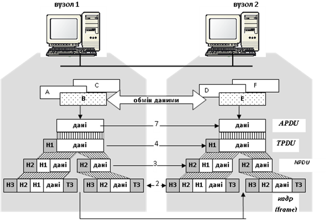
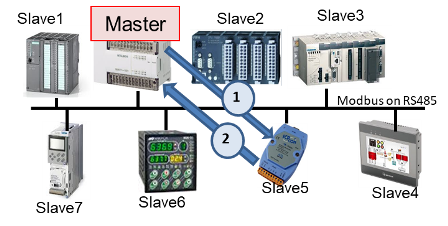
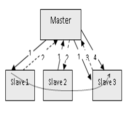
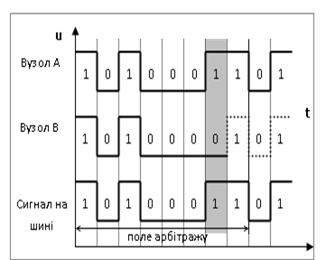
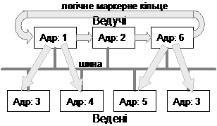
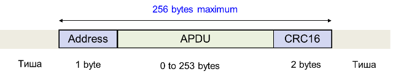
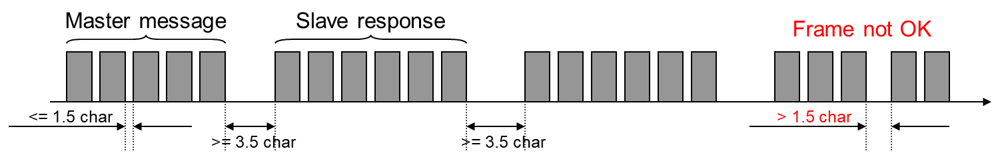

[2. Фізичний рівень <--   ](2.md) [Лекції](README.md) [   --> 4. Основи Ethernet](4.md)

# 3. Функції канального рівня

## 3.1. Організація зв'язку між процесами

На минулих лекціях було показано що комп'ютерні мережі потрібні для забезпечення зв'язку між різноманітними застосунками, які виконуються на комп'ютерах, або інших пристроях. У багатьох випадках учасниками зв'язку є різноманітні програми-служби, які не мають інтерфейсу з користувачем, бо носять службовий характер. Наприклад, коли відправляється документ на друк на мережному принтері, запускається служба, яка забезпечує обмін з цим принтером. Ці застосунки та служби с точки зору мережного обміну ведуть себе однаково, тому надалі будемо їх ототожнювати і називати прикладними процесами. Тобто **прикладний процес** в контексті даного курсу - це якась окрема програма, яка може бути учасником зв'язку. Таким чином, в комп'ютерних мережах саме прикладні процеси обмінюються даними між собою.

На минулих лекціях ми також відмітили, що для побудови такого обміну між прикладними процесами існують протоколи - правила обміну між учасниками. Цей обмін відбувається в багатошаровому осередку, що дає можливість забезпечити гнучкість і упорядкувати обмін. Тому прикладні процеси звертаються до служб (також прикладних процесів) нижнього рівня для забезпечення передачі даних до свого партнера на іншому пристрою. Ті у свою чергу звертаються до інших служб нижнього рівня для передачі даних по фізичній мережі. Це все супроводжується добавленням до даних, що передаються, додаткової службової інформації, щоб забезпечити їх взаємодію з використанням конкретних протоколів цих рівнів.    

рис.3.1. Багатошаровий обмін

Минулої лекції ми розглянули як ці дані зрештою передаються по фізичним середовищам. І там було показано, що організацією доставки даних конкретному пристрою цей рівень не займається, його задача виключно в передачі і прийманні набору бітів. У даній лекції розглядаються питання яким чином пристрої розуміють які дані призначені саме їм і контролюють правильність їх доставки. 

Також в даній лекції для кращого розуміння і порівняння розглядаються підходи, які використовуються не тільки в комп'ютерних мережах а і в промислових.

## 3.2. Забезпечення каналом зв’язку між вузлами   

Прикладні процеси виконуються на конкретних апаратних засобах – вузлах мережі. Під **вузлом мережі** будемо розуміти будь які пристрої, які підключені до мережі як пасивні або активні учасники. Це не тільки комп'ютери або асоційовані з ними вузли (планшети, смартфони, промислові контролери), а і інші типи кінцевих пристроїв - типу принтера, чи считувача штрих-кодів, засоба вводу/виводу, та різноманітні комунікаційні пристрої (комутатори, шлюзи) тобто будь що, що є частиною мережі і може інтерпретувати інформацію, яка в ній передається. Різні фізичні перетворювачі, репітери та інше обладнання, яке працює  тільки на фізичному рівні передачі в даному курсі не будемо вважати вузлами мережі.   

Для того, щоб передати дані між прикладними процесами, перш за все необхідно забезпечити зв’язок між вузлами. Створенням каналу зв’язку займаються **сутності канального рівня** (програмні драйвери, служби, мікросхеми) . 

Канальний рівень виконує ряд конкретних функцій: 

- забезпечує службовий інтерфейс для верхнього рівня, який ним послуговується; 
- обробляє помилки передачі даних в повідомленні; 
- керує потоком даних, що виключає порушення роботи повільних приймачів швидкими передавачами; 
- в мережах з загальним доступом організовує порядок доступу до загального середовища передачі та забезпечує доставку даних до потрібних вузлів. 

Канальний рівень оперує **кадрами** (Frame\), що являють собою послідовність інформаційних та службових байтів, які почергово відправляються сутністю фізичного рівня. 

В широкомовних мережах задачею канального рівня є забезпечення доставки кадрів конкретному(-ним) адресатові. Так як одночасно шину прослуховують всі приймачі, необхідно ідентифікувати того, кому призначений даний кадр. 

## 3.3. Адресація доставки кадрів 

В широкомовних мережах до одного фізичного каналу підключено кілька вузлів. Усі вузли прослуховують її і відповідно отримують однакові дані. Задача канального рівня відфільтрувати кадри, які не призначені для даного вузла (рис.3.2). 

Рис.3.2. Відфільтровування кадрів на канальному рівні

Доставка кадрів може проводитись одним із двох способів: 

-    доставка кадрів орієнтована на адресу вузлів (модель Source-Destination-msg);

-    доставка кадрів орієнтовна на ідентифікатор повідомлення (модель Producer-Consumer-msg).

Доставка кадрів по моделі Відправник-Адресат-msg (Source-Destination-msg\) орієнтована на адресацію вузлів отримувача (інколи також відправника), і є найбільш популярним способом доставки даних. У таких системах кожен вузол в мережі має свою унікальну адресу. При формуванні кадру, канальний рівень вузла відправника добавляє до нього заголовок з адресою (-сами) вузлів отримувачів. Всі вузли отримують цей кадр, але тільки вузли з вказаною адресою пропустять його для обробки верхнім рівням. Таким чином фільтр канального рівня кожного вузла налаштований на свою адресу. Адресу вузла на канальному рівні прийнято називати **MAC-адресою** (Media Access Control) або ще називають **апаратною адресою**. 

У різних протоколах використовуються свої механізми адресації, однак можна зробити деяку їх систематизацію. У мережах з методом доступу Ведучий-Ведений кожний Ведений повинен мати свою адресу, за якою він отримує кадри від Ведучого. Ведучий, в свою чергу, може не мати адреси, якщо всі кадри відправлені Веденими, будуть призначені йому. Для мереж з множинним доступом, відправник у кадрі повинен вказати окрім адреси отримувача ще і свою адресу. В іншому випадку не буде зрозуміло від кого прийшов кадр. 

Більшість мереж дозволяють проводити широкомовну передачу, тобто передавати дані всім вузлам на шині. Як правило це сервіси, які не передбачають відповіді або підтвердження від вузлів. Для широкомовної передачі виділяється спеціальна широкомовна адреса (наприклад усі логічні 1, по типу $11111111_2$), яка резервується для цих цілей, і пропускається фільтрами канального рівня. Крім широкомовної передачі, деякі мережі підтримують також багатоадресну передачу, коли кадр призначений групі вузлів.

У промислових мережах з загальним доступом зустрічаються інші способи фільтрації кадрів – на основі ідентифікаторів повідомлення, який отримав назву Виробник-Споживач-msg (Producer-Consumer-msg\). При такому способі адресації доставки кадрів, кожний кадр містить ідентифікаційне поле, по якому проводиться фільтрація. Фільтр кожного вузла налаштовується тільки на потрібну множину ідентифікаторів. Інакше кажучи, фільтр буде пропускати через себе тільки ті кадри, ідентифікатори яких відповідають одному із заданих значень. В системах Виробник-Споживач кожен кадр що передається по мережі повинен мати унікальний ідентифікатор, на який:

-  канальний рівень одного з вузлів буде налаштований як відправник (producer, Виробник);

-  канальний рівень вузлів призначення буде налаштований як отримувач (consumer, Споживач), тобто його фільтр буде пропускати цей кадр.

Модель адресації Виробник-Споживач-msg ефективна в мережах з груповою передачею даних, зокрема в системах з ідентифікованим обміном даними Виробник-Споживач. Найбільш популярним представником такого способу зараз є шина CAN, яка використовуються і в автомобілях.

Слід зазначити, що наведені моделі не являються загальноприйнятими і можуть відрізнятися від наведених в інших джерелах. Дані моделі використовуються тільки для зручності сприйняття матеріалу в даному курсі.

## 3.4. Методи доступу 

Оскільки широкомовні мережі, які використовують у якості носія сигналу металевий кабель, мають шинну топологію, то необхідно означити порядок доступу до єдиного каналу. Якщо у мережі з шинною топологією не буде чітко означено, хто в конкретний момент може займати шину для передачі, то може виникнути момент одночасної передачі бітової послідовності двома або кількома передавачами. Така ситуація називається **колізією**(Collision) або конфліктом. У цьому випадку приймачі не зможуть визначити, який біт був переданий, оскільки рівень сигналу буде результатом дій декількох передавачів. Окрім того, у деяких мережах таке взагалі неприпустимо, оскільки апаратура передачі пристроїв може вийти з ладу із-за значних струмів на шині. Організація доступу до шини – це одна з задач канального рівня. 

У промислових мережах найчастіше використовують централізовані методи доступу, тобто коли правом видачі дозволу на займання шини володіє один вузол. У кожний конкретний час саме він визначає, якому вузлу на шині зараз можна передавати дані. У комп'ютерних мережах найпопулярнішою сьогодні є комутований Ethernet, де немає необхідності у визначенні методу доступу (буде показано пізніше). Нижче розглянемо тільки кілька з методів доступу, які можуть зустрітися в комп'ютерних або промислових мережах.  

### Ведучий-Ведений 

Найбільш популярні серед мереж з централізованим методом доступу – мережі типу Ведучий-Ведений (Master-Slave\), у яких право на керування володінням шиною надається Ведучому, а Ведені займають шину тільки з його дозволу. Останні мають унікальну адресу (адреса Веденого), за допомогою якої Ведучий ідентифікує кому надсилається повідомлення. На рис.3.3 показаний приклад такої мережі - Modbus Serial. Це промислова мережа, яка базується на шинній топології з використанням інтерфейсу RS-485, який дуже популярний в промисловості. У один момент часу, тільки один пристрій може передавати дані. Це вирішує Ведучий (Master), який звертається до будь якого Веденого (Slave), коли йому заманеться.     

рис.3.3. Метод доступу Ведучий-Ведений на прикладі Modbus Serial on RS-485

Як правило у системах Ведучий-Ведені, Ведені є пасивними вузлами, які можуть тільки відповідати на запити Ведучого. Якщо при цьому прикладні процеси взаємодіють по моделі Клієнт-Сервер, то прикладний процес на вузлі з правами Ведучого завжди буде Клієнтом, а на вузлі Веденого – Сервером, що виключає можливість безпосереднього обміну між Веденими. 

Існують рішення (наприклад Profibus DP), в яких прикладний процес кожного вузла має право на ініціювання обміну. Для клієнт-серверної взаємодії це означає, що клієнтський прикладний процес може знаходитись на вузлі Веденого. Для реалізації такої схеми Ведучий проводить циклічне опитування (polling) кожного Веденого (рис.3.4). Якщо клієнтський прикладний процес Ведучого хоче звернутися до 1-го Процесу у списку веденого, система працює як в попередньому випадку. Якщо прикладному процесу Ведучого нічого не потрібно від 1-го Веденого, він надсилає йому запит ідентифікації, на який Ведений відповідає кадром підтвердження (на рис.3.4 це відповідно запити 1 і 2). Після обслуговування 1-го Веденого, Ведучий опитує 2-го і т.д. Якщо Процесу Веденого необхідно зробити клієнтський запит, замість підтвердження він надсилає кадр з цим запитом (3). У зв’язку з тим, що можливість зайняти шину передавачем Веденого регламентується Ведучим (адже той надав таке право запитом ідентифікації) принцип Ведучий-Ведений залишається. Після отримання кадру запиту Веденого, Ведучий йому відповідає звичайним підтвердженням (типу запит отримав, коли оброблю – відповім). Така схема дає можливість прикладним Процесам Веденого проявити себе в якості Клієнта, тому умовно будемо називати такі мережі Ведучий-Ведений з активними Веденими\. Ведучий постійно веде опитування Ведених, що веде до виявлення несправних вузлів, та дає можливість включати нові вузли з правами Веденого у мережу без переконфігурування Ведучого.

Рис.3.4. Функціонування мереж з активними Веденими: 1- ідентифікація або клієнтський запит,   2 - підтвердження Веденого, 3 - запит Веденого, 4 – підтвердження Ведучого

Слід зупинитися ще на одній принциповій відмінності між наведеними схемами функціонування Ведучий-Ведений. В обох випадках на канальному рівні використовується сервіс з підтвердженням без установки з’єднання. Тобто після кадру від Ведучого, повинен надійти відповідний кадр від Веденого. Щоб уникнути зависання роботи мережі, у випадку виходу з ладу Веденого існують тайм-аути – максимально можливий час очікування кадру від веденого. 

### Маркерне кільце

У методі маркерне кільце (Token Ring) кожен вузол займає шину для передачі на час володіння маркером, а після закінчення часу віддає маркер іншому вузлу. Маркерне кільце підходить для мереж з одноранговими вузлами, коли час володіння ресурсами шини (володіння маркером) рівномірно розділяється між учасниками. Така реалізація дозволяє економити часовий ресурс (якщо вузлу нічого передавати, він може передати маркер далі) та виявити відсутні вузли в мережі. Маркерне кільце наразі мало де використовується. 

### Довільний метод доступу

Множинний або довільний метод доступу передбачає доступ до шини будь якого вузла, коли в нього є дані для передачі. При використанні такого способу, в один із моментів обов’язково виникне колізія у випадку, коли більше ніж один вузол одночасно захоче передавати дані. Основні відмінності між протоколами довільного доступу визначаються способами вирішення цих колізій. 

У ряді таких протоколів передавач при необхідності відразу буде намагатися зайняти шину без її прослуховування.  Наприклад, є мережа з трьома вузлами А, В, С.  Коли у вузла А з’являються дані для передачі вузлу С, він займає шину. Поки передає вузол А, у вузла В теж з’являються дані для передачі, тому він теж починає їх передавати. Виникає колізія і вузол С не зможе отримати дані ні від вузла В, оскільки біти його кадру з самого початку перекриваються з бітами кадру вузла А, ні від вузла А, із-за спотворення другої частини кадру. Як бачимо вузол В не тільки не зміг передати свої кадри, а і завадив це зробити вузлу А.  

Для підвищення ефективності, ряд протоколів передбачають прослуховування шини перед тим, як зайняти її для передачі. Такі протоколи називають протоколами з контролем несучої CSMA(Carrier-Sense Multiple Access – множинний доступ з контролем несучої). Серед них найбільшу популярність має CSMA/CD (CSMA with Collision Detection – множинний доступ з контролем несучої і виявленням конфліктів), який використовується у класичному (не комутованому) Ethernet. Розглянемо принцип його функціонування на прикладі. Вузли А, В і С прослуховують шину. Коли у вузла А з’являються дані для передачі і при цьому шина вільна, він займає шину для передачі. Під час передачі кадра вузла А у вузлів В і С з’явилися дані для передачі. Вони виявляють зайнятість шини і чекають її звільнення. Як тільки шина звільнилася (тобто вузол А повністю передав весь кадр), вузли В і С одночасно намагаються передавати свої кадри, що приводить до колізії. Обидва вузли при передачі своїх бітів прослуховують канал, знову виявляють колізію і припиняють передачу. Кожен включає генератор випадкового часу, через який вони знову зможуть спробувати передати свій кадр. Якщо наприклад у вузла В генератор видав менший час - саме він починає передавати свій кадр.

### Множинний метод доступу з використанням поля арбітражу 

Один із цікавих способів вирішення колізій у мережах типу CSMA є використання у кадрах передачі поля арбітражу, який використовується в шинах CAN. Для реалізації такої схеми необхідно, щоб на шині один логічний сигнал фізично домінував над іншим логічним сигналом. Тобто, скажімо, при одночасній передачі логічної „1” вузлом А і логічного „0” вузлом „В” в результаті на шині була логічна „1”. В такому випадку логічну „1” називають домінантним бітом (dominant bit), а „0” – рецесивним (recessive bit). Всі вузли прослуховують шину, і як тільки вона стає вільною, вони можуть передавати свої кадри. Якщо два вузли одночасно доступилися до каналу, то при передачі бітів наступить момент, коли логічні стани біту одного і іншого вузла не співпадуть і домінантний біт буде визначальним (рис.3.5). Вузол, який передавав дані з рецесивним бітом побачить на шині не свою посилку і миттєво припинить передачу. Область бітів в яких виставляється пріоритет називається полем арбітражу\. Біти у полі арбітражу вузол виставляє виходячи зі своєї адреси або/і пріоритетності кадру. 

Рис.3.5. Вирішення колізій за допомогою поля арбітражу

### Гібридні методи доступу

Гібридні методи доступу використовують комбінацію з методів, розглянутих вище. Наприклад в мережах PROFIBUS використовується комбінація методу передачі маркеру і Master-Slave (рис.3.6). Всі вузли діляться на активні учасники – Ведучі, і пасивні – Ведені. Між активними учасниками передається маркер (логічне маркерне кільце), на час володіння яким він може спілкуватися з пасивними вузлами. 

 

Рис.3.6. Гібридний метод доступу в Profibus   

## 3.5. Формування кадру та контроль за помилками

Для обміну даними між канальними сутностями використовуються кадри (Frame). Кадри вміщують не тільки інформацію про дані процесу, а й додаткову службову інформацію. Канальний рівень користується сервісами фізичного рівня, який приймає потік бітів і передає їх за призначенням, додаючи службові сигнали (наприклад синхронізуючі). Цей потік не застрахований від помилок. Кількість прийнятих бітів може бути меншою, рівною або більшою кількості переданих біт. Крім того, значення прийнятих бітів може відрізнятися від переданих. Рівень передачі даних повинен знайти і по можливості виправити ці помилки.

На рис.3.7. показаний принцип побудови кадру в промислові мережі Modbus RTU. Цей кадр має досить просту структуру на наступній лекції розглянемо більш складніші кадри Ethernet. Отже, задача кадру доставити без помилок пакет APDU (Application Protocol Data Unit), що пересилає один прикладний процес іншому. Для того щоб це зробити до даних добавляється заголовок з адресою Веденого, кому призначено дані і кінцевик - контрольна сума, що розрахована за алгоритмом CRC16.    

рис.3.7. Побудова кадру на прикладі Modbus RTU

Передача кадрів може вестись як побітно, тобто послідовністю з різної кількості бітів, так і посимвольно (побайтно) – послідовністю символів. Символ вміщує не тільки біти даних, а й службові біти (стартовий, стоповий, біти парності тощо). У першому випадку між бітами в кадрі відсутні паузи, в другому – між бітами різних символів йде певна пауза, яка обумовлена стоповими бітами. На рис.3.8 показана структура кадру Modbus RTU з рис.3.7 у вигляді посимвольної передачі. Між символами йде певна пауза (до 1.5 часу символу), і якщо вона перевищить максимальний час це вважатиметься за помилку.   

рис.3.8. Принцип посимвольної (побайтної) передачі кадру.

Кадр який був відісланий приймачу може бути спотворений у результаті дій завад і не вірно прийнятий адресатом. Може виникнути ситуація, що кадр взагалі не дійде до отримувача, наприклад із-за виходу із ладу останнього. Оскільки однією з вимог промислових мереж є надійність, необхідно забезпечити контроль за доставкою кадру та його цілісністю. 

При передачі даних по фізичному каналу завади на лінії можуть спотворити один, або ще гірше, декілька бітів у кадрі. Для боротьби з помилками у мережах існують дві основні стратегії. Кожна з них передбачає додавання надлишкової інформації до даних, що передаються. Тобто до кадру добавляються допоміжні дані, які при його отриманні дозволяють отримувачу визначити помилку. 

- Перша стратегія, яка в основному використовується для дротового зв’язку, базується на тому, що допоміжні дані тільки *виявляють* *наявність* помилки. При такому підході отримувач по надлишковим даним аналізує правильність отриманих даних, і якщо помилка присутня - робить дію, відповідну до протоколу. У ряді протоколів робиться повторний запит, у інших відправляється негативне підтвердження, у третіх (як у Modbus RTU) отримувач просто ігнорує кадр. 
- Друга стратегія направлена на передачу надлишкових даних не тільки для ідентифікації помилки, а і для можливості відтворення помилкових даних. Цей підхід використовується в безпровідній передачі.  

Надлишкові дані, які добавляються до кадру для контролю за помилками і являються результатом певної функції над інформаційними даними, як правило називають ***контрольною сумою*** (Check Sum). Найбільш простий спосіб обрахунку контрольної суми може бути зроблений способом побітової логічної операції між кожним байтом кадру. Результат вставляється в кінець кадру, тобто в кінцевик. Як приклад - використання виключного АБО (XOR) над усіма інформаційними байтами.

Один з поширених алгоритмів обрахунку контрольної суми наведеним вище способом – це алгоритм ***LRC*** (Longitudinal Redundancy Check). Всі байти повідомлення арифметично сумуються між собою, а результат записується в байт. Під час певного кроку сума може вийти за межі одного байта, але старші біти в сумі не враховуються (відкидаються) і результат завжди буде одно-байтним. В кінці обрахунку міняється знак результату (помножується на «-1»).   

Метод ***CRC*** (Cyclic Redundancy Check) більш складніший у використанні, але у випадках коли можливе спотворення декількох бітів інформації – він більш надійний. Контрольна сума CRC використовується у багатьох мережних протоколах, наприклад в MODBUS RTU (CRC16). 

## Запитання для самоперевірки

1. Назвіть приклади прикладних процесів що беруть участь у мережному зв'язку 

2. Яким чином забезпечується передача даних між процесами у мережі?

3. Які функції виконує канальний рівень?

4. Поясніть що таке кадр (Frame) канального рівня?

5. Розкажіть про необхідність адресації вузлів в мережі.

6. Розкажіть про способи фільтрування кадрів вузлами та поясніть принципи кожного з них.

7. Розкажіть коли і навіщо необхідно керувати доступом до середовища передачі. Що таке колізія?

8. Розкажіть про принцип доступу Ведучий-Ведений.

9. Розкажіть про принцип доступу Маркерне кільце, та про гібридний спосіб.

10. Розкажіть про принципи доступу CSMA/CD

11. Розкажіть про принципи доступу  з використанням поля арбітражу

12. Розкажіть про принципи формування кадру. Наведіть приклади полів.

13. Що таке контрольна сума і які можливі реакції на отримання невірного кадру?

## Відеолекція

<iframe width="560" height="315" src="https://www.youtube.com/embed/py98P0jkrW8" title="YouTube video player" frameborder="0" allow="accelerometer; autoplay; clipboard-write; encrypted-media; gyroscope; picture-in-picture" allowfullscreen></iframe>

[2. Фізичний рівень <--   ](2.md) [Лекції](README.md) [   --> 4. Основи Ethernet](4.md)