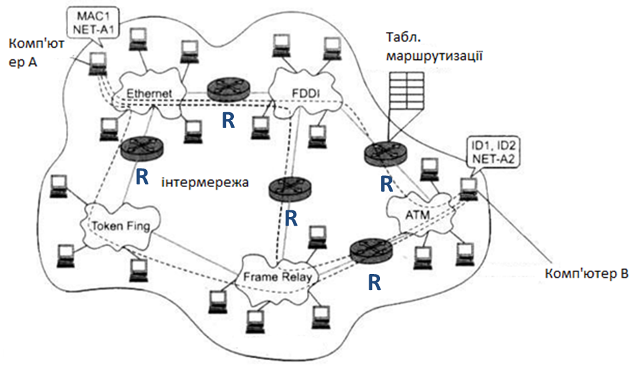
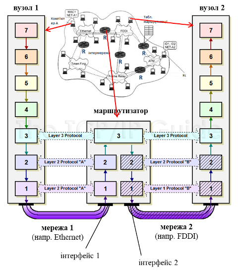
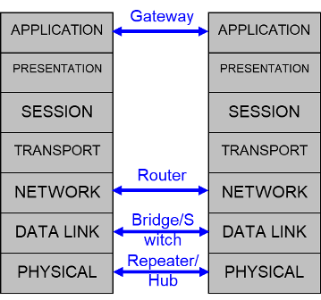
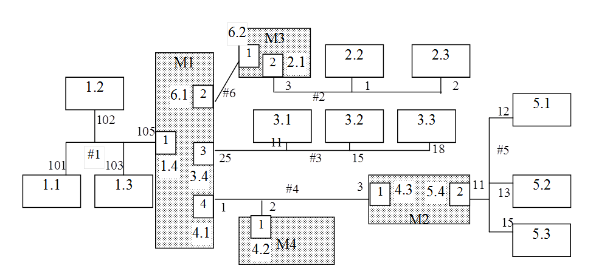
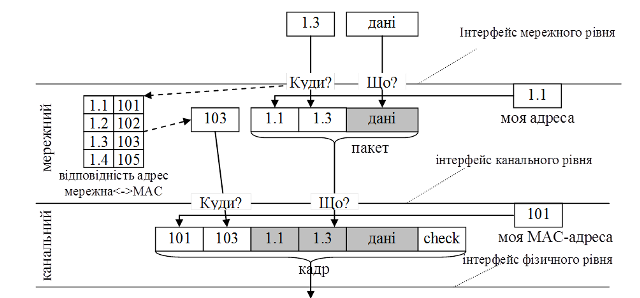
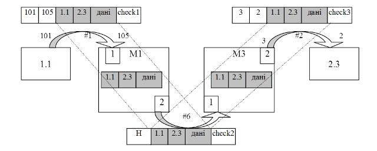

# 5. Мережний рівень та маршрутизація

## 5.1. Призначення мережного рівня

На минулих лекціях було показано яким чином вузли обмінюються в межах однієї мережі. Але сучасні мережі представляють собою об'єднання між собою кількох мережі в інтермережі. За такого способу організації, підмережі які входять в інтермережу (internetwork) і є по суті її **сегментами** можуть мати різну природу і оперувати різними протоколами. Прикладом є наприклад використання 3G/4G модему з вбудованим маршрутизатором, або навпаки - маршрутизатору, який використовує в яості порта WAN 3G/4G модем підключений через його порт USB.  Такий маршрутизатор об'єднує домашні мережі Ethernet, WiFi з мережею на базі 3G/4G. Ці три мережі представляють собою різні фізичні середовища, але завдяки загальному протоколу **мережного** рівня, дають можливість обмінюватися пакетами.   

Основною функцією мережного рівня (яке логічно варто  було назвати міжмережним) є забезпечення передачі корисного навантаження з одного фізичного сегменту в інший, навіть якщо ці сегменти відрізняються своєю архітектурою. Вузли, які займаються цією передачею називають маршрутизаторами. Об’єднання сегментів в цьому випадку будемо називати інтермережею, а самі сегменти – підмережею\. Маршрутизатори одночасно підключаються до декількох мереж, тобто мають вихід на декілька фізичних ліній зв’язку. Їх задача отримати пакет з однієї мережі, по необхідності розбити на частини і відправити в іншу мережу по іншій лінії у відповідності з маршрутною таблицею\. В маршрутній таблиці міститься інформація про те, яким чином можна попасти в необхідну мережу (мережі). Слід наголосити, що це дуже спрощена схема функціонування, яка не враховує багатьох особливостей.       

рис.5.1. Інтеремережа

До функцій мережного рівня входить:

- забезпечення доставки блоку байтів потрібним вузлам у різних мережах, з'єднаних маршрутизаторами  

- просування мережних пакетів (N-PDU) між мережами (маршрутизація) 

- зв'язок мережної адреси з апаратною адресою локальної мережі для доставки кадрів з N-PDU в середині мережі 

- додаткові: діагностичні, конфігураційні (ручне та автоматичне налаштування маршрутизації)  

## 5.2. Маршрутизатори

Таким чином інтермережа може функціонувати за рахунок об'єднання сегментів через маршрутизатори, які підключені до декількох мереж через наявні інтерфейси (мережні адаптери, порти). Вони підтримують фізичний та канальний рівні для кожної мережі. Але на кожному маршрутизаторі так саме як і на кожному вузлі інтермережі має бути реалізація того самого протоколу мережного рівня (рис.5.2). 

рис.5.2. Принцип функціонування маршрутизатору

## 5.3. Варіанти сегментації мережі на різних рівнях

Враховуючи різноманітні варіанти сегментації мережі на даному етапі вивчення є сенс зробити певні узагальнення. Сегмент - це фрагмент мережі, які має якісь особливі характеристики. Але сегменти можуть відрізнятися за різними показниками і засоби що їх поєднують також функціонують на різних рівнях. Розглянемо це нижче. 

рис.5.3. Різні засоби для об'єднання сегментів мережі

**Repeater** (**повторювач**) – поєднує два фізичних сегменти однієї мережі з однаковим інтерфейсом для підсилення сигналу (збільшення відстані, кількості вузлів), він має функції ретранслятору. Для сутностей канального рівня мережі репітери не видимі, так як вони не оперують кадрами. 

Крім репітерів є ще різноманітні перетворювачі (медіаконвертери) з одного фізичного середовища в інше, наприклад з витої пари в оптику, які так само невидимі для сутності канального рівня.

**Hub** (**концентратор**) – поєднує декілька фізичних сегментів однієї мережі в одну логічну шину (багатопортовий повторювач). Так само як і з репітером, концентратор не оперує кадрами, тобто він їх не аналізує і не модифікує, тому не є видим для сутності канального рівня. 

**Bridge** (**міст**) – поєднує два сегменти однієї мережі (не обов'язково з однаковим фізичним рівнем), при цьому проводить фільтрацію кадрів між ними. Оскільки міст аналізує кадри, то він працює на канальному рівні, і повинен розуміти протоколи канального рівня. При цьому для мережного рівня він прозорий. Крім того,сутності канального рівня не знають про існування мостів, і не спілкуються з ними.  

**Switch** (**комутатор**) – багато-портовий міст для паралельної комутації між каналами на основі інформації з канального рівня. Все інше стосовно мостів має місце і для комутаторів.  

**Router** (**маршрутизатор**) – поєднує декілька сегментів різних мереж (можливо з різним стеком реалізації канального і фізичного рівня) забезпечує передачу даних між ними по мережній адресі та маршрутним таблицям. Маршрутизатор - повноцінний учасник сегментів мережі з точки зору фізичного та канального рівня. Тобто вузли обмінюються кадри з маршрутизаторами. Але з точки зору спілкування в інтермережі, маршрутизатори є проміжними вузлами, які забезпечують обмін між вузлами, що можуть знаходитися в різних мережах. 

**Gateway** (**Шлюз**) – забезпечує обміном даними між різними мережами (навіть з повністю різним стеком протоколів). У цьому випадку, може відбуватися навіть перетворення на рівні прикладних протоколів. Але часто під шлюзом розуміють кінцеву точку в сегменті мережі, що надає можливість виходу за цей егмент. Що саме розуміють під шлюзом в конкретному випадку залежить від контексту. 

## 5.4. Приклад інтермережі

Розглянемо функціонування інтермережі на декількох прикладах.  На рис.5.4 зображені 6 мереж, об’єднаних в одну інтермережу. В середині широкомовних мереж (з `#1` по `#5`) кожен вузол має свою адресу, передбачену протоколом канального рівня для цієї мережі. Цією адресою користуються інші вузли цієї ж мережі для обміну даними. Але для вузлів інших мереж ця адреса не має ніякого значення! Для адресації вузлів в інтермережі використовується своя система, визначена на мережному рівні. Надалі, адресу, означену на мережному рівні будемо називати мережною адресою, хоч правильніше б було назвати її 'міжмережною адресою'. На рисунку мережі з `#1` по `#6` можуть бути різні за природою, але використовують спільний протокол на мережному рівні і єдину міжмережну систему адресації. Таким чином кожний вузол, окрім MAC-адреси на канальному рівні (на рисунку показані на вузлах маленьким шрифтом) має ще унікальну в середині інтермережі мережну адресу. Слід нагадати, що мережний рівень оперує пакетами, в яких і розміщується адреса отримувача і відправника.

Рис. 5.4. Приклад функціонування інтермережі

## 5.5. Приклад адресації в середині мережі

Розглянемо приклад, в якому покажемо яким чином відправляється запит від Процесу вузла з мережною адресою 1.1 на вузол 1.3 (рис.5.4), якщо система адресації побудована таким чином, що один байт виділяється під номер мережі, а один байт під номер станції в мережі, тобто використовується двохбайтова система адресації. Це значить, якщо вузол має позначення 1.2, то він являє собою станцію 2 в мережі 1 (в першому байті адреси буде значення 1, а в другому – 2). 

Як бачимо, ці вузли знаходяться в одній мережі. Але сутності, вищих за мережний рівень (наприклад драйвер транспортного протоколу) в даному випадку не вміють працювати з канальним рівнем, щоб напряму відправити кадр на МАС-адресу 103. Їм без різниці знаходиться вузол з адресою 1.3 в локальній мережі, чи в іншій мережі. Верхній рівень просто передає дані для відправки і значення адреси отримувача. Розглянемо як може формуватися кадр на вузлі відправника з адресою 1.1 (рис.5.5).

 Рис.5.5. Приклад формування пакету та кадру

Драйвер транспортного рівня сформував дані для передачі на вузол 1.3. Через інтерфейс мережного рівня він передала «що» відправляти і «куди» відправляти. Сутність мережного рівня бачить, що номер мережі отримувача співпадає з власним номером мережі (свою адресу вона знає). Отже необхідно знайти МАС-адресу отримувача і відправити пакет безпосередньо йому. В нашій мережі мережна сутність кожного вузла має таблицю відповідності, в якій вона знаходить відповідну МАС-адресу до заданої мережної. Разом з МАС-адресою отримувача, вона передає сформований пакет канальному рівню. Той в свою чергу вставляє в заголовок свою адресу та адресу отримувача, а в кінцевик – контрольну суму.

## 5.6. Приклади адресації вузлів в іншій підмережі

Тепер спробуємо вияснити яким чином відправляється запит від Процесу вузла з мережною адресою 1.1 на вузол 2.3 (див. рис.5.4). У цьому випадку мережна сутність бачить, що адреса отримувача лежить не в зоні її досяжності. В такому випадку вона відправляє кадр маршрутизатору М1, який має МАС-адресу 105. Кадр, який буде направлений маршрутизатору буде виглядіти так як показано на рис.5.4. Як бачимо, адреса отримувача в пакеті залишилась 2.3, хоча маршрутизатор має мережну адресу 1.4. Тим не менш кадр відправляэться на МАС-адресу маршрутизатора. Коли маршрутизатор отримає цей кадр, його мережна сутність побачить, що пакет в кадрі не призначений безпосередньо для неї, отже його треба відправити далі. Оскільки маршрутизатор підключений до декількох мереж, то він перевіряє, чи належить адреса отримувача в кадрі одній із цих мереж. М1 являється вузлом в мережах `#1`, `#3`, `#4` і `#6`, а мережа отримувача - `#2`. Якби вони співпали то ситуація б пішла далі як у попередньому прикладі. Але у цьому випадку - маршрутизатор шукає в своїй маршрутній таблиці по мережі `#2` наступний маршрутизатор, через який можна вийти на дану мережу. Запис буде знайдено з мережною адресою 6.2 (тобто М3). У своїй таблиці відповідності по цій адресі М1 знаходить лінію зв’язку, це буде лінія 2. Далі він вилучає повністю пакет, інкапсулює його в кадр, і відправляє по мережі `#6`. Мережа `#6` має інший формат кадру і не потребує адресації на канальному рівні. 

 

Рис.5.6. Транспортування пакету за допомогою маршрутизаторів

Коли маршрутизатор М3 отримує кадр, він виявляє, що підключений до тієї мережі, куди повинен попасти пакет (тобто `#2`). Знаходить в таблиці відповідності необхідну лінію зв’язку (2) та по мережній адресі необхідну МАС-адресу (теж 2), вилучає пакет і інкапсулює пакет в кадр з цією адресою. 

У наступному прикладі вияснимо яким чином відправляється запит від Процесу вузла з мережною адресою 1.1 вузлу з адресою 5.2 (див.рис.5.2). Все, що сказано в попередньому прикладі підходить і для цього випадку, окрім одного кроку. Оскільки мережа `#6` представляє собою на фізичному рівні з’єднання точка-точка, адресація на канальному рівні тут не потрібна, тому в попередньому прикладі достатньо було знайти лінію зв’язку (канал). Але в нашому випадку на каналі 4 два маршрутизотори. Тому, окрім номера лінії треба ще вказати МАС-адресу маршрутизотору. 

У розглянутих прикладах показаний один з принципів маршрутизації, який навмисно, для його простоти, не враховує багато нюансів. На практиці використовуються дещо схожі алгоритми, наприклад в протоколі IP, на якому базується Internet. Мета залишається та сама – прозорий обмін пакетами між однорідними або різнорідними мережами.

Разом з маршрутизацією пакетів, мережний рівень підтримує ще ряд сервісів:

- маршрутизація пакетів;

- побудова маршрутних таблиць;

- роздача мережних адрес.  

## Запитання для самоперевірки

1. Поясніть що таке сегменти мережі. На яких рівнях мережної моделі ISO OSI може відбуватися сегментація?
2. Які функції мережного рівня?
3. Яку роль виконують маршрутизатори?
4. Назвіть варіанти сегментації мережі на різних рівнях, та роль засобів що об'єднують сегменти мж собою?
5. Покажіть на прикладі принципи обміну в інтермережі між вузлами в одному сегменті.
6. Покажіть на прикладі принципи обміну в інтермережі між вузлами в різних сегментах, що об'єднані маршрутизатором. 