[5. Мережний рівень та маршрутизація <--   ](5.md) [Лекції](README.md) [   --> 7. Протоколи TCP/UDP](7.md)

# 6. Протоколи рівня IP

## 6.1. Стек TCP/IP

### Про стек TCP/IP

Стек TCP/IP – це ієрархічно організований набір мережних протоколів, що використовуються в Інтернеті та комп'ютерних мережах. Ці протоколи функціонують взаємопов'язано для виконання типових задач. Він включає такі рівні протоколів:

- прикладний - реалізація типових задач, зокрема:
  - FTP – пересилання файлів, 
  - HTTP – доступ до серверів, 
  - Telnet – для доступу терміналу, 
  - SMTP – робота з поштою
  - інші
- транспортний – реалізація доставки даних прикладним процесам: 
  - TCP – надійна доставка зі встановленням з'єднання, 
  - UDP – швидка без з'єднання але ненадійна (по можливості)
- міжмережний – реалізація доставки між вузлами в об'єднаних мережах: 
  - IP – доставка, 
  - всі інші для обслуговування роботи IP (ICMP, RIP, OSPF та інші)

Рівень доступу до мережі (канальний + фізичний) в даному стеці не регламентується і є тою частиною що забезпечує передачу даних від "хоста" до хоста або маршрутизатора.

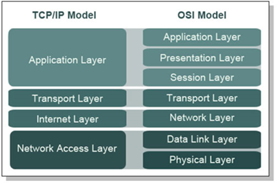

рис.6.1. Модель TCP/IP в порівнянні з моделлю ISO OSI

Розглянемо як функціонує даний стек. Потік даних від прикладного рівня йде на транспортний рівень для відправки за призначенням. Потік ділиться на кілька пакетів, або відправляються одним, які можуть відправлятися одним з 2-х варіантів:

- надійному але повільному сервісу (TCP сегменти) 
- ненадійному але швидкому сервісу (UDP дейтаграми) 

При цьому ці пакети інкапсулюються в пакети IP. Далі IP пакети відправляються до найближчого маршрутизатору, використовуючи кадри мережних інтерфейсів. Для цього відбувається упаковка в кадр і трансляція IP в апаратну адресу (MAC)  

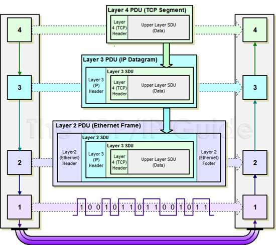


рис.6.2. Послідовність інкапсуляції пакетів та їх передача.

### Типи сервісів

У даному стеку пропонуються різні типи сервісів відносно з'єднання:

- зі встановленням з'єднання (логічне з'єднання, віртуальний канал)

- без встановлення з'єднання 

Сервіси що орієнтовні на з'єднання передбачають попередню домовленість між учасниками зв'язку, в межах якої буде контролюватися весь обмін. Це може передбачати попереднє означення довжин пакетів, нумерування пакетів при передачі в межах з'єднання та інші дії. Якщо сервіс не передбачає з'єднання, то обмін відбувається без додаткових попередніх домовленостей.   

Відносно підтвердження доставки пакетів сервіси можуть бути:

- з підтвердженням (квітуванням), надійні

- без підтвердження, ненадійні 

Пакети що не потребують підтвердження називаються **datagram** (**дейтаграми**).  Відправник дейтаграми в межах сервісу не буде знати результат її доставлення отримувачу. Прикладом такого сервісу є обмін в протоколі IP та UDP.  Якщо необхідно контролювати доставку пакету використовують сервіс з підтвердженням. У цьому випадку, отримувач повідомляє відправнику, чи отримав він пакет і чи цей пакет є коректним. Прикладом є TCP.

Ненадійні сервіси потрібні для швидких операцій. Використання ненадійного сервісу необов'язково приводить до ненадійності доставки даних. Просто надійність доставки даних може забезпечуватися сервісами інших рівнів.

### Протоколи мережного рівня

Хоч стек називається TCP/IP, для функціонування мережного рівня використовуються кілька протоколів, а не тільки IP. Це зумовлено тим, що необхідно виконувати різноманітні функції, які можуть відрізнятися за способом реалізації для різних протоколів нижчого рівня, та необхідності реалізації додаткових сервісів, які не призначені протоколом IP. Ці протоколи можуть бути реалізовані через драйвери, різноманітні служби чи іншим способом. У таб. 6.1 показані протоколи мережного рівня в стеці TCP/IP. 

Таб.6.1. Протоколи мережного рівня.

| Функції мережного рівня                                      | Протоколи                                                    |
| ------------------------------------------------------------ | ------------------------------------------------------------ |
| просування мережних пакетів (N-PDU) між мережами (маршрутизація) | IPv4, IPv6 – доставка між мережами IGMP  - групова передача (поверх IPv4) |
| зв'язок мережної адреси (IP) з апаратною адресою локальної мережі (MAC) для доставки кадрів з N-PDU в середині мережі | ARP                                                          |
| додаткові: діагностичні, конфігураційні (ручне та автоматичне налаштування інтерфейсів та маршрутизації) | ICMP – діагностика та повідомлення про помилки               |

Кожен з наведених в таблиці 6.1 протоколів буде розглядатися в даній лекції нижче.  

Протокол мережного рівня **IP** (**Internet Protocol**) – здобув популярність через використання його в Internet. На сьогодні є дві версії протоколу:

- **IPv4** (IP  версії 4) – 4-байтова адресація вузлів
- **IPv6** (IP  версії 6) – 16-байтова адресація вузлів

У таблиці 6.2 наведений короткий перелік порівняння цих протоколів. На сьогодні IPv4 має більшого вжитку. Але в IPv4 є явний дефіцит кількості IP адрес, що пов'язано з 4-х байтовою системою адресації.  Для IPv6 такої проблеми немає. Крім того, в IPv6 сильно відрізняються механізми маршрутизації.   

Таб.6.2. Порівняння IPv4 та IPv6

| IPv4                                                         | IPv6                                                         |
| ------------------------------------------------------------ | ------------------------------------------------------------ |
| поки-що більшість вузлів в Інтернет працюють з цією версією  | поки не знайшов широкого вжитку, з кожним роком все більша підтримка |
| дефіцит адрес IP                                             | 340 282 366 920 938 463 463 374 607 431  762 211 456         |
| великі затрати ресурсів на  маршрутизацію                    | спрощена  маршрутизація                                      |
| зв'язок з адресами на канальному рівні з використанням додаткових  протоколів (ARP) | адресація на канальному рівні  враховується в IP  адресі     |

### Адресація

Для обміну пакетами між вузлами в Інтернеті використовуються протоколи IP, які передбачають адресацію вузлів. Але користувачам важко запам'ятовувати мережні адреси, їм зручніше користуватися доменними іменами, по типу `nuft.edu.ua`. Тому користувачі, наприклад в браузері, вводять саме символьне ім'я за правилами DNS, яке відповідними службами спочатку перетворюються в IP-адресу, до якої має відношення це символьне ім'я а потім пакет відправляється вже за цією IP-адресою. Функціонування системи DNS розглядається в наступних лекціях.

IP-адреса повинна якимось чином передбачати адресацію підмережі, для того щоб маршрутизатори змогли перенаправити пакет в потрібну підмережу. Як тільки пакет прийшов в потрібну підмережу необхідно зв'язати IP-адресу вузла в в мережі з апаратною адресою для того, щоб доставити кадр з пакетом необхідному пристрою. Задачею визначення зв'язки IP-адреси та MAC-адреси  в локальній мережі займаються служби ARP, які також розглядаються нижче.  

Зв'язок адрес на різних рівнях показаний на рис.6.3. 

Таким чином в стеці TCP/IP можна виділити кілька типів IP-адрес: 

- локальні, апаратні адреси: призначені для адресації вузлів всередині мережі, наприклад MAC-адреса в Ethernet 
- мережні IP адреси: призначені для адресації вузлів в об'єднаній інтермережі, що не залежить від реалізації кожної з них; для маршрутизації в IPv4 логічно мережна адреса повинна включати: 
  - номер мережі (підмережі)

  - номер вузла в мережі

- символьні доменні імена (DNS-імена): призначені для символьної адресації вузлів; доменним іменам ставиться у відповідність IP-адреси 

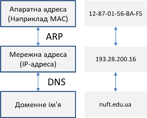

рис.6.3. Перетворення адрес на різних рівнях мережі

## 6.2. Адресація в IPv4

### Структура IP пакету

На рис.6.4 показана структура IP пакету. Пакет включає корисні дані, які передаються від верхнього рівня та заголовок. Заголовок має багато службових полів, деякі з них будуть розглянуті пізніше. Наразі зупинимося на 2-х полях:

- IP-адреса відправника, куди вставляється адреса того хоста, який відправляв пакет. Зверніть увагу, що маршрутизатори не змінюватимуть даного поля за нормальних умов.
- IP-адреса отримувача, куди вставляється адреса того хоста, кому адресований пакет.

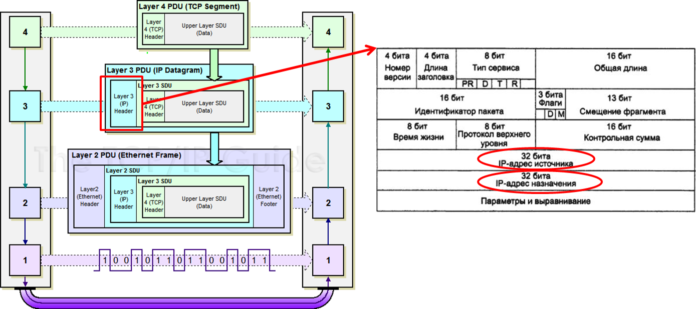

рис.6.4. Структура IP пакету

### Принципи адресації IPv4 

На відміну від адресації всередині мережі, що може передбачатися фізичним рівнем, наприклад, через використання MAC-адрес, для мережного рівня необхідно, щоб адреса якимось чином забезпечувала адресацію підмережі, та вузла (хоста) в цій підмережі. Адже таблиці, за якими буде відбуватися маршрутизація не можуть вміщувати список з усіх можливих адрес IP. Перенаправлення пакету відбувається за адресою підмережі, кількість яких очевидно є меншою ніж кількість хостів. 

Але в структурі запису IP-адреси не визначено де є номер підмережі, а де номер вузла. Тобто адреса типу `193.28.200.10` нічого не говорить про адресацію підмережі та вузла, бо крапки - це просто розділювачі байтів. Навіть якщо її представити в бінарному вигляді (рис.6.5) нічого не можна сказати про таке розділення.

Тим не менше маршрутні таблиці, за якими повинна відбуватися маршрутизація, повинні містити якісь записи, які б перенаправляли пакети в потрібний порт, в залежності від номера підмережі. IPv4 передбачає кілька варіантів такого розподілу 4-байтової адреси:

- фіксована,
- на базі маски, 
- на базі класів адрес

Адресація на базі **фіксованої границі**, що описана в документі RFC760 ([RFC](https://uk.wikipedia.org/wiki/RFC) - технічні документи в Інтернеті) передбачає алгоритм розділення (рис.6.5) на фіксовані 2 частини: номер мережі (підмережі), номер вузла. При цьому всі мережі мають фіксовану максимальну кількість вузлів. Принцип фіксованого поділу погано масштабується, оскільки мережі можуть мати або надмірну кількість вузлів, або навпаки - мало, тому він зараз не використовується в IPv4.   

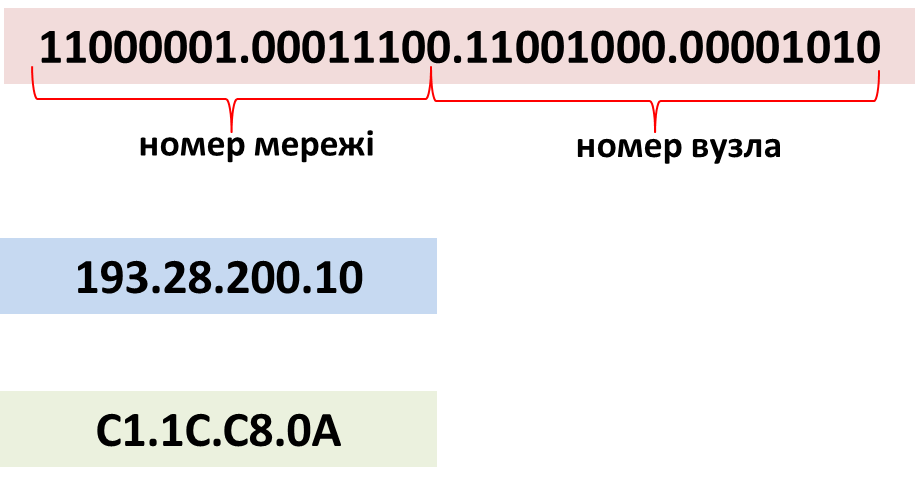

рис.6.5 Статичне виділення IP

Натомість використовується більш гнучкий спосіб адресації **на базі класів** (класова адресація, RFC791), де виділяються 5 класів адрес (A..E), в яких кількість бітів, що виділяються для адреси вузла та підмережі, залежить від вибраного класу. При маршрутизації спочатку визначається клас адреси (відношення до класу визначається першими бітами адреси), а потім номер підмережі і вузла. Класи адрес наведені в таблиці 6.3. 

Таб.6.3. Класи адрес

| Клас  | Перші біти | Найменший номер  мережі    | Найбільший номер  мережі   | Максимальна кількість  вузлів в підмережі, розмір поля |
| ----- | ---------- | -------------------------- | -------------------------- | ------------------------------------------------------ |
| **А** | **0**      | 1.0.0.0     (0 - не викор. | 126.0.0.0   (127 — резерв) | $2^{24}$, поле 3 байта                                 |
| **B** | **10**     | 128.0.0.0                  | 191.255.0.0                | $2^{16}$, поле 2 байта                                 |
| **C** | **110**    | 192.0.0.0                  | 223.255.255.0              | $2^8$, поле 1 байт                                     |
| **D** | **1110**   | 224.0.0.0                  | 239.255.255.255            | Групові адреси                                         |
| **E** | **11110**  | 240.0.0.0                  | 247.255.255.255            | Зарезервовано                                          |

Найбільш поширеними є вузли класу С. На рис.6.7 показаний приклад адресації з цього класу (див. перші три біти). Тут три байти (за винятком 3-х біт) виділяється під адресу підмережі, а інші - під адресу вузла.    Клас D використовується тільки для групової адресації, клас E – зарезервовано. Таким чином реально є тільки 3 класи мереж, тому все одно виходить досить груба градація. 


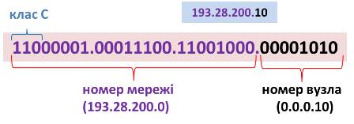

рис.6.7 Приклад адресації на базі класів

Найбільш гнучким способом адресації для IP є використання **масок** (RFC 950, RFC 1518). Частина адреси, що призначена для номера мережі означується маскою – послідовністю одиничних бітів. Номер підмережі тоді визначається за формулою:

```
номер_підмережі = IP_адреса AND маска
```

При цьому запис може бути як в десятковій формі так і в формі завдання кількості бітів. Наприклад маска `255.255.128.0` має `17` одиничні бітів, тому аналогічний запис `129.64.134.5/17`. Маски використовуються як для розділення в класах на підмережі (subnetting) та об'єднання підмереж (supernetting). Маски для класів: 

- А - 255.0.0.0, 
- B – 255.255.0.0, 
- C - 255.255.255.0

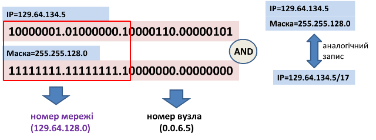

рис.6.8 Приклад адресації на базі масок

### Особливі IP адреси

Є певні особливі правила формування адреси IP, зокрема:

-  не дозволяється назначати мережним картам наступні адреси:

  - всі логічні `1` та всі логічні `0` для призначення адрес вузлам або мережам, так як це широкомовна адреса (всім вузлам) 
  
  
    - в форматі `127.x.x.x` , так як це `loopback` (вузол адресує сам себе)
  


- `0.0.0.0` – невизначена адреса, ставиться тільки в поле адреси відправника, щоб вказати що вузол не знає свою адресу (наприклад при запиті до DHCP-серверу) 
- 0-й номер мережі – вузол призначення в тій самій мережі що і вузол відправника, ставиться тільки в поле адреси відправника

- `255.255.255.255` – обмежена широкомовна адреса (`limited broadcast`), розсилається всім вузлам в тій же мережі, що і відправник;
- всі лог. `1` в номері вузла – широкомовним (`broadcast`), розислається усім вузлам в указаній мережі, наприклад `193.28.200.255` відсилає всім вузлам в мережі `193.28.200.0` 

- адреси `127.x.x.x` вказуються в полі призначення для відправки самому собі ("петля", `loopback` ) 


### Розподіл IP-адрес в Інтернеті

Унікальність IP адрес в Інтернет досягається за рахунок ієрархічного розподілу (виділення пулу з доступних адрес). Головна організація для розподілу є ICANN (Internet Corporation for Assigned Names and Numbers), яка координує американську, європейську і азійську організації, а ті координують регіональних провайдерів, які мілкіших провайдерів і т.д. 

Є серйозна проблема з дефіцитом IP-адрес: мало доступних адрес, неефективне використання особливо в великих мережах. Це вирішується:

- видачею кінцевим користувачам приватних ("сірих") адрес та використання технологій `NAT`, `proxy` (розглядається в наступних лекціях)

- використання безкласової міждоменної маршрутизації CIDR на базі масок змінної довжини (префіксів)
- використанням сучасного протоколу IPv6
- використанням динамічного DNS  

### Приватні IP-адреси

Приватні IP-адреси (private IP address, внутрішньо-мережні, внутрішні, локальні,"сірі") – це адреси які належать до спеціального діапазону, що не призначені для використання в мережі Інтернет. Вони призначені тільки для застосування в локальних (автономних) мережах. Розподіл цих мережних адрес не контролюється організаціями, так як вони не видимі з глобальної мережі Інтернет. Ці адреси співпадають в різних автономних мережах. Хоч приватні адреси не видимі з Інтернету, вузли з такими адресами можуть отримувати доступ до Інтернет, але тільки використовуючи спеціалізовані служби: NAT, проксі-сервери, тунелювання та інші (розглядається в наступних лекціях). 

Таб.6.4. Класи адрес

| Клас адрес | Діапазон приватних мереж                | Кількість мереж | Кількість адрес для хоста |
| ---------- | --------------------------------------- | --------------- | ------------------------- |
| Клас А     | мережа  `10.0.0.0`                      | 1               | 16777216                  |
| Клас В     | мережі `172.16.0.0` — `172.31.0.0`      | 16              | 1048576                   |
| Клас С     | мережі  `192.168.0.0` — `192.168.255.0` | 256             | 65536                     |

## 6.3. Налаштування та діагностика 

Налаштування та діагностика мережних карт та служб на роботу з IP залежить від ОС. Для прикладу ми розглянемо, як це робиться в ОС Windows, для простоти - в Windows 7.  Мережні карти можна налаштовувати через конфігураційні вікна (рис.6.9). Для цього вибирається потрібна карта де налаштовується протокол TCP/IP.  Якщо вказано отримання автоматично адреси, то драйвер буде запрошувати адресу у DHCP серверу (розглядається в наступних лекціях). У іншому випадку адреса вказується в налаштуваннях, а саме:

- IP-адреса
- маска
- основний шлюз - адреса маршрутизатора за замовченням
- адреси DNS-серверів (про DNS буде в наступних лекціях) 

На один мережний інтерфейс можна прив'язати декілька пар з IP та маски. 

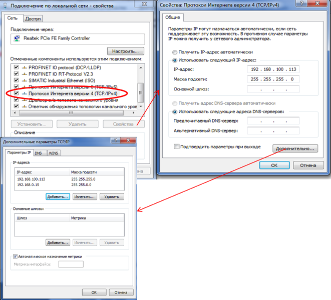

рис.6.9 Приклад налаштування мережної карти з двома IP адресами

За допомогою вікон також можна отримати інформацію про стан мережної карти (рис.6.10).

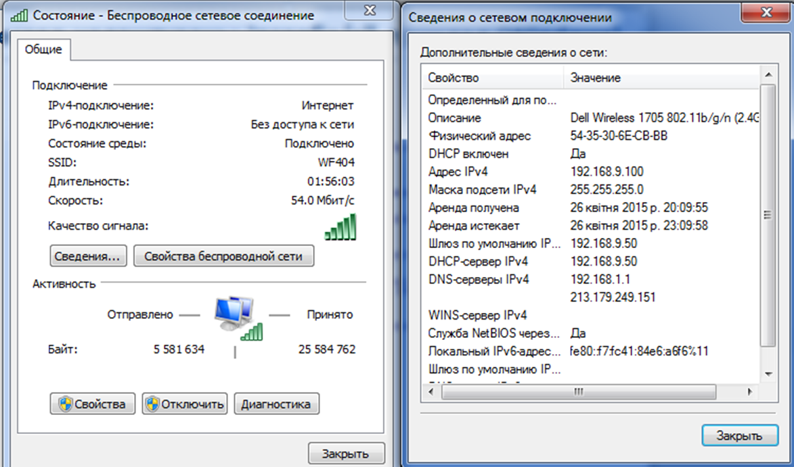

рис.6.10 Перегляд налаштувань через віконний інтерфейс

Також налаштування можна налаштувати та переглянути через різноманітні консольні утиліти. Наприклад `ipconfig/all` виводить всю інформацію про наявні мережні карти.

## 6.4. Зв'язок IP з апаратною адресою, протокол ARP

На кожному вузлі чи маршрутизаторі вирішується якому вузлу в цій же мережі передати пакет (наступному маршрутизатору чи кінцевому вузлу), тобто яка адреса MAC для IP в локальній мережі. Цей пакет повинен упакуватися в кадр Ethernet та передатися цьому маршрутизатору або звичайному вузлу за МАС-адресою. Для цього на на кожному IP-вузлі є таблиця з відповідністю IP<->МАС, яка називається **ARP-таблицею**. 

Таким чином, коли служба IP захоче передати якісь дані через драйвер Ethernet, вона шукає інформацію про MAC отримувача в ARP-таблиці. Записи в цій таблиці можуть заповнюватися статично, наприклад за допомогою консольної утиліти `arp`, або іншими програмами. Однак в більшості випадків, якщо не потрібно явно задавати, вони формуються динамічно за допомогою функціонування **протоколу ARP**.  Ці динамічні записи мають час життя, і якщо не використовуються – видаляються. Як правило час життя динамічних записів - кілька хвилин. 

Перегляд і керування (добавлення, зміна, видалення записів) в таблиці ARP може відбуватися через однойменну утиліту командного рядку `arp`. Приклад її виклику з опцією перегляду має вигляд: 

```bash
C:\Users\user>arp -a

Interface: 192.168.10.102 --- 0xf
  Internet Address      Physical Address      Type
  192.168.10.50         e4-be-ed-f0-f9-2a     dynamic
  192.168.10.255        ff-ff-ff-ff-ff-ff     static
  224.0.0.2             01-00-5e-00-00-02     static
  224.0.0.22            01-00-5e-00-00-16     static
  224.0.0.251           01-00-5e-00-00-fb     static
  224.0.0.252           01-00-5e-00-00-fc     static
  224.0.0.253           01-00-5e-00-00-fd     static
  239.255.255.250       01-00-5e-7f-ff-fa     static
  255.255.255.255       ff-ff-ff-ff-ff-ff     static
```

Формування динамічних записів відбувається за необхідності. Наприклад, якщо в таблиці немає необхідного запису відповідності IP<->MAC то запускається в роботу пошук такої відповідності. Для цього існує **протокол ARP** (Address Resolution Protocol), який забезпечує визначення прив'язки фізичних адрес до IP-адрес та функціонує на мережному рівні поверх канального. Він працює наступним чином (рис.6.11):

- при включенні вузла всі його ARP-таблиці пусті
- (1) служба IP запитує службу ARP «Який МАС у інтерфейсу з таким IP?»
- (2) ARP служба дивиться в ARP-таблицю, якщо IP-адреси немає формується широкомовний ARP-запит (3), який вкладається в кадр Ethernet з широкомовною адресою (`FF:FF:FF:FF:FF:FF`) 
- всі вузли Ethernet отримують запит і направляють своїй службі ARP, яка порівнює запитувану IP-адресу зі своєю, у кого співпала – генерується відповідь конкретному вузлу (4)


рис.6.11 Приклад роботи ARP-протоколу

У рамках протоколу ARP можливі пакети з самозверненням (**gratuitous ARP**), які використовуються наступним чином. Ініціатор формує пакет, де в якості IP отримувача використовується його власна IP-адреса, тобто IP-адреси відправника і отримувача співпадають. Якщо на такий запит прийде відклик, то вузол видасть запитуваній програмі повідомлення-помилку, тобто про вже присутність вказаної IP-адреси. Це потрібно для того, щоб у випадку коли відбувається стартове конфігурування мережного інтерфейсу убезпечитися від конфлікту IP-адрес. Крім того, враховуючи що більшість вузлів відправляють такі `gratuitous ARP`, це можна використати для визначення IP-адреси пристрою типу "чорний ящик" при налагодженні системи, використовуючи при цьому сніфер, наприклад WireShark. 

## 6.5. Принципи маршрутизації

Протоколи рівня IP призначені для обміну пакетами IP як в середині локальних мереж так і між мережами. Останнє можливе за рахунок маршрутних таблиць які знаходяться як на кінцевих вузлах (хостах) так і на маршрутизаторах. Таблиці містять інформацію про підмережі, вузли та шляхи куди необхідно перенаправляти пакети, щоб досягнути їх. Робота служб маршрутизації, заповнення цих таблиць, їх вигляд залежить від багатьох факторів, які не будуть розглядатися в даному курсі. Але основи принципів роботи  маршрутизації IPv4 розглядаються нижче. Для кращого розуміння матеріалу варто перечитати попередню лекцію.      

### Приклад схеми маршрутизації

Принципи маршрутизації продемонструємо на прикладі інтермережі, що показана на рис.6.12. На ньому показані тільки два комп'ютери, які між собою спілкуються через велику кількість з'єднаних мереж. Мережі маркуються там символами `N` після якого йде номер мережі. Мережі між собою з'єднані маршрутизаторами, які позначаються прямокутниками з певним номером. Інколи ми будемо на них посилатися з використанням літери `R`. Також для `Вузлу B` та маршрутизатору з номером 4, показані маршрутні таблиці.       

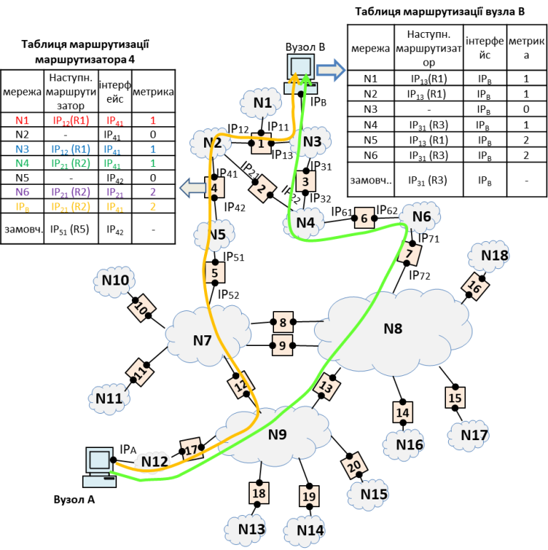

рис.6.12 Приклад мережі для обговорення маршрутизації

Для початку варто звернути увагу, що в кожному маршрутизаторі присутні декілька мережних адаптерів. Якби це було не так, тоді в ньому немає сенсу, бо функція маршрутизатору - перенаправляти пакети з однієї мережі в іншу. Тому адреси IP отримує НЕ маршрутизатор а його адаптери/порти (інтерфейси). Наприклад: маршрутизатор 4 має 2 IP-адреси: `IP41` та `IP42`.

За такої побудови мережі, пакети від вузла A до вузла B можуть пройти різними шляхами. Наприклад 

- 17, 12, 5, 4, 1 
- або 17,13,7,6,3 
- або … 

Вибір маршруту (наступного маршрутизатору) вузол або маршрутизатор робить на основі **маршрутної таблиці**.  Саме за цими маршрутними таблицями вирішується куди далі відправити пакет. Такі маршрутні таблиці є на всіх вузлах, які підтримують протокол IP.

### Приклад маршрутизації на маршрутизаторі

На рис.6.13 показаний фрагмент наведеної на рис.6.12 схеми, для детального аналізу маршрутних таблиць. 

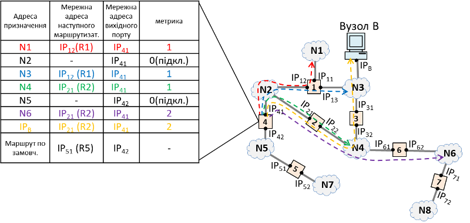

рис.6.13 Приклад фрагменту мережі для обговорення маршрутизації на маршрутизаторі

На рис.6.12 та 6.13 маршрутні таблиці показано спрощено. Кожен запис маршрутної таблиці забезпечує певне правило, за яким служба IP вирішує, куди перенаправляти вхідні пакети. На таблиці маршрутизатору ці записи вміщують:

- адресу призначення, тобто означення підмережі або вузла, куди адресовано пакет; після аналізу вхідних пакетів саме за цим полем відбувається первинний пошук необхідного маршруту; це може бути: 
  - адреса мережі, наприклад `N1`;
  - адреса вузла, наприклад $IP_B$ , навіть якщо цей вузол належить мережі, яка є в маршрутній таблиці, наприклад для даного вузлу `N3`; це потрібно для того, щоб направити пакет для конкретного адресату в конкретний порт маршрутизатору, навіть якщо для підмережі вказаний інший маршрут; 
  - адреса мережі за замовченням (Маршрут по замовч., default route), для адрес призначення, які не вказані в інших записах таблиці; наприклад для мереж `N7` та `N8` з рис.6.13 немає окремих записів, тому для них буде актуальним маршрут за замовченням
- адресу найближчого маршрутизатору на шляху, тобто на який маршрутизатор відправляти пакет, який задовольняє правилу; на рис.6.13 маршрутизатор 4 має в прямій видимості 3 наступні маршрутизатори (R1 - $IP_{12}$, R2 - $IP_{21}$, R5 -  $IP_{51}$); при цьому:
  - якщо адреса призначення в прямій видимості шлюзу (пряме підключення як `N2` та `N5` в прикладах) - адреса маршрутизатора не вказується; 
  - для запису з адресою маршрутизатору за замовчення – вказується адреса маршрутизатору за замовченням (default router)
- мережна адреса вихідного порту, на який буде направлятися пакет; враховуючи що в даного маршрутизатора тільки два порта, то вказується IP одного з них: $IP_{41}$ або $IP_{42}$ 
- **метрика** - це критерій, за яким буде вибиратися шлях, якщо адреса призначення задовольняє кільком записам в таблиці, чим менше число, тим кращий маршрут, 0 - для прямого підключення; він формується за кількістю проміжних маршрутизаторів, часом доставки,  завантаженості по каналу та іншим показникам; на рис.6.13 метрика вказує на кількість маршрутизаторів до місця призначення через даний порт

Записи в таблиці створюються автоматично з використанням спеціальних протоколів маршрутизації, або вручну адміністратором мережі.

Розглянемо функціонування маршрутизації, на прикладі рис.6.13. Коли маршрутизатор отримує IP пакет, він аналізує поле адреси призначення. За цією адресою він починає шукати в маршрутній таблиці запис, в якому вказаний саме цей IP. На рис.6.13 цей приклад показано жовтим кольором. У даному випадку для $IP_B$ є окремий запис в таблиці. За цим записом вказана IP адреса наступного маршрутизатору ($IP_{21}$) та порт, куди треба відправити пакет далі ($IP_{41}$). Відповідно на цей порт буде перенаправлено пакет. 

Якщо запису саме з таким IP немає, служба далі шукає записи з номером підмережі, куди входить IP адреси призначення. Цей номер підмережі визначається за правилами, які наведені вище. Якщо такий запис з підмережею знайдено, наступні дії аналогічні попередньому випадку. Якщо ж запис не знайдено, пакет буде перенаправлено маршрутизатору за замовченням на вказаний IP та порт.

Якщо ж алгоритм пошуку дасть кілька варіантів, пріоритет буде визначатися за метрикою.  

На рис.6.12 та рис.6.13 таблиці маршрутизації показувалися в схематичному вигляді без вказівки IP адрес. На рис.6.14 приклад в більш реальному до житті представленні з IP адресами, але в спрощеному вигляді.  


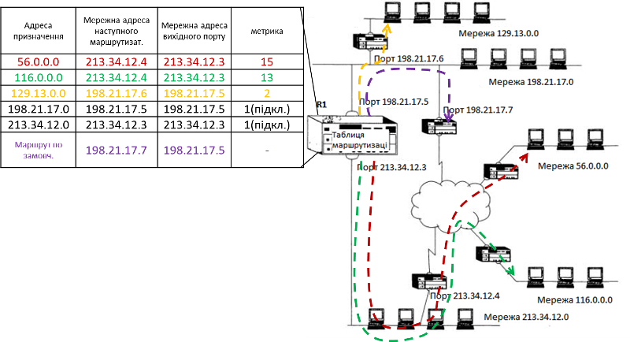 

рис.6.14 Приклад таблиці маршрутизації у спрощеному вигляді 

### Приклад маршрутизації на хості

На рис.6.15 схематично показаний приклад схеми маршрутизації на хості (Вузол B). Там процеси маршрутизаці відбуваються так само:

- визначення призначення: в локальну мережу чи в іншу

  - якщо в локальну (адреси мереж відправника і отримувача співпадає) – маршрутизація не потрібна, відбувається пошук необхідного вузла в локальній мережі в ARP-таблиці

  - якщо в іншу мережу – відбувається пошук маршрутизатору і відповідність в ARP-таблиці

Записи в таблиці маршрутизації можуть створюватися вручну, як правило це тільки маршрутизатор за замовченням, або автоматично:

- через отримання маршрутизатору за замовченням з DHCP-серверу
- можливо і через протоколи маршрутизації

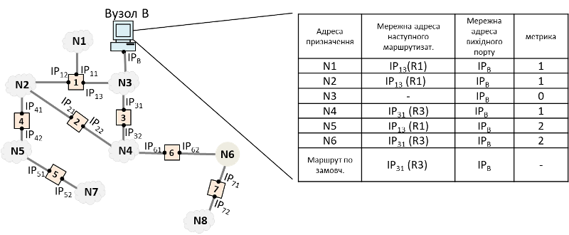

рис.6.15 Приклад фрагменту мережі для обговорення маршрутизації на хості

### Маршрутизатор (шлюз) за замовченням

Для того щоб налаштувати маршрутизацію на хості достатньо як правило налаштувати маршрутизатор за замовченням, або він видається DHCP-сервером. На рис.6.16 в таблиці маршрутиазції на вузлі "Вузол А" будуть два записи: 

- локальної мережі (N12) що має пряме підключення до вузла і в представлені реальних адрес на прикладі має адресу `192.168.100.0/24`, та інтерфейс $IP_A$ `192.168.100.102`
- та маршрутизатор за замовченням, тобто всі інші записи, що не будуть задовольняти наведеним в таблицях будуть прямувати на нього через той самий інтерфейс $IP_A$ `192.168.100.102`

Основний маршрутизатор як правило називається основним шлюзом (gateway), тому що він забезпечує "вихід з мережі". 

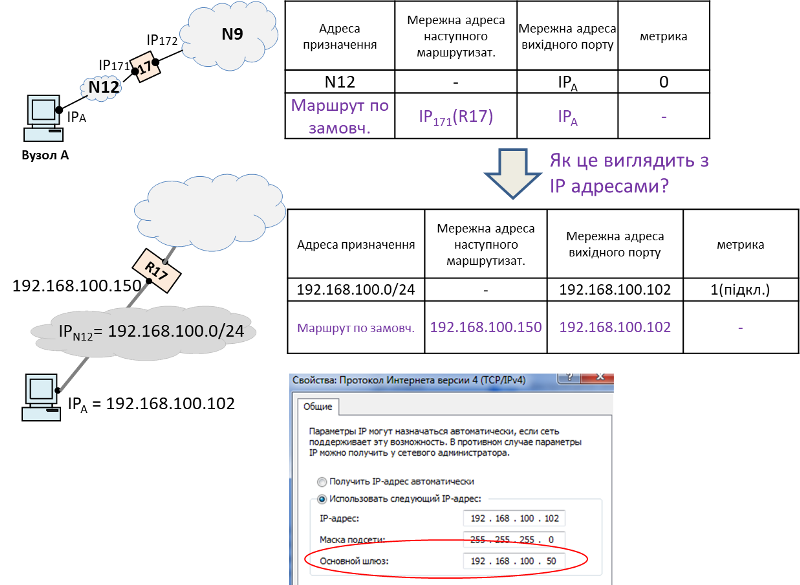

рис.6.16 Приклад налаштування маршрутизатору за замовченням

## 6.6. Використання засобів налаштування та аналізу маршрутизації

### Програмні засоби налаштування маршрутизації

У різних пристроях та ОС надаються різні можливості налаштування, це може бути:

- віконні засоби ОС для налаштування TCP/IP
- консольні команди та утиліти
- веб-консолі, наприклад у маршрутизаторів
- засоби редагування текстових файлів 
- засоби редагування реєстрів Windows

Для Windows для налаштування маршрутизації є консольні утиліти:

- `route`: налаштування таблиць маршрутизації; наприклад `route print` - виводить інформацію по маршрутним таблицям
- `netsh`: налаштування будь-яких мережних налаштувань
- `ipconfig`: перегляд, оновлення через DHCP та DNS

### Приклад у Windows 

Розглянемо приклад виведення маршрутної таблиці в Windows XP через `route print`  (рис.6.17) для прикладу, що був продемонстрований на рис.6.1.6. У реальних таблицях маршрутизації є певні відмінності. Зокрема добавилася маска підмережі, це потрібно для того, щоб за цією маскою визначити ту підмережу, якої стосується даний правила в даному записі. Адреса шлюзу - це по факту мережна адреса маршрутизатору. Тепер розглянемо кожний запис:

-  `192.168.100.0`: це мережа в прямій видимості хоста, тому усі пакети будуть відправлятися на локальний інтерфейс в межах цього ж хоста;
- `0.0.0.0`: адреса маршруту (маршрутизатора) за замовченням, тому вказується реальний маршрутизатор (шлюз) та той же інтерфейс; 
- `127.0.0.0`: loopback інтерфейс, тобто адресація самого себе
- `192.168.100.102`: тут маска `255.255.255.255` вказує на те, що йде адресація самого вузла, а не підмережі; адреса в даному записі є по факту адресою даного вузла, тому для нього будуть діяти ті самі правила як для loopback інтерфейсу;
- `198.168.100.255`: тут маска `255.255.255.255` вказує на те, що йде адресація самого вузла, а не підмережі, але адреса є широкомовною в конкретній мережі, тому усі пакети будуть направлені в локальну мережу, як і для першого запису;
- `224.0.0.0`: групова адреса (буде розглядатися в наступних лекціях) 
- `255.255.255.255`: тут маска `255.255.255.255` вказує на те, що йде адресація самого вузла, а не підмережі, але адреса є широкомовною в "моїй мережі", тому усі пакети будуть направлені аналогічно як в записі `198.168.100.255`;


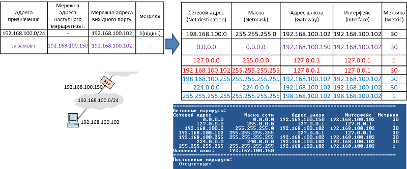

 рис.6.17. Приклад таблиці маршрутизації на хості Windows XP 

Таким чином у наведеному на рис.6.17 виведенні: 

- метрика – умовна відстань (час доставки), для вибору найбільш пріоритетного маршрутизатору
- маска - для визначення адреси призначення:
  - маска 255.255.255.255 - для вузлОвих маршрутів (хоста або широкомовної адреси) 
  - маска 0.0.0.0 - для маршрутизатору по замовченню 
- адреса шлюзу:
  - для локальних маршрутів - це IP-адреса фізичного інтерфейсу ПК
  - для віддалених маршрутів - IP-адреса найближчого маршрутизатору
- інтерфейс: 
  - IP-адреса фізичного інтерфейсу ПК
  - loopback

Для Winodws 7 та вище виведення таблиць маршрутизації за допомогою `route print` дещо буде відрізнятися (рис.6.18). Варто зазначити що у обидвох ОС перед виведенням маршрутних таблиць також покажеться список дескрипторів інтерфейсів з посиланням на ці інтерфейси, через які буде відбуватися керування ними. У новіших ОС в адресі шлюза (Gateway) може бути виведений запис `On-Link` що вказує на безпосереднє підключення вузлу до мережі, замість вказівки своєї ж IP адреси.   

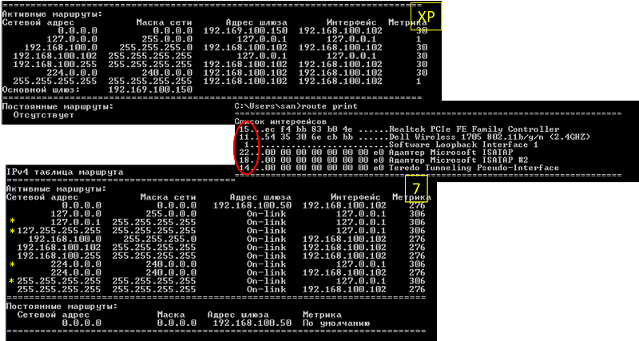

 рис.6.18. Приклад таблиці маршрутизації на хості Windows 7  

Постійні маршрути зберігаються в реєстрі Windows `HKEY_LOCAL_MACHINE\SYSTEM\CurrentControlSet\services\Tcpip\Parameters\PersistentRoutes`

### Резервування шлюзів за замовченням 

У Windows можливо налаштувати декілька шлюзів за замовченням, добавляючи їх в список шлюзів (рис.6.19). Це  може знадобитися для резервування, тобто якщо один шлюз недоступний, можна було підключатися через інший. Служби IP Windows повинні пріоритизувати ці шлюзи, перевіряти доступність з певною періодичністю. Для активації цієї можливості необхідно виставити ключ в реєстрі `HKEY_LOCAL_MACHINE\SYSTEM\CurrentControlSet\Services\Tcpip\Parameters\Interfaces\{ID} EnableDeadGWDetec=1`. Для пріоритезації шлюзів метрику треба вказувати вручну через вікна налаштування (рис.6.19) або через консольні утиліти.

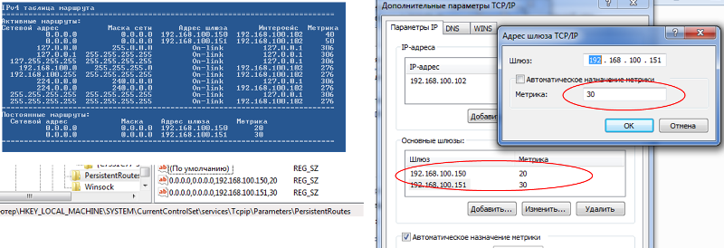

рис.6.19. Приклад налаштування кількох шлюзів за замовченням у Windows

### Добавлення маршрутизатору 

Один вузол, у тому числі хост, може бути підключений до 2-х мереж (рис.6.20). У Windows для добавлення маршрутизатору можна використати команду `route add`. При цьому вказуються всі поля записів.  На рис.6.20 показано приклад в якому усі пакети що матимуть адресу `192.168.101.0` будуть переадресовані вже не на маршрутизатор за замовченням (`192.168.9.50`) а маршрутизатор `192.168.100.150` через інтерфейс `192.168.100.102` з дескриптом 15. Ключ `-p` в `route` вказує на те, що маршрут буде статичний, тобто не буде видалятися після перезагрузки. 

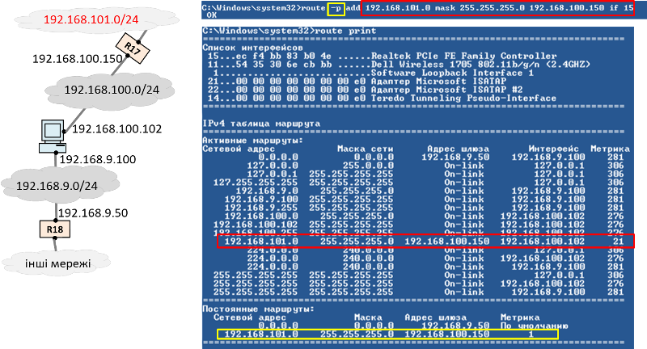

рис.6.20. Приклад з двома маршрутизаторами

## 6.7. Алгоритм роботи маршрутизації з використанням масок

Нагадаємо, що записи в маршрутних таблицях можна виділити 3 типи маршрутів:

- записи для вузлових маршрутів, які в масці виділяються як `255.255.255.255`
- записи для підмереж
- маршрутизатори за замовченням 

Розглянемо, як маршрутизується пакет на прикладі показаному на рис.6.21. У вхідному пакеті є IP-адреса відправника і IP-адреса отримувача, і він приходить кадром наприклад через Ethernet. Далі з цим пакетом відбуваються наступні дії щодо визначення подальшого перенаправлення пакету.

- Спочатку відбирається IP-адреса отримувача ($IP_D$) 
- Далі йде перевірка специфічних вузлових маршрутів  `255.255.255.255`, якщо такі знайдені, йде відправка пакету за вказаним інтерфейсом
- якщо не знайдено специфічного маршруту йде пошук всіх записів, у яких підмережа співпадає за правилом $IP_{NET} = IP_D \ AND \  NetMask$ ; маска в записах дає можливість масштабувати розмір підмережі тобто можуть кілька записів задовольняти умовам? в тому числі адреса маршрутиазатора за замовченням     
- якщо жодного запису не знайдено (у тому числі маршрутизатора за замовченням) пакет буде відкинуто
- якщо знайдено кілька записів, вибирається самий конкретний (з найдовшою маскою)
- якщо таких записів кілька - вибирається з найменшою метрикою 

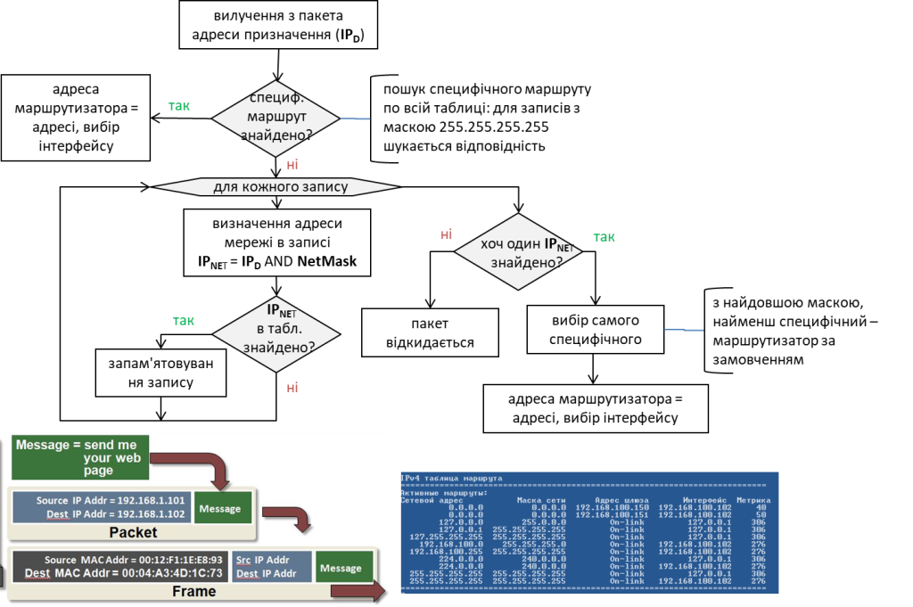

рис.6.21. Алгоритм роботи маршрутизації з використанням масок


## 6.8. Контроль та керування IP, протокол ICMP

### Поля заголовку IP-пакету

У заголовку IP-пакету V4 окрім адреси відправника та адреси отримувача є і інші поля, які впливають на роботу служби:

- Version **–** 4 для IPv4, 6 – для IPv6
- IHL – довжина заголовку (вказує на кількість 32-бітних слів)
- DSCP або ToS (тип сервісу - type-of-service) – прапорці характеризують особливість сервісу: пріоритет, мінімальна затримка, максимальна пропускна здатність, максимальна надійність і мінімальна вартість. Це поле можуть використовувати для керування якістю обслуговування пакету (QoS - Quality of Services) 
- TTL – (час життя - time-to-live) вміщує максимальну кількість пересилань (маршрутизаторів), через які може пройти дейтаграми; обмежує час життя дейтаграми:
  - значення TTL зменшується на 1 кожним маршрутизатором
  - коли досягає 0, дейтаграма знищується
  - при знищенні відправнику може бути відправлено ICMP-повідомлення про помилку
  - запобігає зациклюванню пакетів 
- Protocol - протоколу верхнього рівня
- Flags – опції фрагментації: фрагментувати або не фрагментувати пакети; опції розділення пакетів на кілька пакетів; 
- Header Checksum – контрольна сума заголовку, перераховується на кожному маршрутизаторі: враховуючи що поле життя на маршрутизації змінюється і маршрутизатор може фрагментувати пакети, контрольна сума змінюється  

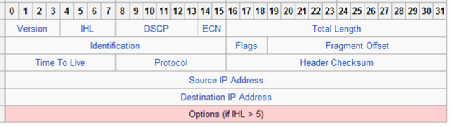

рис.6.22. Поля заголовку IP-пакету

### Протокол ICMP (ICMPv4) 

**ICMP** (*Internet Control Message Protocol* )  - протокол, який входить в стек TCP/IP і є обов'язковий в реалізації на вузлах і призначений для передачі повідомлень про помилки та інші нештатні ситуації, для додаткових сервісних функцій. ICMP-пакети інкапсулюються в IP-пакети і є двох версій: для IPv4 - ICMPv4 (рис.6.23),  для IPv6 - ICMPv6.

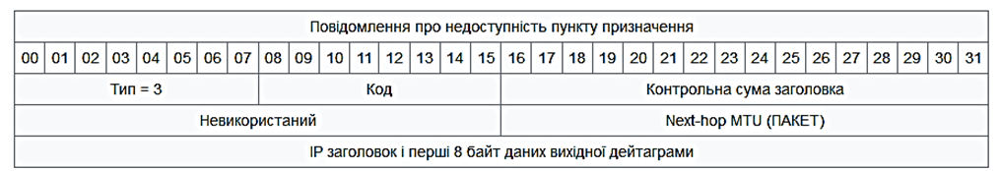

рис.6.23. Поля ICMP-пакету

Пакет ICMP включає в себе тип та код повідомлення. Повідомлення з типом що дорівнює значенню `3` є повідомленнями про помилки. Усі інші типи та коди повідомлень наведені в таблиці 6.5. Наприклад тип `8` використовується для утиліти `ping` яка розглядається нижче. Слід зазначити, що брандмауери можуть блокувати деякі повідомлення ICMP, а служби не реагувати на них належним чином з причин безпеки.    

Таб.6.5. Тип та коди повідомлень.

| Тип    | Код  | Назва                                                        | Запит | Помилка |
| ------ | ---- | ------------------------------------------------------------ | ----- | ------- |
| 0      | 0    | Ехо-відповідь                                                | х     |         |
| 1 та 2 |      | Зарезервовано                                                |       |         |
| 3      | 0    | Мережа недоступна                                            |       | х       |
| 3      | 1    | Хост недоступний                                             |       | х       |
| 3      | 2    | Протокол недоступний                                         |       | х       |
| 3      | 3    | Порт недоступний                                             |       | х       |
| 3      | 4    | Потрібна [фрагментація](https://uk.wikipedia.org/wiki/Фрагментація_(інформаційні_технології)), але DF (прапорець «не фрагментувати») встановлено |       | х       |
| 3      | 5    | Маршрутизація джерелом не вдалося                            |       | х       |
| 3      | 6    | Мережа призначення невідома                                  |       | х       |
| 3      | 7    | Хост призначення невідомий                                   |       | х       |
| 3      | 8    | Хост призначення ізольовано (застарів)                       |       | х       |
| 3      | 9    | Мережа призначення адміністративно заборонена                |       | х       |
| 3      | 10   | Хост призначення адміністративно заборонено                  |       | х       |
| 3      | 11   | Мережа недоступна для TOS                                    |       | х       |
| 3      | 12   | Хост недоступний для TOS                                     |       | х       |
| 3      | 13   | Зв'язок адміністративно заборонено (фільтрування запобігає маршрутизації) |       | х       |
| 3      | 14   | Порушення передування хосту (бажане передування не дозволено для комбінації хоста або мережі та порту) |       | х       |
| 3      | 15   | Порушення передування в дії (передування датаграми нижче рівня встановленого адміністраторами) |       | х       |
| 4      | 0    | Вгамовування джерела (управління заторами)                   |       |         |
| 5      | 0    | Переадресація для мережі                                     |       |         |
| 5      | 1    | Переадресація для хосту                                      |       |         |
| 5      | 2    | Переадресація для TOS та мережі                              |       |         |
| 5      | 3    | Переадресація для TOS та хосту                               |       |         |
| 6      |      | Змінна адреса хосту                                          |       |         |
| 7      |      | Зарезервовано                                                |       |         |
| 8      | 0    | Ехо-запит                                                    | х     |         |
| 9      | 0    | Оголошення маршрутизатора                                    |       |         |
| 10     | 0    | Клопотання маршрутизації                                     |       |         |
| 11     | 0    | Час життя пакету став рівний 0 під час транзиту              |       | х       |
| 11     | 1    | Час збірки фрагментів пакету закінчився                      |       | х       |
| 12     | 0    | Помилка заголовку IP-пакету                                  |       | х       |
| 12     | 1    | Відсутня необхідна опція заголовку                           |       | х       |
| 12     | 2    | Погана довжина заголовку                                     |       | х       |
| 13     | 0    | Запит мітки часу                                             | х     |         |
| 14     | 0    | Мітка часу                                                   | х     |         |
| 15     | 0    | Запит інформації                                             | х     |         |
| 16     | 0    | Відповідь інформацією                                        | х     |         |
| 17     | 0    | Запит маски адреси                                           | х     |         |
| 18     | 0    | Маска адреси                                                 | х     |         |

### PING

Одна з утиліт яка базується на протоколі ICMP є `ping`. Ця консольна утиліта перевіряє досяжність вузла на рівні протоколу IP, фіксує час затримки і отримання відповіді – що в свою чергу показує завантаженість лінії. Додатковими можливостями є відображення зв'язку імені DNS та IP адреси. 

Вона працює наступним чином:

- вузол відправляє ехо-запит (ICMP тип=8) зі вказаним IP, ідентифікатором, номером та довільними даними (див.таб.6.5); 

- вузол, отримавший ехо-запит, відправляє ехо-відповідь (ICMP тип=0), поле даних копіюється з ехо-запиту;     

Синтаксис виклику має наступний вигляд (залежить від ОС):

```bash
ping [-t] [-a] [-n кількість] [-l розмір] [-f] [-i TTL] [-v TOS] [-r кількість] [-s кількість] [[-j списокВузлів] | [-k списокВузлів]]  [-w таймаут] кінцевийВузол 
```

Таб.6.6. Ключі синтаксису `ping`

| Параметр          | Призначення параметру                                        |
| ----------------- | :----------------------------------------------------------- |
| `/? `             | виводить довідку по використанню                             |
| `-t`              | Періодична відправка на вказану  адресу до команди переривання. Для виводу статистики та продовження необхідно натиснути `<Ctrl>+<Break>`, для закінчення `<Ctrl>+<C>`. |
| `-a`              | Визначення імені (DNS) за адресою вузлу. У випадку успішного виконання виводиться ім’я відповідного вузлу. |
| `-n кількість`    | Кількість запитів для  відправлення. За замовченням дорівнює 4. |
| `-l розмір`       | Довжина (в байтах) поля даних у  відправлених повідомленнях з ехо-запитом. За замовченням – 32 байти.  Максимальний розмір - 65527 |
| `-f`              | Виставляє в IP-заголовку пакету  відправки прапорець, який забороняє фрагментацію пакету. |
| `-i TTL`          | Задає значення поля TTL  (тривалість життя пакету) в IP-заголовку. За замовченням – 128, максимум - 255 |
| `-v TOS`          | Вказівка на тип служби (TOS  "Type Of Service") в IP-заголовку. Задається від 0 до 255. За замовченням дорівнює 0. |
| `-r кількість`    | Задає значення запису  шляху (Record Route) в IP-заголовку – максимальна  кількість переходів між джерелом та місцем призначення (від 1 до 9). |
| `-s кількість`    | Вказує на відмітку часу для кожного переходу (Internet Timestamp) в IP-заголовку. Від 1 до 4. |
| `-j списокВузлів` | Вказується набір IP-адрес або імен (розділених пробілами) проміжних вузлів-маршрутизаторів, через які  повинні йти ехо-запити. Вказується до 9-ти вузлів |
| `-k списокВузлів` | Вказує необхідність строгої  маршрутизації в IP-заголовку та перелік вузлів, через які повинен проходити ехо-запит. На відміну від попереднього  параметру, при строгій маршрутизації наступна проміжна точка призначення  повинна бути досяжна напряму (вона повинна бути сусідньою в інтерфейсі  маршрутизатору). Вказується до 9-ти вузлів. |
| `-w таймаут`      | Визначає час очікування  повідомлення з ехо-відповіддю. Якщо час виходить, то видається  повідомлення про помилку "Request timed out". За замовченням дорівнює  4000 (4 секунди) |
| `кінцевийВузол`   | задає IP-адресу або ім’я  вузла-призначення                  |

Нижче показаний приклад виклику утиліти `ping` де вказується IP адреса, яка перевіряється на досяжність. Виводиться статистика по часу та кількості повернених екозапитів.      

```bash
C:\Users\user>ping iasu-nuft.pp.ua

Pinging iasu-nuft.pp.ua [185.230.63.171] with 32 bytes of data:
Reply from 185.230.63.171: bytes=32 time=55ms TTL=241
Reply from 185.230.63.171: bytes=32 time=59ms TTL=241
Reply from 185.230.63.171: bytes=32 time=55ms TTL=241
Reply from 185.230.63.171: bytes=32 time=55ms TTL=241

Ping statistics for 185.230.63.171:
    Packets: Sent = 4, Received = 4, Lost = 0 (0% loss),
Approximate round trip times in milli-seconds:
    Minimum = 55ms, Maximum = 59ms, Average = 56ms
```

А цей запит вказує що кількість запитів має бути `1` а перед ехо-запитом необхідно визначити DNS адресу вузла:

```bash
C:\Users\user>ping -n 1 -a 8.8.8.8

Pinging dns.google [8.8.8.8] with 32 bytes of data:
Reply from 8.8.8.8: bytes=32 time=16ms TTL=114

Ping statistics for 8.8.8.8:
    Packets: Sent = 1, Received = 1, Lost = 0 (0% loss),
Approximate round trip times in milli-seconds:
    Minimum = 16ms, Maximum = 16ms, Average = 16ms
```

Також досить часто при перевірці доступності використовується ключ `-t` , який робить ехо-запити до тих пір поки не буде явного переривання користувачем. 

Політики фільтрування пакетів для маршрутизаторів, брандмауерів та інших шлюзів безпеки можуть запобігати перенаправленню ICMP-пакетів. 

### TRACERT та PATHPING

Утиліта `tracert` (в Unix - `traceroute`) - визначає маршрут до місця призначення та видає статистику проходження, використовуючи ICMP. Утиліта:

- виводить упорядкований список адрес маршрутизаторів 
- фіксує час між відправкою і відповіддю до нього

Ця утиліта може стати корисною для визначення того місця, в якому "обірвався" зв'язок з вузлом призначення.

Але слід відзначити, що враховуючи можливі обмеження при роботі з ICMP деякі маршрутизатори не відслідковуються і при цьому видаються зірочки (`*`).

Синтаксис:  

```bash
tracert [-d] [-h максимальна_кількість_переходів] 
            [-j список_вузлів] [-w інтервал] [ім’я_кінцевого_комп’ютера] 
```

Таб.6.7. Ключі синтаксису `tracert`

| Параметр                              | Призначення параметру                                        |
| ------------------------------------- | ------------------------------------------------------------ |
| `/?`                                  | виводить довідку по використанню                             |
| `-d`                                  | Запобігає намагання команди `tracert` отримувати імена проміжних  маршрутизаторів по їх адресі. Збільшує швидкість виводу результатів |
| `-h  максимальна_кількість_переходів` | Задає максимальну кількість  переходів на шляху при пошуку кінцевого об’єкту. Значення по замовченню  дорівнює 30 |
| `-j список_вузлів`                    | Вказує для повідомлень з ехо-запитом використання параметру вільної  маршрутизації в заголовку IP з набором проміжних місць призначення, вказаних  в списку вузлів. При вільній маршрутизації успішні проміжні місця призначення  можуть бути розділені одним або декількома маршрутизаторами. Максимальна кількість адрес або імен в списку – `9`. Список адрес представляє набор  IP-адрес, розділених пробілами |
| `-w інтервал`                         | Означує в мілісекундах час очікування для отримання ехо-відповідей протоколу ICMP або  ICMP-повідомлень про закінчення часу, що відповідає даному ехо-запиту. Якщо повідомлення не отримане  протягом заданого часу, виводиться зірочка (`*`). Таймаут за замовченням `4000` (4 секунди) |
| `ім’я_кінцевого_вузлу`                | Задає точку призначення, вказану  IP-адресою або іменем вузла |

Приклад:

```bash
C:\Users\user>tracert 8.8.8.8

Tracing route to dns.google [8.8.8.8]
over a maximum of 30 hops:

  1     6 ms     1 ms    11 ms  192.168.10.50
  2     4 ms     1 ms     1 ms  10.101.1.1
  3     1 ms     6 ms     1 ms  10.199.1.193
  4     1 ms     4 ms    <1 ms  r0-nat.startnet.com.ua [10.199.1.54]
  5     1 ms     2 ms     5 ms  r0-uaix.startnet.com.ua [91.217.179.5]
  6     6 ms     2 ms     2 ms  r-ua.startnet.com.ua [94.45.133.49]
  7    25 ms    22 ms    19 ms  google-peering.kievline.net [94.45.141.210]
  8    62 ms    20 ms    21 ms  108.170.248.138
  9    20 ms    21 ms    16 ms  142.251.224.82
 10    20 ms    16 ms    16 ms  74.125.242.241
 11    16 ms    17 ms    18 ms  142.251.65.219
 12    16 ms    17 ms    16 ms  dns.google [8.8.8.8]

Trace complete.
```

Нижче наведений приклад роботи утиліти `tracert` з ключем `-d` який пришвидшує роботу без виведення інформації про доменні імена.

```bash
C:\Users\user>tracert -d 8.8.8.8

Tracing route to 8.8.8.8 over a maximum of 30 hops

  1    <1 ms     3 ms     6 ms  192.168.10.50
  2    15 ms     2 ms     2 ms  10.101.1.1
  3     2 ms     1 ms     1 ms  10.199.1.193
  4     1 ms    <1 ms    <1 ms  10.199.1.54
  5     4 ms     1 ms     1 ms  91.217.179.5
  6     2 ms     1 ms     4 ms  94.45.133.49
  7    26 ms    20 ms    20 ms  94.45.141.210
  8    20 ms    20 ms    23 ms  108.170.248.138
  9    18 ms    18 ms    21 ms  142.251.224.82
 10    16 ms    19 ms    19 ms  74.125.242.241
 11    17 ms    19 ms    18 ms  142.251.65.219
 12    26 ms    21 ms    30 ms  8.8.8.8

Trace complete.
```

Утиліта `pathping` поєднує в собі функціональність `ping` та `tracert`.  

Утиліта `tracert` та `pathping` визначають шлях до місця призначення керуючи полем `TTL` (час життя - time-to-live), який вміщує максимальну кількість пересилань (маршрутизаторів), через які може пройти дейтаграма (див. поля заголовку вище). Це поле обмежує час життя IP-датаграми наступним чином:

- значення TTL зменшується на 1 кожним маршрутизатором
- коли досягає 0, дейтаграма знищується
- при знищенні, відправнику може бути відправлений ICMP-пакет з повідомленням про помилку 

Поле TTL призначено для запобігання зациклюванню пакетів.  Утиліти використовують це поле наступним чином:

- відсилає ехо-запити ICMP з різними значеннями TTL, за кожним разом збільшуючи їх
- маршрутизатор зменшує значення поля TTL на 1
- при 0-му значенні маршрутизатор відсилає ICMP-відповідь з помилкою нульового часу життя 
- на кожному кроці TRACERT фіксує адресу маршрутизатору який відповів та час відправки і відповіді
- процес повторюється до тих пір, поки пакет не досягне цільового вузу
- деякі маршрутизатори не відсилають ICMP повідомлень про нульовий TTL, вийде по таймауту (виведеться зірка `*`).


## Контрольні питання

1. Розкажіть про стек протоколів TCP/IP. Які протоколи прийнято туди відносити?
2. Розкажіть про послідовність інкапсуляції пакетів в стеці TCP/IP.
3. Розкажіть про типи сервісів з точки зору підключення та підтвердження. Навіщо потрібні одні та інші.
4. Назвіть протоколи які функціонують на мережному рівні. Поясніть коротко призначення кожного з них.
5. Поясніть основні відмінності IPv4 та IPv6.
6. Розкажіть про перетворення адрес на різних рівнях мережі. Які служби та протоколи при цьому задіяні:
7. Яке призначення IP-адреси?
8. Навіщо в значенні IP-адресі необхідно виділяти адресу підмережі? Як це може відбуватися?
9. Розкажіть про класову адресацію в IPv4. Як служби маршрутизації дізнаються до якого класу відноситься адреса? Які недоліки має класова адресація?
10. Як означуються підмережі з використанням масок? Чи може використання маски збільшити кількість підмереж в одному класі і як це можна зробити?
11. Наведіть обмеження на назначення значень IP-мережам. Які є особливі діапазони адрес та їх призначення?
12. Як відбувається розподіл IPv4 адрес в Інтернеті? В чому і як вирішується дефіцит IP-адрес?
13. Що таке приватні IP-адреси? Які є обмеження на роботу вузлів з такими IP-адресами в Інтернеті?
14. Які налаштування необхідно вказати на хостах для роботи IPv4? Наведіть приклади як це можна зробити в якійсь з ОС.
15. Як можна отримати інформацію про стан роботи мережі стосовно IPv4?
16. Розкажіть про призначення таблиці ARP та консольної утиліти `arp`. Що таке статичні та динамічні записи в цій таблиці? Як оновлюються динамічні записи? 
17. Розкажіть про сервіс `gratuitous ARP`. Яким чином можна ним скористатися для визначення IP-адреси  вузла?
18. Яке призначення маршрутних таблиць? Яку роль вони виконують на маршрутизаторах та хостах? Чи може пакет піти різними шляхами для досягнення того ж вузлу?
19. Поясніть присутність в маршутизаторі кількох IP-адрес.
20. Яку інформацію містять записи маршрутних таблиць для визначення маршруту слідування пакету?
21. Яким чином використовуючи маршрутні таблиці служба маршрутизації визначає куди далі передавати пакет?
22. Поясніть що таке маршрутизатор (шлюз) за замовченням. За яких причин потрібно кілька шлюзів за замовченням і як служби маршрутизаторів будуть їх використовувати?
23. Які консольні утиліти і як можна використати для контролю та керування таблицями маршрутизації?
24. Розкажіть про роботу алгоритму маршрутизації з використанням масок.
25. Розкажіть про функціонування протоколу ICMP та утиліту `Ping`.
26. Які функції надає утиліта `tracert`? Яким чином вона функціонує?     

## Посилання на відеозаписи лекцій

- [Л6. Протоколи рівня IP Ч1](https://youtu.be/Bp8BFHc3sCc?si=HVyaL0KlmxIY8zC1)
- [Л6. Протоколи рівня IP Ч2](https://youtu.be/dFziv44Rz9o?si=BwQWrLGQEqtyu93P)
- [Л6. Ч3](https://youtu.be/p-Rf2j1_-i0?si=TiPvzlWo6KxLDDF-)


[5. Мережний рівень та маршрутизація <--   ](5.md) [Лекції](README.md) [   --> 7. Протоколи TCP/UDP](7.md)
