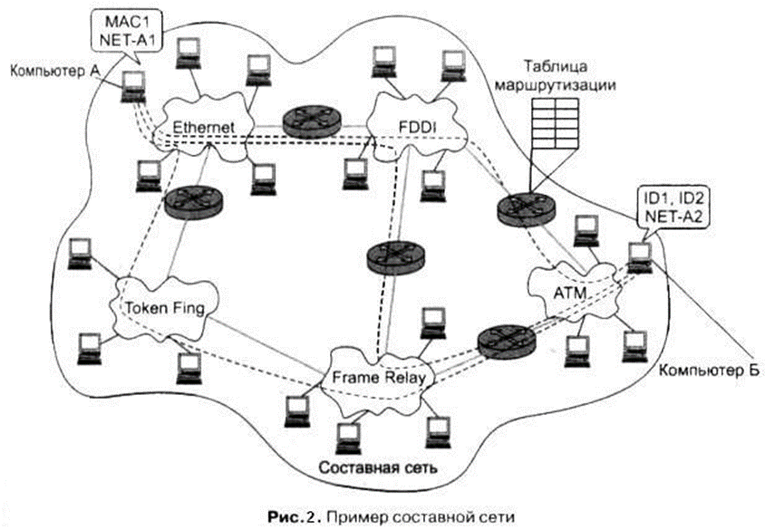
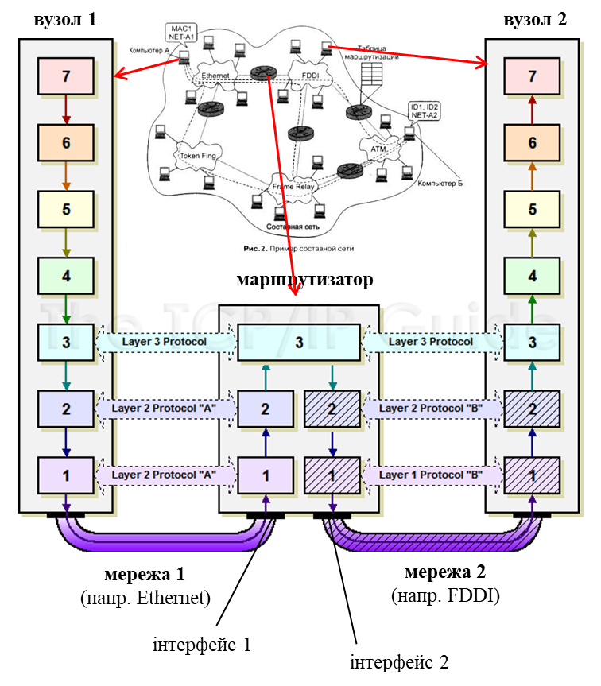
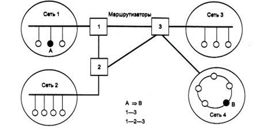
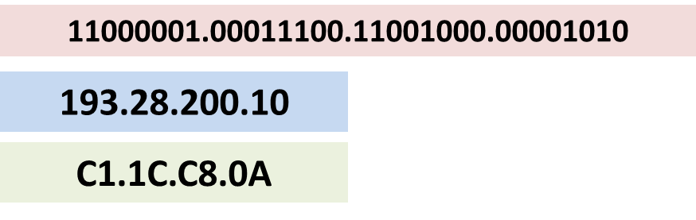
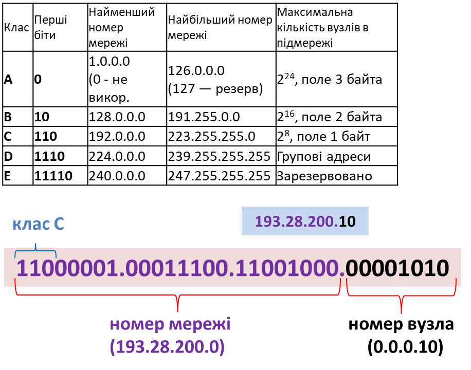
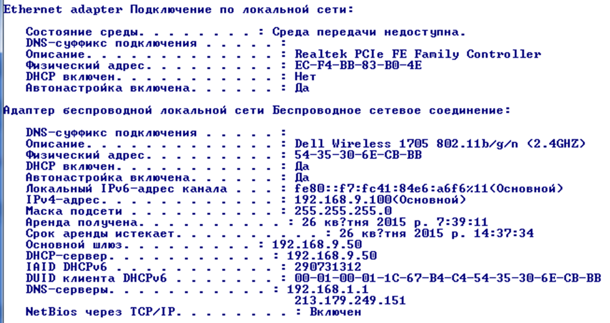
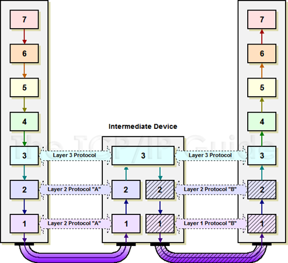
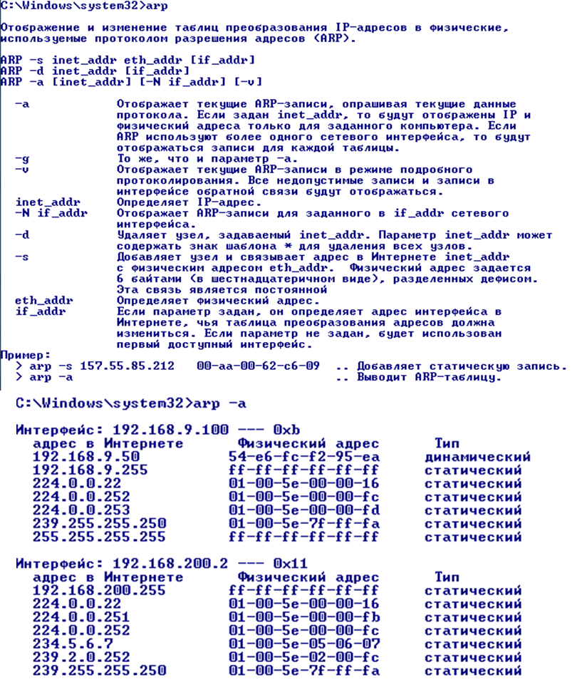
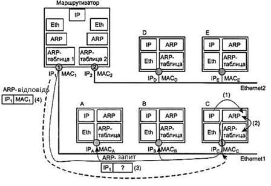
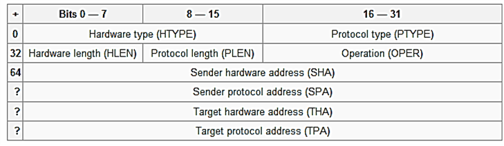

# 6. Протоколи рівня IP

## 6.1. Стек TCP/IP

Стек TCP/IP – це ієрархічно організований набір мережних протоколів, що використовуються в Інтернеті та комп'ютерних мережах; функціонують взаємопов'язано для виконання типових задач. Він включає такі рівні протоколів:

- прикладний - реалізація типових задач, зокрема:
  - FTP – пересилання файлів, 
  - HTTP – доступ до серверів, 
  - Telnet – для доступу терміналу, 
  - SMTP – робота з поштою
  - інші
- транспортний – реалізація доставки даних прикладним процесам: 
  - TCP – надійна доставка зі встановленням з'єднання, 
  - UDP – швидка без з'єднання але ненадійна (по можливості)
- міжмережний – реалізація доставки між вузлами в об'єднаних мережах: 
  - IP – доставка, 
  - всі інші для обслуговування роботи IP (ICMP, RIP, OSPF та інші)

Рівень доступу до мережі (канальний + фізичний) в даному стеці не регламентується.

рис.6.1. Модель TCP/IP в порівнянні з моделлю ISO OSI

Розглянемо як функціонує даний стек. Потік даних від прикладного рівня йде на транспортний рівень для відправки за призначенням. Потік ділиться на кілька пакетів або один, які можуть відправлятися одним з 2-х варіантів:

- надійному але повільному сервісу (TCP сегменти) 
- ненадійному але швидкому (UDP дейтаграми) використовуючи IP

Далі IP пакети відправляються до найближчого маршрутизатору, використовуючи кадри мережних інтерфейсів. Для цього відбувається упаковка в кадр і трансляція IP в апаратну адресу (MAC)  

рис.6.2. Послідовність інкапсуляції пакетів та їх передача.

## 6.2. Типи сервісів (на різних рівнях мережі)

У даному стеку пропонуються різні типи сервісів відносно з'єднання:

- зі встановленням з'єднання (логічне з'єднання, віртуальний канал)

- без встановлення з'єднання 

Відносно підтвердження доставки пакетів:

•з підтвердженням (квітуванням), надійні

•без підтвердження, ненадійні 

•пакети що не потребують підтвердження називаються datagram (дейтаграми) 

### 05:55 Об'єднання мереж

Інтермережа (internet, internetwork, составная сеть (Олифер) ) – мережі (часто різні за типом), об'єднані між собою в єдину мережну систему, в якій вузли об'єднаних мереж можуть спілкуватися між собою.   

-фізичний і канальний рівень об'єднуваних мереж можуть відрізнятися

-об'єднання за допомогою маршрутизаторів (router)

-функціонування на з'єднуваних вузлах та маршрутизаторах єдиного мережного протоколу   

### 07:30 Маршрутизатори

-підключаються відразу до декількох мереж через наявні інтерфейси (мережні адаптери, порти)

-підтримують фізичний та канальний рівні для кожної мережі

-реалізація протоколу мережного рівня на кожному вузлі та маршрутизаторах 

### 09:10 Сегментація мережі

Repeater (повторювач) – поєднує два фізичних сегменти однієї мережі з однаковим інтерфейсом для підсилення сигналу (збільшення відстані, кількості вузлів), ретранслятор.

Hub (концентратор) – поєднує декілька фізичних сегментів однієї мережі в одну логічну шину (багатопортовий повторювач)

Bridge (міст) – поєднує два сегменти однієї мережі (не обов'язково з однаковим фізичним рівнем), при цьому проводить фільтрацію кадрів між ними (однаковий протокол канального рівня)

Switch (комутатор) – багато-портовий міст для паралельної комутації між каналами на основі інформації з канального рівня.

Router (маршрутизатор) – поєднує декілька сегментів різних мереж (можливо з різним стеком реалізації канального і фізичного рівня) забезпечує передачу даних між ними по мережній адресі та маршрутним таблицям

Gateway (Шлюз) – забезпечує обміном даними між різними мережами (навіть з повністю різним стеком протоколів, наприклад Modbus та Profibus)

### 11:40 Мережний рівень OSI

забезпечує доставку блоку байтів потрібним вузлам у різних мережах, з'єднаних маршрутизаторами  

-просування мережних пакетів (N-PDU) між мережами (маршрутизація) 

-зв'язок мережної адреси з апаратною адресою локальної мережі для доставки кадрів з N-PDU в середині мережі 

-додаткові: діагностичні, конфігураційні (ручне та автоматичне налаштування маршрутизації)  

### 13:05 Протоколи IP та допоміжні протоколи мережного рівня 

|                                                              |                                                              |      |
| ------------------------------------------------------------ | ------------------------------------------------------------ | ---- |
| просування мережних пакетів (N-PDU) між мережами (маршрутизація) | IPv4, IPv6 – доставка між мережами IGMP  - групова передача (поверх IPv4) |      |
| зв'язок мережної адреси (IP) з апаратною адресою локальної мережі (MAC) для доставки кадрів з N-PDU в середині мережі | ARP                                                          |      |
| додаткові: діагностичні, конфігураційні (ручне та автоматичне налаштування інтерфейсів та маршрутизації) | ICMP – діагностика та повідомлення про помилки               |      |

### 14:10 Протоколи IPv4 та IPv6

IP (Internet Protocol) – протокол мережного рівня, здобув популярність через використання його в Internet.

IPv4 (IP  версії 4) – 4-байтова адресація вузлів

IPv6 (IP  версії 6) – 16-байтова адресація вузлів

| IPv4                                                         | IPv6                                                         |
| ------------------------------------------------------------ | ------------------------------------------------------------ |
| поки-що більшість вузлів в Інтернет  працюють з цією версією | поки не знайшов широкого вжитку, з кожним роком все більша підтримка |
| дефіцит адрес IP                                             | 340 282 366 920 938 463 463 374 607 431  762 211 456         |
| великі затрати ресурсів на  маршрутизацію                    | спрощена  маршрутизація                                      |
| зв'язок з адресами на канальному рівні з використанням додаткових  протоколів (ARP) | адресація на канальному рівні  враховується в IP  адресі     |

### 16:35 Адресація в стеці TCP/IP

Типи адрес: 

-локальні, апаратні адреси: призначені для адресації вузлів всередині мережі, наприклад MAC-адреса в Ethernet 

-мережні IP адреси: призначені для адресації вузлів в об'єднаній інтермережі, що не залежить від реалізації кожної з них; для маршрутизації в IPv4 логічно мережна адреса повинна включати: 

•номер мережі (підмережі)

•номер вузла в мережі

-символьні доменні імена (DNS-імена): призначені для символьної адресації вузлів; доменним іменам ставиться у відповідність IP-адреси 

193.28.200.10

### 18:00 IP Datagram (IPv4)

### 19:20 Адресація IP (IPv4)

•логічно мережна адреса повинна включати: 

•номер мережі (підмережі)

•номер вузла в мережі

•в структурі запису IP-адреси не визначено де номер підмережі а де номер вузла (крапки - це просто роздільник байтів)

•декілька варіантів вирішення: 

•фіксована,

•на базі маски, 

•на базі класів адрес

### 21:20 Адресація на базі фіксованої границі (RFC760)

•адреса ділиться на фіксовані 2 частини: номер мережі (підмережі), номер вузла

•всі мережі мають фіксовану максимальну кількість вузлів, погана масштабованість    

### 22:30 Адресація на базі класів (класова адресація, RFC791)

•виділяються 5 класів адрес (A..E)

•відношення до класу визначається першими бітами адреси

•найбільш поширені класу С

•D – тільки для групової адресації

•E – зарезервовано

•реально тільки 3 класи мереж, дуже груба градація 

### 26:30 Адресація на базі масок (RFC 950, RFC 1518)

•частина адреси що призначена для номера мережі визначається маскою – послідовністю одиничних бітів

•номер_мережі = IP_адреса AND маска

•запис може бути в формі завдання кількості бітів, наприклад маска 255.255.128.0 має 17 одиничні бітів, тому аналогічний запис 129.64.134.5/17

•використовується для розділення на підмережі (subnetting) та об'єднання підмереж (supernetting)

•маски для класів: А-255.0.0.0, B – 255.255.0.0, C-255.255.255.0

### 28:50 Особливі IP адреси

•не дозволяється назначати мережним картам наступні адреси:

•всі лог."1" та всі лог."0" для призначення адрес вузлам або мережам 

•формату 127.x.x.x

•0.0.0.0 – невизначена адреса, ставиться тільки в поле адреси відправника

•0-й номер мережі – вузол призначення в тій самій мережі що і вузол відправника, ставиться тільки в поле адреси відправника

•255.255.255.255 – обмежена широкомовна адреса (limited broadcast), розсилається всім вузлам в тій же мережі, що і відправник

•всі лог."1" в номері вузла – широкомовним (broadcast), розислається усім вузлам в указаній мережі, наприклад 193.28.200.255 відсилає всім вузлам в мережі 193.28.200.0 

•адреси 127.x.x.x вказуються в полі призначення для відправки самому собі ("петля", loopback ) 

### 31:10 Розподіл IP-адрес в Інтернеті

•унікальність IP адрес в Інтернет досягається за рахунок ієрархічного розподілу (виділення пулу з доступних адрес):

•головна ICANN (Internet Corporation for Assigned Names and Numbers) 

• ICANN координує американську, європейську і азійську

• ті координують регіональних провайдерів, які мілкіших провайдерів і т.д.

•проблема з дефіцитом IP-адрес (мало доступних адрес, неефективне використання особливо в великих мережах), вирішується:

•видачею кінцевим користувачам приватних ("сірих") адрес та використання технологій NAT, proxy

•використання безкласової міждоменної маршрутизації CIDR на базі масок змінної довжини (префіксів)  

### 33:15 Приватні IP-адреси

•Приватні IP-адреси (private IP address, внутрішньомережні, внутрішні, локальні,"сірі") – адреси які належать до спеціального діапазону, що не призначені для використання в мережі Інтернет. 

•призначені тільки для застосування в локальних (автономних) мережах, розподіл мережних адрес не контролюється організаціями, так як вони не видимі з глобальної мережі Інтернет

•адреси співпадають в різних автономних мережах 

•можуть отримувати доступ до Інтернет тільки через спеціалізовані служби: NAT, проксі-сервери, тунелювання 

| Клас А | мережа  10.0.0.0                    |
| ------ | ----------------------------------- |
| Клас В | мережі 172.16.0.0 — 172.31.0.0      |
| Клас С | мережі  192.168.0.0 — 192.168.255.0 |

### 34:45 Ручне налаштування IP (Windows)

на один мережний інтерфейс можна привязати декілька пар IP - маска

### 35:20 Перегляд налаштувань: приклад граф. вікна (Windows)

### 35:35 Перегляд налаштувань: ipconfig/all приклад (Windows)

### 35:50 Зв'язок IP з апаратною адресою Ethernet

•на кожному вузлі чи маршрутизаторі вирішується якому вузлу в цій же мережі передати пакет (наступному маршрутизатору чи кінцевому вузлу), тобто яка адреса IP в локальній мережі

•цей пакет повинен упакуватися в кадр Ethernet та передатися цьому маршрутизатору/вузлу за МАС-адресою

•на кожному IP-вузлі є таблиця з відповідністю IP<->МАС, яка називається ARP-таблицею 

### 37:35 ARP-таблиця та утиліта arp (Windows)

•ARP-таблиця вміщує записи відповідності IP<->MAC 

•може заповнюватися статично, наприклад за допомогою утиліти arp, або іншими програмами

•формується динамічно за допомогою функціонування протоколу ARP 

•динамічні записи мають час життя, і якщо не використовуються – видаляються (як правило хвилини) 

### 39:15 Протокол ARP (в Ethernet) 

•ARP (Address Resolution Protocol) – забезпечує прив'язку фізичних адрес до IP-адрес, функціонує на мережному рівні поверх канального

Алгоритм:

•при включенні вузла/маршрутизатору всі його ARP-таблиці пусті

•(1) служба IP запитує службу ARP «Який МАС у інтерфейсу з таким IP?»

•(2) ARP служба дивиться в ARP-таблицю, якщо IP-адреси немає формується широкомовний ARP-запит (3), який вкладається в кадр Ethernet з широкомовною адресою (FF:FF:FF:FF:FF:FF) 

•всі вузли Ethernet отримують запит і направляють своїй службі ARP, яка порівнює запитувану IP-адресу зі своєю, у кого співпала – генерується відповідь конкретному вузлу (4)

### 41:10 Кадр ARP та сервіс gratuitous

•у рамках протоколу ARP можливі пакети з самозверненням (gratuitous ARP):

•ініціатор формує пакет, де в якості IP отримувача використовується його власна IP-адреса, тобто IP-адреси відправника і отримувача співпадають

•якщо на такий запит прийде відклик, то вузол видасть повідомлення-помилку про наявність вказаної IP-адреси

•потрібно, коли відбувається стартова конфігурація мережного інтерфейсу

•також проводиться коригування запису в АRP-таблицях вузлів, які вміщували стару МАС-адресу ініціатору

•можна використати сніфер для визначення 

SHA – фізична MAC-адреса відправника 

SPA - логічна IP адреса відправника

THA – фізична MAC-адреса отримувача: при запиті поле порожнє;

TPA - логічна IP адреса отримувача

## Запитання для самоперевірки

1. Н

https://youtu.be/ZYJ4Svxj3Dk

https://youtu.be/Y3ZSEr06vLI

https://youtu.be/Oxmzz32s-5I

