[6. Протоколи рівня IP <--   ](6.md) [Лекції](README.md) [   --> 8. Додаткові служби TCP/IP](8.md)

# 7. Протоколи TCP/UDP

## 7.1. Транспортні протоколи TCP та UDP в стеці

Протоколи транспортного рівня слугують для забезпечення передачі даних між процесами (застосунками, службами), тоді як прикладний забезпечує розуміння цих даних і правила спілкування між процесами. Тобто саме транспортний рівень є транспортом для даних між процесами, тоді як нижні рівні є транспортом між вузлами в мережі. 

На сьогодні найбільш популярними є протоколи **TCP** (Transmission Control Protocol) та **UDP** - (User Datagram Protocol). На рис.7.1 показане використання транспортних протоколів в стеці TCP/IP. Їх послугами користуються усі застосунки та сервіси в Інтернеті. Деякі використовують один з них, а деякі обидва (для різних функцій). У свою чергу обидва протоколи для доставки даних на конкретний вузол використовують протокол IP.

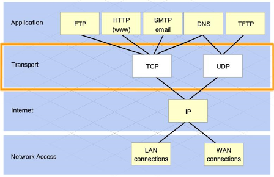

рис.7.1. Транспортні протоколи TCP та UDP в стеці протоколів

На рис.7.2 показаний приклад взаємодії прикладних програм Web-Client (наприклад браузер) та WEB-Server через транспортний протокол. Web-Client формує запит згідно протоколу прикладного рівня HTTP, наприклад на отримання сторінки `/doc/test.html`:

```http
GET /doc/test.html HTTP/1.1
Host: www.example.com
```

Цей запит інкапсулюється (вставляється як байти) в пакет TCP в якості корисного навантаження. Дані які надсилає один прикладний процес іншому називається APDU (Application Protocol Data Unit). Задача транспортного рівня забезпечити передачу цих даних (APDU) в даному випадку до WEB-серверу. Траспортний рівень не цікавить, що значать ці дані, для нього це просто набір байтів. Але для їх доставки потрібному процесу він до цих даних в своєму пакеті добавляє заголовок. Це все необхідно передати на  конкретний вузол, але це не задача транспортного рівня. Тому TCP користується послугами мережного рівня, якому вказує куди саме необхідно передати пакет (IP-адресу). Далі все відбувається за механізмом, описаним в попередніх лекціях.  

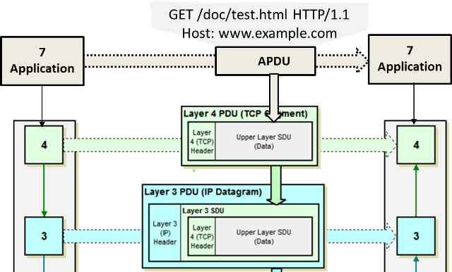

рис.7.2. Послідовність інкапсуляції пакетів та їх передача.

## 7.2. Призначення TCP та UDP в порівнянні

Протокол UDP дуже простий і призначений для доставки APDU до процесу за вказаною транспортною адресою (портом). Він не передбачає ні контролю доставки, ні контролю цілісності повідомлення та не робить фрагментацію (розділення на кілька частин) якщо пакет дуже великий і не може бути переданий IP-пакетом. За рахунок цього UDP швидкий, бо не потребує додаткових полів заголовку (які треба обробляти), а найголовніше - додаткового обміну службовою інформацією. Крім того, він може використовуватися для широкомовлення (broacast, тобто всім) та мультиадресної доставки (multicast). Його використовують у тому випадку коли дані повинні надійти швидко, навіть за умови можливої втрати пакетів. Тобто UDP по факту є просто носієм APDU, який доставляє дані (або ні, якщо не вийде) потрібному прикладному процесу за адресою призначення. 

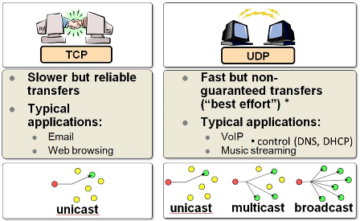

рис.7.3. Порівняння протоколів TCP та UDP

На противагу до UDP, протокол TCP призначений для гарантованої доставки даних. Для цього перед обміном корисними даними для застосунків встановлюється сеанс зв'язку, в межах якого буде проводитися обмін. Для встановлення сеансу проводиться домовленість, що передбачає передачу службових повідомлень (триходове рукостискання), після чого йде обмін пакетами з контролем правильності доставки та підтвердженням отримання. Ці службові пакети роблять передачу надійною, але  набагато повільнішою ніж UDP. 

Детальніше про TCP та UDP описано нижче.   

## 7.3. Адресація за допомогою портів

Обидва протоколи для доставки даних до конкретного процесу (застосунку, службі) використовують адресацію з використанням номерів **портів**. У даному випадку порт є не фізичним, а логічним. Для TCP ініціатор зв'язку називається клієнтом (Client) а Процес, який очікує з'єднання - сервером (Server). Таким чином, щоб сервер отримав повідомлення від клієнта, той має вказати номер (адресу) порту, який прослуховує сервер, тобто очікує на вхідний пакет. Цей номер порту (кажуть просто "порт") вказується в заголовку відправленого пакету, а саме в полі "порті отримувача". У свою чергу, сервер зможе відповісти клієнту, використавши з заголовку отриманого пакету адресу порта відправника. Тобто клієнт заздалегідь повинен знати порт, який прослуховує сервер. А серверу інформація про порт партнера стає відомою після отриманого повідомлення. Для UDP схема обміну така сама, за винятком, що в TCP після встановлення між портами передача проходить в обидва боки, а в UDP тільки в один.  

Необхідність знання клієнтом серверного порту, потребувала би від користувача дізнаватися про цей порт і вписувати в налаштуваннях. Тобто, припустимо, в браузері в рядку підключення, користувач повинен би завжди писати номер порта після двокрапки, наприклад `http://example.com:80`. Але в цьому немає потреби, тому що враховуючи популярність протоколів прикладного рівня, для них означені типові адреси портів, які також називаються **добре відомі** порти (**Well-Known**). Наприклад, за HTTP-сервером закріплений порт `80`. Якщо в браузері не вказати адресу порта (через двокрапку), буде вважатися використання порта `80`, так як він використовується за замовченням для протоколу `http`. Тобто `http://example.com` та `http://example.com:80` будуть доступатися до того ж `80`-го порту.    

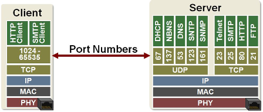

рис.7.4. Номери портів

Клієнтським процесам при підключенні, як правило виділяються вільні порти, тобто ті, які на даний момент на даному пристрої не використовуються драйвером TCP або UDP. Нижче наведений розподіл портів:

- 0-1023 – добре відомі, системні порти (Well-Known, System)
- 1024-49151 – користувацькі (User)
- 49152-65535 – динамічні або приватні порти (Dynamic, Private) 

## 7.4. Заголовок UDP

Як вже було сказано UDP - це дейтаграмний протокол, без з'єднання та без підтвердження доставки. Це дає можливість широкомовної та мультиадресної відправки. Заголовок пакету вміщує тільки адресу відправника та отримувача, довжину пакету (корисні дані та заголовок), та контрольну суму для перевірки (обов'язкова для IPv6 та необов'язкова для IPv4).

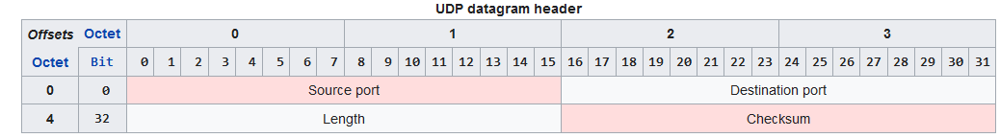

рис.7.5. Заголовок UDP-пакета 

## 7.5. Основи TCP

TCP має складнішу структуру заголовку, яка включає також багато службових полів зокрема для реалізації та пітримання з'єднання, для підтвердження доставки та для можливості фрагментації(7.6)  

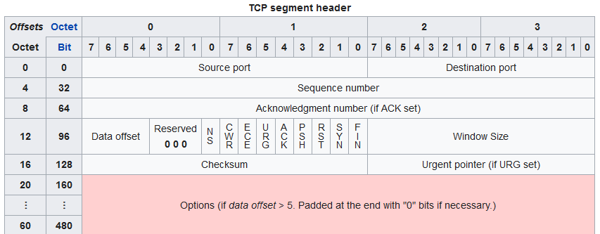

рис.7.6. Заголовок TCP-пакета 

Роботу протоколу можна описати наступними тезисами:

- перед обміном даним створюється логічне з'єднання, перед яким йде домовленість про особливості передачі;
- з'єднання між процесами завжди в режимі "точка-точка"
- з'єднання дуплексне, тобто після з'єднання дані можуть передаватися в обидва боки одночасно
- сервер очікує підключення до нього, а ініціатор (клієнт) активує з'єднання 
- в межах з'єднання відбувається слідкування за доставкою та за порядком октетів (8-бітових байтів)
- з'єднання розривається по ініціативі будь-якого учасника
- дані буферизуються, частина буферу може передатися окремим пакетом - TCP-сегментом
- межі між повідомленнями не зберігаються (потік октетів), які передаються TCP-сегментами

При самостійній реалізації обміну по TCP, наприклад з використанням сокетів (писано нижче), слід звернути на сегментацію та буферизацію обміну. Це значить, що TCP може розбивати APDU на частини, або навпаки об'єднувати їх частини для заповнення буферу. Коли буфер заповниться відбувається відправлення. Тобто TCP не слідкує за межами APDU, і може бути така ситуація, що з одним сегментом прийдуть частини різних APDU.

## 7.6. Сокети

При побудові застосунків з використанням TCP та UDP, як правило користуються бібліотеками, які спрощують обмін з використанням так званих **сокетів** (**Socket**). Сокет - це такий програмний об'єкт, який слугує початковою або кінцевою точкою з'єднання, через який можна передати або отримати дані. Перед обміном даними сокет налаштовується на конкретний мережний інтерфейс та порт (рис.7.7). Таким чином адреса сокету є комбінацією з адреси IP та порту. Клієнтські сокети з'єднуються з серверними з використанням ідентифікатору підключення, який містить п'ятірку елементів:

- протокол (TCP або UDP), 
- IP адреси відправника (src) та отримувача (dst)
- номери портів відправника (src) та отримувача (dst):     

**Protocol** **+** **IPdst** **+** **PORTdst** **+** **IPsrc** **+** **PORTsrc** (5-ка)

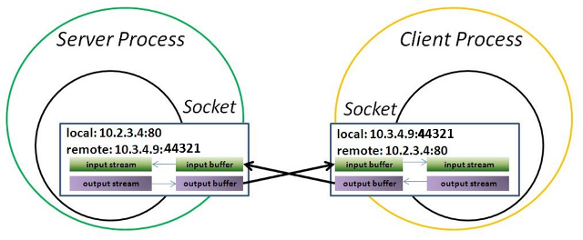

рис.7.7. Принципи роботи сокетів

На рис.7.8. показані етапи роботи сокетів для протоколу TCP. Спочатку в застосунку створюються сокети (примітив `socket`). Далі відбувається зв'язок  з сокету (примітив `bind`) з локальною адресою (IP та порт). Серверний сокет вказує на очікування з'єднання від клієнта (примітив `listen`). У клієнтського сокету викликається примітив `connect` для його підключення до серверного сокету. В примітиві вказується адреса серверного сокету. На серверному сокеті викликається примітив `accept` для підтвердження підключення, після чого будь який з партнерів може відправляти (`send`) та отримувати (`recv`) дані. Примітив `close`  розриває з'єднання.    

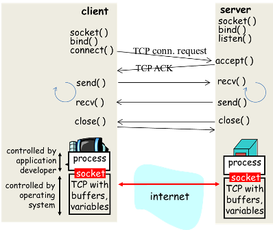

рис.7.8. Етапи роботи сокета

У таблиці 7.1. показані примітиви сокетів, які як правило реалізовані у вигляді методів об'єкту `socket`.   

Таблиця 7.1. Примітиви роботи з сокетом.

| **Примітив** | **Призначення**                    |
| ------------ | ---------------------------------- |
| SOCKET       | створити сокет                     |
| BIND         | зв'язати сокет з локальною адресою |
| LISTEN       | очікувати з'єднання від клієнта    |
| ACCEPT       | підтвердити з'єднання              |
| CONNECT      | підключатися до серверного сокету  |
| SEND         | відправити по каналу               |
| RECEIVE      | отримати з каналу                  |
| CLOSE        | розірвати з'єднання                |

На рис.7.9 схематично показаний обмін через сокети, як через віртуальні канали. Навіть якщо на вузлі використовується той самий номер порту, для окремого з'єднання створюється свій сокет. Таким чином кілька серверних сокетів можуть використовуватися для існуючих з'єднань (наприклад `Socket1` і `Socket2` на рис.7.9), а один завжди буде очікувати нового підключення (на рис.7.9 не показано).    

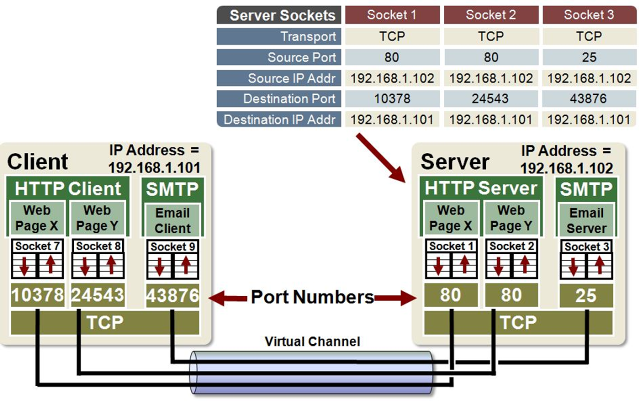

рис.7.9. Демонстрація обміну через сокети

## 7.7. Сеанс TCP

Вище коротко описано які етапи відбуваються при обміні даними з використанням TCP. Зараз розглянемо це більш детально. Даний пункт не є обов'язковим для вивчення і рекомендується для прочитання у випадку глибокого аналізу причин несправностей.   

Як вже було зазначено, для забезпечення надійної передачі між процесами встановлюється логічне з'єднання, яке зветься TCP-сеансом або TCP-сесією. Протокол TCP працює у форматі архітектури клієнт-сервер, де процес який надсилає запит на отримання сервісу є клієнтом, а той хто відповідає на запит зветься сервером. Протягом TCP-сеансу дані надсилаються в  обох напрямках, як від сервера до клієнта так і від клієнта до сервера, тобто створюються два потоки даних. Кожен окремий сеанс роботи протоколу ТСР можна представити через три етапи:

1. Встановлення з'єднання
2. Обмін даними
3. Завершення з'єднання

### Встановлення з'єднання

Необхідною умовою для встановлення ТСР-сеансу є відкритий доступ до програмного сокету процесу на сервері через порт. За такої умови стан ТСР-сеансу на стороні сервера є **LISTEN** (слухати). Вище було розглянуто, що це досягається через однойменний примітив серверного сокету, який попередньо був зв'язаний з цим портом та локальною IP-адресою. Тобто сервер слухає якийсь конкретний TCP-порт і очікує отримання запиту від клієнта на надання послуг, що відповідають номеру цього порту. На стороні клієнта початковий стан ТСР-сеансу є **CLOSED**.

Після виклику примітива CONNECT клієнтського сокету, відбувається процедура з'єднання. Для встановлення з'єднання протокол TCP використовує алгоритм триходового рукостискання (handshaking), назване так за кількістю повідомлень між процесами (рис.7.10):

1) Клієнт формує TCP-заголовок (рис.7.6): 

- у поле порт джерела заносить свій номер TCP-порта, як правило динамічний, 
- у поле порт призначення номер порту протоколу прикладного рівня, послуги якого хоче отримати, 
- в поле номер послідовності сегменту вставляє довільне значення та встановлює прапорець **SYN**. 

Сформований таким чином TCP-сегмент відправляється серверу. ТСР-сеанс на стороні клієнта переходить у стан **SYN-SENT**.

2) Сервер отримує ТСР-сегмент від клієнта зі встановленим прапорцем **SYN** та (у випадку вкилику підтверджуючого примітива ACCEPT для серверного сокету) у відповідь формує TCP-заголовок: 

- у поле порт джерела заносить свій номер TCP-порта, 
- у поле порт призначення номер порту клієнта. 
- додає до отриманого від клієнта номера послідовності сегменту `1`  і поміщає отримане число до номеру підтвердження, 
- вносить свій власний початковий номер послідовності сегменту
- та відправляє сегмент до клієнта з прапорцями **SYN** та **ACK**. 

ТСР-сеанс на стороні сервера переходить у стан **SYN-RECEIVED**.

3) Після отримання ТСР-сегмента зі встановленими прапорцями ACK та SYN клієнт переходить у стан **ESTABLISHED** та: 

- відповідає на запит сервера про синхронізацію шляхом додавання `1` до номера отриманої послідовності сегменту 
- поміщає це число до номера підтвердження. 

Далі клієнт надсилає таким чином сформований сегмент до сервера з прапорцем **ACK**

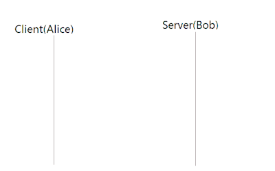

рис.7.10. Встановлення з'єднання - триходове рукостискання

Після отримання сервером ТСР-сегмента з прапорцем **ACK** стан ТСР-сеансу на його стороні стає також **ESTABLISHED**, разом з чим розпочинається передавання даних.

Також на етапі встановлення з'єднання між процесами, як правило відбувається обмін опціями, тобто TCP-параметрами, які впливають на ефективність передавання даних.

### Завершення TCP сеансу

Ініціатором завершення з'єднання може бути, як клієнт так і сервер (рис.7.12). Для закінчення TCP-сеансу використовується так зване чотириходове рукостискання (four-way handshake).

1. Ініціатор розірвання з'єднання направляє своєму партнеру TCP-сегмент зі встановленим прапорцем **FIN**. TCP-сеанс ініціатора переходить зі стану **ESTABLISHED** у стан **FIN-WAIT-1**
2. Процес-отримувач приймає *FIN* від ініціатора та посилає у відповідь *TCP*-сегмент зі встановленим прапорцем **АСК**. *TCP*-сеанс отримувача переходить зі стану **ESTABLISHED** у стан **CLOSE-WAIT**. З набуттям хостом цього стану *TCP* припиняє отримувати нові запити, на передавання даних, від відповідного протоколу верхнього рівня та встановлює таймер на завершення попередніх запитів. Ініціатор отримує *АСК* та переходить у стан **FIN-WAIT-2**.
3. Після завершення оброблення всіх запитів протоколів верхнього рівня процес-отримувач переходить у стан **LAST-ACK** та відправляє ініціатору *TCP*-сегмент зі встановленим прапорцем **FIN**.
4. Ініціатор приймає *FIN* від отримувача та посилає у відповідь *TCP*-сегмент зі встановленим прапорцем **АСК**. Отримувач приймає *АСК* та переходить у стан **CLOSED**.

Ініціатор розірвання з'єднання чекає протягом подвійного часу від MSL (максимального життя сегмента, maximum segment lifetime), щоб переконатися, що відправлений *ACK* був отриманий та також переходить у стан **CLOSED**.  


рис.7.12. Розірвання з'єднання

Весь описаний вище алгоритм встановлення та завершення TCP-сеансу а також роботи під час сеансу показаний на діаграмі станів (рис.7.13). 


рис.7.13. Діаграма станів TCP-сеансу

## 7.8. Утиліти контролю роботи

Для контролю станів портів в конкретній ОС можуть використовуватися різноманітні утиліти. Тут коротко розглянемо декілька. 

### NetStat

Разом з різними ОС у тому числі Windows в комплекті поставляється утиліта NetStat, яка відображає активні підключення TCP, порти, які прослуховуються комп’ютером, статистику Ethernet, таблиці маршрутизації IP, статистику IPv4 (для протоколів IP, ICMP, TCP и UDP). 

Викликана без параметрів, команда netstat відображає встановлені підключенняTCP. Отримати усю довідку можна викликавши `netstat /?`.

Наприклад команда з опцією `-a`:

```bash
netstat -a
```

виведе список активних з'єднань та їх стан в формі:

```bash
C:\Windows\system32>netstat -a

Active Connections

Proto 	Local Address 						Foreign Address 		State
TCP 	192.168.43.15:139 					DESKTOP-A0PM5GD:0 		LISTENING
TCP 	192.168.43.15:52484 				ec2-52-0-252-13:https 		ESTABLISHED
TCP 	192.168.43.15:52532 				ec2-13-228-49-204:https TIME_WAIT
UDP 	[fe80::998c:d2d:17df:65d9%12]:58903 *:*
```

Поля в записах значать: 

- `Proto` –  вказує тип протоколу (TCP, UDP)
- `Local Address` – відображає IP-адресу комп’ютера та порт з локального кінця сокету (тобто цей комп'ютер)
- `Foreign Address` –  відображає віддалений комп’ютер, тобто другу сторону сокета  
- `State` – вказує на стан сокету (LISTENING, ESTABLISHED, CLOSE_WAIT, TIME_WAIT) (див.рис.7.13).

Можна виводити підключення вказавши фільтри, наприклад по стану підключення. Зокрема, для попереднього прикладу команда:

```bash
netstat -a | findstr LISTENING
```

виведе тільки інформацію про сокети, які знаходяться в стані прослуховування:

```bash
C:\Windows\system32>netstat -a | findstr LISTENING
  TCP 192.168.43.15:139 DESKTOP-A0PM5GD:0 LISTENING
```

А ця команда виведе список що містить підключення, що мають в номері порту `502`, та опцією `-o` що виводить також ідентифікатор процесу PID:

```bash
C:\Windows\system32>netstat -a -o | findstr 502
  TCP    0.0.0.0:502            DESKTOP-I8RRH1O:0      LISTENING       2540
  TCP    127.0.0.1:502          DESKTOP-I8RRH1O:7027   ESTABLISHED     2540
  TCP    127.0.0.1:7027         DESKTOP-I8RRH1O:502    ESTABLISHED     17276
```

Виведена вище команда показує, що по одному порту застосунок з PID=2540 має два сокети: 

- по одному відбувається прослуховування з'єднання (LISTENING)
- а по другому встанолене з'єднання з процесом з ID=17276 (ESTABLISHED)  

### nmap

Для перегляду доступних портів на іншому ПК можна використовувати різноманітні безкоштовні утиліти, типу [nmap](https://nmap.org/download.html#windows). Вона дає можливість сканувати ПК в мережі, виявляти серверні порти та багато інших функцій, про які можна дізнатися з довідки.  Наприклад, якщо у полі `Command` ввести команду nmap з опцією `-p` та вказати діапазон портів що цікавить та адресу IP: 

```bash
nmap -p 0-65535 -T5 192.168.56.101
```

можна отримати результат з відкритими портами (рис.7.13) 


рис.7.13. Вікно сканування портів 

Слід зазначити що за замовченням політики безпеки забороняють доступ до вхідних портів в ОС. Різноманітні брандмауери (вбудовані або встановлені з антивірусним ПЗ) можуть блокувати порти. Тому команда на ПК `netstat -a | findstr LISTENING` може показати порти, що наразі прослуховуються, але при цьому `nmap` їх не покаже. Налаштування брандмауерів розглядатиметься на наступних лекціях.

Також варто відмітити, що сканування мереж та портів не в своїй організації, може бути сприйнято як зловмисні дії. Тому дану утиліту варто використовувати тільки в локальних мережах. 

### Packet Sender 

Packet Sender <https://packetsender.com/> - безкоштовна утиліта яка дає можливість тестувати приймання та передавання даних (корисного навантаження) поверх TCP та UDP. Він надає можливість як клієнтського так і серверного інтерфейсу, формувати відповідні повідомлення на запити, передавати дані текстом або байт-кодами та багато чого іншого.  

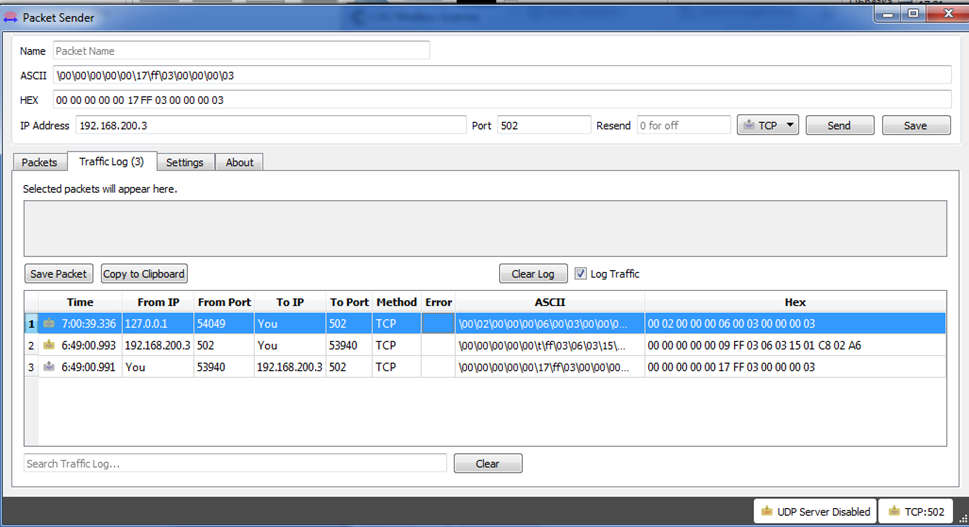 

рис.7.14. Приклад вікна Packet Sender.  

## Контрольні питання

1) Покажіть на прикладі, як відбувається обмін даними між процесами за допомогою транспортного рівня.
2) Порівняйте TCP та UDP стосовно тих можливостей, які вони надають.
3) Розкажіть як використовуються номера портів для адресації процесів в обміні TCP/UDP.
4) Що таке добре відомі порти (Well-Known) і для чого вони використовуються? Чому клієнтським процесам не потрібно назначати добре відомі порти?
5) Розкажіть про функціональність TCP.
6) Розкажіть про механізм використання сокетів.
7) Як досягається унікальність ідентифікування сокету?
8) Розкажіть основні процедури роботи з сокетами.
9) Розкажіть про процедуру встановлення з'єднання по TCP.
10) Розкажіть про процедуру розриву з'єднання по TCP.
11) Розкажіть про основні можливості утиліти NetStat.
12) Розкажіть про основні можливості утиліти nmap.
13) Розкажіть про основні можливості утиліти Packet Sender. 

## Посилання на відеозаписи лекцій

[Л7. Протоколи TCP/UDP Протоколи рівня IP Ч3.](https://youtu.be/p-Rf2j1_-i0?si=qyOIwFoX8Af0iwaZ)


[6. Протоколи рівня IP <--   ](6.md) [Лекції](README.md) [   --> 8. Додаткові служби TCP/IP](8.md)
