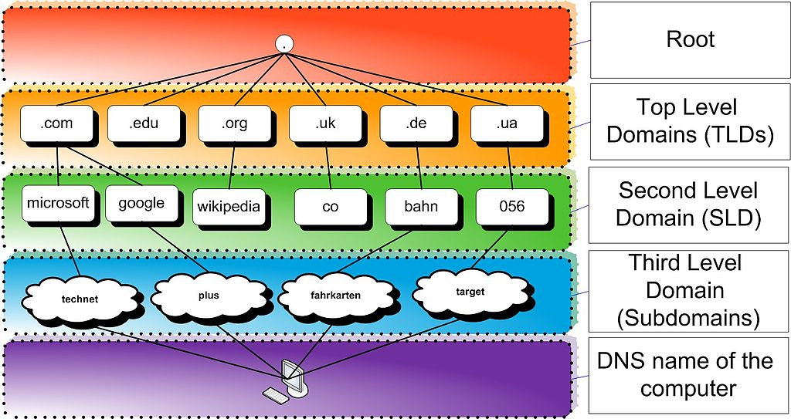
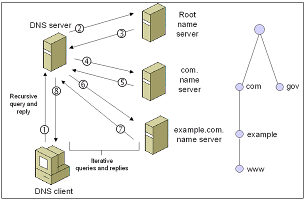
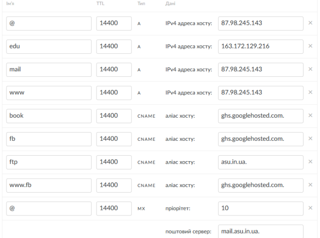
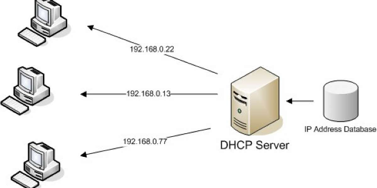
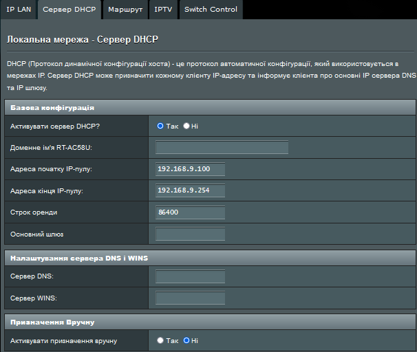
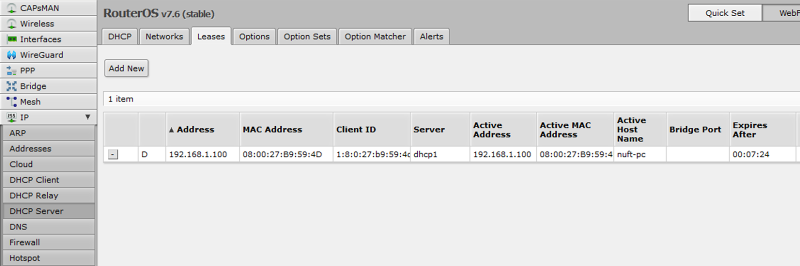
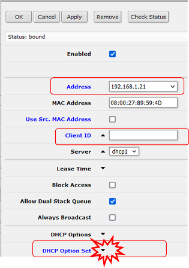
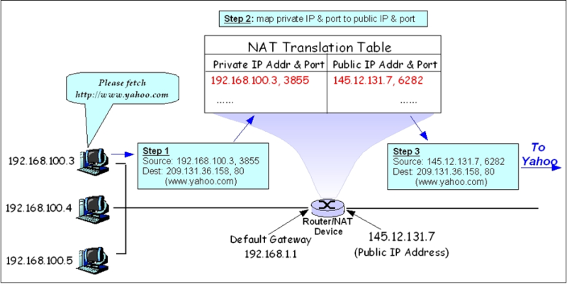
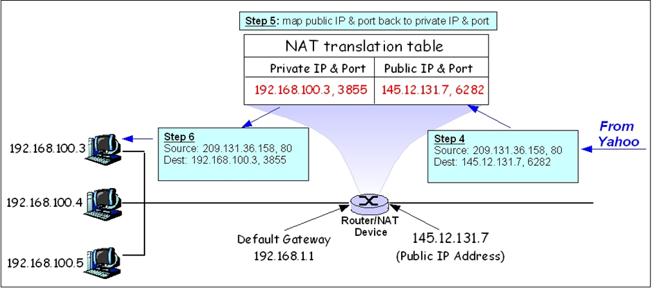
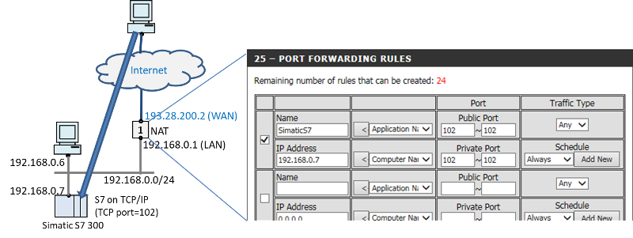

[7. Протоколи TCP/UDP<--   ](7.md) [Лекції](README.md) [   --> 9. Прикладний рівень: HTTP, HTTP API ](9.md)

# 8. Додаткові служби TCP/IP

## 8.1. Система DNS

Користувачам мереж зручніше користуватися іменами ніж адресами. Наприклад простіше запам'ятати символьну адресу сайту університету www.nuft.edu.ua аніж її IP `193.28.200.x`. Крім того, сервера часто змінюють своє розташування (хостинг), "переїжджаючи" з однієї локації (наприклад серверу безпосередньо в будівлі університету) на іншу, наприклад в хмарний сервіс в безпечному місці з постійним живленням. При цьому адреса IP зміниться, а символьне ім'я - ні. Також, в деяких розподілених системах, таких як `www`, на одному вузлі (сервері) можуть виконуватися (хоститися) різні WEB-сайти, які будуть мати різні імена але однакові IP.           

Для можливості звернення до вузлів через їх імена в Інтернеті існує **система доменних імен** (Domain Name System, **DNS**) — ієрархічна та розподілена система ідентифікації хостів (комп’ютерів та інших подібних пристроїв), доступних через Інтернет або інші мережі з Інтернет-протоколом (IP). Ресурсні записи, що містяться в DNS, пов’язують доменні імена із числовими IP-адресами, необхідними комп’ютерам для визначення місцезнаходження служб і пристроїв.

Важливою та повсюдною функцією DNS є його центральна роль у розподілених Інтернет-сервісах, таких як хмарні сервіси та мережі доставки контенту. Коли користувач отримує доступ до розподіленої служби Інтернету за допомогою URL-адреси, доменне ім’я з цієї URL-адреси перетворюється на IP-адресу сервера, який є найближчим до цього користувача. Ключова функція DNS, яка використовується тут, полягає в тому, що різні користувачі можуть одночасно отримувати різні IP-адреси для одного доменного імені найбільш релевантно саме для цього користувача. 

Система доменних імен складається з трьох основних компонентів:

-  Простір доменних імен (domain namespace) є специфікацією для структури дерева доменних імен.
- Сервери імен (Name servers) — це серверні програми, які містять інформацію про структуру дерева домену, які можуть встановлювати інформацію або кешувати її.
- Розв'язувачі (Resolvers) — це клієнтські програми, які отримують інформацію з серверів імен у відповідь на запити користувачів.

Розпізнавання доменних імен (або **DNS resolution**) — це процес пов’язування IP-адрес із доменними іменами. Наприклад, веб-браузер за допомогою розв’язувача зв’язується з сервером імен і за доменним іменем отримує інформацію, що міститься в просторі імен домену.

### Простір доменних імен та зони DNS

Символьна назва вузла в системі DNS називається **повним доменним ім'ям** (**FQDN** - Fully Qualified Domain Name). Наприклад `nuft.edu.ua` - це повне доменне ім'я, яке можна розбити на дві частини: ім'я вузлу ( `nuft`) та ім'я області-домену (`edu.ua`), де знаходиться вузол. За адміністрування та обслуговування вузлів в **домені** (**Domain**) займаються група серверів імен цього домену, які містять інформацію про відповідність IP та імен. 

Весь простір доменних імен має деревовидну структуру. Існує домен кореневого рівня (root), який позначається крапкою `.`, наступний рівень ієрархії — це домени верхнього рівня (TLD), далі другого рівня (SLD), ті субдомени третього рівня і так далі (рис.8.1). Таким чином повне доменне ім'я складається з кількох **міток** (**labels**), які розділені крапками і означують шлях по ієрархії. Наприклад вузол з міткою `nuft` лежить в домені другого рівня з міткою `edu` який у свою чергу знаходиться в домені верхнього рівня з міткою `ua`.  Це дерево підрозділів може теоретично мати до 127 рівнів.



рис.8.1. Ієрархія доменів DNS

Мітка може містити від нуля до 63 символів, а довжина повного доменного імені не може перевищувати 253 символи в текстовому представленні. Символи, дозволені в мітках, є підмножиною набору символів в ASCII кодуванні, що складається з символів від `a` до `z`, від `A` до `Z`, цифр від `0` до `9` і дефіса. Це правило відоме як правило `LDH` (літери, цифри, дефіс). Зараз існує рішення, яке дозволяє використовувати національні символи в мітках, наприклад кирилицю. 

Ієрархічність імен в DNS дає можливість розподілити функції вирішення зв'язування імен та IP-адрес між різними групами серверів імен. Таким чином за певну частину простору імен в системі DNS відповідає певна організація, яка забезпечує адміністрування бази даних, в якій зберігається вся необхідна для цього інформація. Ці області відповідальності називаються **зонами DNS**, кожна з яких може відповідати за кілька субдоменів. Зона починається в домені певного рівня та простягається вниз по дереву домену до листових вузлів або до верхнього рівня субдоменів, де починаються інші зони. Більшість операторів реєстру доменних імен верхнього рівня пропонують свої простори імен громадськості або організаціям із обов’язковим географічним чи іншим призначенням для реєстрації доменів другого рівня. Подібним чином організація, яка відповідає за домен нижчого рівня, може аналогічно керувати своїм простором імен і розділяти свій простір. 

### DNS-сервери

**Сервери імен** (або DNS-Сервери), це застосунки, які містять інформацію для вирішення зв'язки `доменне ім'я -> IP-адреса(-си)`. Вони відповідають на запити від DNS-Клієнтів, яким потрібна ця інформація. Є два типи серверів імен: авторитетні та рекурсивні. 

Кожен домен має принаймні один **авторитетний сервер** імен (authoritative name server), в задачу якого входить публікувати інформацію про цей домен і сервери імен будь-яких підлеглих йому доменів. Він відповідає на запити, беручи інформацію з записів, що були створені в його базі даних шляхом адміністрування. 

Натомість **рекурсивний сервер** (також називають неавторитетним), у відповідь на запит в пошуках відповіді звертається до інших серверів DNS або до власних кешованих даних, які з'явилися за попередніх відповідей на аналогічні запити (рис.8.2).       


рис.8.2. Спрощене представлення взаємодії авторитетних та рекурсивних сереврів.

Рекурсивні сервери є робочими конячками в процесі пошуку DNS. Їм часто доводиться виконувати численні пошуки в системі DNS, щоб надати необхідну інформацію про IP-адресу клієнту. Такими типами серверів зазвичай керує провайдер Інтернет-послуг (Інтернет-провайдер), або спеціалізовані DNS-провайдери. Дійсні (оригінальні) записи зіставлення IP доменному імені існують лише на авторитетних DNS-серверах. У ієрархічній доменній структурі все починається з кореневих авторитетних серверів імен, тобто що відповідають за домен з міткою `.`. Ці авторитетні сервери імен знають IP-адреси авторитетних серверів для доменів верхнього рівня (TLD), наприклад `.com`.

Якщо на запит клієнта (рис.8.3(1)) рекурсивний DNS-сервер не має жодної кешованої інформації, щоб знайти IP-адресу, наприклад для `www.example.com` він запускає рекурсивний алгоритм:

- спочатку рекурсивний сервер спитає серверу кореневого домену про авторитетний сервер домену `.com` (2,3)
- потім він питає авторитетного сервера домену `.com` про субдомен `example` (4,5)
- потім у домену `example` про розташування вузла `www` (6,7)
- повертає відповідь клієнту (8)



рис.8.3. Робота рекурсивного алгоритму

Рекурсивні сервери рекурсивно проходять через ієрархічне дерево DNS зверху вниз, доки не потраплять на авторитетний сервер відповідного домену. У більшості випадків рекурсивні DNS-сервери фактично кешують записи авторитетних DNS-серверів. Це означає, що вони зберігають відображення URL-адрес на IP-адреси протягом певного часу (відомого як `TTL`, або час життя). Це означає, що їм не потрібно повторно надсилати ті самі запити на ті самі авторитетні сервери, що економить користувачеві багато часу а також зменшує навантаження на авторитетні сервери. Рекурсивний сервер імен знає лише, де знайти кореневі сервери імен (з міткою `.`). На основі кожного рівня серверів імен, знаючи, де знаходиться наступний рівень в ієрархії, відповідь зрештою знайдеться.

Авторитетний сервер імен може бути основним (primary server) або резервним сервером (secondary server). Основний сервер — це сервер, на якому зберігаються оригінальні копії всіх записів зони. Резервний сервер використовує спеціальний механізм автоматичного оновлення в протоколі DNS під час зв’язку зі своїм основним сервером для підтримки ідентичної копії первинних записів. Кожній зоні DNS має бути призначений набір авторитетних серверів імен. Цей набір серверів зберігається в зоні батьківського домену із записами сервера імен (`NS`, див. нижче). 

### Ресурсні записи та налаштування DNS

Кожен вузол у дереві має мітку та нуль або більше **ресурсних записів** (**RR** - Resource record), які містять інформацію, пов’язану з доменним іменем. Кожен запис має тип (ім’я та номер), термін дії (час життя), клас і дані, що стосуються типу. Під час надсилання через мережу Інтернет-протоколу всі записи використовують загальний формат, в яких є поля, які налаштовуються при створенні записів:

| Поле | Опис                                                         |
| ---- | ------------------------------------------------------------ |
| NAME | Доменне ім’я вузла в дереві. У мережі ім’я можна скоротити за допомогою стиснення міток, де кінці доменних імен, згаданих раніше в пакеті, можна замінити на кінець поточного доменного імені. |
| TYPE | Тип запису у цифровій формі (наприклад, 15 для MX RR), що вказує на формат даних і дає підказку про їх призначення. |
| TTL  | Кількість секунд, протягом яких RR залишається дійсним (максимум 68 років) |
| DATA | Додаткові специфічні для запису дані. Вони залежать від типу запису, наприклад IP-адреса для записів адрес або пріоритет і ім’я хоста для записів `MX`. |

Відповідно при налаштуванні DNS добавляються кілька записів, для кожної з якої вказують наведені вище поля, та деякі інші. В таблиці нижче наведені деякі типи записів та призначення Name та Data:

| Тип   | Призначення                                    | Функція                                                      | Name                                            | Data                                         |
| ----- | ---------------------------------------------- | ------------------------------------------------------------ | ----------------------------------------------- | -------------------------------------------- |
| A     | Адресний запис                                 | Повертає 32-бітну адресу IPv4, яка найчастіше використовується для зіставлення імен хостів з IP-адресою хосту, але також використовується для DNSBL (чорний список), зберігання масок підмереж у RFC 1101 тощо. | доменне ім'я                                    | адреса IPv4                                  |
| AAAA  | Адресний запис IPv6                            | Повертає 128-бітну адресу IPv6, яка найчастіше використовується для зіставлення імен хостів з IP-адресою хосту. | доменне ім'я                                    | адреса IPv6                                  |
| CNAME | Канонічний запис імені (Canonical name record) | Псевдонім (alias) одного імені для іншого (канонічного). Наприклад для запуску кількох сервісів (FTP-сервер і веб-сервер, кожен з яких працює на різних портах) з однієї IP-адреси: `ftp.example.com` і `www.example.com` на запис DNS для `example.com`, який, у свою чергу, має запис `A`, який вказує на IP-адресу. Канонічне імя може бути в іншій зоні DNS. | доменне ім'я псевдоніму                         | канонічне доменне ім'я                       |
| MX    | Запис про обмін поштою                         | Вказують сервери (з визначенням пріоритетності), на які потрібно відправляти електронну пошту, призначену для адрес в даному домені. Ім'я хоста, зазначеного в MX-записі, повинне містити IP-адресу, визначену за допомогою запису типу A. Псевдоніми CNAME не можуть мати своїх MX-записів. Щоб відправити електронну пошту на певну адресу, сервер-відправник робить DNS-запит, запитуючи MX-запис домену одержувача електронного повідомлення (тобто частини адреси після символу «@»). В результаті запиту повертається список імен хостів поштових серверів, що приймають пошту для даного домену, а також величина пріоритету для кожного з хостів. Сервер-відправник потім намагається встановити SMTP-з'єднання з одним з цих хостів, починаючи з того, у кого значення величини пріоритету найменше, перебираючи кожний з них, поки не вдасться встановити з'єднання принаймні з одним з них. Механізм MX-записів надає можливість використовувати безліч серверів для одного домену та впорядкування їх використання в цілях зменшення навантаження і збільшення ймовірності успішної доставки пошти. | доменне ім'я (що йде після @ в поштовій адресі) | канонічне доменне ім'я для поштового серверу |
| TXT   | Текстовий запис                                | Спочатку було для довільного читабельного тексту в записі DNS, наприклад текстовий опис доменного імені, однак зараз частіше містить машинозчитувані дані. | доменне ім'я                                    | довільний текст                              |
| NS    | Запис сервера імен                             | Делегує зону DNS для використання вказаних авторитетних серверів імен | доменне ім'я                                    | доменне ім'я серверу імен                    |
| PTR   | Вказівник                                      | Зв'язує IP адресу хоста з його канонічним ім'ям. Він обернений до `A`-записів. Запит в  домені `in-addr.arpa` на IP хоста в reverse формі поверне ім'я (FQDN)  даного хоста. Наприклад для IP адреси `192.0.34.164`: запит запису PTR `164.34.0.192.in-addr.arpa` поверне його канонічне ім'я  `referrals.icann.org`. З метою зменшення обсягу небажаної кореспонденції (спаму) багато серверів-одержувачів електронної пошти можуть перевіряти  наявність PTR запису для хоста, з якого відбувається відправлення. У цьому випадку PTR запис для IP адреси повинен відповідати імені відправляючого поштового сервера, яким  він представляється в процесі SMTP-сесії. | адреса IPv4                                     | доменне ім'я                                 |

Організація, яка реєструє домени часто надає послуги і на використання власних серверів імен. Наприклад,  для налаштування записів для www.nic.ua діють наступні правила при створенню запису типу `A` або `AAA`:

1. `Name` (Ім'я): якщо це основний домен, то вноситься ім'я `@`. Якщо це для піддомену, то вноситься його ім'я. Наприклад, для `blog.domain.com` буде  достатньо внести ім'я `blog`;
2. `TTL`: час життя запису. Мінімальний параметр 3600 секунд,  стандартний 14400 секунд. В більшості випадків вам не потрібно його  змінювати;
3. `Type` (Тип): тут ви обираєте тип `А` (для IPv4) або `АААА` (для IPv6);
4. `Data` (Дані) IPv4(IPv6) адреса хосту: вноситься IP адреса хостингу.

Нижче наведений приклад таблиці налаштування серверу імен DNS для домену `asu.in.ua.`, який зареєстрований на NIC.ua та використовує їх сервери імен.  



рис.8.4. Приклад налаштування DNS-серверу 

Як видно з рис.8.4 основний запис (`@`) типу `A` посилається на конкретну IP адресу. На ту ж адресу посилаються піддомени `mail` та  `www`. Запис з іменем `edu` (тобто `edu.asu.in.ua`) задає хост за іншою адресою IP. Ім'я `ftp` типу CNAME є псевдонімом для `asu.in.ua.`, тоді як субдомени `book`, `fb`, `www.fb` посилаються на записи типу `A` в домені `ghs.googlehosted.com.` (сайти гугл). Усі поштові листи, які приходимуть за шаблоном отримувача на `xxxx@asu.in.ua` будуть перенаправлятися на запис, що означено в `mail.asu.in.ua`.

Система доменних імен підтримує записи DNS із символами узагальнення, які означують імена, що починаються з зірочки `*`, наприклад, `*.example`. Записи DNS, що належать доменним іменам із символом узагальнення, означують правила для створення записів ресурсів у межах однієї зони DNS шляхом заміни цілих міток на відповідні компоненти імені запиту, включаючи будь-які вказані нащадки. Наприклад, у наведеній нижче конфігурації зона DNS `x.example` визначає, що всі субдомени, включаючи субдомени субдоменів, `x.example` використовують поштовий обмінник (MX) `a.x.example`. Запис `A` для `a.x.example` потрібен для вказівки IP-адреси поштового обмінника. Оскільки це призведе до виключення цього доменного імені та його субдоменів зі збігів символів підстановки, додатковий запис `MX` для субдомену `a.x.example`, а також запис `MX` із символами підстановки для всіх його субдоменів також необхідно визначити в зоні DNS.

```
x.example.       MX   10 a.x.example.
*.x.example.     MX   10 a.x.example.
*.a.x.example.   MX   10 a.x.example.
a.x.example.     MX   10 a.x.example.
a.x.example.     AAAA 2001:db8::1
```

### Утиліти для перевірки DNS

#### WHOIS

WHOIS — протокол запит/відповідь, що дозволяє отримати інформацію про домен, наприклад:

- Дані про поточний реєстратор домену.
- Поточний статус домену.
- Дату і термін реєстрації домену.
- Поточні NS (сервери імен), на яких обслуговується домен.
- Дату останньої зміни статусу домену або його NS (зміна налаштувань домену не враховується).

Є утиліти які надають інформацію безпосередньо з командного рядку ОС, наприклад в Linux вбудовані, у Windows можна завантажити. Натомість є безкоштовні онлайн-сервіси, наприклад [за цим посиланням](https://www.ukraine.com.ua/uk/domains/whois-service) . Наприклад, якщо ввести `nuft.edu.ua`  в поле для введення, можна тримати таку інформацію (деякі фрагменти видалені):

```
Інформація реєстру whois домену - nuft.edu.ua

% % .UA whois
% Domain Record:
% =============
domain:     nuft.edu.ua
admin-c:    NUFT-UANIC
tech-c:     NUFT-UANIC
status:     OK-UNTIL 20230614113424
nserver:    ns.nuft.edu.ua
nserver:    miranda.uran.ua
remark:     National University Of Food Technologies
created:    0-UANIC 20020415000000
changed:    UARR168-UANIC 20220515060245
source:     UANIC


% Glue Record:
% ===========
nserver: ns.nuft.edu.ua
ip-addr: 193.28.200.5
```

Для `asu.in.ua` буде виведена наступна інформація:

```
Інформація реєстру whois домену - asu.in.ua

domain:             asu.in.ua
dom-public:         NO
mnt-by:             ua.nic
nserver:            ns12.uadns.com
nserver:            ns11.uadns.com
nserver:            ns10.uadns.com
status:             ok
created:            2014-04-10 14:58:55+03
modified:           2022-03-18 10:57:52+02
expires:            2024-04-10 00:00:00+03
source:             SUNIC
```

У наведених вище фрагментах видалена оригінальна інформація про того, хто зареєстрував домен, та різноманітні контактні дані.

#### nslookup

nslookup - це утиліта, що надає користувачеві інтерфейс командного рядка для звернення до системи DNS. Наявна в ОС Linux та Windows, доступна також в різних онлайн сервісах в Інтернеті (наприклад https://www.nslookup.io) Дозволяє задавати різні типи запитів і запрошувати довільно вказані сервери. Її аналогом є утиліти `host` і `dig`. `nslookup` може працювати в інтерактивному режимі, коли спочатку запускається утиліта, а потім вводяться команди.  

```
C:\Users\user>nslookup
Default Server:  mail.startnet.com.ua
Address:  91.217.179.254

> ?
Commands:   (identifiers are shown in uppercase, [] means optional)
NAME            - надрукувати інформацію про хост/домен NAME за допомогою сервера за замовчуванням
NAME1 NAME2     - як вище, але використовуйте NAME2 як сервер
help or ?       - друкувати інформацію про типові команди
set OPTION      - встановити опцію
    all                 - параметри друку, поточний сервер і хост
    [no]debug           - роздрукувати інформацію про налагодження
    [no]d2              - роздрукувати вичерпну інформацію про налагодження
    [no]defname         - додати доменне ім’я до кожного запиту
    [no]recurse         - запитати рекурсивну відповідь на запит
    [no]search          - використовувати список пошуку домену
    [no]vc              - завжди використовувати віртуальну схему
    domain=NAME         - встановити назву домену за умовчанням на NAME
    srchlist=N1[/N2/.../N6] - встановити домен на N1 і список пошуку на N1, N2 тощо.
    root=NAME           - встановити кореневий сервер на NAME
    retry=X             - встановити кількість повторних спроб на X
    timeout=X           - встановити початковий інтервал тайм-ауту на X секунд
    type=X              - встановити тип запиту 
    					(напр.  A,AAAA,A+AAAA,ANY,CNAME,MX,NS,PTR,SOA,SRV)
    querytype=X         - те саме, що type
    class=X             - встановити клас запиту (ex. IN (Internet), ANY)
    [no]msxfr           - використовуйте MS fast zone transfer
    ixfrver=X           - поточна версія для використання в запиті на передачу IXFR
server NAME     - встановити сервер за умовчанням на NAME, 
					використовуючи поточний сервер за замовчуванням
lserver NAME    - встановити сервер за умовчанням на NAME, 
					використовуючи початковий сервер
root            - встановити кореневий поточний сервер за замовчуванням
ls [opt] DOMAIN [> FILE] - виведення списку адрес у DOMAIN (необов'язково: у FILE)
    -a          -  список канонічних імен і псевдонімів
    -d          -  вивести всі записи
    -t TYPE     -  вивести записи заданого типу запису RFC (напр. A,CNAME,MX,NS,PTR etc.)
view FILE           - відсортувати вихідний файл 'ls' і переглянути його за допомогою pg
exit            - вийти з програми
```

Команда `?` - виводить допомогу

Приклад режиму командного рядку для виведення IP-адреси `nuft.edu.ua`:

```bash
C:\Users\user>nslookup nuft.edu.ua
Server:  mail.startnet.com.ua
Address:  91.217.179.254

Non-authoritative answer:
Name:    nuft.edu.ua
Address:  193.28.200.16
```

 Спочатку виводиться DNS-сервер, з яким відбувається спілкування. Потім виводиться результат запиту.

 Приклад режиму командного рядку для виведення доменного імені по IP-адресі `8.8.8.8`:

```
C:\Users\user>nslookup 8.8.8.8
Name:    dns.google
Address:  8.8.8.8
```

Вивести детальну інформацію про `asu.in.ua`, сконфігуровані записи якої показані вище на рис.8.4 можна наступним чином:

```
C:\Users\user>nslookup
Default Server:  router.asus.com
Address:  192.168.9.50

> set type=any
> asu.in.ua
Server:  router.asus.com
Address:  192.168.9.50

Non-authoritative answer:
asu.in.ua
        primary name server = ns10.uadns.com
        responsible mail addr = hostmaster.nic.ua
        serial  = 2021071504
        refresh = 28800 (8 hours)
        retry   = 7200 (2 hours)
        expire  = 3600000 (41 days 16 hours)
        default TTL = 86400 (1 day)
asu.in.ua       MX preference = 10, mail exchanger = mail.asu.in.ua
asu.in.ua       internet address = 87.98.245.143
asu.in.ua       nameserver = ns12.uadns.com
asu.in.ua       nameserver = ns11.uadns.com
asu.in.ua       nameserver = ns10.uadns.com
```

Як видно, утиліта вивела записи трьох типів:

- MX - `mail.asu.in.ua`
- A - `87.98.245.143`
- ns - `ns12.uadns.com`, `ns11.uadns.com`, `ns10.uadns.com`

Перші два записи кореневого домену, які при конфігуруванні відмічені `@`. Для отримання інформації про піддомени, треба звернутися до них, наприклад:

```
C:\Users\user>nslookup fb.asu.in.ua
Server:  router.asus.com
Address:  192.168.9.50

Non-authoritative answer:
Name:    ghs.googlehosted.com
Addresses:  2a00:1450:400d:80c::2013
          142.251.39.19
Aliases:  fb.asu.in.ua
```

### Додаткові функції DNS

Система доменних імен також включає кілька додаткових функцій. Імена хостів та IP-адреси не обов’язково збігаються у зв’язку «один до одного». Кілька імен хостів можуть відповідати одній IP-адресі, що корисно у віртуальному хостингу, де багато веб-сайтів обслуговуються одним хостом. Як альтернатива, одне ім’я хоста може розв’язуватися багатьма IP-адресами, щоб полегшити відмовостійкість і розподілити навантаження на кілька екземплярів сервера на підприємстві чи в глобальному Інтернеті.

Крім перекладу імен на IP-адреси, DNS служить і для інших цілей. Наприклад, агенти передачі електронної пошти використовують DNS, щоб знайти найкращий поштовий сервер для доставки електронної пошти: запис типу ` MX` (див. нижче) забезпечує відображення між доменом і кількома поштовими серверами з пріоритетністю, що може забезпечити додатковий рівень відмовостійкості та розподілу навантаження.

DNS використовується для ефективного зберігання та розподілу IP-адрес хостів електронної пошти з чорного списку. Поширеним методом є розміщення IP-адреси відповідного хоста в піддомен доменного імені вищого рівня та розв’язання цього імені в записі, який вказує на позитивний або негативний показник.

Динамічний DNS (DDNS) оновлює DNS-сервер за допомогою IP-адреси клієнта на льоту, наприклад, під час переходу між Інтернет-провайдерами або мобільними гарячими точками або коли IP-адреса змінюється адміністративно.

## 8.2.DHCP

**DHCP** (Dynamic Host Configuration Protocol — протокол динамічної конфігурації вузла) — це стандартний протокол прикладного рівня, який дозволяє пристроям автоматично отримувати IP-адресу та інші параметри, необхідні для роботи в мережі IP. Для цього служба DHCP-клієнта на пристрої, що потребує адреси звертається відповідно до служби DHCP-сервера на іншому пристрої. Мережевий адміністратор може задати діапазон адрес на DHCP-сервері, які будуть розподілені між пристроями в мережі. Це дозволяє уникнути ручного налаштування комп'ютерів мережі й зменшує кількість помилок. Протокол DHCP використовується в більшості великих мереж TCP/IP. DHCP є розширенням протоколу BOOTP, що використовувався раніше для забезпечення бездискових робочих станцій IP-адресами при їхньому завантаженні, і зберігає з ним зворотну сумісність.

Крім IP-адреси, DHCP також може повідомляти клієнтові додаткові параметри (опції), необхідні для нормальної роботи в мережі, серед них найбільш вживаними є:

- IP-адреса маршрутизатора за замовчуванням;
- маска підмережі;
- адреси серверів DNS;
- ім'я домену DNS.

Деякі постачальники програмного забезпечення можуть визначати власні, додаткові опції DHCP. 

Служба DHCP-сервера як правило присутня в маршрутизаторах та в операційних системах десктопних комп'ютерів та інших мережних пристроях.  

### Принцип функціонування протоколу

Протокол DHCP працює за схемою клієнт-сервер, передача даних здійснюється за допомогою протоколу UDP, при цьому сервер приймає повідомлення від клієнтів на порт 67 і відправляє повідомлення клієнтам на порт 68. Під час запуску системи пристрій, який є DHCP-клієнтом, відправляє в мережу широкомовний (IP=255.255.255.255) запит `DHCPDISCOVER` на отримання IP-адреси. Тому DHCP-Сервер (або **DHCP-агент**, який є ретранслятором) і Клієнт повинні знаходитися в одній локальній мережі. Пакет містить апаратну адресу запитувача клієнта. Потім один або кілька серверів DHCP розглядають запит і  посилають у відповідь пакет `DHCPOFFER`, що містить пропоновану IP-адресу та деякі інші конфігураційні параметри і «час оренди». Клієнт вибирає адресу з отриманих пакетів `DHCPOFFER`. Вибір  клієнта залежить від його призначення — наприклад, він може вибрати  адресу з найбільшим часом оренди. Слідом за тим клієнт посилає пакет `DHCPREQUEST` з адресою вибраного сервера. Обраний сервер посилає підтвердження (`DHCPACK`) і процес  узгодження завершується. Пакет `DHCPACK` містить обумовлені адресу та час  оренди. Сервер позначає виділену адресу як зайняту — до закінчення  терміну оренди цю адресу не можна буде присвоїти іншому клієнту. Клієнту залишилося тільки сконфігурувати себе відповідно до надісланих даних і  можна приступати до роботи в мережі.



рис.8.5. Принцип роботи DHCP

DHCP-сервер може працювати в різних режимах, включаючи:

- Динамічний розподіл — адміністратор присвоює IP-діапазон адрес на сервері DHCP. Кожен клієнтський пристрій в мережі повинен запитати IP-адресу від DHCP-сервера, коли мережа ініціалізується за концепцією «оренди». Коли закінчується термін оренди, якщо вона не буде продовжена, DHCP-сервер має право повернути адресу і призначити її на інші комп'ютери.
- Автоматичне виділення — сервер DHCP буде постійно призначати вільний IP-адрес з діапазону, встановленого адміністратором, запитуючому пристрою. Основна відмінність з динамічним розподілом в тому, що сервер зберігає записи минулих сесій IP і намагається привласнити ту ж адресу тому ж пристрою для майбутніх мережних підключень.
- Статичний розподіл — сервер DHCP робить призначення IP-адрес виключно на основі таблиці MAC-адрес або символьної назви, які зазвичай заповнені вручну адміністратором мережі. Якщо MAC-адреса (або символьна назва) пристрою не зазначена в таблиці, йому не буде призначена адреса IP.

### Адміністрування клієнтів та серверів

Налаштування DHCP-серверів може відбуватися як через консольні команди пристроїв (наприклад маршрутизаторів) так і через вбудовані WEB-консолі, чи спеціалізовані програми. Для налаштування служби DHCP-серверу як правило вказують (рис.8.6):

- діапазон адрес IP-пулу
- строк аренди
- шлюз за замовченням (основний шлюз)
- сервери DNS та WINS



рис.8.6. Приклад простого налаштування DHCP-серверу

Перелік виданих IP-адрес також як правило можна проконтролювати (рис.8.7)



рис.8.7. Список налаштованих та виданих IP адрес. 

Приклад налаштування статичних записів з прив'язкою до MAC чи символьного ідентифікатору показано на рис 8.8.



рис.8.8. Приклад налаштування статичного запису в DHCP

Налаштування DHCP-клієнта здебільшого зводиться до виставлення опції "Отримати IP-адресу автоматично" (рис.8.9) 


рис.8.9. Спосіб налаштування мережної карти як DHCP-клієнта  

### Публічні, приватні, динамічні, статичні IP

У користувачів часто виникає плутанина в термінах: публічні ("білі"), приватні ("сірі"), динамічні та статичні IP адреси. 

Статична IP-адреса – видається на постійне користування (без терміну), наприклад шляхом налаштування інтерфейсу (мережної карти).

Динамічна IP-адреса – видається на певний час (термін дії адреси, термін аренди) з пула доступних адрес, наприклад DHCP-сервером.

"Сіра" IP-адреса – локальна (приватна) адреса, не видима з мережі Інтернет (можна вийти в Інтернет через NAT або Proxy). 

"Біла" IP-адреса – унікальна в Інтернет адреса, виділена провайдером і видима з мережі Інтернет

Таким чином можуть бути "білі динамічні", "сірі динамічні", "білі статичні", "сірі статичні".  

Ще раз зазначимо, що приватні IP-адреси (private IP address, внутрішньомережні, внутрішні, локальні,"сірі") належать до спеціального діапазону, що не призначені для використання в мережі Інтернет.  Вони призначені тільки для застосування в локальних (автономних) мережах, тому розподіл мережних адрес не контролюється організаціями, так як вони не видимі з глобальної мережі Інтернет. Адреси співпадають в різних автономних мережах і можуть отримувати доступ до Інтернет тільки через спеціалізовані служби: NAT, проксі-сервери або тунелювання.  

| Клас   | Діапазон                            |
| ------ | ----------------------------------- |
| Клас А | мережа  10.0.0.0                    |
| Клас В | мережі 172.16.0.0 — 172.31.0.0      |
| Клас С | мережі  192.168.0.0 — 192.168.255.0 |

## 8.3.NAT

**NAT** (від англ. Network Address Translation — «перетворення мережевих адрес») — це механізм у мережах TCP/IP, котрий дозволяє змінювати IP-адресу у заголовку пакунку, котрий проходить через пристрій маршрутизації трафіку. Також має назви IP Masquerading, Network Masquerading і Native Address Translation, NAPT (Network address and port translation). 

Служба NAT як правило є вбудованою у маршрутизатори. Найбільш популярним є SNAT (**source NAT**), суть механізму котрого складається у заміні адреси джерела (source) при проходженні пакету в одну сторону і зворотній заміні адреси призначення (destination) у зворотному пакеті. Поряд з адресами джерело/призначення можуть також замінюватися номера портів джерела і призначення.

Приймаючи пакет від локального комп'ютера (або іншого пристрою), роутер переглядає IP-адресу призначення. Якщо це локальна адреса, то пакет пересилається іншому локальному комп'ютерові. Якщо нi, то пакет слід переслати назовні, наприклад до Інтернету. Але зворотною адресою у пакеті вказана локальна адреса комп'ютера, котра з інтернету буде недоступна. Тому роутер «на льоту» транслює (підміняє) зворотню IP-адресу пакету на свою зовнішню (видиму з інтернету) IP-адресу, а також міняє номер порту (щоб розрізняти зворотні пакети, адресовані різним локальним комп'ютерам). Комбінацію, потрібну для зворотної підстановки, роутер зберігає у себе у тимчасовій таблиці. Через деякий час після того, як клієнт і сервер закінчать обмінюватися пакетами, роутер зітре у себе в таблиці запис про n-м порт за строком давнини.

Розглянемо це на прикладі, що наведений на рис.8.10 та 8.11. 

Крок 1. Процес на комп'ютері з приватною адресою `IP=192.168.100.3` відправляє пакет на комп'ютер у Інтернет з публічною адресою `209.131.36.158`. При цьому пакет відправляється від порта `3855` на TCP порт `80` (Веб-сервер). Враховуючи, що шлюз за замовченням в цьому пристрої вказаний як `192.168.1.1` пакет пройде через маршрутизатор з цим IP, на якому працює служба NAT серверу, що працює за принципом SNAT. З боку Інтернету, сервер має `IP=145.12.131.7`. 

Крок 2. Проходячи через NAT на маршрутизаторі, він формує новий динамічний TCP порт відправника та у свою таблицю NAT (`NAT Translation Table`) заносить запис, в якому фіксує: 

- дійсну приватну IP адресу та порт відправника 
- публічну IP адресу маршрутизатору та заново згенерований динамічний порт відправника      

Крок 3. Публічна адреса маршрутизатора та заново згенерований динамічний клієнтський порт вставляється в пакет відповідно замість приватної адреси та порту і відправляється за адресою призначення. Таким чином Веб-сервер на `209.131.36.158` буде вважати що спілкується з маршрутизатором.     



рис.8.10. Приклад відправлення пакету з внутрішнього комп'ютера до серверу в Інтернеті. 

Крок 4. Сервер відправляє пакет-відповідь, в заголовку якого, звісно, адреса та порт відправника та отримувача будуть поміняні місцями. Цей пакет прийде на маршрутизатор.

Крок 5. Служба NAT, за портом `6282` знаходить запис в таблиці і робить зворотну підстановку: замінює IP адресу та порт отримувача зі своєї на ті, що вказані в таблиці `192.168.100.3` та  `3855`. Запис з таблиці видаляється.

Крок 6. Пакет відправляється в локальну мережу на вказаний вузол.   



рис.8.11. Приклад повернення пакету з серверу в Інтернеті до внутрішнього комп'ютера до . 

Слід відмітити що така схема працює тільки в тому випадку, коли клієнтська програма (ініціатор зв'язку) працює на стороні приватної мережі. Якщо необхідно підключитися клієнту зі сторони публічної мережі до приватної мережі то необхідні додаткові заходи, наприклад прокидування портів.  

У найпростішому випадку для активації NAT достатньо виставити однойменну опцію. У складнішому випадку налаштовуються правила переадресації відповідно до необхідних принципів.

NAT має як переваги так і недоліки. До переваг можна віднести: можливість вирішення недостатньої кількості IPv4-адрес, простий спосіб організації (NAT-блоки включені у більшість маршрутизаторів), приховання структури мережі від "зовнішнього світу" (IP-адреси невидимі). До недоліків можна віднести: до вузлів не можна підключитися із зовнішньої мережі (треба спеціальні технології, наприклад port forwarding); порушуються принципи ієрархії протоколів, деякі протоколи не можуть коректно працювати (наприклад FTP); обмежена кількість записів в таблиці NAT та інші.

Описані тут механізми NAT не є вичерпними. Для тонкого налаштування NAT зверніться до довідкової інформації для конкретного пристрою.

## 8.4. Переадресація портів (Port Forwarding)

Разом з описаною вище методикою source NAT застосовуєтся також **destination NAT**, який ще називається переадресація портів (**Port forwarding**) або зіставлення портів (**port mapping**).  Цей тип NAT при проходженні пакетів через маршрутизатор перенаправляє запит зв’язку з однієї комбінації з адреси та номера порту на іншу. Ця техніка найчастіше використовується для того, щоб зробити доступними сервіси на хості, що знаходиться в захищеній або замаскованій (внутрішній) мережі для хостів на протилежній стороні шлюзу (зовнішньої мережі). 

Як описано вище, для зовнішнього інтерфейсу пристрою NAT налаштовано загальнодоступну IP-адресу. Комп’ютери за маршрутизатором, з іншого боку, невидимі для хостів в Інтернеті, оскільки кожен з них спілкується лише за допомогою приватної IP-адреси. Під час налаштування переадресації портів адміністратор мережі виділяє на маршрутизаторі діапазон портів для виключного використання зв’язку з сервісами в приватній мережі, розташованій на певному хості. Часто для того щоб звичайні Інтернет-сервіси могли бути реалізовані на хостах у приватних мережах для перенаправлення портів використовуються номери портів відомих Інтернет-сервісів, наприклад номер порту `80` для веб-сервісів (HTTP), при цьому порти призначення на хості можуть бути іншими.

На рис.8.12 показаний приклад налаштування переадресації портів. Усі вхідні порти з діапазону `102-102` (по факту один порт) перекидуються на такі самі порти в локальній мережі вузла `192.168.0.7`  



рис.8.12. Приклад Port Forwarding

Слід зазначити, що в реальній практиці приклад показаний на рис.8.12 з зазначеним промисловим контролером не варто реалізовувати, так як **це дуже небезпечно з точки зору кібербезпеки!** Це можна застосовувати тільки в локальних мережах.   

## Контрольні питання

1) Яке призначення системи DNS?
2) Що таке повне доменне ім'я FQDN?
3) Що таке мітка в доменному імені? Розкажіть про ієрархію доменів.
4) Поясніть що таке зона DNS.
5) Що таке сервери імен DNS? Чим авторитетні сервери імен відрізняються від неавторитетних (рекурсивних)?
6) Розкажіть про принцип функціонування рекурсивного алгоритму в DNS.
7) Поясніть призначення полів NAME, TYPE, TTL та DATA в ресурсних записах.
8) Наведіть приклад використання записів різних типів, та поясніть що значать NAME та TYPE для них.
9) Яка інформація доступна через протокол і однойменну утиліту WHOIS?
10) Яку інформацію можна отримати, використовуючи nslookup?
11) Яке призначення DHCP? 
12) Розкажіть про функціонування DHCP.
13) Яку інформацію може передавати DHCP-сервер клієнтам?
14) Розкажіть про загальні принципи налаштування DHCP зі сторони клієнту та серверу.
15) Розкажіть про відмінність понять "Публічні", "приватні", "динамічні" та статичні IP.
16) Покажіть на прикладі принцип функціонування NAT (source NAT).
17) Які обмеження має методика NAT трансляції?
18) Розкажіть про принципи роботи та налаштування переадресації портів.

## Посилання на відеозаписи лекцій

[Запис Л8. Додаткові служби TCP/IP](https://youtu.be/pPc8U6D089Q?si=7VZXAKuwXHx_ATEg)
