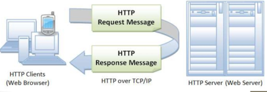
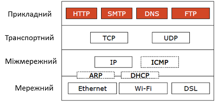
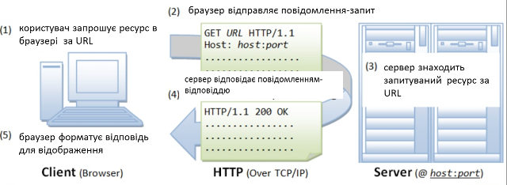
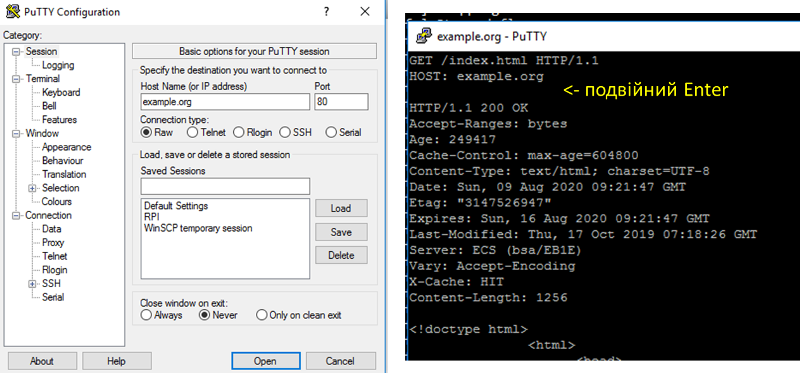
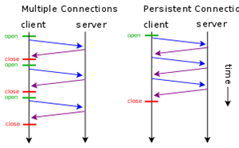
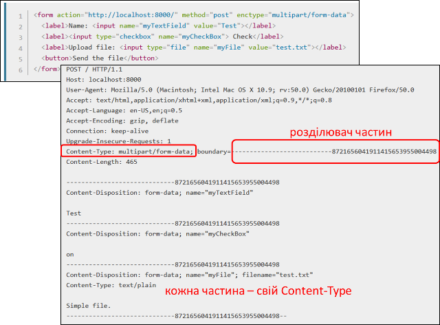
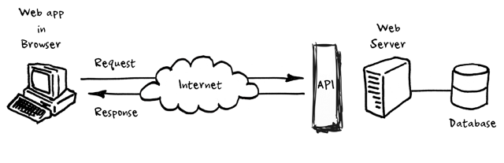
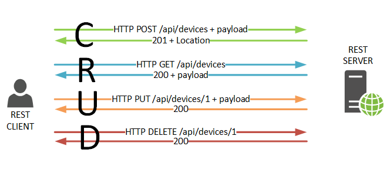

[8. Додаткові служби TCP/IP <--   ](8.md) [Лекції](README.md) [   --> 10. XML](10.md)

# 9. Прикладний рівень: HTTP, HTTP API

На минулих лекціях розглядалися протоколи, які забезпечують обмін даними між процесами, що можуть виконуватися на різних вузлах. Тобто усі мережні протоколи здебільшого слугують зрештою одній меті - забезпечити взаємодію між процесами: Ethernet для обміну в одній мережі, IP - для обміну між вузлами в обєднаних мережах через маршрутизатори, а протоколи TCP та UDP забезпечують транспорт між цими процесами. Що саме процеси передають один одному і як налагоджують правила взаємодії є задачою протоколів прикладного рівня. У цій лекції розглянемо протокол HTTP, який використовується для доступу до ресурсів в Інтернеті (і не тільки) і принципи побудові на базі нього WEB API, зокрема REST.     

## 9.1. Протокол HTTP 

**HTTP** (HyperText Transfer Protocol — «протокол передачі гіпертексту») — протокол прикладного рівня передачі даних, який є повінстю текстовим, тобто використовуються тільки літери та цифри. Початково проткол використовувався для передачі гіпертекстових документів HTML, зараз використовується для передачі чого завгодно. 

У обміні приймають участь два застосунки (рис.9.1):

- HTTP Клієнт (наприклад Web Browser) - ініціатор, той застосунок, якому потрібні ресурси серверу. Він формує запит (Request Message) на сервер на виконання операціъ з ресурсом. 
-  HTTP Сервер (Web Server) - той застосунок, у якого є ресурси. Він обробляє запит клієнта і відправляє відповідь (Response Message), у якому повертає результат обробки ресурсу, або сам ресурс. 



рис.9.1. Клієнт-серверний обмін в HTTP.

На сьогодні інсує кілька версій: HTTP/1.1, впроваджується HTTP/2 (з 2015) та HTTP/3 (з 2019).

HTTP так само і багато споріднених протоколів використовує стандартний стек TCP, UDP, IP та інші (рис.9.2)  



рис.9.2. Стек протоколів HTTP

Розглянемо приниципи функціонування HTTP на прикладі (рис.9.3). 

1) Коли користувач заходить за посиланням на WEB-ресурс він вказує *URL* того ресурсу (наприклад сторінки), який необхідно завантажити. 

2) Браузер запитує цей ресурс за допомогою повідомлення в текстовому форматі, що починається з назви методу `GET` в якому передається адреса ресурсу та додаткові параметри запиту. Це повідомлення передається по TCP до серверу по вказаному порту. Якщо користувач не вказав порт він буде рівним 80 (див. попередню лекцію).    



рис.9.3. Приклад фунуціонування протоколу HTTP. 

3) Сервер, отримавши повідомлення на отримання ресурсу, шукає його за URL.

4) У випадку знаходження ресурсу сервер відправляє відповідь, в заголовку якої вказує позитивний результат виконання запиту `200 Ok`. Також в корисному навантаженні він передає запрошуваний ресурс. 

5) Браузер виводить ресурс, якщо це буде HTML-сторінка показує її у відповідному вигляді.

### Ідентифікація ресурсу

**Ресурси** на сервері - це документи у різноманітному форматі, які можна отримати, записати, змінити і т.п. Для доступу до потрібного ресурсу вказується його унікальний для серверу ідентифікатор розміщення -  **URL (**Uniform Resource Locator). Він задається у вигялді рядку і має наступний формат:

```http
<схема>://<логін>:<пароль>@<хост>:<порт>/<шлях>?<параметри>#<якір>
```

- схема – це означення того, який проткол використовується для доступу ресурсу, наприклад `http` або `https`
- логін та пароль – це ім'я і пароль користувача, якщо доступ до ресурсу обмежений; як видно вони розділені двокрапкою; якщо дсотуп до ресурсу не обмежується, логін та пароль не вказуються 
- хост - доменне ім'я хоста (DNS) або IP-адреса 
- порт – TCP порт хоста, якщо не вказується,  
- шлях – інформація що уточнює місцезнаходження ресурсу
- параметри – рядок запиту з параметрами, що передаються на сервер (методом GET) 
  - використовується разділювач параметрів — знак &. 
- #<якір> - якір, тобто заголовок всередині документа, або атрибут id 

Приклади:

`https://uk.wikipedia.org/wiki/Уніфікований_локатор_ресурсів#Cтруктура` `http://asu.in.ua/viewtopic.php?p=6135#p6135`

### Структура повідомлення

Як зазначалося в протоколі HTTP повідомлення-запит та повідомлення-відповідь мають повністю текстовий формат. Повідомлення складається з (рис.9.4): 

- стартового рядку, який завершується символом кінця рядку і включає в себе 
  - для запиту вказується рядок запиту (`request line`): у ньому вказується метод (на рисунку `GET`), ресурс (на рисунку `/doc/test.html`) та версія протоколу (на рисунку `HTTP/1.1`) 
  - для відповіді вказується статусний рядок (`status line`): у ньому вказується версія протоколу (на рисунку `HTTP/1.1`), код статусу (на рисунку `200`) та текстове представлення статусу (на рисунку `OK`) 
- headers (заголовки), які уточнюють повідомлення; кожен заголовок закінчується символом кінця рядку; є тільки один обовязковий заголовок для клієнта - `Host`, в якому  треба вказати імя хоста, до якого відбувається звернення; усі інші заголовки добалвяються за необхідності; 
- body (тіло повідомлення), яке включає зміст ресурсу; може бути порожнім, наприклад у повідомленні-запиті на отримання ресурсу
- розділювач - пустий рядок, який розділяє заголовки і тіло повідомлення    


рис.9.4. Структура повідомлення HTTP 

Перевірити роботу http можна за допомогою програми-терміналу, наприклад для систем Windows це PuTTY (рис.9.5). Для цього треба підключитися до потрібного порта потрібного `host` в режимі передачі тексту (`raw`). Далі у консольному вікні набрати текстове повідомлення, після подвійного `Enter` з'явиться відповідь від серверу.        



рис.9.5. Приклад перевірки роботи HTTP за допомогою PuTTY.

### Методи запитів

Метод запиту (HTTP Method) - це означення дії, яку необхідно провести над ресурсом. За великим рахунком це може бути довільний символьний набір, але цей метод повинен підтримуватися і Client і Server.  Тим не менше є стандартні методи, зокрема:

- **GET** – запит на зміст ресурсу 
- **POST** – передача даних для існуючого ресурсу 
- **HEAD** – запит інформації про ресурс але без змісту
- **PUT** – розміщення нового ресурсу на Web-сервері
- PATCH – часткова зміна ресурсу
- DELETE – видалення ресурсу з Web-серверу
- TRACE – трасировка (ехо-запит) перевірки зміни запиту по шляху
- OPTIONS – запит підтримуваних методів HTTP та розширень
- CONNECT – підключення до Web-серверу через проксі

### Статуси відповідей

Статус відповіді вказує на результат виконання сервером запиту. Він включає числове представлення у вигялді коду та текстову рошифровку. Перша цифра тризначного коду (сотні) вказують на тип відповіді: 

- **1XX** – інформаційна; наприклад `101 switching protocols` вказує на те, що відбулося переключення на інший протокол (наприклад з HTTP на WebSocket)
- **2XX** – успішне виконання; наприклад `200 ОК`
- **3ХХ** – перенаправлення на інше розміщення ресурсу; наприклад `301` – перенаправлення на постійне розміщення, `307` – перенаправлення на тимчасове переміщення
- **4ХХ** – помилка з причини клієнта; наприклад `403` –доступ заборонений за неправильної вказівки користувача та пароля, `404` – ресурс не знайдено за вказаним посиланням
- **5ХХ** – помилка на сервері; наприклад `500` – відбулася внутрішня помилка серверу

### Заголовки

Заголовки HTTP (HTTP Headers) уточнюють повідомлення. Описуються парою `ім'я: значення` (див. рис.9.6). Наприклад 

```http
Content-Type: text/html;charset=utf-8
```

задає формат і спосіб представлення тіла повідомлення типу `text/html` з кодуванням `charset=utf-8`.

Існують стандартні заголовки, які описані в документах RFC. Нестандартні  заголовки повинні починатися з `X-`. Для протоколу HTTP > v1.1 заголовок «Host» в повідомленні-запиті повинен бути обов'язковим, так як на одному IP/домені може бути декілька Веб-серверів. Список заголовків можна подивитися на [Вікіпедії](https://uk.wikipedia.org/wiki/Список_заголовків_HTTP).

Розглянемо вплив заголовку `Connection` на функціонування обміну. Заголовок вказує на властивість підключення, зокрема `Connection: Keep-Alive` вказує на необхідність утримання (`persistent`) з'єднання після відповіді на запит. У протоколі `HTTP/1.0` передбачалося, що після обробки кожного запиту – з'єднання розривається. Однак для багатьох випадків це може спричинити до значних часових затрат. Розглянемо це на прикладі (рис.9.6). Якщо при завантаженні сторінки необхідно додатково зробити запит, наприклад, на завантаження рисунків для неї, то в звичайному варіанті після кожного запиту GET TCP-з'єднання в `HTTP/1.0` буде розриватися, хоча логічний сеанс обміну при цьому триває. Як відомо з попередньої лекції це приведе до додаткових часових затрат, тому для утримання з'єднання в HTTP/1.0 потрібен заголовок `Connection: Keep-Alive`, який після відповіді серверу тримає TCP-з'єднання активним протягом 5-15 секунд (залежить від реалізації серверу). У версії `HTTP/1.1` за замовченням вважається даний параметр `persistent` а у 2-й версії заголовок взагалі заборонений.



рис.9.6. Функціонування постійного з'єднання `Persisten Connection`

Інший прикладом є використання заголовку `Cache-Control`. Для прискорення обміну завантажувані ресурси можуть кешуватися, тобто зберігатися на локальних (приватних) або проміжних загальнодоступних  (shared) кешах (рис.8). Тобто якщо запит проходить через сервера, які передбачають кешування, може повернутися старе значення ресурсу. Це з одного боку зменшує трафік, так як надає багатьом клієнтам швидше доступ до одного і того ж ресурсу. З іншого боку, якщо ресурс (наприклад сторінка) змінився, усі клієнти отримають старе значення. Для вказівки параметрів роботи з кешем передбачений заголовок: `Cashe Control`, наприклад:

- `Cache-Control: no-cache, no-store` - не кешувати, не зберігати, 
- `Cache-Control: max-age=31536000` - максимальний час збереження в кеші в секундах

## 9.2. Робота зі змістом HTML повідомлень

### Тип змісту тіла повідомлення (Content-Type)

Хоч протокол HTTP повністю текстовий, за допомогою тексту можна кодувати будь-який зміст тіла, навіть бінарні файли. Однак для їх правильної інтерпретації необхідно вказати тип змісту за допомогою заголовка `Content-Type`. Заголовок може включати декілька директив, розділені крапкою з комою:

- `media-type`, тип змісту, наприклад `text/html`, або `multipart` - для вказівки багато-частинних повідомлень
- `charset` – стандарт кодування, наприклад `utf-8`
- `boundary` – для багато-частинних (`multipart`) повідомлень розділювач  

Наприклад:

```text
Content-Type: text/html; charset=utf-8 
Content-Type: multipart/form-data; boundary=something
```

Тип змісту, визначається типом **MIME**(Multipurpose Internet Mail Extensions) – стандарт на характер і формат документу, файлу або даних. Він описується парою тип/підтип, тобто:

```
type/subtype
```

Ці типи можуть бути дискретними, тобто які описують весь формат, або у випадку змішаного формату (наприклад текст та рисунки) включати кілька частин. Популярні дискретні формати

```
application/octet-stream (бінарний)
text/plain (текстовий)
text/css, text/html, text/javascript, text/xml (текстовий з ромзіткою)
image/gif, image/jpeg, image/png (зображення)
application/json (JSON)
```

Інші дискретні формати:

```
text/css, audio/mpeg, audio/ogg, audio/*, video/mp4, application/*, pplication/ecmascript
application/octet-stream ...
```

Для змісту що включає кілька розділів (зміст) виділяється тип **MIME Multipart**. На рис.9.7 показаний приклад використання змісту, який включає кілька розділів. Це тіло повідомлення відправлення HTML-форми. Для цього використовується директива `multipart/form-data` заголовку `Content Type` . Директива`boundary` вказує на роздільник, який використовується для ідентифікації початку частин. Далі кожен розділ тіла повідомлення починається з вказаного роздільника, після чого вказується тип формату через `Content-type` . 

 

рис.9.7. Приклад використання MIME Multipart

## 9.3. WEB API

Протокол HTTP використовується не тільки для реалізації доступу до документів на серверах з браузера. Цей протокол знайшов популярність як спосіб доступу одних прикладних програм до сервісів інших через означений API.   

**Прикладний програмний інтерфейс (інтерфейс програмування застосунків, інтерфейс прикладного програмування)** (*Application Programming Interface*, *API*) — набір означень підпрограм, протоколів взаємодії та засобів для  створення програмного забезпечення. Спрощено - це набір чітко означених  методів (функцій) для взаємодії різних компонентів. API надає розробнику засоби для швидкої розробки програмного забезпечення оскільки можна  скористуватися готовими об’єктами (функціями) іншого програмного  забезпечення через означені в останньому правила взаємодії. API може  бути для веб-базованих систем, операційних систем, баз даних, апаратного забезпечення, програмних бібліотек.

При використанні прикладного програмного інтерфейсу в контексті веб-розробки, як правило, API означується набором повідомлень-запитів  HTTP та структурою повідомлень-відповідей. Повідомлення можуть мати  різний формат, як правило це XML або JSON. Доступ відбувається до через одніу або декілька загальнодоступних кінцевих точок (endpoints).  

**Кінцеві точки** вказують, де знаходяться ресурси, доступ  до яких може отримати стороння програма. Зазвичай доступ здійснюється  через URI, до якого надсилаються HTTP-запити, і звідки очікується  відповідь. 



рис.9.8.Принципи роботи WEB-API.

Кінцеві точки повинні бути статичними (незмінними), інакше правильне  функціонування програмного забезпечення, яке взаємодіє з нею, не може бути гарантоване. Якщо місце розташування ресурсу змінюється (і разом з  ним кінцева точка), то раніше написане програмне забезпечення буде не вірно працювати, оскільки потрібний ресурс більше не може бути знайдено в тому ж місці. Оскільки постачальники сервісів можуть оновлювати свої веб-API, багато хто з них запровадили систему версій в URI, яка вказує  на кінцеву точку. 

Наприклад, Clarifai API: кінцева точка для функцій  позначення в Web API має такий URI: 

```http
https://api.google.com/v1/tag/
```

де `/V1/` частина URI означує доступ до першої версії веб-API. Якщо Clarifai вирішить оновити до другої версії, вони можуть це спокійно зробити через означення додаткового позначення нової версії, зберігаючи при цьому підтримку стороннього програмного забезпечення, яке використовує першу версію.

Веб-інтерфейси Web 2.0 часто використовують взаємодії на основі таких технологій як REST та SOAP. Simple Object Access Protocol (SOAP) базується на основі веб-сервісів і сервіс-орієнтованої архітектури (SOA), тоді як REST на стилі веб-ресурсів та  ресурсно-орієнтованої архітектури (ROA).  RESTful Веб-інтерфейси  зазвичай базуються на основі методів HTTP для доступу до ресурсів за  допомогою URL-кодуваних параметрів та використання JSON або XML для передачі даних. На відміну від цього, протоколи SOAP стандартизуються W3C і мандатом на використання XML в якості формату корисного навантаження, як правило, поверх HTTP. 

При використанні деяких Web API,  що мають певні обмеження для використання або потребують ідентифікації  програмного забезпечення, що викликається, необхідно вказувати API key. **Application programming interface key** (**API key**)  - це код, який передається комп'ютерними програмами, викликаючи  прикладний програмний інтерфейс (API) на веб-сайті, для ідентифікації викликаючої програми, її розробника чи її користувача. API key  використовуються для відстеження та керування використанням API,  наприклад, для запобігання зловмисному використанню або зловживання API (як це означено, можливо, умовами надання послуг). API key часто виступає і як унікальний ідентифікатор, так і секретний маркер (токен)  для автентифікації, і, як правило, має набір прав доступу до пов'язаного з ним API. API key можуть базуватися на універсальному унікальному ідентифікаторі (UUID) щоб забезпечити унікальність кожного користувача.

## 9.4. Основи REST

**REST** (Representational State Transfer, «передача репрезентативного стану») означує ряд архітектурних принципів проектування Web-сервісів, орієнтованих на ресурси. Ці принципи включають способи обробки і передачі станів ресурсів по HTTP різноманітними клієнтськими застосунками, написаними різними мовами програмування. За останні кілька років REST стала переважаючою моделлю проектування Web-сервісів. 

Передбачається, що конкретна реалізація Web-сервісів REST слідує чотирьом базовим принципам проектування:

- Явне використання HTTP-методів.
- Незбереження стану.
- Надання URI, аналогічних структурі каталогів.

- Передача даних в XML, JavaScript Object Notation (JSON) або в обох форматах.

Нижче  розглядаються ці чотири принципи.

### Явне використання HTTP-методів

Однією з ключових характеристик Web-сервісу RESTful є явне використання HTTP-методів згідно з протоколом, де він означений (RFC 2616). Адже HTTP передбачає наявність всіх методів для доступу до ресурсів як для читання та запису так і для зміни. Наприклад, HTTP GET означений як метод генерування даних, використовуваний клієнтським застосунком для читання ресурсу, отримання даних з Web-сервера або виконання запиту в надії на те, що Web-сервер знайде і поверне набір відповідних ресурсів.



рис.9.8.Принципи роботи REST-API.

REST пропонує розробникам використовувати HTTP-методи явно відповідно до означення протоколу. Цей основний принцип проектування REST встановлює однозначну відповідність між операціями create, read, update і delete (CRUD) і HTTP-методами. Згідно з цим необхідно використовувати методи:

- POST - для створення ресурсу на сервері;

- GET - для отримання ресурсу з серверу;

- PUT – для зміни стану ресурсу або його поновлення;

- DELETE - для видалення ресурсу.

Недоліком проектування багатьох Web API є використання HTTP-методів не за прямим призначенням. Наприклад, URI запиту в HTTP GET мало б означувати один конкретний ресурс. Або рядок запиту в URI містить ряд параметрів, що означують критерії пошуку сервером набору відповідних ресурсів. Принаймні саме так описаний метод GET в HTTP/1.1 RFC. Однак часто зустрічаються непривабливі Web API, що використовують HTTP GET для виконання різного роду транзакцій на сервері (наприклад, для додавання записів в базу даних). У таких випадках URI запиту GET використовується некоректно або, принаймні, не використовується в REST-стилі (RESTfully). Якщо Web API використовує GET для запуску віддалених процедур, запит для непривабливого API може виглядати приблизно так:

```http
GET /adduser?name=Robert HTTP/1.1
```

Це невдалий проект, оскільки вищезгаданий Web-метод за допомогою HTTP-запиту GET підтримує операцію, що змінює стан. Інакше кажучи, HTTP-запит GET має побічні ефекти. У разі успішного виконання запиту в сховище даних буде додано нового користувача (в нашому прикладі - Robert). Проблема тут в основному семантична. Web-сервери призначені для відповідей на HTTP-запити GET шляхом вилучення ресурсів відповідно до URI запиту (або критерію запиту) і повернення їх або їхні уявлення у відповіді, а не для додавання запису в базу даних. З точки зору передбачуваного використання і з точки зору HTTP/1.1-сумісних Web-серверів таке використання GET є неналежним.

Крім семантики ще однією проблемою є те, що для видалення, зміни або додавання запису в базу даних або для зміни будь-яким чином стану на стороні сервера GET привертає різні засоби Web-кешування (роботи) і пошукові механізми, які можуть виконувати ненавмисні зміни на сервері шляхом простого обходу посилання. Найпростішим способом вирішення цієї загальної проблеми є вставлення імен та значень параметрів URI запиту в XML-теги. Ці теги (XML-представлення створюваного об'єкта) можна відправити в тілі HTTP-запиту POST, URI якого є батьком об'єкта. Тобто наведений вище запит мав би виглядати так:

```http
POST /users HTTP/1.1
Host: myserver
Content-Type: application/xml
<?xml version="1.0"?>
<user>
  <name>Robert</name>
</user>
```

Це зразок RESTful-запиту: HTTP-запит POST використовується коректно, а тіло запиту містить корисне навантаження. На приймаючій стороні в запит може бути доданий ресурс, що міститься в тілі, підлеглий ресурсові, визначеному в URI запиті; в даному випадку новий ресурс повинен додаватися як нащадок /users. Таке ставлення включення (containment) між новим логічним об'єктом і його батьком, вказане в запиті POST, аналогічно відношенню підпорядкування між файлом і батьківським каталогом. Клієнтська програма встановлює відношення між логічним об'єктом і його батьком і означує URI нового об'єкта в запиті POST. Потім клієнтська програма може отримати уявлення ресурсу, використовуючи новий URI, який вказує, що принаймні логічно ресурс розташований в /users 

```http
GET /users/Robert HTTP/1.1
Host: myserver
Accept: application/xml
```

Це правильне застосування запиту GET, оскільки він служить тільки для отримання даних. GET - це операція, яка повинна бути вільною від побічних ефектів. 

Загальноприйнятим підходом, відповідних рекомендацій REST по явному застосуванню HTTP-методів, є використання в URI іменників замість дієслів. У Web-сервісі RESTful дієслова POST, GET, PUT і DELETE вже означені протоколом. В ідеалі для реалізації узагальненого інтерфейсу і явного виклику операцій клієнтськими додатками Web-сервіс не повинен означувати додаткові команди або віддалені процедури, наприклад /adduser або /updateuser. Цей загальний принцип можна застосувати також до тіла HTTP-запиту, який призначений для передачі стану ресурсу, а не імені віддаленого методу або віддаленої процедури, що викликається.

### Незбереження стану

Серверні застосунки при RESTful не повинні орієнтуватися на стан пов'язаний з сеансом зв'язку з клієнтом. З одного боку, наявність такого стану значно ускладнює роботу ВЕБ-застосунку та його налагодження. Крім того це вимагає наявність додаткових ресурсів для кожного підключеного клієнта. Крім того для задоволення постійно зростаючих вимог до продуктивності Web-сервіси REST повинні бути масштабованими. Для формування топології сервісів, що дозволяє при необхідності перенаправляти запити з одного сервера на інший з метою зменшення загального часу реакції на виклик Web-сервісу, зазвичай застосовують кластери серверів з можливістю розподілу навантаження і аварійного перемикання на резерв, проксі-сервери і шлюзи. Використання проміжних серверів для поліпшення масштабованості вимагає, щоб клієнти Web-сервісів REST відправляли повні самодостатні запити, що містять всі необхідні для їх виконання дані, щоб компоненти на проміжних серверах могли перенаправляти, маршрутизувати і розподіляти навантаження без локального збереження стану між запитами.

При обробці повного самодостатнього запиту серверу не потрібно витягувати стан або контекст програми. Застосунок (або клієнт) Web-сервісу REST включає в HTTP-заголовки і в тіло запиту всі параметри, контекст і дані, необхідні серверному компоненту для генерування відповіді. У цьому сенсі незбереження стану (statelessness) покращує продуктивність Web-сервісу і спрощує проектування і реалізацію серверних компонентів, оскільки відсутність стану на сервері усуває необхідність синхронізації сеансових даних із зовнішнім застосунком.

### Відображення URI, аналогічних структурі каталогів

З точки зору звернення до ресурсів з клієнтського за стосунку URI, що надаються, означують наскільки інтуїтивним буде Web-сервіс REST і чи буде він використовуватися так, як припускав розробник. Третя характеристика Web-сервісу RESTful повністю присвячена URI.

URI-адреси Web-сервісу REST повинні бути інтуїтивно зрозумілими. Розглядайте URI як якийсь самодокументований інтерфейс, що майже не вимагає пояснень або звернення до розробника для його розуміння і для отримання відповідних ресурсів. Тому структура URI повинна бути простою, передбачуваною і зрозумілою.

Один із способів досягти такого рівня зручності використання - побудова URI за аналогією зі структурою каталогів. Такого роду URI є ієрархічними, що походить із одного кореневого шляху, розгалуження якого відображають основні функції сервісу. Згідно з цим означенням, URI - це не просто рядок з косими як роздільниками, а скоріше дерево з встановленими вище і нижче лежачими гілками, з'єднаними в вузлах. Наприклад, в сервісі обговорень різних тем можна означити структурований набір URI такого вигляду:

```http
http://www.myservice.org/discussion/topics/{topic}
```

Корінь /discussion має нижчий вузол /topics. Нижче розташовуються назви тем (наприклад, gossip (чутки), technology (технологія) і т.д.), кожна з яких вказує на свою гілку обговорення. В рамках цієї структури можна легко викликати гілки обговорення простим введенням чогось після /topics/.

У деяких випадках каталого-подібна структура особливо добре підходить для шляхів до ресурсів. Як приклад можна назвати ресурси, впорядковані за датою. Для них дуже добре підходить ієрархічний синтаксис.

Наступний приклад інтуїтивно зрозумілий, оскільки заснований на правилах:

```http
 http://www.myservice.org/discussion/2008/12/10/{topic}
```

Перший фрагмент шляху - чотири цифри року, другий - дві цифри дня і третій - дві цифри місяця. Подібне пояснення може здатися дещо спрощеним, але це саме той рівень простоти, який нам потрібен. Люди і комп'ютери можуть легко генерувати подібні структуровані URI, оскільки вони засновані на правилах. Вказівка фрагментів шляху у відповідних позиціях згідно синтаксису робить URI уніфікованими, оскільки існує закономірність їх створення:

```http
 http://www.myservice.org/discussion/{year}/{day}/{month}/{topic}
```

### Передача XML, JSON або обох

Представлення ресурсу, як правило, відображає поточний стан ресурсу (і його  атрибутів) на момент його запиту клієнтським процесом. Представлення  ресурсів в цьому сенсі є просто знімками в конкретні моменти часу. Ці  представлення повинні бути такими ж простими, як представлення запису в  базі даних, що складається з відображення між іменами стовпців і  XML-тегами, де значення елементів в XML містять значення рядків. Якщо  система має модель даних, то згідно з цим означенням представлення  ресурсу є знімком стану атрибутів одного з об'єктів моделі даних  системи. Це ті об'єкти, які буде обслуговувати Web-сервіс REST.

Останній набір обмежень, тісно пов'язаний з розробкою Web-сервісів RESTful, відноситься до формату даних, якими обмінюються застосунок і  сервіс при роботі в режимі запит/відповідь або в тілі HTTP-запиту. Тут  особливо важливі простота, читабельність і зв'язаність.

Об'єкти моделі даних зазвичай якось пов'язані, і ці відносини між  об'єктами (ресурсами) моделі даних повинні відображатися в способі їх  подання для передачі клієнтського застосунку. У сервісі обговорень наприклад у форумі, пов'язані ресурси можуть включати в себе кореневу тему обговорення і її атрибути, а також вбудовані посилання на відповіді,  надіслані в цю тему.

```xml
<?xml version="1.0"?>
<discussion date="{date}" topic="{topic}">
  <comment>{comment}</comment>
  <replies>
    <reply from="joe@mail.com" href="/discussion/topics/{topic}/joe"/>
    <reply from="bob@mail.com" href="/discussion/topics/{topic}/bob"/>
  </replies>
</discussion>
```

Нарешті, щоб надати клієнтським застосункам можливість запитувати конкретний найбільш підходящий їм тип вмісту, проектують сервіс так, щоб він використовував вбудований HTTP-заголовок Accept, значення якого є  MIME-типом. Деякі загальновживані MIME-типи, які використовуються  RESTful-сервісами, перераховані в таблиці 9.1.

Таблиця 9.1. Загально-вживані MIME-типи, що використовують RESTful-сервіси

| MIME-тип | Тип змісту            |
| -------- | --------------------- |
| JSON     | application/json      |
| XML      | application/xml       |
| XHTML    | application/xhtml+xml |

Це дозволить використовувати сервіс клієнтським застосунком,  написаним на різних мовах і працюючим на різних платформах і пристроях.  Використання MIME-типів і HTTP-заголовку Accept є механізм узгодження  вмісту (content negotiation), що дозволяє клієнтським застосункам  вибирати відповідний для них формат даних і мінімізувати зв'язність  даних між сервісом і застосунком, що його використовує.

## Питання для самоперевірки.

1) Розкажіть про загальні принципи функціонування протоколу HTTP.

2) На якому протоколі транспортного рівня базується HTTP?

3) Поясніть що таке ресурс HTTP? Як він ідентифікується на сервері?

4) Розкажіть про структуру повідомлення HTTP.

5) Розкажіть про призначення методів запитів HTTP.

6) Розкажіть про призначення статусів відповіді HTTP. 

7) Розкажіть про призначення заголовків HTTP. 

8) Розкажіть про призначення кешування в HTTP. Як можна керувати кешем в протоколі HTTP?

9) Як вказується формат повідомлення в HTTP?

10) Що таке Multipart повідомлення?

11) Поясніть що таке API.

12) Поясніть що таке кінцева точка у WEB API. Чому вона не повинна змінюватися?

13) Поясніть своїми словами як функціонує WEB API.

14) Яка роль API-key у WEB API?

15) Що таке REST?

16) Розкажіть про вимогу явного використання методів HTTP в технології REST.

17) Які методи HTTP і для чого пропонується використовувати в REST.

18) Розкажіть і поясніть приклад неправильного (не RESTful) використання методу GET.

19) Що значить вимога "незбереження стану" в  REST?

20) Які вимоги до структури URI в REST?

21) Яким чином кодуються дані, які передаються по REST API?
